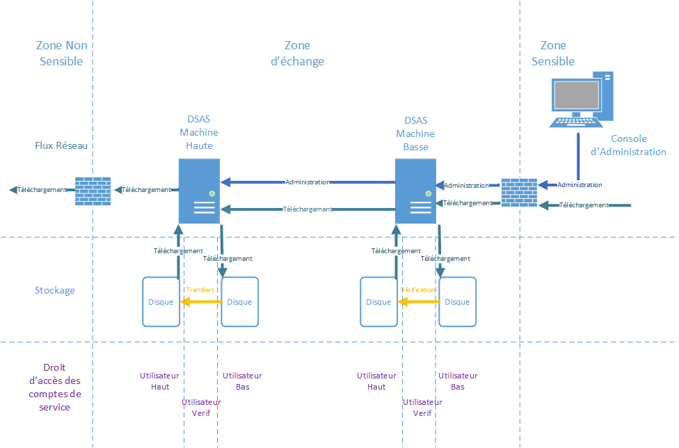

# Introduction

Le cloisonnement des infrastructures industrielle est essentiel pour limiter 
les possibilités d’attaques malveillantes. Ce niveau de cloisonnement limite 
fortement les capacités à automatiser la récupération des mises à jours de sécurité 
(MAJ OS, signatures SEP, MAJ logiciels) indispensables à tous systèmes sensibles. 
Les fichiers de configuration et d'autre support venant d'ailleurs sont egalement
difficle à recuperer.

Généralement des clés usb sont utilisées pour injecter des fichiers dans les 
systèmes d’information.  Ce mode de transfère nécessite des interventions humaines 
(chronophage) et expose le système industriel à une contamination virale à chaque 
branchement. Des moins organisationnelle pourait être mise en place afin de controller
les clefs USB a chaque utilisation, mais la risque de contamination est impossible
à exclure.

Donc nous avons besoin un moyen technique de transfer des fichiers d'un zone non
sensible vers nos infrastructure industriel, et de controler symetatiquement tout
transfert afin de exclure les risques de malveillance. Le XXXXXXXXX (DSAS) a but
de mettre en place ce moyen de transfert sécurisé. Le DSAS a pour objectif de 
télécharger les mises à jours de sécurité, contrôler leurs intégrités et de les 
mettre à disposition dans les systèmes d’information. Il a également pour la 
suppression des usages des clef USB sont des infrastructure industriel.

Le DSAS assure égalemenr une rupture de session protoclaire entre les différentes
zone de sécurité dans un contexte de défense en profondeur.

## Architecture

Les principes du DSAS sont les suivante

- Le DSAS n'est pas integré dans aucun des deux domaines interconnecté, mais 
cloissonné des deux. Les connexions vers les DSAS doit être strictement 
controllés. 
- Aucun service ou port réseau non utilisé doit être dispsonible. Les logiciels
non  utilisé doit être désinstallé
- Le DSAS doit implementé un rupture complet entre les deux domaines de sensiblité.
Ceci est implementé par l'utilisation de deux machine distinct pour les connexions
vers les deux zones de sécurité differents, afin qu'une compromission de la machine 
interconnecté avec le zone non sensible mettra pas a risque le zone sensible
- Aucun fichier non controlé doit être visible dans le zone sensible. Les systemes
fichiers des deux machines du DSAS doit être distinct.
- Des vérifications doit être fait par le DSAS avant de rendre disponible les
fichiers dans le zone sensible. C'est vérfications sont actuellement limité à
des controles d'intégrités mais pourait dans la futur inclure des controles des
menaces avec un moteur d'AV
- Le maintient en condition de sécurité  doit être assurer. Ceci veut dire que
l'ensemble des logiciels exposé à l'attaque doit connu, veille de sécurité mise
en place et des moyens de palier les vulnérabilité maitrisé

Ces contraints nous poussent vers un des principe d'architecture avec

- Separation de la traitement des zones sensible et non sensible sur deux machines
distinct.
- Utilisation d'un souche linux minimale avec le moins de logiciels installé possible.
Le choix d'utilisation de [Tiny Core Linux](http://tinycorelinux.net/) a été fait car 
ce souche est mise à jour régulairement et l'installation minimale (de 12 megactets) 
n'inclut que le noyau de linux, busybox et quelques script de démarrage. Aucun service
est démarré par défaut
- Des dépendances supplementaires sont éviter; par exemple perl, python, etc ne sont pas
installé et tout script utilisé par le DSAS est écrit en shell.
- Chaque machine utilisé dans le DSAS possede deux interface réseau distinct, un pour 
la connexion vers les zone sensible et non sensible et l'autre pour l'interconnexion
entre eux.
- La sens d'initiation des flux réseau est toujours du plus senible vers le moins
sensible, et aucun port réseau sur l'interface plus sensible est exposé vers la machine 
moins sensible
- L'ensemble de l'adminsitration doit se faire via la machine en zone sensible, afin de
ne pas exposé l'administration de la machine exposé en zone non sensible.




## Usage des hardlink linux

Un hardlink sous linux est exactement le même fichier dupliqué à un autre endroit. 
L'usage des hardlink entre les fichier du gichet haut du sas et le guichet bas 
pourrait permettre un simplication des l'architecture, car aucun moyen de tracer les
ficheirs téléchargé sera necessaire et ça sans augmentation de l'espace disque.

En revanche les hardlink doit réspecter les exigences d'acces entre les guichet haut
et bas. Quand un fichier existe dans les deux zones, il faut que

- L'utilisateur haut ne peut pas modifier le fichier visible dans le guichet bas
- L'utilisateur haut ne peut pas supprimer l'existance de la fichier dans le 
  guichet bas
- Que l'utilisateur haut pourrait supprimer l'existence de la fichier dans le 
  guichet haut

Avec les permissions suivante

| Perms      |  UID   | GID   |  Chemin
|------------|--------|-------|-------------------
| drwxrwx--- |  haut  | haut  |  dsas/haut
| -rw-r----- |  verif | share |  dsas/haut/fichier
| drwxrwx--- |  bas   | bas   |  dsas/bas
| -rw-r----- |  verif | share |  disas/bas/fichier

et un fichier /etc/group centenant 

```
verif:x:2000:
bas:x:2001:verif
haut:x:2002:verif
share:x:2003:verif,bas,haut
```

les exigences voulu sont respecté. Les script de verification DSAS ont été adapté
afin d'assurer ces coditions


# Taches

## Verification 

Il y a 3 type de verification des répository linux

* rpm - Les signature de chaque fichier RPM est verifié avec "rpm -K"
* repomd - Le fichier repomd.xml est verifié et seulement les hashes to chaque fichier est verifié
* deb - Actuellement non implementé

Il y a trois autres type de vérification 

* authenticode - Verifier avec Microsoft Authenticode signatures. 
* gpg - 
* openssl -

### Verification - rpm

Les détails - A completer

### Vérification - repomd

Les détails - A completer

### Vérification - authenticode

Pour la tye de vérification "authenicode" chaque fichier dans la dossier est verifiés contre les
certificates specifiés. Si aucun certificate authorité est specifié, le store de certificate est
utilisé incluant tous les certificates dans le store. Ceci pourrait augmenté les risques et il est 
beaucoup meiux de spécifier un seul certificate autorité pour la vérification

Si les signatures sont valable et signé par les certificates spécifiés, les fichiers sont mise à 
disponibilité sur le sas du bas de DSAS. Aucun sous-dossier est traité

Le logiciel osslsigncode [https://github.com/mtrojnar/osslsigncode] est utilisé pour la verification

### Vérification - gpg

Les signatures GPG pourrait être integré dans le fichier signé ou dans un fichier à part. Le DSAS
assume qu'un des moyens suivant est utilisé afin de signé un fichier

```
gpg --output <file>.gpg --sign <file>
gpg --output <file>.sig --detach-sig <file>
gpg --output <file>.sig -a --detach-sig <file>
```

Donc des signature detaché sont en deux fichiers <file> et <file>.sig, et des signature integrés 
sont dans des fichiers terminant comme <file>.gpg

### Verification - openssl

L'utilisateur doit avoir déja generé des clefs publique et privé pour la signature avec 

```
openssl genrsa -out key.pem 4096
openssl rsa -in key.pem -pubout > key.pub
```

Et le clef publique dans le fichier key.pub doit être associé avec le tache dans le DSAS. Les fichiers
sont signés comme

```
openssl dgst -sign key.pem -keyform PEM -sha256 -out <file>.sig -binaru <file>
```

Les signatures sont toujours stockés dans des fichiers séparé, et le DSAS assume que les signature
sont dans un fichier avec un extension .sig 
