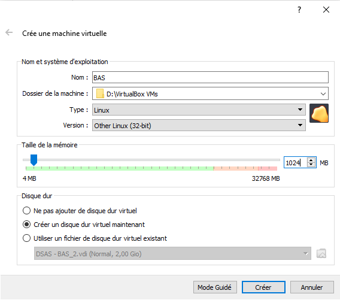
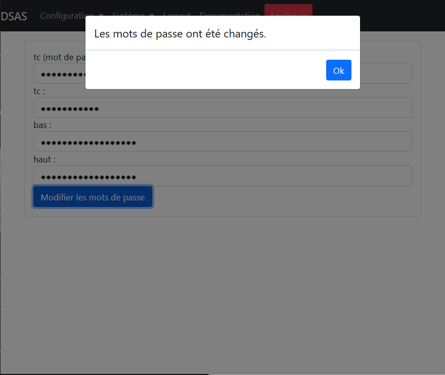
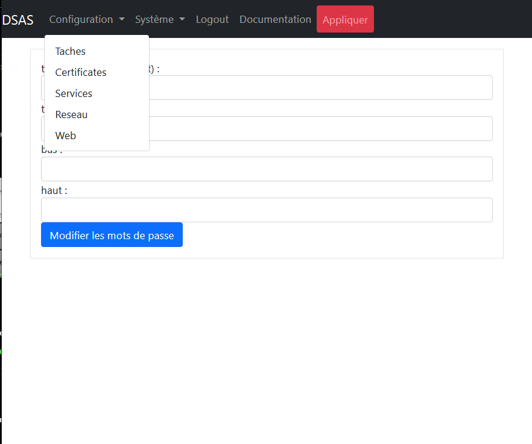

# Introduction

Le cloisonnement des infrastructures industrielle est essentiel pour limiter 
les possibilités d’attaques malveillantes. Ce niveau de cloisonnement limite 
fortement les capacités à automatiser la récupération des mises à jours de sécurité 
(MAJ OS, signatures SEP, MAJ logiciels) indispensables à tous systèmes sensibles. 
Les fichiers de configuration et d'autre support venant d'ailleurs sont egalement
difficle à recuperer.

Généralement des clés usb sont utilisées pour injecter des fichiers dans les 
systèmes d’information.  Ce mode de transfère nécessite des interventions humaines 
(chronophage) et expose le système industriel à une contamination virale à chaque 
branchement. Des moins organisationnelle pourait être mise en place afin de controller
les clefs USB a chaque utilisation, mais la risque de contamination est impossible
à exclure.

Donc nous avons besoin un moyen technique de transfer des fichiers d'un zone non
sensible vers nos infrastructure industriel, et de controler symetatiquement tout
transfert afin de exclure les risques de malveillance. Le XXXXXXXXX (DSAS) a but
de mettre en place ce moyen de transfert sécurisé. Le DSAS a pour objectif de 
télécharger les mises à jours de sécurité, contrôler leurs intégrités et de les 
mettre à disposition dans les systèmes d’information. Il a également pour la 
suppression des usages des clef USB sont des infrastructure industriel.

Le DSAS assure égalemenr une rupture de session protoclaire entre les différentes
zone de sécurité dans un contexte de défense en profondeur.

## Architecture

Les principes du DSAS sont les suivante

- Le DSAS n'est pas integré dans aucun des deux domaines interconnecté, mais 
cloissonné des deux. Les connexions vers les DSAS doit être strictement 
controllés. 
- Aucun service ou port réseau non utilisé doit être dispsonible. Les logiciels
non  utilisé doit être désinstallé
- Le DSAS doit implementé un rupture complet entre les deux domaines de sensiblité.
Ceci est implementé par l'utilisation de deux machine distinct pour les connexions
vers les deux zones de sécurité differents, afin qu'une compromission de la machine 
interconnecté avec le zone non sensible mettra pas a risque le zone sensible
- Aucun fichier non controlé doit être visible dans le zone sensible. Les systemes
fichiers des deux machines du DSAS doit être distinct.
- Des vérifications doit être fait par le DSAS avant de rendre disponible les
fichiers dans le zone sensible. C'est vérfications sont actuellement limité à
des controles d'intégrités mais pourait dans la futur inclure des controles des
menaces avec un moteur d'AV
- Le maintient en condition de sécurité  doit être assurer. Ceci veut dire que
l'ensemble des logiciels exposé à l'attaque doit connu, veille de sécurité mise
en place et des moyens de palier les vulnérabilité maitrisé

Ces contraints nous poussent vers un des principe d'architecture avec

- Separation de la traitement des zones sensible et non sensible sur deux machines
distinct.
- Utilisation d'un souche linux minimale avec le moins de logiciels installé possible.
Le choix d'utilisation de [Tiny Core Linux](http://tinycorelinux.net/) a été fait car 
ce souche est mise à jour régulairement et l'installation minimale (de 12 megactets) 
n'inclut que le noyau de linux, busybox et quelques script de démarrage. Aucun service
est démarré par défaut
- Des dépendances supplementaires sont éviter; par exemple perl, python, etc ne sont pas
installé et tout script utilisé par le DSAS est écrit en shell.
- Chaque machine utilisé dans le DSAS possede deux interface réseau distinct, un pour 
la connexion vers les zone sensible et non sensible et l'autre pour l'interconnexion
entre eux.
- La sens d'initiation des flux réseau est toujours du plus senible vers le moins
sensible, et aucun port réseau sur l'interface plus sensible est exposé vers la machine 
moins sensible
- L'ensemble de l'adminsitration doit se faire via la machine en zone sensible, afin de
ne pas exposé l'administration de la machine exposé en zone non sensible.

L'architecture du DSAS simplifier est alors


ou les fleches representent des flux réeau ou applicatif et les direction de ces fleches
est la sens de l'initation de ces flux

# Installation

Avec le DSAS séparé en deux machine, deux installation séparé sont nécessaire. Les deux
installation suivent le même logique. Dans la discussion suivant la machine connecté au
réseau non sensible est appelé la machine "haut" et la machine connecté au réseau sensible
est appelé la machine "bas". Un configuration initial de chaque machine est nécessaire
depuis sa console, mais après cette phase initale, tout la configuration est fait depuis
la machine bas.

Afin que la configuration se passe facilement il faut démarrer avec la configuration de
la machine haut, car même en phase initial la machine bas doit prendre la main sur la
machine haut, et il doit être configuré en premier afin d'être pret à accepter des ordres.

Dans les sections suivant si ce n'est pas dit explicitement la configuration concerne les
deux machines

## Choix des tailles des disques

Le DSAS a besoin deux disque independant, un pour chacun des deux machines utilisés 
dans son implementation. Donc le DSAS a besoin deux fois plus de disques que la 
maximum utilisé pour les transfert. Le DSAS est configuré afin de faire des "mirroir" 
des disques à télécharger, et les anciens fichiers sont supprimer site ils ne sont 
plus disponible sur leur site de téléchargement. Donc seulement l'addition des espaces
utilisé par les sites externe est nécessaire plus un peu de marge

Les mise à mise de windows des "patch tuesday" sont souvent iun 100 de megaoctets en
taille, donc multiple ca par le nombre à garder à plusiers gigaoctets pourrait être 
nécessaire pour les mise à jour de windows. Pour les mise à jour de Symantec le besoin
est dans la 150 megactets

Chaque repositoire de Linux pourrait avoir jusqu'au 50 gigaoctets utilisé, donc si on
tranfert des mise à jour de linux notre besoin de disque peut vite explosé. Dans Les
configurations suivant, nous avons utilisé un taille de 50 gigaoctets, mais nous
recommandons au moins 500 Go pour chaque machine du DSAS.

## Configuration en machine virtuel

Le DSAS est founir en forme de ISO à utiliser en "live CD". Ceci veut dire que le 
système exploitation doit démarrer toujours sur ce disque ISO. La grand advantage de
ca est que les mise à jour du DSAS va être très simple en exploitation et se resume
par l'arret du DSAS, la remplacement du ISO et la redemarrage.

L'iso du DSAS est un souche linux en 32 bit, et la virtuel machine est à configuré
en consequence. Par exemple sous VirtualBox la configuration initial devrait être



un minimum de 256 megaoctets est nécessaire afin de démarrer la DSAS. Mais en 
fonctionnement la DSAS pourrait utiliser plus de ressources et nous recommandant 
l'utilisation de 1 gigaoctet de memoire. 

La disque pourrait être configuré en présque tous les format, mais pour cette 
installation nous avons cohoisir d'utiliser des défaut proposé par VirtualBox.


Après il faut configuré le disque de démarrage du DSAS en mettant le disque ISO du
DSAS en maitre primaire IDE


Si le disque de démarrage est mal configuré, le DSAS ne pourrait pas démarrer. 

### Interconnexion réseaux entre les machines du DSAS

Les machines virtuels sont à configurer avec deux cartes reseaux. Le premier carte 
réseau est toujour utilisé pour les connexions vers les réseaux externe du DSAS
et leur configuration dependant de l'environement ou est installé le DSAS. 

Le deuxieme carte réseau est toujours utilisé pour l'interconnexion entre les 
deux machines du DSAS, et ce réseau est un réseau static en "192.168.192.0/24".
Plusieurs moyenns pourrait être mise en place pour la configuration du reseau
d'interconnexion, notamment si un pare-feux supplementaire est à place sur ce
lien (pas vraiment utile). Nous conseillons l'usage un réseau interne à l'hyperviseur
configuré en VirualBox comme


Nous sommes maintenant prêt a démarrer la machine pour la premiere fois

## Formatage des disques

FIXME : Remove Cancel buttons in DSAS boot dialogs and change the images here !!
FIXME : Therefore don't discuss the cancel button in this documentation

A la premiere démarrage le DSAS nous demande de formatter sa disque. Un menu est
présenter avec l'ensemble des disques trouver connecté au DSAS. Ceci se presente
comme


La navigation dans ce type de menu est fait avec les clefs suivantes

- les fleches - déplacement du cursors
- Espace - selection d'un option
- Tab - bascule entre "Ok" et "Cancel".  
- Entrée - Continuer

Utiliser "Espace" afin de selectionner la disque, ici "/dev/sda", et "Entrée" 
afin de démarrer la formattage de la disque. Après la formattage, la machine 
rédemarra automatiquement avant de continuer

## Selection de la type de la machine

Le prochain étape est de selectionner si la machine du DSAS va être configuré 
en machine haut ou bas. Le menu 


est utilisé afin de présenter la selection de type de machine. Si la machine 
a été configuré avec seulement une carte réseau a ce point le DSAS va arreter
sa configuration avec l'érreur


Dans ce cas arrêter la machine et ajouter une carte réseau dan l'hyperviseur.

## Configuration réseau initial

La configuration réseau de la machine haut est fait via l'interface d'administration
de la machine bas. Par consequence cette section ne concerne que la machine bas. En
revanche si le réseau n'est pas au moins partiellement configuré sur la machine bas,
l'interface d'administration pourrait ne pas être disponible. Par consequence un 
configuration initial du réseau de la machine bas est fait à partir de la console 
de la machine.

Le premier étape est choisir si le réseau est static ou s'il utilise DHCP pour sa 
configuration. Le menu suivantte est utilisé afin de confirmer ce choix


A ce point si DHCP a été choisi aucun autre configuration réseau est nécessaire et 
vous pouvez passer au section suivant.

Pour la configuration en IP static il faut rentrer l'adresse et netmask en format
CIDR. Dans le format CIDR le netmask est répresenté par integer entre 0 et 32 
representant des netmask avec entre 0 et 32 "1" a gauche et le reste du netmask
completer par des zéros.

Par exemple le netmask "255.255.255.0" est répresenté en format CIDR par "/24" et
le netmask "255.255.255.128" par "/25". Donc si notre ip est "10.0.2.15" et notre
netmask est "255.255.255.0" il est rentrer comme


dans l'interface de configuration au démarrage. L'adresse IP rentrer est validé
pour sa synatax avant de continuer. Si il n'est pas dans un format accpetable 
vous seriez répresenter avec le même menu.

Si la machine d'administration n'est pas sur la même sous réseau que la DSAS il faut
configurer un passerelle par défaut. Sinon laisser vide afin d'empecher tout connexion 
au DSAS depuis l'exterieur du sous  réseau.


Deux elements sont nécessaire pour la configuration du DNS. Premierement la domain
de rechercher. Ici une domain de rechercher "edf.fr" est utilisé


avec cette domain de rechercher les hosts "ntp1" et "ntp1.edf.fr" sera equivalent.
Après il faut définir des serveurs de nom, responsable pour la conversion des 
adresse DNS en IP. Par exemple 


Plusieurs adresses IP separé par des espaces pourrait être rentre, donnant une liste de 
serveur de nom en ordre de leur préference d'usage.

## Configuration SSH

Il n'y a aucun utilisateur SSH sur la machine haut de base, même si optionnelle un
compte sftp pour l'utilisateur "haut" pourrait être créer pour les dépots de fichier
sur la machine haut pour une tache sans URI. Si cette configuration non recommandé 
est utilisé l'interface d'administration pourrait être utiliser afin de configurer.
La machine haut n'a pas besoin d econfiguration SSH en pphase initial.

Le configuration du SSH requiert la création de clefs SSH pour deux utilisateur du DSAS;

- l'utilisateur tc en tant que compte a privelge permettant de travailler en shell avec les
deux machines, et 
- l'utilisateur haut permettant l'interconnexion en sftp avec l'utilisateur bas du machine haut.

La création des clefs est automatique, mais il faut transferer les clefs authorisé sur le
machine haut. Si la machine haut n'est pas visible du machine bas il va attendre avec la message


La raison principale afin de voir cette ecran pourrait être que la machine haut n'est
pas démarré. Mais l'interconnexion réseau entre les deux machine pourrait egalement être
à revoir.

Dans la phase initial, il n'y a aucun clef SSH pour les SSH sans mot de passe. Donc il 
faut entrée le mot de passe d'utilisateur priviligier __tc__ dans la fenêtre


Par défaut le mot de passe du DSAS est __dSa02021DSAS__ mais à la premiere utilisation de
l'interface d'administration vous seriez forcer de changer ce mot de passe.

Ceci est la dernier étape de la configuration initial sur la console. Phase deux de la
configuration initial devrrait être fait avec l'interface d'administration.

## En cas d'erreur d'initialisation du DSAS

L'erreur est humain, et le DSAS propose des moyens de récuperer des erreurs fait
à l'initialisation. Si la phase initial de l'installation  (utilisant la console)
n'est terminer, aucun configuration a été sauvé. Un simple rédemarrage de la
machine va permettre de reconfigurer de zéro. 

Si malheuresuement vous avez terminer l'installation mais il n'est pas correcte 
et l'interface d'administration n'est pas accessible, tout n'est pas perdu. En
revanche le DSAS est configuré afin de démarrer sans aucun interaction humain après
sa premiere configuration. Donc afin de récuperer d'un erreur il faut connecter
sur l'interface console.

Le l'utilisateur à utiliser sur la console est 'tc' et le mot de passe à utiliser,
si vous n'avez pas déjà modifier avec l'interface d'adminsitration, est comme plus
haut. Vous seriez presenter avec un console linux classic avec un minimum de fonctionalité
disponible. 

La commande nécessaire avec de réconfigurer le DSAS est

```shell
$ sudo /etc/init.d/services/dsas reconfig 
```

Vous seriez présenter avec les menus comme avant pour la réconfiguration. A la fin 
de la configuration n'oublie pas de déconnecté avec la commande

```shell
$ exit
```

## Premier connexion à l'interface d'administration

L'adresse de connexion à l'interface d'administration du DSAS va dependre de votre installation
mais sans NAT entre vous est le DSAS va etre l'adresse IP rentrée precedement. En revanche le
port d'administration du DSAS est toujours le __port 5000__. Donc si votre IP est 10.0.15.2 
comme utilisé dans l'exemple ci-dessus vous devrez connecté à https://10.0.2.15:5000 pour 
l'interface d'administration du DSAS.

L'interface d'administration est en HTML5 avec des function recent de javascript utilisé. Donc
un navigateur recente (après 2016) sera nécessaire afin d'utilisé l'interface. Si vous n'arrivez 
pas à connecter, soit il y a un problème de routage entre vous et le DSAS et il faut vous les 
configurations des routeurs entre vous et le DSAS, soit la configuration duréseau du DSAS
precedent est faux. Dans ce cas il faut refferer à la section [En cas d'erreur d'initialisation 
du DSAS](#en-cas-derreur-dinitialisation-du-dsas). 

Le certificate SSL utilisé par le DSAS en phase initial est auto-signé et ça sera nécessaire 
à accepter son usage dans votre navigateur. Si vous avez réussi à connecter à l'interface
d'administration du DSAS vous serez présenter avec l'écran de connexion suivante

![Ecran de connexion du DSAS(images/DSAS1.png)

L'utilisater priviligier sur la DSAS est l'utilisateur __tc__, et le mot de passe par défaut
est le __dSaO2021DSAS__. A ce point connecter à l'interface d'administration.

### Les basics de l'interface d'administration

#### Le bouton `Appliquer`

En haut des pages de l'interface d'administration vous trouvez un bouton `Appliquer` sousligné
en rouge. Ce bouton est très importante. Aucun modification que vous avez fait via l'interface 
d'administration sera permenant et tous, sauf les changements de mot de passe, ne seraint pas 
appliqués tant que le bouton n'est pas utilisé avec de sauvegardé les changement de manière 
permenant. De cette façon des erreurs majeurs pourrait être facilement supprimer avec un simple 
rédemarrage tant qu'il ne sont pas appliqués. 

#### Arrêter et Rédemarrer

Le DSAS pourrait être arrêter et rédemarrer sans craint car l'ensemble des code executable est
sur l'image ISO du DSAS. Les taches du DSAS en cours sera interompu, mais sera reprise à la
rédemarrage. Les fonction d'arrêt et rédemarrage sont disponible dan sla menu `Systeme` du
DSAS, comme


#### Déconnexion automatique

Le DSAS est configuré afin de verifier les droits de connexion à chaque opération, si plus que
10 minutes passe entre une opération et la suivante, vous seriez déconnecté automatiquement avec
la message suivante


En cliquenat `Ok` sur cette message vous seriez rédiriger vers l'écran de connexion du DSAS.

### Changement initale des mots de passe

Si ceci est votre premier connexion au DSAS seriez présenté avec l'écran


Les lignes en rouges et jaune en haut de l'écran sont des erreur globale sur la configuration
du DSAS et ceci sera résolu pendant l'installation du DSAS. Le premier erreur est que ceci 
est votre premier connexion et tous les mot de passe sont à changer. C'est impossible à 
continuer avec l'interface d'administration sans ces modifications de mot de passe. 

L'écran de changement d emot de passe comporte 4 lignes. Sur la premiere ligne, le mot de
passe existant de l'utilisateur __tc__ doit être rentrée. Apres les trois autres lignes 
concerne les utilisateurs suivante

- __tc__ - L'utilisateur administrateur du DSAS. Il a tous les priviliges sur le DSAS y compris
le doit de devenir __root__. Si `ssh` est active pour l'utilisateur __tc__ il pourrait connecter
avec un interface `ssh` afin de faire de la maintenance avancé sur la DSAS.

- __bas__ - Cet utilisateur est utilisé dans pour un seul chose. Si le DSAS est configuré avec 
`ssh` pour l'utilisateur __bas__ il aurait le droit de connecter en `sftp` et seulement en `sftp`
depuis le zone sensible. Ceci pourrait être utile pour la recuperation des fichiers transmis
par le DSAS dans certain scenerio. Cet utilisateur ne sera présenter que des fichiers vérifié 
par le DSAS (un [chroot](https://fr.m.wikipedia.org/wiki/Chroot) est utilisé afin d'empecher 
l'utilisateur de voir autre chose).

- __haut__ - Cet utilisateur comme l'utilisateur __bas__ est utilisé pour une connexion en `sftp`
depuis le zone non sensible afin de permettre la dépot de fichier directement sur la DSAS. Il est
également cloissonné et ne peut voir qu'une zone de dépot de fichier. __L'utilisation de cette
fonctionalité est fortement déconseillé__ car il ouvre la possibilité d'attaque contre le DSAS

Donc, en configuration normale seulement l'utilisateur __tc__ est à utilisé. Mais les trois
mot de passe sont a modifier quand même afin d'éliminer l'ensemble des éléments sécret par 
défaut. Les mots de passe des utilisateurs __bas__ et __haut__ pourraient toujours être rechanger 
depuis cet interface et si vous ne penser par à utiliser les fonctionnes `sftp` choisir des mot 
de passes long et aléatoire pour les utilisateurs __bas__ et __haut__.

FIXME : Add any new rules for the complexity of the password here if added

Les limitations imposé sur les mots de passes sont qu'ils sont

- au moins 8 caracteres de long (12 récommandé)
- il ne contient pas des expaces ou tabulation

Renterer vos nouvelles mots de passe et cliquer sur `Modifier les mots de passe`. 



A ce point il est récommandé d'appuyer sur la bouton `Appliquer` afin de rendre ces 
modifications permenant. Sinonà la prochainement rédemarrage les anciennes mots de passe sera 
demandé.

### Finalisation des configurations de réseau

L'écran de configuration du réseau est aceder depuis le menu `Configuration` du DSAS, comme 
suivante



en cliquant dessus vous seriez présenté avec l'écran


La configuration réseau du DSAS est séparé en deux partie. Le réseau conecté vers le réseau 
sensible denommé __bas__ et le reseau vers le réseau non sensible dénommé __haut__.  Chacun
de ces deux configuration enu pourrait être acceder en cliquent sur le fleche à côté de type
du réseau, comme


La configuration du réseau __bas__, précedement rentré est visible dans ce menu. Verifier les
configurations, modifier si nécessaire et appuyer sur  `Sauvegarder des changements`.

Une synthese des formats des entrées sur cette pages sont

- Si l'option DHCP est sélecté les autres champs pour la configuration réseau est ignoré sur cette
interface.

- Les adresses IP, sont en format IPv4 come NNN.NNN.NNN.NNN

- Si un netmask est nécessaire il rentrer en format CIDR  Dans le format CIDR le netmask est 
répresenté par integer entre 0 et 32  representant des netmask avec entre 0 et 32 "1" a gauche
et le reste du netmask completer par des zéros. Par exemple le netmask "255.255.255.0" est 
répresenté en format CIDR par "/24" et le netmask "255.255.255.128" par "/25". 

- Le "DNS serach domain" doit être un nom de domaine valable.

Plusieurs adresses IP separé par des espaces pourrait être rentre, donnant une liste de 
serveur de nom en ordre de leur préference d'usage.


### Renouvellement de la certificate web

# Usage

## Page de statut des taches et les machines

## Configuration réseau 

## Configuration web

## Configuration des services

## Configuration des certificates

## Configuration des taches

## Rédemarrage et arret

# Mantient en condition de sécurité

FIXME : Ajouter la liste des logiciels exposé et leurs vesrsion ici

FIXME : Discuter procedure de remplacement de l'iso 

## Processus de pull et build github

FIXME : Fournir une image de build tinycore preconfiguré

## Mise à jour binaire

## Mise à jour source

# Architecture détaillé

Cette séction inclut des détailles des mesures de sécurité mise en place afin
de garantir le niveau de sécurité du DSAS.

## Matrice de flux réseau détaillé

## Les comptes utilisateurs sur la DSAS

### Les droit d'ecriture de chaque utilisateur

### Les droit de connexion de chaque utilisateur

## Cloissonnement disque 

FIXME : Discuter sur le disque mounter en "noexec"

Un hardlink sous linux est exactement le même fichier dupliqué à un autre endroit. 
L'usage des hardlink entre les fichier du gichet haut du sas et le guichet bas 
pourrait permettre un simplication des l'architecture, car aucun moyen de tracer les
ficheirs téléchargé sera necessaire et ça sans augmentation de l'espace disque.

En revanche les hardlink doit réspecter les exigences d'acces entre les guichet haut
et bas. Quand un fichier existe dans les deux zones, il faut que

- L'utilisateur haut ne peut pas modifier le fichier visible dans le guichet bas
- L'utilisateur haut ne peut pas supprimer l'existance de la fichier dans le 
  guichet bas
- Que l'utilisateur haut pourrait supprimer l'existence de la fichier dans le 
  guichet haut

Avec les permissions suivante

| Perms      |  UID   | GID   |  Chemin
|------------|--------|-------|-------------------
| drwxrwx--- |  haut  | haut  |  dsas/haut
| -rw-r----- |  verif | share |  dsas/haut/fichier
| drwxrwx--- |  bas   | bas   |  dsas/bas
| -rw-r----- |  verif | share |  disas/bas/fichier

et un fichier /etc/group centenant 

```
verif:x:2000:
bas:x:2001:verif
haut:x:2002:verif
share:x:2003:verif,bas,haut
```

les exigences voulu sont respecté. Les script de verification DSAS ont été adapté
afin d'assurer ces coditions

## Moyens de Verification 

Il y a 3 type de verification des répository linux

* rpm - Les signature de chaque fichier RPM est verifié avec "rpm -K"
* repomd - Le fichier repomd.xml est verifié et seulement les hashes to chaque fichier est verifié
* deb - Actuellement non implementé

Il y a trois autres type de vérification 

* authenticode - Verifier avec Microsoft Authenticode signatures. 
* gpg - 
* openssl -

### Verification - rpm

Les détails - A completer

### Vérification - repomd

Les détails - A completer

### Vérification - authenticode

Pour la tye de vérification "authenicode" chaque fichier dans la dossier est verifiés contre les
certificates specifiés. Si aucun certificate authorité est specifié, le store de certificate est
utilisé incluant tous les certificates dans le store. Ceci pourrait augmenté les risques et il est 
beaucoup meiux de spécifier un seul certificate autorité pour la vérification

Si les signatures sont valable et signé par les certificates spécifiés, les fichiers sont mise à 
disponibilité sur le sas du bas de DSAS. Aucun sous-dossier est traité

Le logiciel osslsigncode [https://github.com/mtrojnar/osslsigncode] est utilisé pour la verification

### Vérification - gpg

Les signatures GPG pourrait être integré dans le fichier signé ou dans un fichier à part. Le DSAS
assume qu'un des moyens suivant est utilisé afin de signé un fichier

```shell
$ gpg --output <file>.gpg --sign <file>
$ gpg --output <file>.sig --detach-sig <file>
$ gpg --output <file>.sig -a --detach-sig <file>
```

Donc des signature detaché sont en deux fichiers <file> et <file>.sig, et des signature integrés 
sont dans des fichiers terminant comme <file>.gpg

### Verification - openssl

L'utilisateur doit avoir déja generé des clefs publique et privé pour la signature avec 

```shell
$ openssl genrsa -out key.pem 4096
$ openssl rsa -in key.pem -pubout > key.pub
```

Et le clef publique dans le fichier key.pub doit être associé avec le tache dans le DSAS. Les fichiers
sont signés comme

```shell
openssl dgst -sign key.pem -keyform PEM -sha256 -out <file>.sig -binary <file>
```

Les signatures sont toujours stockés dans des fichiers séparé, et le DSAS assume que les signature
sont dans un fichier avec un extension .sig 

## Service OpenSSH

## Service web

FIXME: discuter l'usage de TLS et le group "repo" afin de respecté les droit
