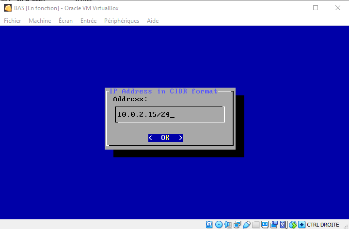
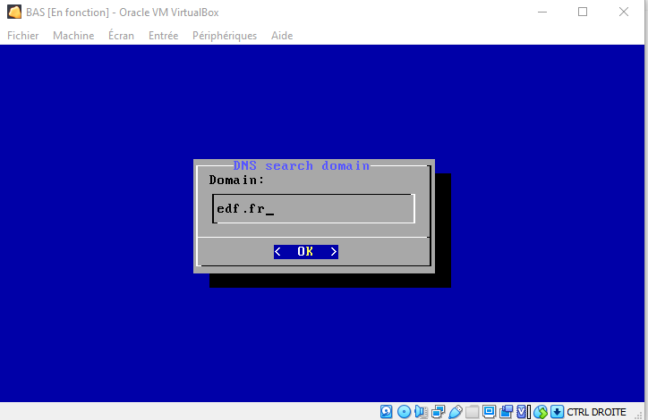
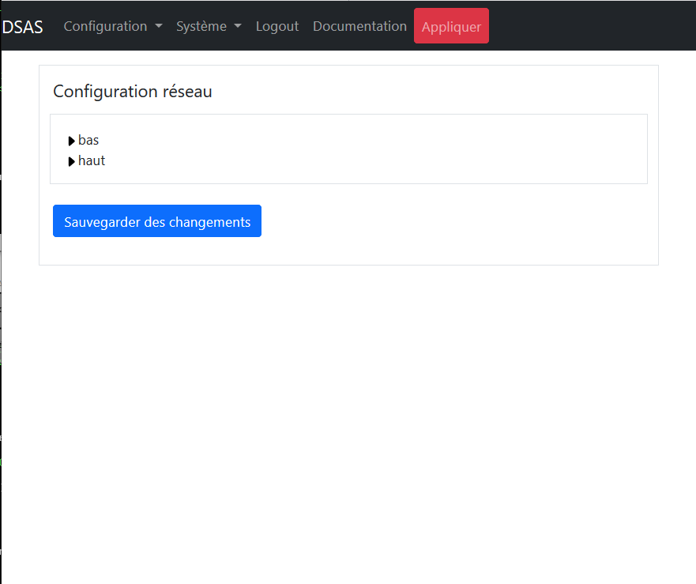
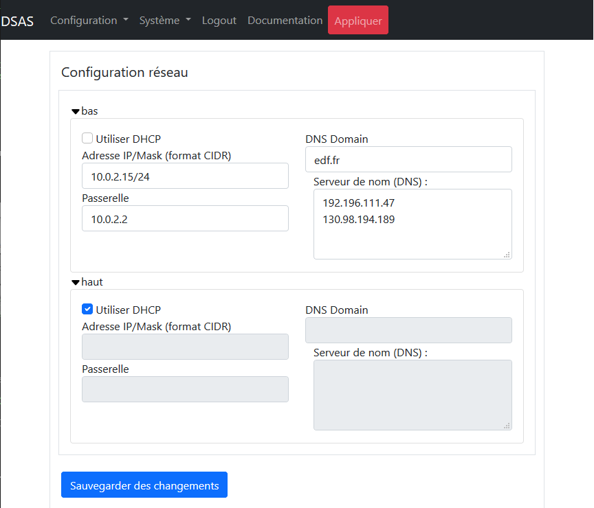

# Introduction

Le cloisonnement des infrastructures industrielles est essentiel pour limiter 
les possibilités d’attaques malveillantes. Ce niveau de cloisonnement limite 
fortement les capacités à automatiser la récupération des mises à jour de sécurité 
(MAJ OS, signatures SEP, MAJ logicielles) indispensables à tous systèmes sensibles. 
Les fichiers de configuration ou tout autre fichier sont également
difficiles à récupérer.

Généralement des clés usb sont utilisées pour injecter des fichiers dans les 
systèmes d’information.  Ce mode de transfert nécessite des interventions humaines 
(chronophages) et expose le système industriel à une contamination virale à chaque 
branchement. Des moyens organisationnels pourraient être mis en place afin de controller
les clefs USB à chaque utilisation, mais le risque de contamination est impossible
à exclure.

Nous avons donc besoin d'un moyen technique de transfert de fichiers d'une zone non
sensible vers nos infrastructures industrielles, et de controller systématiquement tout
transfert afin d'exclure les risques de malveillance. Le "Dynamic Security Access Service" 
(DSAS) a pour but de mettre en place ce moyen de transfert sécurisé. 

Le DSAS a pour objectif de télécharger les mises à jours de sécurité, contrôler leurs 
intégrités et de les mettre à disposition dans les systèmes d’information. Il a également 
pour but la suppression de l'usage de clefs USB sur des infrastructures industrielles, et 
donc  inclut la capacite de transfert des fihciers signé par des personnes habilités.
Le DSAS assure également une rupture de session protocolaire entre les différentes
zones de sécurité dans un contexte de défense en profondeur.

## La principe de vérification des signatures

Le moyen principal de vérification des fichiers transmis par le DSAS est la vérification
des signatures. Chaque fichier permis de passer par le DSAS pourrait être verifier par
une signature cryptographique. 

Le DSAS n'est pas le premier a proposer ce moyen de vérification dans un sas de transfert
de fichier et [nous avons déja un produit](https://www.seclab-security.com/seclab-securing-systems/)
déployé a EDF. Le probleme est que ces moyens requiert l'intervention de quelqu'un à EDF 
afin de signer chaque fichier reçu avant leurs transmission. Un produit comme Symantec 
End Point Manager produit approximativement 4000 fichiers par jours à transmettre. Donc c'est 
illusoire à penser que quelqu'un va controller chacun de ses fichier avant de signer et les 
transmettre.

Le DSAS prendre un autre approche, en donnant confiance aux signature des fichier fournient par
certains editeur de logiciel, et permettant le transfert de ces fichiers. En revanche il est 
plusiers moyens de signature utilisé par les éditeurs de logiciels, est le DSAS est requis 
d'avoir une moyen de vérifier chaque type de signature utilisé par les éditeurs de logiciel

### La chaine de confiance

Le probleme avec une verification de signature est de savoir et limiter à qui on donne confiance.
Pour ça la chaine de confiance de la signature est important à conaitre. Cette chaine de confiance
pourrait être lié à des "Autorités de certification" (ou CA) dans la cas des certificates de type X509,
soit à une confiance distribué avec des certificates eux-mêmes qui sont signé entre-eux dans la
cas des certificates PGP. Dans la cas des certificates PGP, la "toile de confiance" est implicite
est se passe avant l'inclusion des certificates dans la DSAS. Pour les certificates basé sur la
norme X509 la chaine de confiance est inclut dans chaque fichier signés. Par exemple la certificate
utilisé pour la signature d'une fichier est lui-même signé par une certificate intermediaire, et
cette certificate intermediaire est signé par l'autorité de certification. Le DSAS permet de définir
des taches de verification limitant des fichiers permis à passer à une chaine de confiance complete
et pas seulement verifier vis-à-vis des autorités de certification. Malheureusement, [les malveillantes
peut acheter des certificates de signature aussi](https://duo.com/decipher/attackers-are-signing-malware-with-valid-certificates).
est une vérification seulement avec un autorité de certification n'est pas un garantis stricte 
d'absence de malveillance. Le DSAS, si correctement configuré permets de strictement limiter les 
transfert à seulement un seul editeur de logiciel, ou même un sous-division du editeur de logiciel, 
minimisant les risques.

## Architecture

Les principes du DSAS sont les suivantes :

- Le DSAS n'est intégré dans aucun des deux domaines interconnectés, mais est
cloisonné des deux. Les connexions vers les DSAS doivent être strictement 
contrôlées. 
- Aucun service ou port réseau non utilisé ne doit être disponible. Les logiciels
non utilisés doivent être désinstallés.
- Le DSAS doit implémenter une rupture complète entre les deux domaines de sensibilité.
Ceci est implémenté par l'utilisation de deux machines distinctes pour les connexions
vers les deux zones de sécurité différentes, afin que la compromission de la machine 
interconnectée avec le zone non sensible ne mettra pas à risque le zone sensible.
- Plusieurs compte utilisateurs sur les machines du DSAS sont utilisés, avec les droits
d'accès distinct, afin que la compromission d'un compte, n'expose pas entierement
les zones internes de chaque machine.
- Aucun fichier non controlé ne doit être visible dans la zone sensible. Les systèmes
fichiers des deux machines du DSAS doivent être distincte.
- Des vérifications doivent être faites par le DSAS avant de rendre disponible les
fichiers dans le zone sensible. Ces vérifications sont actuellement limitées à
des contrôles d'intégrité mais pourraient dans la futur inclure des contrôles des
menaces avec un moteur d'AV.
- Le maintien en condition de sécurité doit être assurer. Ceci veut dire que
l'ensemble des logiciels exposés à l'attaque doivent connus, une veille de sécurité doit 
être mise en place et des moyens pour pallier les vulnérabilités maitrisées.

Ces contraintes nous poussent vers un des principes d'architecture avec

- séparation du traitement des zones sensibles et non sensibles sur deux machines
distinctes.
- Utilisation d'une souche linux minimale avec le moins de logiciels installés possible.
Le choix d'utilisation de [Tiny Core Linux](http://tinycorelinux.net/) a été fait car 
cette souche est mise à jour régulièrement et l'installation minimale (de 12 megaoctets) 
n'inclut que le noyau de linux, busybox et quelques scripts de démarrage. Aucun service
n'est démarré par défaut
- Des dépendances supplémentaires sont à éviter; par exemple perl, python, etc ne sont pas
installés et tout script utilisé par le DSAS est écrit en shell.
- Chaque machine utilisée dans le DSAS possède deux interfaces réseau distinctes, l'une 
d'entre elles sert à l'interconnexion entre les machines. Une des machines possède une 
connexion vers les zones sensibles et l'autre machine est connectée à la zone non sensible.
- La sens d'instanciation des flux réseau va toujours du plus sensible vers le moins
sensible, et aucun port réseau sur l'interface la plus sensible n'est exposé de la machine 
la moins sensible. Ainsi seule la machine de la zone sensible peut télécharger des flux 
provenant de la zone sensible, la zone non sensible ne peut envoyer des flux vers la zone 
sensible.
- L'ensemble de l'administration doit se faire à partir de la zone sensible. Aucune 
administration ne peut se faire à partir de la zone non sensible. 
- Plusieurs comptes de service sont créés avec le compte "haut" etant le seul avec les droit
de declecher un téléchargement depuis le zone moins sensible, le compte "verif" etant le 
seul avec les droit de transfert entrée un guichet haut et bas de chaque machine, et le 
compte "bas" etant le seul avec les droit d'accès au guichet bas de chaque machine depuis 
le zone plus sesnibles. Le compte "verif" n'est pas accesible depuis l'exterieur de la
machine.

L'architecture du DSAS simplifiée est alors


où les flèches représentent des flux réseau ou applicatifs et les directions de ces flèches
sont le sens de l'initiation de ces flux

Un autilisateur administrateur est également ajouté. Cet utilisateurs ne peut que connecté
depuis le zone sensible et un filtrage forte sur les machine avec les droit de connecter
sur cette compte est implementé. Ceci est le seul compte avec les droit d'administration
sur les deux machines, et le compte root n'est accessible que depuis le compte "tc".

# Installation

Avec le DSAS séparé en deux machines, deux installations séparées sont nécessaires. Les deux
installations suivent la même logique. Dans la discussion suivante la machine connectée au
réseau non sensible est appelée la machine "haute" et la machine connectée au réseau sensible
est appelée la machine "basse". Une configuration initiale de chaque machine est nécessaire
depuis leur console propre, mais après cette phase initiale, toute la configuration est faite depuis
la machine basse.

Afin que la configuration se passe facilement il faut démarrer avec la configuration de
la machine haute, car même en phase initiale la machine basse doit prendre la main sur la
machine haute, et elle doit être configurée en premier afin d'être prête à accepter des ordres.

Dans les sections suivantes si ce n'est pas dit explicitement la configuration concerne les
deux machines.

## Configuration des machines virtuelles

### Choix des tailles des disques

Le DSAS a besoin de disques indépendants, un pour chacun des deux machines utilisées 
dans son implementation. Donc le DSAS a besoin de deux fois plus de disques que le 
maximum utilisé pour les transferts. Le DSAS est configuré afin de faire des "mirroirs" 
des disques à télécharger, et les anciens fichiers sont supprimés s'ils ne sont 
plus disponibles sur leur site de téléchargement. Donc seulement l'addition des espaces
utilisés par les sites externes est nécessaire, plus un peu de marge.

Les mises à jour de windows des "patchs tuesday" sont souvent une centaine de mégaoctets en
taille, donc multiplier ça par le nombre à garder représente potentiellement plusieurs 
gigaoctets. Pour les mises à jour de Symantec le besoin est de l'ordre de 150 mégaoctets.

Chaque repositoire de Linux pourrait avoir jusqu'a 50 gigaoctets, donc si on
tranfère des mises à jour de linux notre besoin de disque peut vite exploser. Dans Les
configurations suivantes, nous avons utilisé une taille de 50 gigaoctets, mais nous
recommandons au moins 500 Go pour chaque machine du DSAS.

### Création des machines virtuelles

Le DSAS est fourni sous forme d'une ISO à utiliser en "live CD". Ceci veut dire que le 
système exploitation doit démarrer toujours sur ce disque ISO. La grand advantage de
cela est que les mises à jour du DSAS vont être très simples en exploitation et se resument
par l'arrêt du DSAS, le remplacement de l'ISO et le redémarrage.

L'ISO du DSAS est une souche linux en 32 bits, et la machine virtuelle est à configurer
en conséquence. Par exemple sous VirtualBox la configuration initiale devrait être


un minimum de 256 mégaoctets est nécessaire afin de démarrer le DSAS. Mais en 
fonctionnement le DSAS pourrait utiliser plus de ressources et nous recommandons
l'utilisation de 1 gigaoctet de mémoire. 

Le DSAS n'a pas besoin d'un format spécifique de disque. Nous avons choisi ici d'utiliser 
le format par défaut proposé par VirtualBox.


Après il faut configurer le disque de démarrage du DSAS en mettant le disque ISO du
DSAS en maître primaire IDE


Si le disque de démarrage est mal configuré, le DSAS ne pourrait pas démarrer. 

### Interconnexion réseau entre les machines du DSAS

Les machines virtuelles sont à configurer avec deux cartes réseaux. La première carte 
réseau est toujours utilisée pour les connexions vers les réseaux externes du DSAS
et leur configuration dépendent de l'environnement où est installé le DSAS. 

La deuxième carte réseau est toujours utilisée pour l'interconnexion entre les 
deux machines du DSAS, et ce réseau est un réseau statique en "192.168.192.0/24".
Plusieurs moyens pourraient être mis en place pour la configuration du réseau
d'interconnexion, notamment si un pare-feux supplémentaire est à placer sur ce
lien (ceci ne semble néanmoins pas vraiment nécessaire). Nous conseillons l'usage un 
réseau interne à l'hyperviseur configuré en VirualBox comme


Nous sommes maintenant prêts a démarrer la machine pour la première fois. 

Cette étape démarre ainsi une initialisation qui se fait en deux phases : la première à 
l'aide de la console Linux, et la deuxième à partir de l'interface d'administration en https.

## Premier phase d'initialisation

Cette phase est fait depuis les consoles des machines, parce-que avant la première
configuration il n'y a aucun garanti que les machines soit visible depuis l'exterieur.
Il faut faire un minimum de geste sur la console afin de démarrer la configuration réseau 
avat de continuer dans une deuxieme phase depuis l'interface d'administration du DSAS.

### Formatage des disques

Au premier démarrage le DSAS nous demande de formatter son disque. Un menu est
présenté avec l'ensemble des disques trouvés connectés au DSAS. Ceci se présente
comme


La navigation dans ce type de menu est faite avec les clefs suivantes

- les flèches - déplacement du curseur
- Espace - sélection d'une option
- Entrée - Continuer

Utiliser "Espace" afin de sélectionner le disque, ici "/dev/sda", et "Entrée" 
afin de démarrer le formatage du disque. Après le formatage, la machine 
rédemarrera automatiquement avant de continuer

### Sélection du type de machine

La prochaine étape consiste à sélectionner si la machine du DSAS va être configurée 
en machine haute ou basse. Le menu 


est utilisé afin de présenter la sélection du type de machine. Si la machine 
a été configurée avec seulement une carte réseau à ce point le DSAS va arrêter
sa configuration avec l'erreur


Dans ce cas arrêter la machine et ajouter une carte réseau dans l'hyperviseur.

### Configuration du réseau initial

La configuration réseau de la machine haute est faite via l'interface d'administration
de la machine basse. Par conséquence cette section ne concerne que la machine basse. En
revanche si le réseau n'est pas au moins partiellement configuré sur la machine basse,
l'interface d'administration pourrait ne pas être disponible. Par conséquent une 
configuration initiale du réseau de la machine basse est faite à partir de la console 
de la machine.

La première étape consiste à choisir si le réseau est statique ou s'il utilise DHCP pour sa 
configuration. Le menu suivant est utilisé afin de confirmer ce choix


A ce point si le DHCP a été choisi aucune autre configuration réseau n'est nécessaire et 
vous pouvez passer au section suivante.

Pour la configuration en IP statique il faut rentrer l'adresse et le netmask en format
CIDR. Dans le format CIDR le netmask en IPv4 est représenté par un entier compris entre 
0 et 32 représentant le nombre de bits utilisés pour coder la partie NetId.

Par exemple le netmask "255.255.255.0" est répresenté en format CIDR par "/24" et
le netmask "255.255.255.128" par "/25". Donc si notre ip est "10.0.2.15" et notre
netmask est "255.255.255.0" il est rentré comme



dans l'interface de configuration au démarrage. La syntaxe de l'adresse IP rentrée est 
validée avant de continuer. Si elle n'est pas dans un format acceptable le même menu vous 
sera représenté en boucle.

Si la machine d'administration n'est pas sur le même sous-réseau que le DSAS il faut
configurer une passerelle par défaut. Sinon laisser vide afin d'empêcher toute connexion 
au DSAS depuis l'extérieur du sous-réseau.


Deux elements sont nécessaires pour la configuration du DNS. Premièrement le domaine
de recherche. Ici un domain de recherche "edf.fr" est utilisé



avec ce domaine de recherche les hosts "ntp1" et "ntp1.edf.fr" seront équivalents.
Après il faut définir des serveurs de noms, responsables pour la conversion des 
adresses DNS en IP. Par exemple 


Plusieurs adresses IP séparées par des espaces pourraient être rentrés, donnant une 
liste de  serveurs de noms en ordre de leur préférence d'usage.

### Configuration SSH

Il n'y a aucun utilisateur SSH sur la machine haute de base, même si un
compte sftp pour l'utilisateur "haut" pourrait être créé de manière optionnelle.
Celui-ci pourrait servir au dépôt de fichiers sur la machine haute pour une tâche sans 
URI. Bien que cette configuration soit non recommandée, une telle configuration est 
possible depuis l'interface d'administration.  La machine haute n'a pas besoin de 
configuration SSH en phase initiale.

Le configuration du SSH requiert la création de clefs SSH pour deux utilisateurs du DSAS;

- l'utilisateur __tc__ en tant que compte à privilèges permettant de travailler en shell 
avec les deux machines, et 
- l'utilisateur __haut__ permettant l'interconnexion en sftp avec l'utilisateur bas de la 
machine haute.

La création des clefs est automatique, mais il faut transférer les clefs autorisées sur la
machine haute. Si la machine haute n'est pas visible de la machine basse elle va attendre 
avec le message


La raison principale afin de voir cet écran pourrait être que la machine haute n'est
pas démarrée. Mais l'interconnexion réseau entre les deux machines pourrait également être
à revoir.

Dans la phase initiale, il n'y a aucune clef SSH pour les SSH sans mot de passe. Donc il 
faut entrer le mot de passe utilisateur à privilège __tc__ dans la fenêtre.


Par défaut le mot de passe du DSAS est __dSa02021DSAS__ mais à la première utilisation de
l'interface d'administration vous serez forcé de changer ce mot de passe.

Ceci est la dernière étape de la configuration initiale sur la console. La deuxième phase 
de la configuration initiale devrait être faite avec l'interface d'administration.

### En cas d'erreur d'initialisation du DSAS

L'erreur est humaine, et le DSAS propose des moyens de récupérer des erreurs faites
lors de l'initialisation. Si la phase initiale de l'installation (utilisant la console)
n'est terminée, aucune configuration ne sera sauvegardée. Un simple redémarrage de la
machine va permettre de reconfigurer à partir de zéro. 

Si malheureusement vous avez terminé l'installation mais qu'elle n'est pas correcte 
et que l'interface d'administration n'est pas accessible, tout n'est pas perdu. Cependant 
comme le DSAS est configuré pour démarrer sans aucune interaction humaine après
sa première configuration, il vous faudra vous connecter à partir l'interface console pour 
pouvoir accéder de nouveau au menu de configuration.

L'utilisateur à utiliser sur la console est 'tc' et le mot de passe à utiliser,
si vous ne l'avez pas déjà modifié avec l'interface d'administration est comme plus
haut. Un console linux classique avec un minimum de fonctionnalités
disponibles vous era présenté. 

La commande nécessaire avec de reconfigurer le DSAS est

```shell
$ sudo /etc/init.d/services/dsas reconfig 
```

Le menu de configuration vous sera alors présenté. A la fin de la configuration n'oubliez 
pas de vous déconnecter à l'aide de la commande

```shell
$ exit
```

## Première connexion à l'interface d'administration

L'adresse de connexion à l'interface d'administration du DSAS va dépendre de votre installation
mais sans NAT entre vous et le DSAS, l'adresse IP sera celle entrée précédemment. En revanche le
port d'administration du DSAS est toujours le __port 5000__. Donc si votre IP est 10.0.15.2 
comme utilisé dans l'exemple ci-dessus vous devrez vous connecter à https://10.0.2.15:5000 pour 
l'interface d'administration du DSAS.

L'interface d'administration est en HTML5 avec des functions récentes de javascript. Donc
un navigateur récent (après 2016) sera nécessaire afin d'utiliser l'interface. Si vous n'arrivez 
pas à vous connecter, c'est soit qu'il y a un problème de routage entre vous et le DSAS et il faut 
revoir les  configurations des routeurs entre vous et le DSAS, soit que la configuration du réseau 
du DSAS précedent est fausse. Dans ce cas il faut référer à la section [En cas d'erreur d'initialisation 
du DSAS](#en-cas-derreur-dinitialisation-du-dsas). 

Le certificat SSL utilisé par le DSAS en phase initiale est auto-signé et il sera nécessaire 
d'accepter son usage dans votre navigateur. Si vous avez réussi à vous connecter à l'interface
d'administration du DSAS l'écran de connexion suivant vous sera présenté :


L'utilisateur privilégié sur le DSAS est l'utilisateur __tc__, et le mot de passe par défaut
est le __dSaO2021DSAS__. A ce point connectez vous sur l'interface d'administration.

### Les basics de l'interface d'administration

#### Le bouton `Appliquer`

En haut des pages de l'interface d'administration vous trouvez un bouton `Appliquer` souligné
en rouge. Ce bouton est très important. Aucune modification faite via l'interface 
d'administration ne sera permanente et aucune, sauf les changements de mot de passe, ne sera 
appliquée tant que le bouton n'est pas utilisé. Ce bouton effectue une sauvegarde permanente 
des changements effectués et les applique. De cette façon les erreurs majeures peuvent être 
facilement supprimées avec un simple redémarrage tant qu'elles ne sont pas appliqués. 

#### Arrêter et Rédémarrer

Le DSAS peut être arrêté et redémarré sans crainte car l'ensemble du code executable est
sur l'image ISO du DSAS. Les taches du DSAS en cours seront interrompues, mais seront reprises au
redémarrage. Les fonctions d'arrêt et redémarrage sont disponibles dans le menu `Systeme` du
DSAS, comme


#### Sauvegarde et Restauration

La configuration actuellement appliqué du DSAS peut-être sauvegardée en utilisant le button dans
la menu ci-dessus. En selectionnant vous seriez demander d'entrée un mot de passe pour la 
sauvegarde, comme


Les sauvegardes des deux machines du DSAS sont alors chiffré en `bcrypt` avec ce mot de passe et
archivé ensemble. Si vous ne rentrée pas de mot de passe de sauvegarde, les fichiers sera archivés
sans l'étape de chiffrement.

Il est fortement conseillé de chiffrer ces archives, parce qu'il contient la configuration completement
du DSAS, y compris les haches des mots de passe, les certificates SSL et les éléemnts secrets SSH.
Le mot de passe n'a pas besoin être le même mot de passe que le DSAS. 

En cas de restauration le même mot de passe sera demander, et donc garder le preciousement. En cas
de restauration la configuration sera appliqué immediatement. Ceci pourrait empecher l'accès au DSAS, 
particulierement si la configuration réseau n'est plus à jour. Dans ce cas referer à la section [En cas 
d'erreur d'initialisation du DSAS](#en-cas-derreur-dinitialisation-du-dsas).

#### Déconnexion automatique

Le DSAS est configuré afin de verifier les droits de connexion à chaque opération, si plus de
10 minutes sépare une opération de la suivante, vous serez automatiquement déconnecté avec
la message suivant :


En cliquant `Ok` sur ce message vous serez redirigé vers l'écran de connexion du DSAS.

### Changement inital des mots de passe

Si ceci est votre première connexion au DSAS, une message d'erreur sera affiché et après, 
l'écran suivant vous sera présenté :


A votre première connexion, tous les mots de passe sont à changer. Il est impossible de 
continuer avec l'interface d'administration sans modifier les mots de passes. 

L'écran de changement de mots de passe comporte 4 lignes. Sur la première, le mot de
passe existant de l'utilisateur __tc__ doit être rentré. Les trois autres lignes 
concernent les utilisateurs suivants :

- __tc__ - L'utilisateur administrateur du DSAS. Il a tous les privilèges sur le DSAS y compris
le doit de devenir __root__. Si `ssh` est actif pour l'utilisateur __tc__ il peut se connecter
avec une interface `ssh` afin de faire de la maintenance avancée sur la DSAS.
- __bas__ - Cet utilisateur n'a qu'un seul rôle. Si le DSAS est configuré avec 
`ssh` pour l'utilisateur __bas__ il aura le droit de se connecter en `sftp` et seulement en `sftp`
depuis la zone sensible. Ceci pourrait être utile pour la récuperation des fichiers transmis
par le DSAS dans certains scenarios. Ne seront présentés à cet utilisateur que des fichiers vérifiés 
par le DSAS et un [chroot](https://fr.m.wikipedia.org/wiki/Chroot) est utilisé afin d'empêcher 
l'utilisateur de voir autre chose.
- __haut__ - Cet utilisateur comme l'utilisateur __bas__ est utilisé pour une connexion en `sftp`
depuis la zone non sensible afin de permettre la dépôt de fichiers directement sur le DSAS. Il est
également cloisonné et ne peugt voir qu'une zone de dépôt de fichiers. __L'utilisation de cette
fonctionnalité est fortement déconseillés__ car elle ouvre la possibilité d'attaques contre le DSAS

Donc, en configuration normale seulement l'utilisateur __tc__ est à utiliser. Mais les trois
mots de passe sont néanmoins à modifier afin d'éliminer l'ensemble des éléments secrets par 
défaut. Les mots de passe des utilisateurs __bas__ et __haut__ peuvent toujours être modifiés 
depuis cette interface et si vous ne pensez pas utiliser les fonctions `sftp`, ilets recommander 
de choisir des mots de passe longs et aléatoires pour ces utilisateurs __bas__ et __haut__.

FIXME : Add any new rules for the complexity of the password here if added

Les limitations imposées sur les mots de passe sont 

- ils ont au moins 8 caractères de long (12 recommandés)
- ils ne contiennent pas d'espaces ni de tabulations

Rentrez vos nouveaux mots de passe et cliquez sur `Modifier les mots de passe`. 


A ce point il est recommandé d'appuyer sur la bouton `Appliquer` afin de rendre ces 
modifications permanentes. Sinon au prochain redémarrage les anciens mots de passe seront 
demandés.

### Configuration des réseaux

L'écran de configuration du réseau est accédé depuis le menu `Configuration` du DSAS, comme 
suivant :


en cliquant dessus l'écran suivant vous sera présenté 



La configuration réseau du DSAS est séparée en deux parties. Le réseau connecté vers le réseau 
sensible denommé __bas__ et le réseau vers le réseau non sensible dénommé __haut__.  Chacunes
de ces deux configurations pourront être accédées en cliquant sur la flèche située à côté du type
de réseau, comme



La configuration du réseau __bas__, précédemment entrée est visible dans ce menu. Vérifier les
configurations, modifier si nécessaire et appuyer sur  `Sauvegarder des changements`.

Une synthèse des formats des entrées sur cette pages sont

- Si l'option DHCP est sélectionnée les autres champs pour la configuration réseau sont ignorés sur cette
interface.
- Les adresses IP, sont au format IPv4 comme NNN.NNN.NNN.NNN
- Si un netmask est nécessaire il est rentré au format CIDR. Dans le format CIDR le netmask est 
répresenté par un entier compris entre 0 et 32, représentant la taille du NetId. 
Par exemple le netmask "255.255.255.0" est 
répresenté en format CIDR par "/24" et le netmask "255.255.255.128" par "/25". 
- Le "DNS Domain" doit être un nom de domaine valable.
- Plusieurs adresses IP separées par des retours chariot peuvent être rentrées, donnant une liste de 
serveurs de noms en ordre de leur préférence d'usage.

### Renouvellement du certificate web

Comme [discuté ci-dessus](#première-connexion-à-linterface-dadministration), le certificate SSL
utilisé par le DSAS par défaut est auto-signé. Cecu est également un élément secret à remplacer 
à la mise en service. L'interface d'administration of le serveur web est dans le sous-menu `Web`
du ment `Configuration` et se presente comme


L'onglet de renouvellement est acedé en cliquant sur la fleche à gauche de `Renouvellement du 
certificate`, et se présente comme


Les champs à remplir pour la renouvellement sont des champs défini par la norme [RFC5280]
(https://datatracker.ietf.org/doc/html/rfc5280.html).

- __C__ - Ce champ est le pays de l'organisation responasable du serveur. Il est obligatoire
codé sur deux lettres comme dédini dans le RFC5280. Le code pour la France est __FR__.
- __O__ - L'organisation responsable pour le serveur. En France est est obligatoirement le
nom du société enregistré avec INSEE et doit être tout en majuscule.
- __OU__ - Un identifiant of le sous organisation responsale pour le serveur. Les certificates
signés par l'ONS d'EDF utilise tous '0002 552081317', le KBIS d'EDF.
- __CN__ - Pour un serveur, comme le DSAS ceci est obligatoirement le nom DNS du serveur
- __S__ - Un champ libre pour la region de la seige social de L'entreprise. Il est optionnel
- __L__ - Un champ libre pour la ville de la seige social de L'entreprise. Il est optionnel

Vous pouvez maintenant cliquer sur le bouton `Renouvellement certificate` et une certificate
sera géneré. En revanche il ne sera pas utilisé par le serveur jusqu'au prochaine fois que 
vous avez cliquer sur `Appliquer`. Le certificate publique et Requete de signature (CSR) pourrait
téléchargé en cliquant sur le bouton .

## Configuration des services

Autre que le service web d'administration et service web de repositoire, il y a 3 services
qui pourrait être demarrer sur les machines du DSAS;

- Un serveur OpenSSH pour les connexion depuis l'exterieur,
- Un client ntpd pour la mise à l'heure des machines, et
- Un client syslogd pour les logs d'administration locale et distante


### Configuration de la service OpenSSH

En plus que le serveur openssh sur la machine haut utilisé pour les communications 
interne entre les deux machine du DSAS, l'adminsitrateur du DSAS peut choisir d'ouvrir 
d'autre service de SSH depuis le zone sensible et/ou non-sensible.

Le serveur OpenSSH n'est jamais démarrer avec des accès ouvertes à tous les utilisateurs sur 
le DSAS. Il faut explicitement donner l'accès a chaque utilisateur, et cet accès n'est valable
que depuis certain zones de sécurité. Par exemple, ci-dessus le service OpenSSH est coché est 
l'utilisateur __tc__  peut connecté que depuis des adresseses IP dans le sous-réseau 10.0.2.0/24. 
Les utilisateurs bas et haut n'ont aucun droit d'accès.

Les adresses d'écoute pour chaque utilisateur peut-être très complexe avec plusieurs adresses 
possible separées par des virgules. Un exemple complexe pourrait-être

```
10.0.2.1,10.0.2.128/25,!10.0.2.129
```

ou l'adresse 10.0.2.1 et le sous reseau 10.0.2.128/25 pourraient aceder au DSAS, mais l'adresse
10.0.2.129 est interdit de faire. Par défaut aucun accès est donné, et si l"adresse d'écoute 
pour un utilisateur est blanc, le serveur OpenSSH n'est même pas démarrer sur l'interface 
réseau du DSAS concerné.

Chaque utilisateur ne peut que connecter depuis certaines zones de sécurité:

- __tc__ - L'utilisateur __tc__ ne peut que connecter depuis la zone sensible et peut 
connecter en ssh, scp et sftp
- __bas__ - L'utilisateur bas ne peut que connecter en sftp depuis la zone sensible. Cette
fonctionalité de sftp pourrait être utilisé pour remplacer le serveur http de répositoire
(ou en complement). Il n'a que accès à la zone du DSAS avec les fichiers verifiés et ne
peut pas accéder ailleurs dans le DSAS.
- __haut__ - `Utilisation du compte haut en SSH en fortement déconseillé`. La raison qu'il est 
déconseillé est qu'il ne respecte pas le sens de l'ouverture des flux de la zone plus sensible 
vers la zone moins sensible. Mais en absence d'autre moyen de téléchargement ce compte ouvre
la possiblité depuis la zone non sensible à déposer des fichiers sur la machine haute du DSAS.
L'utilisateur __haut__ n'a accès que en sftp et que à la zone du DSAS avec les fichiers non
vérifiés.

Si le service SSH est activé vers une zone le port 22 est ouverte sur la machine du DSAS
concernée.

### Client syslogd

Si le service `syslogd` du DSAS est activé, des logs des services sont fait localement au DSAS.
Il est egalement possible à definir une serveur distante pour le service rsyslogd pour des logs 
en UDP sur la port 514. 

A noter que le service syslogd est fournit par BusyBox, et l'implementation de syslogd de BusyBox
n'inclut pas la possibilité de chiffrement en TLS sur la port 6514. Donc d'autre moyen de 
sécurisation de cette flux sont à mettre en place.

L'utilisation de la service syslogd n'ouvre pas une port sur le DSAS, mais seulement une flux
vers une serveur distante.

### Client ntpd

Le DSAS inclut la possibilité de synchroniser via le protocole ntp. Un ou plusieurs hôtes ntp
pourraient être configuré. Les adresses des hôtes ntp pourrait être des adresses IP ou des
nom de hôte comme fournit par le DNS. Dans le deuxieme cas le DNS doit-être configuré dans 
comme discuté dans la section [Configuration des réseaux](configuration-des-réseaux).

Utilisation de ntp n'ouvre pas une port sur le DSAS mais seuelment des flux vers des serevurs 
distantes

# Exploitation du DSAS

## Statut des machines

Le page de statut des taches et les machines et la page d'entrée dans la DSAS et la page 
principale. Il est accedé en cliquant sur `DSAS`dans la menu en tête des pages et se 
presente commande


Le page est divisé en deux section; en haut la statut des machines du DSAS en en bas la status
des taches du DSAS. Trois statistiques sont donnés pour les deux machines du DSAS.

- __L'usage disque__ - L'occupation total des disques de DSAS sont montrés. Si les disques 
sont plein ça sera impossible de correctement télécharger et verifier des fichiers. Donc il
faut surveiller periodiquement l'état des disques. Logiquement si les taches n'ont pas changés,
l'usage des disques ne devraient pas changer non plus, mais si une des taches soudainnement
augmente son usage des disques ça sera facile à rétrouver en manque. Un disque occupé à plus
de 80 ou 90% présente un risque de débordement.
- __L'usage de la mémoire__ - Chaque tache sur le DSAS occupe de la mémoire de la machine.
Si le mémoire est remplit, la performance des taches sera impacté. Il faut surveillé que
la mémoire n'est jamais trop utilisé, mais tant qu'il en dessous de 90% il ne faut trop 
s'en occupé. Avec l'architecture du DSAS, presque 200Mo est utilisé par le systeme 
d'exploitation.
- __Loadavg__ - Le "Load average" est un concept d'unix donnant un idée sur l'occupation des
ressources de calcul de la machine. Un "Load Average" de "1" veut dire que l'équivalent 
d'un coeur du processeur est completement occupé. Donc l'occupation total des ressources
de calcul de la machine est à la point ou le "Load average" est égale à la nombre de coeur
de la processeur. Sur la page de la DSAS le "Load average" est présenté de manière 
logarithmique et avec un echelle avec le nombre de coeur de la processeur à 50% de la 
longeur de la barre de statut. Si le barre de statut est plus longue que la moitie, il y
a peut-être un probleme avec le DSAS ou pas suffisamment de resosurces de calcul. Le premier
chose à refaire dans ce cas est de redémarrer le DSAS afin de voir si le probleme 
disparaitre.

Si la machine basse du DSAS n'est pas disponible vous seriez en imposisbilité de connecter 
à l'interface d'administration. En revanche si le machine haute est défaillante, la page 
de status vous informe avec l'écran suivante


## Statut des fichiers vérifiés 

Le statut des fichiers vérifiés est disponible directement en dessous les statuts des machines 
du DSAS, comme


La statut des verifications des fichiers pourraient être sur plusieurs onglet. Le numèro de
l'onglet est croissant avec l'age des verifications. Le premier onglet est la semaine en cours,
le deuxieme onglet la semaine derniere, etc.

Le statut de chaque fichier vérifié est donné sur une ligne de la page, et chaque ligne est 
composées de 4 éléments

- __Statut__ : En premier position on pourrait trouver la statut de la vérification
- __Hache__ : En deuxieme position est un hache unique en MD5 de la fichier. En cas de recherche
de ménaces ceci pourrait être utile afin de voir si le DSAS de laisser passer le fichier ou pas.
- __Date__ : La date de la vérification est donner en troisieme position. La date est en format
`AAAAMMJJHHMMSS` ou `AAAA` est l'année, `MM` est le mois, etc. Les dates sont toujours données 
en format UTC.
- __Fichier__ : Et en dernier position le chemin vers le fichier est données

Le statut pourrait prendre les valeurs suivantes

- `   Ok` : Tout les vérifications démandé ont réussi et le fichier a été mise à disposition
depuis le machine bas.
- `$$ Checksum fail` : Un test de checksum sur le fichier a échoué 
- `** Bad Sig` : Un des vérifications démandé à signalé une mauvaise signature
- `** Bad Interm Sig` : La vérification d'une certificate intermediare a échoué
- `** Bad RPM Sig` : La vérification de signature d'un fichier RPM a échoué
- `** Bad DEB Sig` : La vérification de signature d'un fichier RPM a échoué
- `** Not signed` : Le fichier n'est pas signé et ne pourrait pas être vérifié

le boutton blue en haut des logs de vérification permettre de basculer entre un mode ou "tous le logs" 
sont visible ou un mode ou "que des erreurs" sont visible. ceci permettre de rapidement identifiés 
les fichiers ayant eu des problemes.

## Configuration des certificates

Le DSAS est pré-configuré avec l'ensemble de certificates racines d'un souche linux classic. 
L'ensemble de ces certificates et d'autres certificates importés sont disponible depuis onglet
Configuration/Certificates comme vue ci-dessous


Les certificates installés dans chaque categorie pourrait être vue en cliquant sur la
fleche a gauche de chaque categorie et les détailles de chaque certificate sont disponible
comme


Chaque certificate pourrait être téléchargé sur la poste d'adminsitration en cliquant 
sur le bouton . 

Les certificates sont souslignés de 4 façon differentes dependant sur les caracteristiques
du certificate. 

- __Certificate CA__ - Avec une texte en noir. Le certificate est un certificate racine ou 
un certificate auto-signé. Les deux types de certicate se resemble avec la difference étant 
la  confiance ou pas donné au certificate.
- __Certicate Intermediate__ - Avec une texte en bleue. Ce certificate n'est pas
un certificate raçine, mais elle est signé par un autre certificate
- __Moins de 6mois à l'éxpiration__ - Avec une texte en orange/jaune. Ce certifcate est à 
moins de 6 mois de l'éxpiration
- __Expiré__ - Avec une texte en rouge. Le certificate a déjà expiré. Ceci ne veut pas dire
qu'il n'est plus utilisable, mais il n'est pas valable pour des fichiers signés après la date
de éxpiration

Les certificaties racines preinstallés pourraientt être utiliser pour les verifications 
du DSAS. Mais l'utilisation de ces certificates seule n'est pas suffisante, parce que

- Les certiciates pré-installé n'incluent pas des certificates GPG utilisé par les 
repositoire linux
- La verification seulement contre un certificate racine n'ai pas un garanti forte d'absence
de malveillance. [Les certificiate de type "code signing" ont été abusés par les 
malveillantes](https://duo.com/decipher/attackers-are-signing-malware-with-valid-certificates) 
afin de signer des malware.

Donc idéalement il faut restriente les verifications par des vérifications des certificates
de type intermediares la plus proche de l'éditeur de logiciel voulu. Par exemple un
mise à jour de "Symantec Endpoint Protection" (SEP) comporte la chaine de confiance 
suivante

```
VeriSign Class 3 Public Primary Certification Authority - G5
-> Symantec Class 3 SHA256 Code Signing CA
  -> Symantec Corporation
```
Donc idéalement il faut vérifier les mises à jour de SEP avec le certificate racine 
`VeriSign Class 3 Public Primary Certification Authority - G5` et avec le certificate
intermediate  `Symantec Corporation` afin de limiter au maximum les fichiers qui 
pourrait être validé en tant que mise à jour de Symantec. Donc pour ces mises à
jour il faut chargé le certificate `Symantec Corporation` dans le DSAS.

### Gestion des certificates X509

#### Identification des certificaties X509

Les certicates X509 sont utilisé dans la verification des binaires Windows, mais
également pour des fichiers signés par `openssl`. 

Depuis un poste de travail en windows, avec un clique droit et en selectionnant l'option
`Propriétés` nous pourrions voir la menu suivante


En cliquant sur `Détails` et après `Affichier le certificat` nous pourrions voir la
chaine de confiance suivante


Ceci permet de valider la certificate racine et l'ensemble des certificates utilisées
pendant la signature des binaires.

#### Preparation des certificates X509

La plus importante pour la préparation d'une certificate pour l'importation dans le DSAS
est de savoir la provenance de la certificate. Idéalement le certiciate est donnés de 
manière sûr par l'éditeur de logiciel. Cette moyen de diffussion est souvent réalisé par
une moyen de télécharger le(s) certificate(s) depuis une site web de l'éditeur. Mais
ceci n'est pas toujour le cas, nottament pour Symantec comme ci-dessus.

A défaut de la distribution par site web, l'ensemble des certificates utilisés pour des
signatures de binaires windows sont embarquées dans les binaires signés eux-mêmes. Donc si 
vous êtes __sûr__ de  la provenance d'un bianire vous pouvez utiliser le binaire lui-même comme 
source de certificate.

Sur le même menu que ci-dessous sur l'onglet `Détails` nous pourrions voir


avec l'option de `copier dans un fichier`. Cet option permettre de Sauvegarder 
l'ensemble des certificates de la chaine de confiance. Il faut selectionner de
sauvegarder le certificate en format X.509 encodé en base 64 comme 


Un fichier avec le certificate sera sauvegarder sur votre poste de travail.

#### Cas special des certificate Symantec LiveUpdate

Les fichiers LiveUpdate de Symantec ne sont pas signées directement, sont sont 
plutot des archive en format `7z` avec tous les metadonnées signés nécessaire à 
leur vérification. Dans chaque fichier de `LiveUpdate` un fichier avec l'extension
`.sig` pourrait être trouver, typiquement `v.sig`. Ce fichier contient les 
certificates qui doit être importés dans le DSAS pour la signature des fichiers 
de LiveUpdate. Tant que vous avez extrait le ficher `v.sig`, les deux Certificates
à importer peux être retrouver avec la commande

```shell
$ openssl pkcs7 -inform der -in v.sig -outform pem -print_certs | awk 'split_after==1{n++;split_after=0} /-----END CERTIFICATE-----/ {split_after=1}{if(length($0) > 0) print > "cert" n ".pem"}
```
sur une machine linux. A partir de la ligne de command windows nous pourrions faire.

```shell
$ openssl pkcs7 -inform der -in v.sig -outform pem -print_certs -out certs.pem
```

et la fichiers `certs.pem` va contenir plusieurs certificates en format text que vous pouvez
splitté en plusiers fichiers avec l'aide d'un editeur de texte.

En revanche, certaine fichiers dans les archives sont relativement vieux, et leurs
signatures aussi. Par consequence, plusieurs certificates sont nécessaires. En plus
les certificates raçine utilisé pour ces signature ne sont pas incluent dans les fichiers
mais integrés directement dans SEP, voir [discuté ci-dessus](#vérification-symantec-liveupdate).

Afin de facilitié l'utilisation de Symantec LiveUpdate, et les autres editeur de logiciel
typiquement utilisé avec le DSAS, les 10 certificates à installer sur le DSAS sont disponible
dancs [le bundle de certificates ci-jointe](certificates.zip).

### Gestion des certificates GPG

Les certificiates GPG sont utilisé notamment pour la vérification des binaires
de linux, mais également pour d'autres fichiers signés par GPG (par exemple des
fichiers de configuration dévéloppé par les utilisateurs du DSAS). 

Les certificates GPG n'integrent pas explicitement la chaine de confiance dans les
binaires signées. GPG utilise la concept de [toile de confiance](https://fr.wikipedia.org/wiki/Toile_de_confiance)
ou les certificates eux-mêmes sont validés entre eux. Ceci est en dehors de la scope
du document et nous avons assumé que vous avez un confiance complet dans les certificates 
que vous avez choisi à télécharger sur le DSAS.

Afin de récuperer un certificate GPG, la seule solutions est de retouner vers 
l'editeur de logiciel concerné. Par exemple quelques exemples de certificate
des éditeurs de logiciels sont

- [La page des certificates de RedHat](https://access.redhat.com/security/team/key) 
contient [le certificate utilisé pour la signatures des binaires de Redhat depuis 
2010](https://www.redhat.com/security/data/fd431d51.txt)
- [La page des certificates de CentOs](https://www.centos.org/keys/) contient nottament 
[le certificate utilisé pour CentOS7](https://www.centos.org/keys/RPM-GPG-KEY-CentOS-7)
- [La page des certificates debian](https://ftp-master.debian.org/keys.html) contient
nottamment le certicate de [Debian Bullseye](https://ftp-master.debian.org/keys/archive-key-11.asc)

### Importation d'un certicate dans le DSAS

Des certificates X509 et GPG pourraient être ajoutés au DSAS en cliquant sur le
[](images/DSAS23.png) a droit de chaque categorie de certificate. Un navigateur 
du poste de travail est ouvert afin de selectionner le fichier à télécharger sur
le DSAS. Et un importation réussi est signalé par


Afin de confirmer la bonne importation du certificate dans le DSAS, il est 
recommander de regarder les détails de la certificate importée, comme par exemple


## Configuration des taches

Une nouvelle tache pourrait être ajouter en cliquant sur le  
a droit de la page des taches. 


En cliquant dessus nous sommes présenté avec un formulaire d'jout de tache comme


- `Nom du tache` : Un nom donné au tache, qui n'est pas forcement unique
- `Sous-dossier utilisé par le tache` - Les fichiers associé avec chaque tache 
sont stocké dans un dossier à part sur le DSAS. Ce dossier devrait être unique 
pour chaque tache.
- `URI (pas de chargement si vide)` - L'adresse ou le DSAS va chercher les fichiers
associés avec un tache. De laisser vide est permissible et dans ce cas il est assumé 
que les fichiers associés avec le taches doit-être déposé sur la DSAS par l'utilisateur.
le `URI` doit-être de la forme `protocole://site/dossier/` .....
+ `sftp:` -
+ `ftp:` -
+ `http:` -
+ `https:` -
+ `scp:` -


# Mantient en condition de sécurité

FIXME : Ajouter la liste des logiciels exposé et leurs vesrsion ici

FIXME : Discuter procedure de remplacement de l'iso 

## Processus de pull et build github

FIXME : Fournir une image de build tinycore preconfiguré

## Mise à jour binaire

## Mise à jour source

# Architecture détaillé

Cette séction inclut des détailles des mesures de sécurité mise en place afin
de garantir le niveau de sécurité du DSAS.

## Matrice de flux réseau détaillé

| Source          |  Destination    | Port        |  proto  | Service  | optionnel | commentaire                  |
|-----------------|-----------------|-------------|---------|----------|-----------|------------------------------|
| bas             | haut            | 22          | tcp     | ssh      | requis    | interconnexion machines dsas |
| reseau sensible | bas             | 5000        | tcp/udp | https    | requis    | console d'adminsitration     |
| reseau sensible | bas             | 443         | tcp/udp | https    | optionnel | repositoire de fichier       |
| reseau sensible | bas             | 22          | tcp     | ssh      | optionnel | acces console user 'tc'      |
| reseau sensible | bas             | 22          | tcp     | sftp     | optionnel | acces fichiers user 'bas'    |
| reseau ouverte  | haut            | 22          | tcp     | sftp     | non reco. | depot fichier user 'haut'    |
| bas             | reseau sensible | 123         | udp     | ntp      | optionnel | synchronisation temps        |
| bas             | reseau sensible | 514         | udp     | syslog   | optionnel | service de log               | 
| haut            | reseau ouverte  | 22          | tcp     | sftp/scp |    -      | tache en sftp/scp            |
| haut            | reseau ouverte  | 20          | tcp     | ftp      |    -      | tache en ftp - data fixed    |
| haut            | reseau ouverte  | 21          | tcp     | ftp      |    -      | tache en ftp                 |
| haut            | reseau ouverte  | 60000-65535 | tcp     | ftp      |    -      | tache en ftp - data trigger  |
| haut            | reseau ouverte  | 80          | tcp/udp | http     |    -      | tache en http                |
| haut            | reseau ouverte  | 443         | tcp/udp | https    |    -      | tache en https               |


## Les comptes utilisateurs sur la DSAS

### Les droit d'ecriture de chaque utilisateur

### Les droit de connexion de chaque utilisateur

## Cloissonnement disque 

FIXME : Discuter sur le disque mounter en "noexec"

Un hardlink sous linux est exactement le même fichier dupliqué à un autre endroit. 
L'usage des hardlink entre les fichier du gichet haut du sas et le guichet bas 
pourrait permettre un simplication des l'architecture, car aucun moyen de tracer les
ficheirs téléchargé sera necessaire et ça sans augmentation de l'espace disque.

En revanche les hardlink doit réspecter les exigences d'acces entre les guichet haut
et bas. Quand un fichier existe dans les deux zones, il faut que

- L'utilisateur haut ne peut pas modifier le fichier visible dans le guichet bas
- L'utilisateur haut ne peut pas supprimer l'existance de la fichier dans le 
  guichet bas
- Que l'utilisateur haut pourrait supprimer l'existence de la fichier dans le 
  guichet haut

Avec les permissions suivante

| Perms      |  UID   | GID   |  Chemin
|------------|--------|-------|-------------------
| drwxrwx--- |  haut  | haut  |  dsas/haut
| -rw-r----- |  verif | share |  dsas/haut/fichier
| drwxrwx--- |  bas   | bas   |  dsas/bas
| -rw-r----- |  verif | share |  disas/bas/fichier

et un fichier /etc/group centenant 

```
verif:x:2000:
bas:x:2001:verif
haut:x:2002:verif
share:x:2003:verif,bas,haut
```

les exigences voulu sont respecté. Les script de verification DSAS ont été adapté
afin d'assurer ces conditions

## Moyens de Verification 

Il y a 3 type de verification des répository linux

* rpm - Les signature de chaque fichier RPM est verifié avec "rpm -K"
* repomd - Le fichier repomd.xml est verifié et seulement les hashes to chaque fichier est verifié
* deb - Actuellement non implementé

Il y a quatre autres type de vérification 

* authenticode - Verifier avec Microsoft Authenticode signatures. 
* liveupdate - Symantec LiveUpdate signatures
* gpg - Signature d'un fichier avec gpg
* openssl - signature d'un fichier avec 

### Verification - rpm

Dans les verifications des repository RPM le fichier repodata/repodmd.xml est lu et les fichiers
xml avec la liste des packages à verifier sont lu. Actuellement seulement le repositoire primaire
est identifié est lu (FIXME: rendre possible la transfert des autre repo). 

Dand la mode de vérification `rpm`, chaque fichier de package listé dans le fichier xml de repositoire
primaire est vérifié avec la commande `rpm -k` contre la certificate GPG fournit pour la tache.

### Vérification - repomd

La mode `repomd` est comme la mode `rpm` avec l'exception que le fichier `repodata/repomd.xml` est
signé directement avec GPG. Le fait que ce fichier de metadonnées est signée et il contient la 
hash du fichier xml primaire, et les hashes de chaque package est inclut dans le fichier xml de
repositoire primaire. De cette façon, une seule vérification de signature et des vérification de
hash de chaque fichier de package, permets de cryptographiquement vérifier l'ensemble des fichiers
du répositoire. Ceci est plus rapide est aussi sûr que la verification de type `rpm`.

### Vérification - authenticode

Pour la tye de vérification "authenicode" chaque fichier dans la dossier est verifiés contre les
certificates specifiés. Si aucun certificate authorité est specifié, le store de certificate est
utilisé incluant tous les certificates dans le store. Ceci pourrait augmenté les risques et il est 
beaucoup meiux de spécifier un seul certificate autorité pour la vérification

Si les signatures sont valable et signé par les certificates spécifiés, les fichiers sont mise à 
disponibilité sur le sas du bas de DSAS. Aucun sous-dossier est traité

Le logiciel osslsigncode [https://github.com/mtrojnar/osslsigncode] est utilisé pour la verification.
La commande

```shell
$ osslsigncode verify -CAfile ca.pem  <file>
```

est utilisé pour la verifications d'un fichier `<file>` contre un specifique certificate raçine `ca.pem`.
Si nous voulons verifier contre un certificate intermediaire, la commande est

```shell
$ osslsigncode verify -CAfile ca.pem -require-leaf-hash sha256:$(sha256sum inter.der | cut -d" " -f1) <file>
```

ou le ficher `inter.der` est la certificate intermediaire à utiliser pour la verification.

### Vérification - Symantec LiveUpdate

Les fichiers IntelligentUpdate de Symantec sont en authenticode, donc ils sont exclut de cette discussion.
Le format Symantec LiveUpdate est utilisé par `Symantec Endpoint Protection Manager` (SEPM) pour les mises
à jour. La format de signature des fichier de LiveUpdate sont très complexe avec des ficheirs signée selon 
[la methode déatillé dans la section suivante](#signature-des-fichiers-liveupdate), et des fichiers verifiés
que par leurs hash dans un autre fichier signé, l'ensemble des fichier en format LiveUpdate peut-être 
idéntifiées selon leurs nom comme

- `*.livetri.zip` - des fichiers signés de type LiveUpdate faissant réferences à d'autre fichiers non-signés
- `NNNNNNNNNN*.*` - des fichiers non-signés avec le champ `NNNNNNNNNN` répresentant la date en nombre de secondes
depuis l'epoche unix (1 janvier 1970, 00:00:00 UTC). Ce fichiers ne sont pas signés, et doit être référencés 
dans un fichier `*livtri.zip`. Ca semble que `SEPM` laisse des fichiers de ce type qui ne sont plus utilisé dans
un fichier `*livetri.zip` et dans ce cas les fichiers pourraient être ignorés.
- `minitri.flg` - Un fichier de un seul octets avec le caracters `0x20` (un esapce) dedans. Le presence ou pas
du fichiers pourrait modifier la comportement de `SEPM`. Le fichier ne pourrait âs être malveillante. Dans le
contexte de faire rentre des fichiers depuis un zone non sensible vers un zone sensible il ne pourrait pas 
être utilisé pour un canal cache pour la fuite d'information non plus. Ce fichier est transmit sans test
- `SymantecProductCatalog.zip` - les dates des ficheirs dans cette archive sont tous tous avant 2009.  Mais la
date de l'archive est toujours mise à jour par `SEPM`, le fichier est signé est des vieux certificate de
Symantec. Ce fichier est verifié est transmis par le DSAS
- `*.jdb`- [Les fichiers JDB sont pour des mise à jour de `SEPM` ou des clients 
`SEP`](https://knowledge.broadcom.com/external/article/151309/download-jdb-files-to-update-definitions.html). 
A ce jour ils sont signé avec un certificate Symantec périmé. 

Le DSAS est capable de transmettre l'ensemble de ce type de fichiers avec l'exception des fichiers
`NNNNNNNNNN*.*` qui ne sont plus listé dans un fichier `*livetri.zip`.

#### Signature des fichiers LiveUpdate

Les fichiers de LiveUpdate, et les fichier JDB, de Symantec ne sont pas signés directement. En revanche 
l'ensemble de ces fichiers sont des archive en format `7z` ou `ZIP`, et ces acrhives contient deux fichiers,
typiquement nommés `v.grd` et `v.sig`. C'est fichiers pourraient avoir d'autre nom, mais les extensions
`.grd` et `.sig` sont toujours utilisé

Le contenu de la fichier `.grd` est en format comme

```
[GuardHeader]
Legal=Copyright (c) 2021 Broadcom. All Rights Reserved.
LastModifiedUtcSeconds=1631691252
LastModifiedGmtFormated=20210915 07:34:12
[File-catalog.dat]
SHA1=283a3db5efa98bca72c9a637d06ee91e0602bd78
SHA256=aba60a13486e25fe4cb4faf332ff304159d9611433618f1d067e756746432918
[File-cceraser.dll]
SHA1=4454574388758ec3d0cad00b142df6a163a5c001
SHA256=721473abd9d240d5170c9952a8a1d1644f177c1dbbef01b105e1d44705188db4
...
```

Avec des hashes de l'ensmeble des fichiers contenu dans l'archive. Dans le cas des fichiers `*livetri.zip`
les hashes des fichiers pourrait correspondre egalement à un autre fichiers pas inclut directement dans
l'archive mais à côté avec un nom comme `NNNNNNNNNN*.*`. La commande

```shell
$ openssl asn1parse -i -inform der -in v.sig
```

permettre de voir facilement que la fichier sig contient, au moins deux certificates,
un hache de la fichier `.grd` et la signature en binaire lui-même. La texte "pkcs7-signedData"
permettre d'identifier le type de signature utilisé. Le probleme est que la chaine de 
confiance des ficheirs `.sig` sont typiquement

```
Symantec Internal RSA IT Root
-> Symantec Code Signing 2017 CA
  -> Product Group - LiveUpdate
```

ou

```
Symantec Root 2005 CA
-> Code Signing 2005 CA
  -> Symantec Corporation
```

ou bien

```
Symantec Root CA
-> Code Signing CA
  -> Symantec Corporation
```

pour des vielles fichiers. Aucun de c'est certificates est publiquement disponible, est ils sont 
embarquées directement dans le logiciel SEPM à son installation. La chaine des certificates 
utilisés sont inclut dans les fichiers `.sig` et nous pourrions les sortir en format PEM avec une 
commande

```shell
$ openssl pkcs7 -inform der -in v.sig -outform pem -print_certs | awk 'split_after==1{n++;split_after=0} /-----END CERTIFICATE-----/ {split_after=1}{if(length($0) > 0) print > "cert" n ".pem"}
```

cette commande va créer deux fichier, `cert.pem` et `cert1.pem` avec la certificate signateur et les 
certificates intermediaires utilisées. Ces certificates peuvent être importé  dans le DSAS. Malheureusement, 
ceci va permettre de sortir que les certificates intermediaires et la certificate utilisé pour la signature. 
La certfiicate raçine n'est pas inclut dans les fichiers signature. Il faut retourner vers l'executable de SEP 
afin de retrouver les trois certificates raçines utilisées par SEPM. 

Tous les postes clients 64bit de SEP inclut l'executable `sepWscSvc64.exe`. En regardant avec la commande

```shell
$ LANG=C grep -obUaP "\x30\x82..\x30\x82" sepWscSvc64.exe
```

ou si ta version de grep inclut pas de regexp de type perl 

```shell
$ echo -e "\x30\x82..\x30\x82" | LANG=C xargs -i grep -obUa {} sepWscSvc64.exe
``` 

c'est possible d'indentifiés la debut des certificates. le string "\x30\x82" correspond à la code ASN.1
pour une `SEQUENCE`. Une sequence est toujour suivi par une longeur codé sur deux octets, et une 
certificate demarre toujour avec deux `SEQUENCE`. Donc le regexp "\x30\x82..\x30\x82" est adapté à
trouver les debut des certificates, mais pas que.  Cette commande trouver les offsets binaires des
endroit correspondant à des certificates comme

```
$ echo -e "\x30\x82..\x30\x82" | LANG=C xargs -i grep -obUa {} sepWscSvc64.exe
1665104:0▒▒0▒
1666048:0▒▒0▒
1667008:0▒▒0▒
1794627:0▒)▒0▒
1805383:0▒0▒
1806692:0▒▒0▒
1809680:0▒j0▒
1810300:0▒▒0▒
1811326:0▒▒0▒
1811999:0▒▒0▒
1814423:0▒▒0▒
1815659:0▒Y0▒
1817874:0▒j0▒
1818494:0▒▒0▒
1819520:0▒▒0▒
1820193:0▒▒0▒
```

mais le string du regexp pourrait egalement être une partie du binaire et pas une certificate de tout. 
Il faut les tester tous ces valeurs avec

```shell
$ dd bs=1666048 skip=1 if=sepWscSVC64.exe | openssl -inform der -in - -noout -text | less
```

et quand les certificates `Symantec Internal RSA IT Root`, `Symantec Root 2005 CA` et `Symantec Root CA` sont identifiés, les sauver avec

```shell
$ dd bs=1665104 skip=1 if=sepWscSvc64.exe | openssl x509 -inform der -in - -outform pem -out Symantec_Internal_RSA_IT_ROOT.pem
$ dd bs=1666048 skip=1 if=sepWscSvc64.exe | openssl x509 -inform der -in - -outform pem -out Symantec_Root_2005_CA.pem
$ dd bs=1667008 skip=1 if=sepWscSvc64.exe | openssl x509 -inform der -in - -outform pem -out Symantec_Root_CA.pem
```

Maintenant le format `PKCS7` est la format utilisé par `SMIME`, et ici la signature est en 
format `DER`. La commande normale de verification de signature smime est

```shell
$ openssl cms -verify -inform der -in v.sig -content v.grd
```

cette commande va verifier les signatures contenu dans `v.sig' contre les certificates raçines 
installé sur la machine et comparé contre le hache du fichier `v.grd`. La certficate raçine 
typiquement utilisé est `Symantec Root 2005 CA`, et donc le vrai verification à mettre en place 
est 

```shell
$ openssl cms -verify -CAfile SymantecRoot2005CA.pem -inform der -in v.sig -content v.grd
```

qu'on va trouver deux autres probleme avec les chaines de signature de Symantec. Les deux certificates
raçines utilisés par Symantec pour les signatures ont tous les deux expiré, et Symantec n'ont pas utilisé
des signatures horodaté avec un server de temps openssl. Donc, òpenssl` va réfuser de valider les fichiers
fournaient par Symantec. Le deuxieme probleme est dans les champs `X509v3 Key Usage` et `X509v3 Extended
Key Usage`. `openssl` demande que l'ensemble des certificates de la chaine de confiance support les mêmes
options de signature, mais la certificate `Code Signing CA` support l'option `Code Signing', mais les
deux atres certificates dans la chaine ne le supportent pas. Deux autres option de `openssl` sont
necessaire afin de détoruner ces problemes, comme

```shell
$ openssl cms -verify -purpose any -no_check_time -CAfile SymantecRoot2005CA.pem -inform der -in v.sig -content v.grd
```

Ceci suffit afin de verifier que les fichiers de SYmantec sont bien signés par une certificate avec la
raçine `Symantec Root 2005 CA`, mais rien veut dire Symantec n'as pas autorisé un autre certifcate 
intermediate sur cette raçine. Donc ca sera plus propre de verifier la signature contre une chaine
de confiance complete que nous contrôle. Pour ça le DSAS nous doit ignorer les certificates dans 
`v.sig` en prennant en compte que les données de signature, et nous sommes obligé à fournir les deux
autres certificates utilisé pour les signatures, `cert.pem` et `cert1.pem` créé ci-dessus. L'argument
`-certfile` pourrait être utilisé afin de faire, mais `openssl` n'accepte qu'une seul argument de 
type `-certfile`, donc les deux certficates doit être remise dans un seul fichier et verifier comme

```shell
$ cat cert.pem cert1.pem > certs.pem
$ openssl cms -verify -CAfile SymantecRoot2005CA.pem -certfile certs.pem -nointern -inform der -in v.sig -content v.grd
```

### Vérification - gpg

Les signatures GPG pourrait être integré dans le fichier signé ou dans un fichier à part. Le DSAS
assume qu'un des moyens suivant est utilisé afin de signé un fichier

```shell
$ gpg --output <file>.gpg --sign <file>
$ gpg --output <file>.sig --detach-sig <file>
$ gpg --output <file>.sig -a --detach-sig <file>
```

Donc des signature detaché sont en deux fichiers <file> et <file>.sig, et des signature integrés 
sont dans des fichiers terminant comme <file>.gpg. Le DSAS traite les deux type de signatrue. Dans le
cas de signature detaché, les deux fichiers doit être fournient au DSAS.

### Verification - openssl

L'utilisateur doit avoir déja generé des clefs publique et privé pour la signature avec 

```shell
$ openssl genrsa -out key.pem 4096
$ openssl rsa -in key.pem -pubout > key.pub
```

Et le clef publique dans le fichier key.pub doit être associé avec le tache dans le DSAS. Les fichiers
sont signés comme

```shell
$ openssl dgst -sign key.pem -keyform PEM -sha256 -out <file>.sig -binary <file>
```

Les signatures sont toujours stockés dans des fichiers séparé, et le DSAS assume que les signature
sont dans un fichier avec un extension .sig. Les deux fichiers doit être fournient au DSAS.

## Service OpenSSH

## Service web

FIXME: discuter l'usage de TLS et le group "repo" afin de respecté les droit
