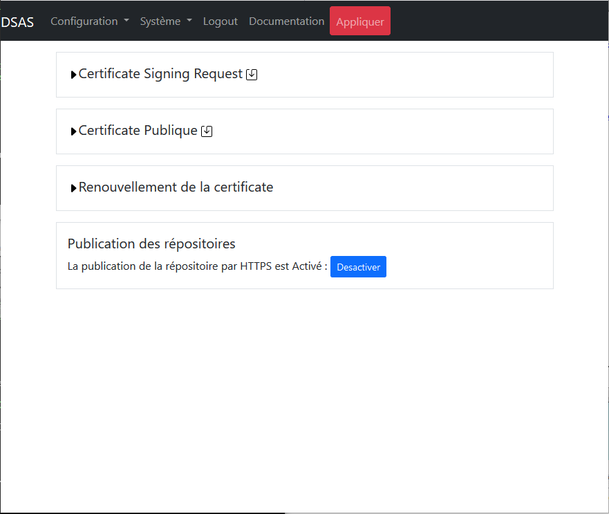

# Introduction

Le cloisonnement des infrastructures industrielles est essentiel pour limiter 
les possibilités d’attaques malveillantes. Ce niveau de cloisonnement limite 
fortement les capacités à automatiser la récupération des mises à jour de sécurité 
(MAJ OS, signatures SEP, MAJ logicielles) indispensables à tous systèmes sensibles. 
Les fichiers de configuration ou tout autre fichier sont également
difficiles à récupérer.

Généralement des clés usb sont utilisées pour injecter des fichiers dans les 
systèmes d’information.  Ce mode de transfert nécessite des interventions humaines 
(chronophages) et expose le système industriel à une contamination virale à chaque 
branchement. Des moyens organisationnels pourraient être mis en place afin de controller
les clefs USB à chaque utilisation, mais le risque de contamination est impossible
à exclure.

Nous avons donc besoin d'un moyen technique de transfert de fichiers d'une zone non
sensible vers nos infrastructures industrielles, et de controller systématiquement tout
transfert afin d'exclure les risques de malveillance. Le "Dynamic Security Access Service" 
(DSAS) a pour but de mettre en place ce moyen de transfert sécurisé. 

Le DSAS a pour objectif de télécharger les mises à jours de sécurité, contrôler leurs 
intégrités et de les mettre à disposition dans les systèmes d’information. Il a également 
pour but la suppression de l'usage de clefs USB sur des infrastructures industrielles, et 
donc  inclut la capacite de transfert des fihciers signé par des personnes habilités.
Le DSAS assure également une rupture de session protocolaire entre les différentes
zones de sécurité dans un contexte de défense en profondeur.

## Architecture

Les principes du DSAS sont les suivantes :

- Le DSAS n'est intégré dans aucun des deux domaines interconnectés, mais est
cloisonné des deux. Les connexions vers les DSAS doivent être strictement 
contrôlées. 
- Aucun service ou port réseau non utilisé ne doit être disponible. Les logiciels
non utilisés doivent être désinstallés.
- Le DSAS doit implémenter une rupture complète entre les deux domaines de sensibilité.
Ceci est implémenté par l'utilisation de deux machines distinctes pour les connexions
vers les deux zones de sécurité différentes, afin que la compromission de la machine 
interconnectée avec le zone non sensible ne mettra pas à risque le zone sensible.
- Plusieurs compte utilisateurs sur les machines du DSAS sont utilisé, avec les droits
d'accès disctinct, afin que la compromission d'un compte, n'expose pas entierement
les zones interne de chaque machine.
- Aucun fichier non controlé ne doit être visible dans la zone sensible. Les systèmes
fichiers des deux machines du DSAS doivent être distincte.
- Des vérifications doivent être faites par le DSAS avant de rendre disponible les
fichiers dans le zone sensible. Ces vérifications sont actuellement limitées à
des contrôles d'intégrité mais pourraient dans la futur inclure des contrôles des
menaces avec un moteur d'AV.
- Le maintien en condition de sécurité doit être assurer. Ceci veut dire que
l'ensemble des logiciels exposés à l'attaque doivent connus, une veille de sécurité doit 
être mise en place et des moyens pour pallier les vulnérabilités maitrisées.

Ces contraintes nous poussent vers un des principes d'architecture avec

- séparation du traitement des zones sensibles et non sensibles sur deux machines
distinctes.
- Utilisation d'une souche linux minimale avec le moins de logiciels installés possible.
Le choix d'utilisation de [Tiny Core Linux](http://tinycorelinux.net/) a été fait car 
cette souche est mise à jour régulièrement et l'installation minimale (de 12 megaoctets) 
n'inclut que le noyau de linux, busybox et quelques scripts de démarrage. Aucun service
n'est démarré par défaut
- Des dépendances supplémentaires sont à éviter; par exemple perl, python, etc ne sont pas
installés et tout script utilisé par le DSAS est écrit en shell.
- Chaque machine utilisée dans le DSAS possède deux interfaces réseau distinctes, l'une 
d'entre elles sert à l'interconnexion entre les machines. Une des machines possède une 
connexion vers les zones sensibles et l'autre machine est connectée à la zone non sensible.
- La sens d'instanciation des flux réseau va toujours du plus sensible vers le moins
sensible, et aucun port réseau sur l'interface la plus sensible n'est exposé de la machine 
la moins sensible. Ainsi seule la machine de la zone sensible peut télécharger des flux 
provenant de la zone sensible, la zone non sensible ne peut envoyer des flux vers la zone 
sensible.
- L'ensemble de l'administration doit se faire à partir de la zone sensible. Aucune 
administration ne peut se faire à partir de la zone non sensible. 
- Plusieurs comptes de service sont créés avec le compte "haut" etant le seul avec les droit
de declecher un téléchargement depuis le zone moins sensible, le compte "verif" etant le 
seul avec les droit de transfert entrée un guichet haut et bas de chaque machine, et le 
compte "bas" etant le seul avec les droit d'accès au guichet bas de chaque machine depuis 
le zone plus sesnibles. Le compte "verif" n'est pas accesible depuis l'exterieur de la
machine.

L'architecture du DSAS simplifiée est alors


où les flèches représentent des flux réseau ou applicatifs et les directions de ces flèches
sont le sens de l'initiation de ces flux

Un autilisateur administrateur est également ajouté. Cet utilisateurs ne peut que connecté
depuis le zone sensible et un filtrage forte sur les machine avec les droit de connecter
sur cette compte est implementé. Ceci est le seul compte avec les droit d'adminsitration
sur les deux machines, et le compte root n'est accessible que depuis le compte "tc".

# Installation

Avec le DSAS séparé en deux machines, deux installations séparées sont nécessaires. Les deux
installations suivent la même logique. Dans la discussion suivante la machine connectée au
réseau non sensible est appelée la machine "haute" et la machine connectée au réseau sensible
est appelée la machine "basse". Une configuration initiale de chaque machine est nécessaire
depuis leur console propre, mais après cette phase initiale, toute la configuration est faite depuis
la machine basse.

Afin que la configuration se passe facilement il faut démarrer avec la configuration de
la machine haute, car même en phase initiale la machine basse doit prendre la main sur la
machine haute, et elle doit être configurée en premier afin d'être prête à accepter des ordres.

Dans les sections suivantes si ce n'est pas dit explicitement la configuration concerne les
deux machines.

## Configuration des machines virtuelles

### Choix des tailles des disques

Le DSAS a besoin de disques indépendants, un pour chacun des deux machines utilisées 
dans son implementation. Donc le DSAS a besoin de deux fois plus de disques que le 
maximum utilisé pour les transferts. Le DSAS est configuré afin de faire des "mirroirs" 
des disques à télécharger, et les anciens fichiers sont supprimés s'ils ne sont 
plus disponibles sur leur site de téléchargement. Donc seulement l'addition des espaces
utilisés par les sites externes est nécessaire, plus un peu de marge.

Les mises à jour de windows des "patchs tuesday" sont souvent une centaine de mégaoctets en
taille, donc multiplier ça par le nombre à garder représente potentiellement plusieurs 
gigaoctets. Pour les mises à jour de Symantec le besoin est de l'ordre de 150 mégaoctets.

Chaque repositoire de Linux pourrait avoir jusqu'a 50 gigaoctets, donc si on
tranfère des mises à jour de linux notre besoin de disque peut vite exploser. Dans Les
configurations suivantes, nous avons utilisé une taille de 50 gigaoctets, mais nous
recommandons au moins 500 Go pour chaque machine du DSAS.

### Création des machines virtuelles

Le DSAS est fourni sous forme d'une ISO à utiliser en "live CD". Ceci veut dire que le 
système exploitation doit démarrer toujours sur ce disque ISO. La grand advantage de
cela est que les mises à jour du DSAS vont être très simples en exploitation et se resument
par l'arrêt du DSAS, le remplacement de l'ISO et le redémarrage.

L'ISO du DSAS est une souche linux en 32 bits, et la machine virtuelle est à configurer
en conséquence. Par exemple sous VirtualBox la configuration initiale devrait être


un minimum de 256 mégaoctets est nécessaire afin de démarrer le DSAS. Mais en 
fonctionnement le DSAS pourrait utiliser plus de ressources et nous recommandons
l'utilisation de 1 gigaoctet de mémoire. 

Le DSAS n'a pas besoin d'un format spécifique de disque. Nous avons choisi ici d'utiliser 
le format par défaut proposé par VirtualBox.


Après il faut configurer le disque de démarrage du DSAS en mettant le disque ISO du
DSAS en maître primaire IDE


Si le disque de démarrage est mal configuré, le DSAS ne pourrait pas démarrer. 

### Interconnexion réseau entre les machines du DSAS

Les machines virtuelles sont à configurer avec deux cartes réseaux. La première carte 
réseau est toujours utilisée pour les connexions vers les réseaux externes du DSAS
et leur configuration dépendent de l'environnement où est installé le DSAS. 

La deuxième carte réseau est toujours utilisée pour l'interconnexion entre les 
deux machines du DSAS, et ce réseau est un réseau statique en "192.168.192.0/24".
Plusieurs moyens pourraient être mis en place pour la configuration du réseau
d'interconnexion, notamment si un pare-feux supplémentaire est à placer sur ce
lien (ceci ne semble néanmoins pas vraiment nécessaire). Nous conseillons l'usage un 
réseau interne à l'hyperviseur configuré en VirualBox comme


Nous sommes maintenant prêts a démarrer la machine pour la première fois. 

Cette étape démarre ainsi une initialisation qui se fait en deux phases : la première à 
l'aide de la console Linux, et la deuxième à partir de l'interface d'administration en https.

## Premier phase d'initialisation

Cette phase est fait depuis les consoles des machines, parce-que avant la première
configuration il n'y a aucun garanti que les machines soit visible depuis l'exterieur.
Il faut faire un minimum de geste sur la console afin de démarrer la configuration réseau 
avat de continuer dans une deuxieme phase depuis l'interface d'administration du DSAS.

### Formatage des disques

Au premier démarrage le DSAS nous demande de formatter son disque. Un menu est
présenté avec l'ensemble des disques trouvés connectés au DSAS. Ceci se présente
comme


La navigation dans ce type de menu est faite avec les clefs suivantes

- les flèches - déplacement du curseur
- Espace - sélection d'une option
- Entrée - Continuer

Utiliser "Espace" afin de sélectionner le disque, ici "/dev/sda", et "Entrée" 
afin de démarrer le formatage du disque. Après le formatage, la machine 
rédemarrera automatiquement avant de continuer

### Sélection du type de machine

La prochaine étape consiste à sélectionner si la machine du DSAS va être configurée 
en machine haute ou basse. Le menu 


est utilisé afin de présenter la sélection du type de machine. Si la machine 
a été configurée avec seulement une carte réseau à ce point le DSAS va arrêter
sa configuration avec l'erreur


Dans ce cas arrêter la machine et ajouter une carte réseau dans l'hyperviseur.

### Configuration du réseau initial

La configuration réseau de la machine haute est faite via l'interface d'administration
de la machine basse. Par conséquence cette section ne concerne que la machine basse. En
revanche si le réseau n'est pas au moins partiellement configuré sur la machine basse,
l'interface d'administration pourrait ne pas être disponible. Par conséquent une 
configuration initiale du réseau de la machine basse est faite à partir de la console 
de la machine.

La première étape consiste à choisir si le réseau est statique ou s'il utilise DHCP pour sa 
configuration. Le menu suivant est utilisé afin de confirmer ce choix


A ce point si le DHCP a été choisi aucune autre configuration réseau n'est nécessaire et 
vous pouvez passer au section suivante.

Pour la configuration en IP statique il faut rentrer l'adresse et le netmask en format
CIDR. Dans le format CIDR le netmask en IPv4 est représenté par un entier compris entre 
0 et 32 représentant le nombre de bits utilisés pour coder la partie NetId.

Par exemple le netmask "255.255.255.0" est répresenté en format CIDR par "/24" et
le netmask "255.255.255.128" par "/25". Donc si notre ip est "10.0.2.15" et notre
netmask est "255.255.255.0" il est rentré comme


dans l'interface de configuration au démarrage. La syntaxe de l'adresse IP rentrée est 
validée avant de continuer. Si elle n'est pas dans un format acceptable le même menu vous 
sera représenté en boucle.

Si la machine d'administration n'est pas sur le même sous-réseau que le DSAS il faut
configurer une passerelle par défaut. Sinon laisser vide afin d'empêcher toute connexion 
au DSAS depuis l'extérieur du sous-réseau.


Deux elements sont nécessaires pour la configuration du DNS. Premièrement le domaine
de recherche. Ici un domain de recherche "edf.fr" est utilisé


avec ce domaine de recherche les hosts "ntp1" et "ntp1.edf.fr" seront équivalents.
Après il faut définir des serveurs de noms, responsables pour la conversion des 
adresses DNS en IP. Par exemple 


Plusieurs adresses IP séparées par des espaces pourraient être rentrés, donnant une 
liste de  serveurs de noms en ordre de leur préférence d'usage.

### Configuration SSH

Il n'y a aucun utilisateur SSH sur la machine haute de base, même si un
compte sftp pour l'utilisateur "haut" pourrait être créé de manière optionnelle. C
elui-ci pourrait servir au dépôt de fichiers sur la machine haute pour une tâche sans 
URI. Bien que cette configuration soit non recommandée, une telle configuration est 
possible depuis l'interface d'administration.  La machine haute n'a pas besoin de 
configuration SSH en phase initiale.

Le configuration du SSH requiert la création de clefs SSH pour deux utilisateurs du DSAS;

- l'utilisateur __tc__ en tant que compte à privilèges permettant de travailler en shell 
avec les deux machines, et 
- l'utilisateur __haut__ permettant l'interconnexion en sftp avec l'utilisateur bas de la 
machine haute.

La création des clefs est automatique, mais il faut transférer les clefs autorisées sur la
machine haute. Si la machine haute n'est pas visible de la machine basse elle va attendre 
avec le message


La raison principale afin de voir cet écran pourrait être que la machine haute n'est
pas démarrée. Mais l'interconnexion réseau entre les deux machines pourrait également être
à revoir.

Dans la phase initiale, il n'y a aucune clef SSH pour les SSH sans mot de passe. Donc il 
faut entrer le mot de passe utilisateur à privilège __tc__ dans la fenêtre.


Par défaut le mot de passe du DSAS est __dSa02021DSAS__ mais à la première utilisation de
l'interface d'administration vous serez forcé de changer ce mot de passe.

Ceci est la dernière étape de la configuration initiale sur la console. La deuxième phase 
de la configuration initiale devrait être faite avec l'interface d'administration.

### En cas d'erreur d'initialisation du DSAS

L'erreur est humaine, et le DSAS propose des moyens de récupérer des erreurs faites
lors de l'initialisation. Si la phase initiale de l'installation (utilisant la console)
n'est terminée, aucune configuration ne sera sauvegardée. Un simple redémarrage de la
machine va permettre de reconfigurer à partir de zéro. 

Si malheureusement vous avez terminé l'installation mais qu'elle n'est pas correcte 
et que l'interface d'administration n'est pas accessible, tout n'est pas perdu. Cependant 
comme le DSAS est configuré pour démarrer sans aucune interaction humaine après
sa première configuration, il vous faudra vous connecter à partir l'interface console pour 
pouvoir accéder de nouveau au menu de configuration.

L'utilisateur à utiliser sur la console est 'tc' et le mot de passe à utiliser,
si vous ne l'avez pas déjà modifié avec l'interface d'administration est comme plus
haut. Un console linux classique avec un minimum de fonctionnalités
disponibles vous era présenté. 

La commande nécessaire avec de reconfigurer le DSAS est

```shell
$ sudo /etc/init.d/services/dsas reconfig 
```

Le menu de configuration vous sera alors présenté. A la fin de la configuration n'oubliez 
pas de vous déconnecter à l'aide de la commande

```shell
$ exit
```

## Première connexion à l'interface d'administration

L'adresse de connexion à l'interface d'administration du DSAS va dépendre de votre installation
mais sans NAT entre vous et le DSAS, l'adresse IP sera celle entrée précédemment. En revanche le
port d'administration du DSAS est toujours le __port 5000__. Donc si votre IP est 10.0.15.2 
comme utilisé dans l'exemple ci-dessus vous devrez vous connecter à https://10.0.2.15:5000 pour 
l'interface d'administration du DSAS.

L'interface d'administration est en HTML5 avec des functions récentes de javascript. Donc
un navigateur récent (après 2016) sera nécessaire afin d'utiliser l'interface. Si vous n'arrivez 
pas à vous connecter, c'est soit qu'il y a un problème de routage entre vous et le DSAS et il faut 
revoir les  configurations des routeurs entre vous et le DSAS, soit que la configuration du réseau 
du DSAS précedent est fausse. Dans ce cas il faut référer à la section [En cas d'erreur d'initialisation 
du DSAS](#en-cas-derreur-dinitialisation-du-dsas). 

Le certificat SSL utilisé par le DSAS en phase initiale est auto-signé et il sera nécessaire 
d'accepter son usage dans votre navigateur. Si vous avez réussi à vous connecter à l'interface
d'administration du DSAS l'écran de connexion suivant vous sera présenté :


L'utilisateur privilégié sur le DSAS est l'utilisateur __tc__, et le mot de passe par défaut
est le __dSaO2021DSAS__. A ce point connectez vous sur l'interface d'administration.

### Les basics de l'interface d'administration

#### Le bouton `Appliquer`

En haut des pages de l'interface d'administration vous trouvez un bouton `Appliquer` souligné
en rouge. Ce bouton est très important. Aucune modification faite via l'interface 
d'administration ne sera permanente et aucune, sauf les changements de mot de passe, ne sera 
appliquée tant que le bouton n'est pas utilisé. Ce bouton effectue une sauvegarde permanente 
des changements effectués et les applique. De cette façon les erreurs majeures peuvent être 
facilement supprimées avec un simple redémarrage tant qu'elles ne sont pas appliqués. 

#### Arrêter et Rédémarrer

Le DSAS peut être arrêté et redémarré sans crainte car l'ensemble du code executable est
sur l'image ISO du DSAS. Les taches du DSAS en cours seront interrompues, mais seront reprises au
redémarrage. Les fonctions d'arrêt et redémarrage sont disponibles dans le menu `Systeme` du
DSAS, comme


#### Déconnexion automatique

Le DSAS est configuré afin de verifier les droits de connexion à chaque opération, si plus de
10 minutes sépare une opération de la suivante, vous serez automatiquement déconnecté avec
la message suivant :


En cliquant `Ok` sur ce message vous serez redirigé vers l'écran de connexion du DSAS.

### Changement inital des mots de passe

Si ceci est votre première connexion au DSAS l'écran suivant vous sera présenté :


Les lignes en rouge et jaune présentées en haut de l'écran sont des erreurs globales sur la 
configuration du DSAS et ceci sera résolu pendant l'installation du DSAS. La première "erreur" 
est que ceci est votre première connexion et tous les mots de passe sont à changer. Il est
impossible de continuer avec l'interface d'administration sans modifier les mots de passe. 

L'écran de changement de mots de passe comporte 4 lignes. Sur la première, le mot de
passe existant de l'utilisateur __tc__ doit être rentré. Les trois autres lignes 
concernent les utilisateurs suivants :

- __tc__ - L'utilisateur administrateur du DSAS. Il a tous les privilèges sur le DSAS y compris
le doit de devenir __root__. Si `ssh` est actif pour l'utilisateur __tc__ il peut se connecter
avec une interface `ssh` afin de faire de la maintenance avancée sur la DSAS.
- __bas__ - Cet utilisateur n'a qu'un seul rôle. Si le DSAS est configuré avec 
`ssh` pour l'utilisateur __bas__ il aura le droit de se connecter en `sftp` et seulement en `sftp`
depuis la zone sensible. Ceci pourrait être utile pour la récuperation des fichiers transmis
par le DSAS dans certains scenarios. Ne seront présentés à cet utilisateur que des fichiers vérifiés 
par le DSAS et un [chroot](https://fr.m.wikipedia.org/wiki/Chroot) est utilisé afin d'empêcher 
l'utilisateur de voir autre chose.
- __haut__ - Cet utilisateur comme l'utilisateur __bas__ est utilisé pour une connexion en `sftp`
depuis la zone non sensible afin de permettre la dépôt de fichiers directement sur le DSAS. Il est
également cloisonné et ne peugt voir qu'une zone de dépôt de fichiers. __L'utilisation de cette
fonctionnalité est fortement déconseillés__ car elle ouvre la possibilité d'attaques contre le DSAS

Donc, en configuration normale seulement l'utilisateur __tc__ est à utiliser. Mais les trois
mots de passe sont néanmoins à modifier afin d'éliminer l'ensemble des éléments secrets par 
défaut. Les mots de passe des utilisateurs __bas__ et __haut__ peuvent toujours être modifiés 
depuis cette interface et si vous ne pensez pas utiliser les fonctions `sftp`, ilets recommander 
de choisir des mots de passe longs et aléatoires pour ces utilisateurs __bas__ et __haut__.

FIXME : Add any new rules for the complexity of the password here if added

Les limitations imposées sur les mots de passe sont 

- ils ont au moins 8 caractères de long (12 recommandés)
- ils ne contiennent pas d'espaces ni de tabulations

Rentrez vos nouveaux mots de passe et cliquez sur `Modifier les mots de passe`. 


A ce point il est recommandé d'appuyer sur la bouton `Appliquer` afin de rendre ces 
modifications permanentes. Sinon au prochain redémarrage les anciens mots de passe seront 
demandés.

### Configuration des réseaux

L'écran de configuration du réseau est accédé depuis le menu `Configuration` du DSAS, comme 
suivant :


en cliquant dessus l'écran suivant vous sera présenté 


La configuration réseau du DSAS est séparée en deux parties. Le réseau connecté vers le réseau 
sensible denommé __bas__ et le réseau vers le réseau non sensible dénommé __haut__.  Chacunes
de ces deux configurations pourront être accédées en cliquant sur la flèche située à côté du type
de réseau, comme


La configuration du réseau __bas__, précédemment entrée est visible dans ce menu. Vérifier les
configurations, modifier si nécessaire et appuyer sur  `Sauvegarder des changements`.

Une synthèse des formats des entrées sur cette pages sont

- Si l'option DHCP est sélectionnée les autres champs pour la configuration réseau sont ignorés sur cette
interface.
- Les adresses IP, sont au format IPv4 comme NNN.NNN.NNN.NNN
- Si un netmask est nécessaire il est rentré au format CIDR. Dans le format CIDR le netmask est 
répresenté par un entier compris entre 0 et 32, représentant la taille du NetId. 
Par exemple le netmask "255.255.255.0" est 
répresenté en format CIDR par "/24" et le netmask "255.255.255.128" par "/25". 
- Le "DNS Domain" doit être un nom de domaine valable.
- Plusieurs adresses IP separées par des retours chariot peuvent être rentrées, donnant une liste de 
serveurs de noms en ordre de leur préférence d'usage.

### Renouvellement du certificate web

Comme [discuté ci-dessus](#première-connexion-à-linterface-dadministration), le certificate SSL
utilisé par le DSAS par défaut est auto-signé. Cecu est également un élément secret à remplacer 
à la mise en service. L'interface d'administration of le serveur web est dans le sous-menu `Web`
du ment `Configuration` et se presente comme



L'onglet de renouvellement est acedé en cliquant sur la fleche à gauche de `Renouvellement du 
certificate`, et se présente comme


Les champs à remplir pour la renouvellement sont des champs défini par la norme [RFC5280]
(https://datatracker.ietf.org/doc/html/rfc5280.html).

- __C__ - Ce champ est le pays de l'organisation responasable du serveur. Il est obligatoire
codé sur deux lettres comme dédini dans le RFC5280. Le code pour la France est __FR__.
- __O__ - L'organisation responsable pour le serveur. En France est est obligatoirement le
nom du société enregistré avec INSEE et doit être tout en majuscule.
- __OU__ - Un identifiant of le sous organisation responsale pour le serveur. Les certificates
signés par l'ONS d'EDF utilise tous '0002 552081317', le KBIS d'EDF.
- __CN__ - Pour un serveur, comme le DSAS ceci est obligatoirement le nom DNS du serveur
- __S__ - Un champ libre pour la region de la seige social de L'entreprise. Il est optionnel
- __L__ - Un champ libre pour la ville de la seige social de L'entreprise. Il est optionnel

Vous pouvez maintenant cliquer sur le bouton `Renouvellement certificate` et une certificate
sera géneré. En revanche il ne sera pas utilisé par le serveur jusqu'au prochaine fois que 
vous avez cliquer sur `Appliquer`. Le certificate publique et Requete de signature (CSR) pourrait
téléchargé en cliquant sur le bouton .

## Configuration des services


FIXME :: Document the configuration of the services

A ce point des gestes initiales pour la configuration du DSAS sont fait et en rentrée dans
une d'exploitation du DSAS.

# Exploitation du DSAS

## Statut des machines

Le page de statut des taches et les machines et la page d'entrée dans la DSAS et la page 
principale. Il est accedé en cliquant sur `DSAS`dans la menu en tête des pages et se 
presente commande


Le page est divisé en deux section; en haut la statut des machines du DSAS en en bas la status
des taches du DSAS. Trois statistiques sont donné pour les deux machines du DSAS.

- __L'usage disque__ - L'occupation total des disques de DSAS sont montrés. Si les disques 
sont plein ça sera impossible de correctement télécharger et verifier des fichiers. Donc il
faut surveillé periodeement l'état des disques. Logiquement si les taches n'ont pas changés,
l'usage des disques ne devraient pas changé non plus, mais un des taches soudainnement
augmente son usage des disque ça sera facile à rétrouver en manque. Un disque occupé à plus
de 80 ou 90% présente un risque de débordement.
- __L'usage de la mémoire__ - Chaque tache sur le DSAS occupe de la mémoire de la machine.
Si le mémoire est remplit, la performance des taches sera impacté. Il faut surveillé que
la mémoire n'est jamais trop utilisé, mais tant qu'il en dessous de 90% il ne faut trop 
s'en occupé. Avec l'architecture du DSAS, presque 200Mo est utilisé par le systeme 
d'exploitation.
- __Loadavg__ - Le "Load average" est un concept d'unix donnant un idée sur l'occupation des
ressources de calcul de la machine. Un "Load Average" de "1" veut dire que l'équivalent 
d'un coeur du processeur est completement occupé. Donc l'occupation total des ressources
de calcul de la machine est à la point ou le "Load average" est égale à la nomre de coeur
de la processeur. Sur la page de la DSAS le "Load average" est présenté de manière 
logarithmique et avec un echelle avec le nombre de coer de la processeur à 50% de la 
longeur de la barre de statut. Si le barre de statut est plus longue que la moitie, il y
a peut-être un probleme avec le DSAS ou pas suffisamment de resosurces de calcul. Le premier
chose à refaire dans ce cas est de redémarrer le DSAS afin de voir si le probleme 
disparaitre.

Si la machine basse du DSAS n'est pas dispnile vous seriez en imposisbilité de connecter 
à l'interface d'administration. En revanche si le machine haute est défaillante, la page 
de status vous informe avec l'écran suivante


## Statut des taches 

## Configuration des certificates

## Configuration des taches

# Mantient en condition de sécurité

FIXME : Ajouter la liste des logiciels exposé et leurs vesrsion ici

FIXME : Discuter procedure de remplacement de l'iso 

## Processus de pull et build github

FIXME : Fournir une image de build tinycore preconfiguré

## Mise à jour binaire

## Mise à jour source

# Architecture détaillé

Cette séction inclut des détailles des mesures de sécurité mise en place afin
de garantir le niveau de sécurité du DSAS.

## Matrice de flux réseau détaillé

## Les comptes utilisateurs sur la DSAS

### Les droit d'ecriture de chaque utilisateur

### Les droit de connexion de chaque utilisateur

## Cloissonnement disque 

FIXME : Discuter sur le disque mounter en "noexec"

Un hardlink sous linux est exactement le même fichier dupliqué à un autre endroit. 
L'usage des hardlink entre les fichier du gichet haut du sas et le guichet bas 
pourrait permettre un simplication des l'architecture, car aucun moyen de tracer les
ficheirs téléchargé sera necessaire et ça sans augmentation de l'espace disque.

En revanche les hardlink doit réspecter les exigences d'acces entre les guichet haut
et bas. Quand un fichier existe dans les deux zones, il faut que

- L'utilisateur haut ne peut pas modifier le fichier visible dans le guichet bas
- L'utilisateur haut ne peut pas supprimer l'existance de la fichier dans le 
  guichet bas
- Que l'utilisateur haut pourrait supprimer l'existence de la fichier dans le 
  guichet haut

Avec les permissions suivante

| Perms      |  UID   | GID   |  Chemin
|------------|--------|-------|-------------------
| drwxrwx--- |  haut  | haut  |  dsas/haut
| -rw-r----- |  verif | share |  dsas/haut/fichier
| drwxrwx--- |  bas   | bas   |  dsas/bas
| -rw-r----- |  verif | share |  disas/bas/fichier

et un fichier /etc/group centenant 

```
verif:x:2000:
bas:x:2001:verif
haut:x:2002:verif
share:x:2003:verif,bas,haut
```

les exigences voulu sont respecté. Les script de verification DSAS ont été adapté
afin d'assurer ces coditions

## Moyens de Verification 

Il y a 3 type de verification des répository linux

* rpm - Les signature de chaque fichier RPM est verifié avec "rpm -K"
* repomd - Le fichier repomd.xml est verifié et seulement les hashes to chaque fichier est verifié
* deb - Actuellement non implementé

Il y a trois autres type de vérification 

* authenticode - Verifier avec Microsoft Authenticode signatures. 
* gpg - 
* openssl -

### Verification - rpm

Les détails - A completer

### Vérification - repomd

Les détails - A completer

### Vérification - authenticode

Pour la tye de vérification "authenicode" chaque fichier dans la dossier est verifiés contre les
certificates specifiés. Si aucun certificate authorité est specifié, le store de certificate est
utilisé incluant tous les certificates dans le store. Ceci pourrait augmenté les risques et il est 
beaucoup meiux de spécifier un seul certificate autorité pour la vérification

Si les signatures sont valable et signé par les certificates spécifiés, les fichiers sont mise à 
disponibilité sur le sas du bas de DSAS. Aucun sous-dossier est traité

Le logiciel osslsigncode [https://github.com/mtrojnar/osslsigncode] est utilisé pour la verification

### Vérification - gpg

Les signatures GPG pourrait être integré dans le fichier signé ou dans un fichier à part. Le DSAS
assume qu'un des moyens suivant est utilisé afin de signé un fichier

```shell
$ gpg --output <file>.gpg --sign <file>
$ gpg --output <file>.sig --detach-sig <file>
$ gpg --output <file>.sig -a --detach-sig <file>
```

Donc des signature detaché sont en deux fichiers <file> et <file>.sig, et des signature integrés 
sont dans des fichiers terminant comme <file>.gpg

### Verification - openssl

L'utilisateur doit avoir déja generé des clefs publique et privé pour la signature avec 

```shell
$ openssl genrsa -out key.pem 4096
$ openssl rsa -in key.pem -pubout > key.pub
```

Et le clef publique dans le fichier key.pub doit être associé avec le tache dans le DSAS. Les fichiers
sont signés comme

```shell
openssl dgst -sign key.pem -keyform PEM -sha256 -out <file>.sig -binary <file>
```

Les signatures sont toujours stockés dans des fichiers séparé, et le DSAS assume que les signature
sont dans un fichier avec un extension .sig 

## Service OpenSSH

## Service web

FIXME: discuter l'usage de TLS et le group "repo" afin de respecté les droit
