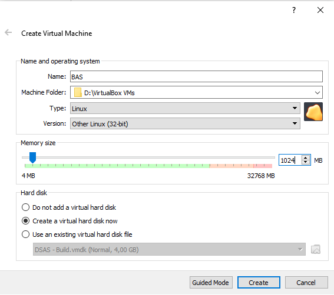
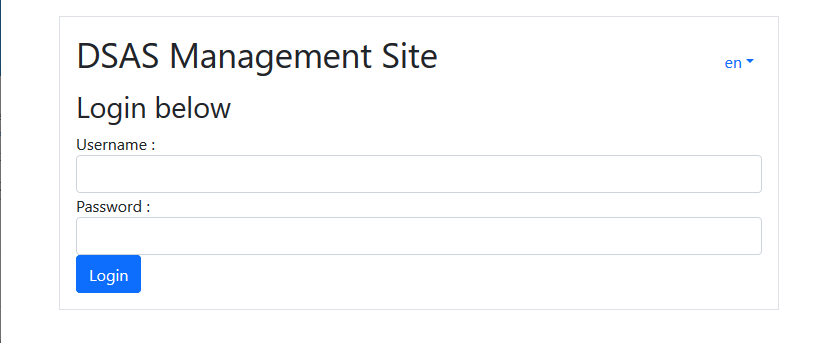
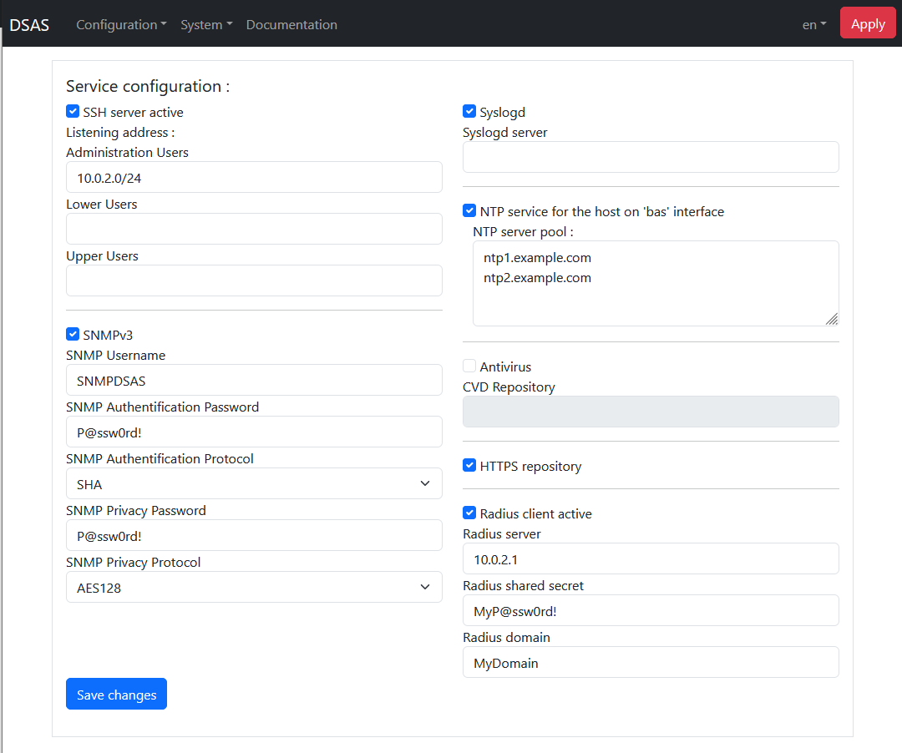
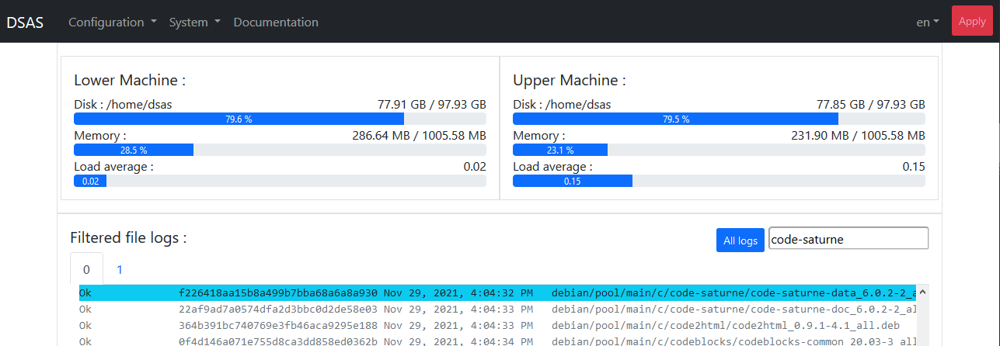
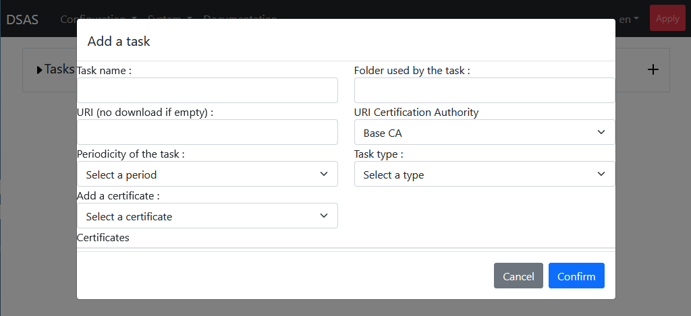
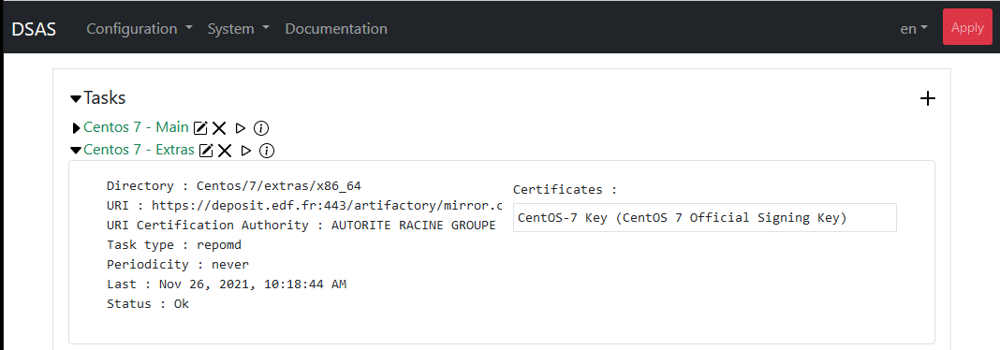

# Introduction

The isolation of industrial infrastructures is essential to limit
the possibility of malicious attack. However, this isolation limits 
the ability to automate the downloading of software updates (operating
systems, viral signatures, other updates) that are essential to the
health of all sensitive systems. Configuration and other files are also
difficult to send to sensitive systems.

The means to transfer files to sensitive systems is often the use of USB
keys. This mode of transfer requires time consuming human intervention
and exposes the industrial system to viral contamination at each USB
connection. Organizational means could be put in place to control USB
keys each time they are used, but the risk of contamination is impossible
to exclude.

So, a means of transferring files from a non-sensitive area to our
industrial infrastructure is needed, that includes the systematic control
of all files transferred to eliminate the risk of malicious files. The
`Decontaminating Security Access Service` (DSAS) aims to be this means of
secure transfer.

The objective of the DSAS is to download security updates, to control
their integrity and to make them available to the sensitive systems. The
DSAS will also allow the use of USB keys to be eliminated on our
industrial infrastructures, and therefore the DSAS includes the ability
to transfer files signed by authorized people. Finally, the DSAS ensures
a protocol break between the various security zones in a defense in depth
strategy.

## The principal of signature verification

The principal means of file verification of the DSAS is the verification
Of signatures. Each file allowed to pass the DSAS can be verified by its
cryptographic signature.

The DSAS is not the first proposal to use cryptographique signatures in a
file transfer system and for example [a product by SECLAB implements
this.](https://www.seclab-security.com/seclab-securing-systems/)
The problem is that these existing systems require human intervention to
verify and sign every file received and to be transferred by the DSAS. A
program like Symantec End Point Manager produces approximately 4000 files
a day to transfer. It is therefore an illusion to consider that a human
control of these files is possible before their transmission.

The DSAS takes another approach, by assigning confidence to the existing
Signatures of certain software editors, thus allowing their transfer.
However, there exists a multitude of means used by these editors to sign
their software, and the DSAS must have the means to verify each type of
signature used by the desired editors.

### The chain of confidence

The problem with a verification by signature is to know to whom we must
give confidence. To this ends it is important to understand the chain of
trust of the signature. This chain can be rooted in a `Certification
Authority` (or CA) in this case of X509 certificates, or a distributed
confidence with the certificates themselves signed amongst themselves in
the case of PGP certificates. For PGP certificates, the `web of trust` is
implicit and passes by certificate signing ceremonies in the phase before
the inclusion of the certificate in the DSAS. For X509 certificates, the
chain of trust is explicitly included in every signed file. For example,
the certificate used to sign a file is itself signed by an intermediate
certificate which is signed by a certification authority. The DSAS allows
verification tasks to be defined limiting the files allowed to pass to
have a particular chain of trust and to not just verify the file is
signed by a valid certification authority. Unfortunately, [malicious
actors can also buy signing certificates](https://duo.com/decipher/attackers-are-signing-malware-with-valid-certificates)
and a verification solely based on the certification authority is not a
strict guarantee that a file is not malicious. The DSAS, if correctly
configured, allows the transfers to be strictly limited to a single
software editor, or even a particular division of this editor, so that
the risks are minimized.

## Architecture

The principals of the DSAS are the following:

- The DSAS is not part of either of the two domains that are
interconnected, but is isolated between the two. The connections towards
the DSAS are strictly controlled
- Unneeded services or network ports are not made available. All unneeded
software is uninstalled
- The DSAS must implement a complete break in the protocol between the
two zones of sensitivity. This is implemented by the DSAS being
implemented on two different machines, each dedicated to the connections
towards one of the two different zones of sensitivity, so that the
compromission of the machine attached in the non-sensitive zone does not
put the machine in the sensitive zone at risk.
- Several user accounts are used on the DSAS with different access
rights, so that the compromission of an account will not expose all of
the internal zones of each of the machines of the DSAS
- No unverified file is visible in the sensitive zone. The file systems
of the two machines of the DSAS are separate
- The verifications are performed by the DSAS before files are made
available in the sensitive zone. These verifications always include a
signature and integrity check, which can be completed by an anti-virus
control.
- The maintenance of the security of the DSAS must be assured. This means
that all of the software elements exposed to an attack must be known,
their vulnerabilities monitored and the means to protect against these
vulnerabilities in place.

These constraints push us towards an architecture with

- separation of sensitive and non-sensitive treatments of the two zones
on to two distinct machines
- To use of a minimalist Linux system with the absolute minimum of
software pre-installed. We have chosen to use the [Tiny Core
Linux](http://tinycorelinux.net/) operating system because it is
regularly updated with a minimal installation (12 megabytes) including
only the Linux kernel, busybox and a few boot scripts. No service is
started by default
- Additional dependances are avoided wherever possible. For example,
perl, python, ... are not installed as the scripting language `ash` is
already available.
- Each of the machines of the DSAS has two network interfaces, with one
serving only for the interconnection between the two machines. One of the
machines is interconnected via the additional interface to the sensitive
zone, while the other to the non-sensitive zone
- The direction of the initiation of the network connection is always
from the more sensitive zone towards the less sensitive zone. No network
port on the more sensitive machine is exposed to the less sensitive
machine. In this manner, while the more sensitive machine can download
files from the less sensitive machine, the less sensitive machine cannot
send them directly.
- All the administration is performed form the sensitive zone. No
administration is possible from the non-sensitive zone.
- There are several service accounts created on each machine, with the
account `haut` being the only one with the rights to download from a less
sensitive zone, the account `verif` being the only one with the rights to
transfer files between zones on each machine and the account `bas` being
the only one with exposed towards the more sensitive zone. The account
`verif` is not accessible outside the machine.

A simplified architecture of the DSAS is then


where the arrows represent network or application flows with the
direction defining which machine or application initiates the flow.

An administration account is also created. This account is only available
from the sensitive zone and the possibility to add filtering to limit the
machine that can connect to this account is implemented. This is the only
account with administration rights and the root account is only
accessible from this account.

# Installation

With the DSAS separated into two machines, two separate installations are
needed. The two installations follow the same logic. In the following
discussions, the machine connected to the non-sensitive network is called
`upper` or `haut` and the machine connected to the sensitive network is
called `lower` or `bas`. An initial configuration of each machine is
needed from their console, but after this initial phase, all configuration is done from the lower machine.

To facilitate the installation, it is better to start with the
installation of the upper machine, because in the initial phase the lower
machine must be able to contact the upper machine, and so the upper
machine must be configured first to allow the lower machine to send it
orders.

In the following sections, if it is not explicitly stated, the
configuration step concerns both machines.

## Disk space needed by the DSAS

The DSAS needs independent disks for each of the machines used in its
implementation. So the DSAS needs two times more disk space than the
maximum used for the transfers. Inside each machine, the DSAS `mirrors`
the files between each zone, and the old files are removed when they are
no longer available on the site they were downloaded from. So the only
the sum of space used by the download sites is needed, with a little
extra margin.

The formula for the disk space needed for each of the DSAS machines is

```
Space = D1 + D2 + ... Dn + max(D1, D2, ..., Dn) + (IsDocker ? 150Mbytes : 60Mbytes)
```

where `Di` is the space needed for the repository `Di`. As there can
temporarily be two copies of the repository, `max(D1, D2, ..., Dn)`
of additional disk is needed. The installation of the Docker of the DSAS
runs from a uncompressed copy of the ISO image, where the other cases use
a copy of the compressed ISO only.

The Windows `Patch Tuesday` updates are often a hundred or so megabytes,
so we multiply that by the number of updates to keep available and we can
easily find ourselves with several gigabytes. The `Symantec
IntelligentUpdate`s needs roughly 150 megabytes, while `Symantec LiveUpdate`s needs 50 gigabytes.

Each Linux repository could need up to 50 gigabytes, so if we need to
transfer Linux update the needed disk space can easily explode. In the
following configurations, we have used a disk size of 50 gigabytes,
however, we recommend at least 500 gigabytes for each machine
of the DSAS.

## Memory needed by the DSAS

The DSAS needs an absolute minimum of 500 Mbytes of memory to boot and
run correctly. To this minimum additional space is needed depending on
the configuration. In the standard virtual machine installation, the
directory `/tmp` is part of the root filesystem and is stored in memory.
As this directory is used extensively for the decompression of
the archived files for testing, the size of the largest decompressed file
is needed as additional memory. In testing we have found that this means
that a minimum of __1 Gbyte__ is needed by both machines of the DSAS.

If the DSAS is configured to use an antivirus, the antiviral daemon uses
additional memory. The antivirus only runs on the `lower` machine and we
found that with in this case a minimum of __3 Gbytes__ is needed.

The use of Docker might slightly change this calculation, by the docker
image will share the hosts memory and so these number should not change
that much.

## Configuration of the virtual machines

The DSAS is supplied in the form of an ISO that should be used as a `live
CD`. This means that the operating system should always boot from this
image ISO. The major advantage of this is that the updates of the DSAS
will be extremely easy and resumes as the shutdown of the DSAS, the
replacement of the ISO and a restart.

Three types of virtual machine installation are discussed below, with
VirtualBox, with VMWare and with Docker.

### Installation with VirtualBox

#### Creation of the virtual machines

The ISO of the DSAS is a 32-bit Linux, and the virtual machine must be
Configured accordingly. For example, under VirtualBox the initial
configuration should be 



Without the antivirus we recommend 1 gigabyte of memory, but if the
antivirus is active at least 3 gigabytes are needed for the lower
machine.

The DSAS has no specific requirement for the format of its disk, and here
we have chosen VirtualBox's default format 


After the boot disk must be defined with the DSAS ISO image in `IDE
primary master` 


If the boot disk is incorrectly configured the DSAS will not start.

#### Network interconnection between the machines of the DSAS

The virtual machines should be configured with two network cards. The
first card will be used for the connection to the outside the DSAS and
their configuration will be dependent upon the environment in which the
DSAS is installed.

The second card is always used for the interconnexion between the two
machines, and this network by default will be the static network
`192.168.192.0/24`. Several means could be used to configure this
interconnection network, particularly if a firewall is placed on this
link (which doesn't seem to be necessary). We propose the use of an
internal network of the hypervisor configured with VirtualBox like


### Installation with VMWare

The configuration under VMWare is very similar to the configuration with
VirtualBox. As shown in the screen below, the virtual machine must be
configured with

- The desired disk space - Here a value of 150 Gbytes has been used
- A cdrom device - As discussed below
- Two network cards - The first card must be configured will be used for
the connection to the outside the DSAS and their configuration will be
depend upon the environment in which the DSAS is installed. The second
card is always used for the interconnection between the two machines of
the DSAS.


The ISO boot image can be uploaded by clicking on the device, uploading a
new image with the menu below, selecting it and saving the changes 


### Installation on Docker 

The docker image of the DSAS is supplied in a file `docker.tgz`. This
image must first be decompressed with the command

```
tar xvzf docker.tgz
```

This will create a directory named `docker` containing three files.

- rootfs64.tar.gz - This file contains all of the files needed to create
the root directory of the DSAS with Docker
- Dockerfile - This contains the instructions need to convert the file
`rootfs64.tar.gz` into a valid Docker image
- Makefile - This file contains a number of make targets that allow the
simplification of the installation of the Docker image of the DSAS 

The network configuration in the `Makefile` must be adapted before use.
The DSAS will also configure the network (see the section on Docker at
the end of this document), and so the configuration of the network by
Docker must be identical to the network configuration supplied to the
DSAS.

#### Docker configuration of principal network

The Makefile assumes that the principal interface of the DSAS will always
be configured in `bridge` mode. This means that if the administration
interface must be accessed from a remote machine, the host must correctly
route this network as well. If a different type of network is needed, the
user is responsible for the creation of an appropriate Docker
image and cannot use the supplied Makefile.

Three variables are used to configure the principal network interface 

- NET0 - The network in CIDR format. By default, the Makefile with
configured so that the lower machine is configured with the network
`192.168.0.0/24` and the upper network with the network `192.168.1.0/24`.
These can be adapted as needed
- GW0 - This is the gateway address that will be configured for the
network, and it must be an address in the network supplied.
- IP_ETH0 - This this the address of the upper or lower machine itself

#### Docker configuration of interconnection network

The interconnexion network might be a virtual or a physical network
depending on the configuration. There are four variables that control its
configuration

- ETH1 - If a physical network is used this must be a valid network
interface on the host machine. The network will be configured with the
`macvlan` device of Linux as a physical interface
- NET1 - The network of the interconnexion in CIDR format. By default, it
is assumed that the upper and lower machines are on the same LAN and so
this network is the same on both machines. It is possible to have a
firewall between the two machines of the DSAS and in that case the
networks will be different. By default, the network used is 
`192.168.192.0/24`.
- GW1 - If the machines of the DSAS are on the same network, the gateway
can be left empty or undefined. Otherwise, it must be configured with an
address allow packets to be routed between the two machines of the DSAS
- IP_ETH1 - The specific IP address of the two machines of the DSAS. By
default, the address of the upper machine is `192.168.192.2` and the
lower machine `192.168.192.1`.

#### Docker installation

The docker installation is done individually for the two machines and
must be performed in two phases. The first phase for the upper machine is
launched with

```
make install CONTAINER=haut
```

This step will start the next step of the installation process as
[shown in the next section](#first-initialisation-phase). At the end of
this step the docker container is installed and configured. Before
continuing with the installation of the lower machine, the upper machine
must be running. This can be done either via the Makefile with 

```
make start CONTAINER=haut
```

or directly with the command

```
docker container start haut
```

At the point the lower machine can be configured, starting with the
command

```
make install CONTAINER=bas
```

And after [following the instructions in the next section](#first-initialisation-phase)
can be launched with

```
make start CONTAINER=bas
```

or directly with the command

```
docker container start bas
```

## First initialization phase

We are now ready to start the machines for the first time.

This step starts with an initialization in two phases: the first using
the Linux console, and the second with the administration console of the
DSAS using https.

The initial phase is performed from the machine consoles, because before
the first configuration there is no guarantee that the machines will be
visible from the outside. A minimum of configuration from the console for
the network configuration is needed before continuing in a second phase
from the DSAS administration interface.

### Formatting the disks

As a first step, the DSAS will request to format its disk. A menu is presented
with all the disks found connected to the DSAS. This menu resembles 


Navigation in this type of menu is done with the following keys

- arrows - cursor movement
- Space - select an option
- Enter - continue

Use `Space` to select the disk, here `/dev/sda`, and `Enter` to start
formatting the disk. After formatting, the machine will restart
automatically before continuing

### Selection of the type of machine

The next step is to select whether the DSAS machine will be configured
as the upper or lower machine. The menu


is used to present the selection of the machine type. If the machine
has been configured with only one network card at this point the DSAS
will shut down its configuration with the error


In this case stop the machine and add a network card in the hypervisor.

### Configuration of interconnection network

The configuration of the interconnection network should only be changed
rarely, and its configuration is only available in this initial phase of
configuration. The configuration of the interconnexion network depends on
the environment in which the DSAS is installed. There are 2 typical means
of configuring the interconnection network of the DSAS.

1. Both machines are on the same LAN. In this case the upper and lower
machines interconnection network should be configured with IP addresses
in CIDR on the same LAN, and the gateways for both machines will be
ignored
2. The two machines are on different LANs, to allow a firewall to be
placed between them. In this case the IP addresses of both machines are
independent and the gateways for both machines must be a valid IP address
on the same LAN

Both machines must know the interconnexion network configuration of both
machines and so this step must be carried out on both machines and be
__identical__. If the configuration is incorrect, the lower machine will
be unable to contact the upper machine and one or both machines must be
[reconfigured as discussed below](#in-the-event-of-a-dsas-initialization-error).

There are 4 steps in the configuration of the interconnection network.
Firstly, the upper machines IP address in CIDR format must be entered as


The IP address here is the IP address that the upper machine will take
and the mask in CIDR format must be between 24 and 30. By default, this
address is `192.168.192.2/24`.

Next, the gateway of the upper interconnection network. If the two
machines are on the same network, the gateway can be left blank. It is
configured as 


The lower network is configured in an identical manner 


Here, both machines are on the same network with the lower machine taking
the address `192.168.192.1/24`. It should be noted that the addresses
used for the interconnection network must not reused elsewhere.

### Initial network configuration

The network configuration of the upper machine is done via the
administration interface of the lower machine. Consequently, this section
only concerns the lower machine. However, if the network is not at least
partially configured on the lower machine, the administration interface
might not be available. Therefore a initial configuration of the 
network of the lower machine is made from the console.

The first step is to choose if the network is static or if it uses DHCP
for its configuration. The following menu is used to confirm this choice


At this point if DHCP has been chosen no other network configuration is
necessary and you can move on to the next section.

For the static IP configuration, you must enter the address and the
netmask in the CIDR format. In CIDR format, the IPv4 netmask is
represented by an integer between 0 and 32 representing the number of
bits used to encode the NetId part.

For example, the netmask `255.255.255.0` is represented in CIDR format by
`/24` and the netmask `255.255.255.128` by `/25`. So, if our IP is
`10.0.2.15` and our netmask is `255.255.255.0` it is entered as


in the configuration interface at startup. The syntax of the entered IP
address is validated before continuing. If it is not in an acceptable
format the same menu will be presented in a loop.

If the administration machine is not on the same subnet as the DSAS, you
must configure a default gateway. Otherwise leave blank to prevent any
connection to DSAS from outside the subnet.


Two items are required for DNS configuration. First the search domain,
where here a search domain `example.com` is used


with this search domain the hosts `ntp1` and `ntp1.example.com` will be equivalent. Then you must define name servers, responsible for
converting DNS names to IP addresses. For example,


Several IP addresses separated by spaces could be entered, giving a list
of name servers in order of their preferred usage. 

### SSH configuration

The upper machine does not need an SSH configuration in the initial
phase. SSH configuration requires the creation of SSH keys for two DSAS
users;

- the privileged user __tc__ allowing shell connection with both
machines, and
- the user __haut__ for the use of sftp between the two machines.

The creation of the keys is automatic, but the authorized keys must be
transferred to the upper machine. If the upper machine is not visible
from the lower machine, it will wait with the message


The main reason to see this screen could be that the upper machine has
not been started. However, the network interconnection between the two
machines could also be at fault.

In the initial phase, there is no SSH key for SSH without a password. So,
the privileged users __tc__ password must be entered in the window.


By default, the DSAS password is __dSa02021DSAS__ but the first time you
Use the administration interface you will be forced to change this
password.

This is the last step of the initial setup on the console. The second
phase of the initial configuration should be done with the administration
interface.

### In the event of a DSAS initialization error

To make mistakes is human, and DSAS offers ways to recover from mistakes
made during initialization. If the initial phase of the installation
(using the console) is not completed, no configuration will be saved. A
simple restart of the machine will allow reconfiguration from scratch.

If unfortunately, you have completed the installation, but it is not
correct, then the administration interface will no longer be accessible,
all is not lost. However, as the DSAS is configured to start without any
human interaction after its first configuration, you will need to connect
from the console interface to be able to access the configuration menu
again.

The user to use on the console is 'tc' and the password to use if you
haven't changed it already with the admin interface is as above. A
classic Linux console with minimal functionality available will be
presented to you.

The command required to reconfigure the DSAS is

``` shell
$ sudo /etc/init.d/services/dsas reconfig
```

You will then be presented with the configuration menu. At the end of the
configuration, don't forget to log out using the command

``` shell
$ exit
``` 

## First login to the administration interface

The address for the DSAS administration interface will depend on your
Installation but without NAT between you and the DSAS, the IP address
will be the one entered previously. On the other hand, the DSAS
administration port is always __port 5000__. 
So, if your IP is 10.0.15.2 as used in the example above you will need to
connect to https://10.0.2.15:5000 for the DSAS administration interface.

The administration interface is in HTML5 with recent JavaScript
functions. So a recent browser (after 2016) will be necessary in order to
use the interface. If you cannot connect, there is either a routing
problem between you and the DSAS and it is necessary review the router
configurations between you and the DSAS, i.e. the network configuration
of the above DSAS is incorrect. In this case, refer to the section [In
the event of an initialization error of the DSAS](#in-the-event-of-a-dsas-initialization-error).

The SSL certificate used by the DSAS in the initial phase is self-signed
and it will be necessary to accept its use in your browser. If you have
successfully logged into the DSAS administration interface you will be
presented with the following login screen:



The privileged user on the DSAS is user __tc__, and the default password
is __dSaO2021DSAS__. There will be a 3 second delay between failed login
attempts and accounts will be locked for 10 minutes after 3 successive
failed login attempts. At this point log on to the administration
interface.

### The basics of the administration interface

#### The `Apply` button

At the top of the administration interface pages you will find an `Apply`
Button highlighted in red. This button is very important. No modification
made via the administration interface will be permanent and none, except
password changes, will be applied until this button is used. This button
performs a permanent backup of the changes and applies them. In this
manner, major errors can be easily removed with a simple restart unless
they are applied.

#### Shutdown and Restart

The DSAS can be shut down and restarted without fear because all the
executable code is on the DSAS ISO image. The DSAS tasks in progress will
be interrupted but will be resumed at restart. The shutdown and restart
functions are available in the `System` menu of the DSAS, like


When running under Docker these commands will do nothing.

#### Backup and Restore

The currently applied DSAS configuration can be saved by using the button
in the menu above. Selecting to backup, you will be asked to enter a
password for the backup, like


The backups of the two DSAS machines are then encrypted in `bcrypt` with
this password and archived together. If you do not enter a backup
password, the files will be archived without the encryption step.

It is strongly advised to encrypt these archives because it contains the
complete DSAS configuration, including SSL certificates and SSH secrets.
The password does not have to be the same password as used for the DSAS.
The user passwords will not be backed up.

When restoring the same password will be requested, and so this password
should be kept
preciously. In case of a restoration, it will be applied immediately.
This could result in the DSAS becoming unavailable, particularly if the
network configuration has changed between the backup and restoration. In
this case, refer to the section [In the event of an initialization error
of the DSAS](#in-the-event-of-a-dsas-initialization-error).

#### Automatic logout

The DSAS is configured to check the connection rights for each operation
if more than 10 minutes separate one operation from the next, you will be
automatically logged out with the following message:


By clicking `Ok` on this message you will be redirected to the DSAS login
screen.

### Initial password change

If this is your first connection to the DSAS, the password of the user
`tc` must be changed. Connect with the user `tc` and you will be
presented with the following screen:


It is impossible to continue with the administration interface without
changing the password. The limitations on passwords are

- they are at least 8 characters long (12 recommended),
- they do not contain spaces or tabs,
- They contain at least 3 types of characters (upper case, lower case, number, special character).

Enter your new passwords and click on `Update`. You can now click on
`Logout` and after logging in again with the user `tc` you will have
access to the administration interface.

### User Configuration

The user configuration screen is found under the tab `System` and the
option `Users`. The configuration screen is as follows


At the first connection only the default user `tc` is configured. It is
recommended to create nominative users account for each user and to
deactivate the account `tc`. The user `tc` is the only one with the
rights to become `root` on the DSAS. Even though the account is
deactivated
it remains usable from the console of the DSAS and other administrative
users, knowing the password for the account `tc` can use this knowledge
to become `root`.

A new account is created by clicking on the button  to
the right of the screen. You will be asked to enter a new username like


New usernames must be valid POSIX usernames. That is, they must

- Start with a lower-case letter or an underscore
- Include only lower-case letters, numbers, underscores or minuses
- Can terminate in a dollar character
- Be no longer than 32 characters

Here we have added the user `ua12345`.


For each user several modifications or actions are possible

- __Description__ - Information about the user can be freely added in
this field
- __Type__ _ Three types of users are possible 
  * __administrator__ - An administration user of the DSAS. It has all
the privileges on the DSAS, and if `ssh` is active for administrators, it
can be used to connect with `ssh` for advanced maintenance on the DSAS.
  * __lower__ - This type of user has only one role. If the DSAS is
configured with `ssh` for the user __bas__ it will have the right to
connect via `sftp` and only via `sftp` from the sensitive zone. This
could be useful for the recovery of transmitted files by DSAS in certain
scenarios. Only verified files will be shown to this user by DSAS and a
[chroot](https://fr.m.wikipedia.org/wiki/Chroot) is used to prevent
the user from seeing anything else.
  * __upper__ - This type of user, like user __lower__, is used for an
`sftp` connection from the non-sensitive area to allow files to be
uploaded directly to the DSAS. It is also isolated with chroot and can
only see the zone where files should be deposited. The use of this
feature is strongly discouraged as it opens up the possibility of attacks
against the DSAS
- __Active__ - An account can be deactivated without deleting it. This
allows for an account to be temporarily suspended without deleting it.
-  - By clicking on this icon, it is possible to change the
password of the user.
-  - By clicking on this icon, it is possible to permanently
delete the user.
 
The modifications will not be taken into account unless the `Save
Changes` button has been pressed. An example of the user configuration
might be 


At this point it is recommended to press the `Apply` button in order to
make these changes permanent. Otherwise on the next restart the old
passwords will be requested.  

### Network configuration

The network configuration screen is accessed from the DSAS
`Configuration` menu, and the option `Network`. Selecting this option,
the following screen will be presented


The DSAS network configuration is separated into two parts. The network
connected to the sensitive network called __lower__ and to the
non-sensitive network called __upper__. Each of these two configurations
can be accessed by clicking on the arrow next to the type of network,
like


The configuration of the __lower__ network, previously entered is visible
in this menu. Check the settings, modify if necessary and press `Save
changes`.

A summary of the input fields on this page are

- If the DHCP option is selected, the other fields for the network
configuration are ignored on this interface.
- IP addresses, are in IPv4 format like NNN.NNN.NNN.NNN
- If a netmask is necessary it is entered in CIDR format. In CIDR format
the netmask is represented by an integer between 0 and 32, representing
the size of the NetId. For example, the netmask `255.255.255.0` is
represented in CIDR format by `/24` and the netmask `255.255.255.128` by
`/25`.
- The `DNS Domain` must be a valid domain name.
- Several IP addresses separated by carriage returns can be entered,
giving a list of name servers in order of their preference.

To avoid the interconnection between the upper and lower machines being
broken, the configuration of the interconnection network is not available
via the UI. If it needs to be changed you should refer to the section [In the event of an initialization error of the 
DSAS](#in-the-event-of-a-dsas-initialization-error).

### Renewal of the web certificate

As [discussed above](#first-login-to-the-administration-interface), the
SSL certificate used by the default DSAS is self-signed. This is also a
secret item to replace during the initial installation. The web server
administration interface is in the `Web` submenu of the `Configuration`
tab and appears as


The renewal tab is accessed by clicking on the arrow to the left of
`Renew certificate`, and looks like


The fields to be filled in for the renewal are fields defined by the
standard [RFC5280](https://datatracker.ietf.org/doc/html/rfc5280.html).

- __C__ - This field is the country of the organization responsible for
the server. It must be two letters encoded as defined in RFC5280. For
example, the code for France is __FR__.
- __O__ - The organization responsible for the server. In France, it is
generally the name of the company registered with INSEE and must be all
capital letters.
- __OU__ - An identifier of the sub organization responsible for the
server. Certificates signed in France must include a KBIS, for example
here '0002 552081317', is a valid KBIS.
- __CN__ - For a server, like the DSAS this must be the DNS name of the
server
- __S__ - A free field for the region of the Company's head office. It is
optional
- __L__ - A free field for the city of the company's head office. It is
optional

You can now click on the button `Renew certificate` and a certificate
will be generated. However, it will not be used by the server until the
next time you click on `Apply`. The public certificate and Signing
Request (CSR) could be downloaded by clicking on the button
.

## Service Configuration

Other than the administration and repository web services, there are 6
other services which could be started on the DSAS;

- An OpenSSH server for connections to the DSAS,
- An HTTPS repository for the files verified by the DSAS,
- An ntpd client for setting the time of the machines,
- A syslogd client for local and remote administration logs,
- A SNMPD server to supply the status logs of the DSAS, and
- An antivirus server



### Configuring the OpenSSH service

In addition to the openssh server on the upper machine used for
Communications between the two DSAS machines, the DSAS administrator can
choose to open other SSH services from the sensitive and/or non-sensitive
zones.

The OpenSSH server is never started with open access to all users on the
DSAS. You must explicitly give access to each user type, and this access
is only valid from certain security zones. For example, above the OpenSSH
service is checked and the administration users can only log in from IP
addresses in the 10.0.2.0/24 subnet. Users of type __upper__ and
__lower__ users have no access rights.

Listening addresses for each user can be very complex with multiple
Addresses possible separated by commas. A complex example could be

```
10.0.2.1,10.0.2.128/25,!10.0.2.129
```

where the address 10.0.2.1 and the subnet 10.0.2.128/25 could access the
DSAS, but the address 10.0.2.129 is prohibited to do so. By default, no
access is given, and if the listening address for a user left blank, the
OpenSSH server is not even starting on the DSAS network interface
concerned.

Each user can only log in from certain sensitivity zones:

- __Administration__ - The users of type `Administrator` can only connect
from the sensitive area and can connect with ssh, scp and sftp
- __lower__ - The users of type __lower__ can only connect with sftp from
the sensitive zone. This sftp functionality could be used to replace http
server repository (or in addition). It only has access to the DSAS area
with the verified files and cannot access files elsewhere.
- __upper__ - `Use of users of type __upper__ in SSH and strongly
discouraged`. The reason it is not recommended is that it does not
respect the direction of the initiation of network flows, from
the more sensitive zone to the less sensitive zone. But in the absence of
other means of downloading, this account opens the possibility from the
non-sensitive zone to deposit files on the upper machine of the DSAS. The
users of type __upper__ only have access with sftp and only to the DSAS
zones with the unverified files.

If the SSH service is enabled towards a zone, port 22 is open on the DSAS
machine concerned. 

### HTTPS Repository

The DSAS can publish all the verified files read only with a repository
HTTPS. If the IP address of the DSAS on the lower network is `10.0.2.15`
for example, the repository will be available at `https://10.0.2.15`.

### SNMP Server

A SNMP server can be activated on the DSAS. This service is only
available with authentication and encryption and so only SNMPv3 is
supported. Selecting `SNMPv3` the service will be activated. After
protocols for the authentication and encryption must be selected, a valid
`SNMP Username` and valid `SNMP Password` must be entered for both the
authentication and encryption. 

All the read only data available from a typical SNMP server on a Linux
machine will be published. The data specific to the DSAS are available
with the following OIDs 

- 1.3.6.1.4.1.16845.100.100.1.0     - Status of the upper machine. `0` if the machine is available.
- 1.3.6.1.4.1.16845.100.100.2.0     - Status of the DSAS tasks. `0` if all of the tasks are ok.
- 1.3.6.1.4.1.16845.100.100.3.1.1.1 - Index of the task 1.
- 1.3.6.1.4.1.16845.100.100.3.1.1.N - Index of the task N.
- 1.3.6.1.4.1.16845.100.100.3.1.2.1 - Name of the task 1.
- 1.3.6.1.4.1.16845.100.100.3.1.2.N - Name of the task N.
- 1.3.6.1.4.1.16845.100.100.3.1.3.1 - ID of the task 1.
- 1.3.6.1.4.1.16845.100.100.3.1.3.N - ID of the task N.
- 1.3.6.1.4.1.16845.100.100.3.1.4.1 - Status of the task 1.
- 1.3.6.1.4.1.16845.100.100.3.1.4.N - Status of the task N.

A [MIB file with these OID is available for download](DSAS-MIB.txt).

### syslogd client

If the DSAS `syslogd` service is enabled, service logs are made locally.
It is also possible to define a remote server for the rsyslogd service
for logs in UDP on port 514.

Note that the syslogd service is provided by BusyBox, and the
implementation of syslogd by BusyBox does not include the possibility of
TLS encryption on port 6514. So other means of securing this flow must be
put in place.

Using the syslogd service does not open a port on the DSAS, but only
connections to a remote server.

### ntpd client

The DSAS includes the possibility of synchronizing via the ntp protocol.
One or more ntp hosts could be configured. The addresses of the ntp hosts
could be IP addresses or hostnames as provided by DNS. In the second case
the DNS must be configured as discussed in the section 
[Network configuration](network-configuration).

Using ntp does not open a port on the DSAS but only connections to remote
servers.

### Antivirus server

The DSAS includes an antivirus server based on `ClamAV`. If the option
`Antivirus` is checked, a server `clamd` will be started, and the files
transferred by the DSAS will be checked with the antivirus.

However, these verifications need updated viral signatures. The files
`main.cvd`, `daily.cvd` and `bytecode.cvd` must be installed on the DSAS.
These files are available on the URL

```
https://database.clamav.net/main.cvd
https://database.clamav.net/daily.cvd
https://database.clamav.net/bytecode.cvd
```

and the URI to configure on the DSAS could be
`https://database.clamav.net/` but a local mirror should be preferred.
The DSAS will update these files from this URI once a day.

# DSAS Operation

## Status of machines

The status page of tasks and machines is the entry and main page of the
DSAS. It is accessed by clicking on `DSAS` in the menu at the top of the
pages and resembles


The page is divided into two sections; at the top the status of the DSAS
machines at the bottom the status DSAS tasks. Three statistics are given
for the two DSAS machines.

- __Disk usage__ - The total occupancy of DSAS disks are shown. If the
Disks are full it will be impossible to properly download and verify
files. So, the disks should be periodically monitored. Logically if the
tasks have not changed, the use of the disks should not change either,
but if one of the tasks suddenly increases its disk usage it will be easy
to lack disk space. A disk that is more than 80 or 90% full could easily be saturated.
- __Memory usage__ - Each task on the DSAS occupies machine memory. If
the memory is full, the performance of the tasks will be impacted. It is
necessary to watch that memory is saturated, but if it is below 90% it
should not be a problem. With the DSAS architecture, almost 200MB is also
used by the operating system.
- __Loadavg__ - The `Load average` is a concept of Unix giving an idea on
the occupation of computational resources of the machine. A `Load
Average` of `1` means that the equivalent of a processor core is
completely occupied. So, the total occupation of resources
of the machine is at the point where the `Load average` is equal to the
number of cores of the processor. On the DSAS page the `Load average` is
presented in a logarithmic scale with the number of processor cores at
50% of the length of the status bar. If the status bar is longer than
half, DSAS might have insufficient computing resources. The first thing
to do again in this case is to restart the DSAS in order to see if the
problem disappears.

If the DSAS lower machine is not available, you will be unable to connect
to the administration interface. On the other hand, if the upper machine
is faulty, the page status informs you with the following screen

 

## Status of verified files

The status of the verified files is available directly below the status
of the machines of the DSAS, like


The status of file verification might be in multiple tabs. The number
the tab grows with the age of the verification. The first tab is the
current week, the second tab last week, etc.

The status of each verified file is given on a line of the page, and each
line is composed of 4 elements

- __Status__: In the first position we find the status of the
verification
- __Hash__: In second position is the MD5 hash of the file. This could be
useful when a threat has been identified, to see if it has been passed by
the DSAS or not.
- __Date__: The date of the verification is given in the third position.
Dates are always given in converted to the local time zone.
- __File__: And in the last position the path to the file is given

The status will take one of the following values

- `Ok`: All the requested checks were successful, and the file was made
Available on the lower machine.
- `$$ Checksum fail`: A checksum test on the file failed
- `** Bad Sig`: One of the requested verifications reported a bad
signature
- `** Bad Interm Sig`: The verification of an intermediate certificate
failed
- `** Bad RPM Sig`: The signature verification of an RPM file failed
- `** Bad DEB Sig`: The signature verification of a DEB file failed
- `** Not signed`: The file is not signed and could not be verified

the blue button at the top of the verification logs allow to switch
between a mode or `all logs` are visible or a mode or that `errors only`
are visible. This will allow you to quickly identify the files that had
problems.

### Search in verification logs 

In the case of a problem or a vulnerability being identified it might be
necessary to examine the verification logs, for either the name of a file
or its MD5 signature as an indicator of compromission. The DSAS includes
a search dialog allowing matching log lines to be found. Type the string
value to be found in the verification logs as shown below and the next
matching line will be highlighted.



Typing `Return` allows the next matching line to be found. If there is no
matching line between the actual position in the logs and the end of the
logs, the DSAS will recommence the search starting at the beginning. If
no matching line is found, no line will be highlighted.

## Certificate configuration

The DSAS is preconfigured with the set of root certificates of a classic
Linux distribution. All these certificates and other imported
certificates are available from the tab Configuration/Certificates as seen below


The certificates installed in each category can be viewed by clicking on
The arrow to the left of each category and the details of each
certificate is available like


Each certificate can be downloaded by clicking on the button
.

Certificates are highlighted in 4 different ways depending on the
Characteristics of the certificate.

- __Certificate CA__ - With black text. The certificate is a root
certificate or a self-signed certificate. The two types of certificates
are similar with the difference being whether the certificate is trusted
or not.
- __Intermediate Certificate__ - With blue text. This certificate is not
a root certificate, but it is signed by another certificate
- __ Less than 6 months to expiration__ - With orange/yellow text. This
certificate is less than 6 months from expiration
- __Expired__ - With red text. The certificate has already expired. This
does not mean that it is no longer usable, but it is not valid for files
signed after the date of expiration

Preinstalled root certifications could be used for verifications on the
DSAS. But using these certificates alone is not sufficient, because

- Preinstalled certificates do not include GPG certificates used by Linux
repositories
- Verification only against a root certificate does not completely
guarantee the absence of malware. [Code signing certificates have been
abused]https://duo.com/decipher/attackers-are-signing-malware-with-valid-certificates)
in the past to sign malware.

So ideally it is necessary to verify with the intermediate certificates
closest to the desired software publisher. For example, an update of
`Symantec Endpoint Protection` (SEP) includes the chain of trust

```
VeriSign Class 3 Public Primary Certification Authority - G5
-> Symantec Class 3 SHA256 Code Signing CA
  -> Symantec Corporation
```
So ideally you should check for updates of SEP with the root certificate
`VeriSign Class 3 Public Primary Certification Authority - G5` and with
the Intermediate certificate `Symantec Corporation` or `Symantec Class 3
SHA256 Code Signing CA` to limit as much as possible the files that could
be validated as a Symantec update. So, it is necessary to upload at least
one of these Symantec certificates to the DSAS.

## X509 certificate management

#### Identification of X509 certificates

X509 certificates are used in Windows signatures, but also for files
signed by `openssl`.

From a Windows computer, with a right click and selecting the option
`Properties` we could see the following menu


By clicking on `Details` and after` Display the certificate` we can see
the chain of trust


This allows the root certificate and all the certificates used to sign
the file to be seen.

#### Preparation of X509 certificates

The most important point for the preparation of a certificate for
importation into the DSAS is to know the provenance of the certificate.
Ideally the certificate is supplied directly by the software editor via a
secure method. A usual means of recovering a certificate is directly from
the editors website use https. However, this is not always possible,
especially for Symantec as above.

In the absence of distribution via a website, all the certificates used
for Windows signatures are embedded in the signed binaries themselves.
So, if you are __ sure__ where a binary comes from you can use the binary
itself as a certificate source.

On the same menu as below on the `Details` tab we can see


with the option of `copy to file`. This option allows all the
certificates of the chain of trust to be saved. It is necessary to select
from `save the certificate in base64 encoded X.509` format as


A file with the certificate will be saved on your computer.

#### Special case of Symantec LiveUpdate certificates

Symantec LiveUpdate files are not signed directly, they are rather
archives in `7z` format with all the signed metadata necessary for their
verification. In each file of `LiveUpdate` a file with the extension
`.sig` can be found, typically` v.sig`. This file contains the
certificates that must be imported into the DSAS for signing files of
LiveUpdate. If you have extracted the `v.sig` file, the two certificates to import can be found with the command

``` shell
$ openssl pkcs7 -inform der -in v.sig -outform pem -print_certs | awk 'split_after == 1 {n ++; split_after = 0} / ----- END CERTIFICATE ----- / {split_after = 1} {if (length ($ 0)> 0) print> `cert` n `. pem `}
```

on a Linux machine. From the Windows command line we could do.

``` shell
$ openssl pkcs7 -inform der -in v.sig -outform pem -print_certs -out certs.pem
```

and the `certs.pem` file will contain several certificates in text format
that you can split into multiple files with the help of a text editor.

On the other hand, some files in the archives are relatively old, and
their signatures too. Therefore, several certificates are required.
Moreover, the root certificates used for these signatures are not
included in the files but integrated directly into SEP, as [discussed
above](#verification-symantec-liveupdate).

To facilitate the use of Symantec LiveUpdate, and other software vendors
typically used with the DSAS, the certificates to be installed on the
DSAS are available in [the attached certificate
bundle](Certificates.zip). 

#### Special case Trend Micro certificates

The files supplied by Trend Micro are signed in two different ways; In
signed JAR files, or in files signed in SMIME. The certificates used for
the SMIME signatures can be recovered in a similar manner to the
certificates of Symantec LiveUpdate. For the certificates used for the
JAR files, the JAR file must first be uncompressed to obtain the
Certificates like,

```shell
$ unzip file.zip
$ openssl pkcs7 -inform der -in JAVA.RSA -outform pem -print_certs | awk 'split_after==1{n++;split_after=0} /-----END CERTIFICATE-----/ {split_after=1}{if(length($0) > 0) print > `cert` n `.pem`}
```

### SSL public key management

Public keys are not really certificates, as they only contain the
cryptographic object used for signature verification or decryption. No
information on the organization responsible for the keys or limitations
on their use are included in SSL public keys. These keys are used in the
__openssl__ or __cyberwatch__ tasks

Because there is no chain of trust for public keys, it is essential to
have a trusted means of retrieving them.

### Managing GPG certificates

GPG certificates are used to check Linux binaries, but also for other
files signed by GPG (for example configuration files developed by DSAS
users).

GPG certificates do not explicitly integrate the chain of trust into
signed binaries. GPG uses the concept of a [web of
trust](https://en.wikipedia.org/wiki/Web_of_trust) where the certificates
themselves are validated against each other. This is outside the scope of
this document and we have assumed that you have complete confidence in
the certificates that you have chosen to download to the DSAS.

To retrieve a GPG certificate, the only solution is to retrieve them from
their publisher. Some examples of certificate of software publishers are

<!-- Keep these bullet points on a single line as it causes problems with forigate VPN SSL -->
- [The RedHat certificates page](https://access.redhat.com/security/team/key) contains [the certificate used for signing Redhat binaries since 2010](https://www.redhat.com/security/data/fd431d51.txt)
- [The CentOs certificates page](https://www.centos.org/keys/) contains in particular [the certificate used for CentOS7](https://www.centos.org/keys/RPM-GPG-KEY-CentOS-7)
- [The debian certificates page](https://ftp-master.debian.org/keys.html) contains in particular the certificate of [Debian Bullseye](https://ftp-master.debian.org/keys/archive-key-11.asc)

### Importing a certificate into the DSAS

Public keys, X509 and GPG certificates can be added to DSAS by clicking on
 next to each category of certificate. A file browser
of the computer is opened to select the file to download to the DSAS. And
a successful importation is signaled by


To confirm the correct importation of the certificate into the DSAS, it
is recommend to examine the details of the imported certificate, for
example

 

## Task configuration

A new task can be added by clicking on  to the right of
the tasks page.


By clicking on it we are presented with an add task form like



- `Task name`: A name given to the task, which is not necessarily unique
- `Sub-folder used by the task` - The files associated with each task
are stored in a separate folder on the DSAS. This folder should be unique
for each task.
- `URI (no loading if empty)` - The address where the DSAS will look for
the files associated with a task. Leaving this empty is permissible and
in this case it is assumed that the files associated with the tasks must
be deposited on the DSAS by the user. the `URI` must be of the form
`protocol://site/folder/` or else `protocol://site/folder/file`. Allowed
protocols are `sftp:`, `ftp:`, `ftps:` `http:` and `https:`. For example,
`ftp://example.com/LiveUpdate/`. The `/` at the end of the `URI` with a
folder is optional but recommended.
- `URI Certification Authority` - If the `URI` uses `https`, then the
DSAS will refuse to download files from the URI unless a valid
HTTPS certificate is used for the server. Three choices are possible
  * `Base CA` - The integrated certificate authorities are used to
validate the server
  * `Self-signed` - The DSAS will not validate the certificate used by
the server. In this case a `Man in the Middle` attack is possible, and
other means of ensuring protection against this might be needed. All
files recovered are verified by the DSAS so the risk is minimized.
  * Uploaded certificates - The X509 root certificates that have been
uploaded can also be used as the certification authority for the
verification of the server.
- `Task type` - The type of task used. The types of tasks allowed are
  * `rpm` - The task is a file repository in rpm format. All files are
check with `rpm -K`.
  * `repomd` - Like the` rpm` type, but the `repomd.xml` files are signed
allowing to speed up verification.
  * `deb` - Verification of Debian repositories
  * `authenticode` - Files are signed with` Microsoft` type signatures.
  * `liveupdate` - The files corresponding to the update files of
Symantec LiveUpdate.
  * `cyberwatch` - files corresponding to signature files provided by
  [CyberWatch](https://docs.cyberwatch.fr/fr/9_advanced_administration_guides/offline_administration/swarm/import_securitydb.html)
  * `openssl` - Task allowing the transfer of files signed by openssl
  * `gpg` - Task allowing the transfer of files signed by gpg.
  * `jar` - Task for the verification of signed JAR files
  * `trend` - Task for the verification of Trend Micro DSP and Package files.
- `Periodicity of the task` - How often is the task executed
  * `never` - The task is never executed automatically, but can be executed manually
  * `quarter hourly` - The task is executed 4 times an hour
  * `per hour` - The task is executed once per hour
  * `per day` - The task is executed once per day
  * `per week` - The task is executed once per week
  * `per month` - The task is executed once per month
- `Add certificate` - Default certificates and certificates added
by user are available for addition to verification tasks. The certificate
type must be appropriate for the type of task. Each selected certificate
is added to the list of certificates for the task, and can be removed by
clicking on the  next to the certificate.

An example of an added task is


Next to each task, the icon  allows the task to be
modified,  allows the task to be removed, 
allows the task to be executed immediately and  allows the
logs of the task to be examined. If the task is running an icon 
 will appear next to the task, allowing the running task to
be terminated. The status of the task is provided via the color of the
task title. In blue, the task was not executed, in green, the execution
of the task was successful, and in red the execution has failed. The last
execution of the task is visible by opening the task as

 

### Debian and Redhat architecture selection

The Debian and Redhat style repositories can be very large. One means of
reducing their size is to only download the files for architectures that
you will really be using. For instance, if you don't have `arm64` Debian
machines in your infrastructure there is no point in downloading the
files for this architecture.

Both Debian and Redhat permit the files to be downloaded to be
restricted, but the way this is achieved with the DSAS if different
because Debian has one single monolithic repository whereas Redhat
separates the repositories by both function (for example main, extras and
updates for Centos) and by architecture.

To limit the files downloaded for Debian is therefore directly controlled
in the task creation or modification as can be seen in the figure below


Where the special architectures

- source : The source packages permitting the binary packages to be
rebuilt
- all : The architecture independent files needed by all architectures

are also supplied.

As Redhat supplies individual repositories by architecture and function,
the DSAS must be configured with multiple tasks for each architecture
and/or functions. For example, to download a mirror or RHEL v8 for both
Intel/AMD 64-bit and Arm 64-bit architectures, two DSAS tasks using the
URIs below might be needed

```
https://mirror.example.com/rhel/8Server/x86_64
https://mirror.example.com/rhel/8Server/arm64
```

# Security Maintenance

## Analysis of the main risks of the DSAS

This section discusses the main risks of DSAS. Other risks exist, for
example the compromission of the DSAS repository site, but considering
the architecture of the DSAS other risks are considered as negligible.

The software impacted by these risks are detailed with the version
numbers of each installed software making it easy to see if an upgrade of
a software component is required.

### Risk: Compromise of the link between the two DSAS machines

| Risk        | Compromise of the link between the two DSAS machines |
| ----------- | ---------------------------------------------------------- |
| Criticality | Critical                                                   |
| Comment     | The protocol break in the link between the two DSAS machines <br />is the main protection of the DSAS. In case of compromission <br />The attacker could take control of the lower machine <br />from the upper machine. This could put into question the <br />isolation between the of sensitivity zones. |

Software impacted by this risk

| software      | version    | comment                                                                        | 
| ------------- | ---------- | ------------------------------------------------------------------------------ |
| openssl | [1.1.1q](https://www.openssl.org/source/openssl-1.1.1q.tar.gz) | Only the functionality used by ssh impacted |
| openssh | [9.1p1](https://ftp.openbsd.org/pub/OpenBSD/OpenSSH/portable/openssh-9.1p1.tar.gz) | ssh and sftp used |

### Risk: Attack on signature verification

| Risk | Attack on signature verification |
| ----------- | ---------------------------------------------------------- |
| Criticality | Major |
| Comment | If the software used for signature verification <br />are compromised, malicious files might be passed through the DSAS. <br /> This will undermine the primary purpose of the DSAS, but <br />will be limited to asynchronous attacks. |

Software impacted by this risk

| software | version | comment |
| -------------- | ---------- | ------------------------------------------------------------------------------ |
| openssl | [1.1.1q](https://www.openssl.org/source/openssl-1.1.1q.tar.gz) | Used for authenticode, LiveUpdate and OpenSSL verification |
| gnupg | [2.2.27](https://www.gnupg.org/ftp/gcrypt/gnupg/gnupg-2.2.27.tar.bz2) | Used for RPM, DEB and GPG verification |
| libgcrypt | [1.10.1](https://www.gnupg.org/ftp/gcrypt/libgcrypt/libgcrypt-1.10.1.tar.bz2) | Used for RPM, DEB and GPG verification |
| rpm | [4.18.0](https://ftp.osuosl.org/pub/rpm/releases/rpm-4.18.x/rpm-4.18.0.tar.bz2) | Used for RPM checking |
| osslsigncode | [2.5.0](https://github.com/mtrojnar/osslsigncode/releases/download/2.5/osslsigncode-2.5.tar.gz) | Used for authenticode verification |
| clamav | [0.105.1](https://www.clamav.net/downloads/production/clamav-0.105.1.tar.gz) | Used for antivirus tests |

### Risque : Elevation of privileges

| Risk        | Attack by elevation of DSAS users privileges  |
| ----------- | ------------------------------------------------------------------------ |
| Criticality | Important                                                                  |
| Comment     | A step that is necessary in several attacks is an attack<br />by elevation of privilege. These attacks must pass by an<br />SUID application or the Linux kernel. |

Software impacted by this risk

| software    | version  |  comment                                                                      | 
|-------------|----------|------------------------------------------------------------------------------|
| Linux kernel| [5.15.10](https://tinycorelinux.net/13.x/x86/release/src/kernel/linux-5.15.10-patched.txz) | Only elevation of privileges CVE need be considered. |


### Risk: Attack on the means of downloading files

| Risk | Attack on the means of downloading files |
| ----------- | --------------------------------------------------------- |
| Criticality | Important |
| Comment | All download connections are initiated by the <br />DSAS, so this risk can only be used from specific <br />machines. The risk cannot be <br />used to hijack the main function of the DSAS<br /> |

Software impacted by this risk

| software | version | comment |
| ------------- | ---------- | ------------------------------------------------------------------------------ |
| openssl | [1.1.1q](https://www.openssl.org/source/openssl-1.1.1q.tar.gz) | only the functionality used by ssh impacted |
| lftp    | [4.9.2](https://lftp.yar.ru/ftp/lftp-4.9.2.tar.bz2) | Used for http, https, ftp, ftps, sftp |
 
### Risk: Attack against DSAS administrator authentication

| Risk | Attack against DSAS administrator authentication |
| ----------- | --------------------------------------------------------- |
| Criticality | Important |
| Comment | The DSAS administration site is only available <br />from the sensitive network, and normally by configuring the <br />DMZ where the DSAS is installed accessible only from well-controlled <br />machines. So, the risk is limited to an attack from a <br />console allowed to access the DSAS by someone not <br />authorized to do so. The risk of reconfiguring the DSAS to allow <br />unwanted files to enter or to prevent wanted files from <br />doing so. |

Software impacted by this risk

| software | version | comment |
| ------------- | ---------- | ------------------------------------------------------------------------------ |
| php-cgi | [8.0.1](http://tinycorelinux.net/12.x/x86/tcz/php-8.0-cgi.tcz) | Backend of the administration site |
| lighttpd | [1.4.58](http://tinycorelinux.net/12.x/x86/tcz/lighttpd.tcz) | Backend of the administration site |
| Linux PAM | [1.5.2](https://github.com/linux-pam/linux-pam/releases/download/v1.5.2/Linux-PAM-1.5.2.tar.xz) | Authentication on the administration site |
| DSAS website | [1.2.6](https://gitlab.com/adb014/dsas-tinycore) | Backend and frontend of the administration site |

The DSAS website is specially developed for this project. Static analysis
of the code and a test suite is used on this code before each release to
minimize the risk. 

## DSAS build process

### Preparing a build machine under TinyCore

You will need a build machine. The easiest way is to use the same
operating system to build as is used by the DSAS itself. For example, the
system [CorePlus v13.x](http://tinycorelinux.net/13.x/x86/release/CorePlus-current.iso)
is currently used for the build of DSAS. The build of the DSAS needs at
least 5GBytes of memory (for the clamav build especially). After as you
have set up this machine, you would need a number of tools in order to do
the build.

At this point, if you are behind a proxy for internet access, you must
Configure access via the environment variables `http_proxy` and`
https_proxy` like

```shell
export http_proxy=http://<hostanme>:<port>
export https_proxy=http://<hostname>:<port>
```

It will be useful to add these two lines to the `~/.profile` file so that
it is configured at each login. After the command

```shell
tce-load -wi Xorg-7.7 compiletc rsync coreutils mkisofs-tools squashfs-tools git curl ncursesw-dev tar
```

will install all the tools necessary for the build. 

#### Non-English keyboard

If you have a non-English keyboard, the easiest solution is to add a
command like

```shell
/usr/local/bin/setxkmap fr
```

to the `~/.xession` file or run this command from an X11 console. 

#### Preparing the DSAS source tree 


```shell
git clone https://gitlab.com/adb014/dsas-tinycore.git
```

#### Preparing the DSAS source tree for a private git

The build of the DSAS requires packages to be downloaded from the
internet. In the case where the main git repository used by the DSAS is
on the private network, a bit a git magic will be needed to ensure that
access to both the git repository and the internet is assured. This
step is only needed for this case and can be safely skipped otherwise

We first must temporarily disable the http proxy like 

```shell
unset http_proxy
unset https_proxy
```

Taking the example of the gitlab used by my own company, the TLS
certificate used is signed by a private certification authority, which is
not installed by default on the build machine. An example of the means to
download the CA and install it for use with 
git might be 

```shell
mkdir ~/.git-certs
wget -P ~/.git-certs http://crl-edf.edf.fr/ac/autorite_racine_groupe_edf.cer
cat >> ~/.gitconfig << EOF
[http `https://gitlab.devops-unitep.edf.fr`]
  sslCAInfo = ~/.git-certs/autorite_racine_groupe_edf.cer
EOF
```

where the site used for the CA and location of the git should be adapted
to your needs. 

Now we are ready to download the DSAS source code with the command

```shell
git clone https://gitlab.devops-unitep.edf.fr/dsao-cyber/dsas-tinycore.git
```

We can configure the next actions on the source tree to ignore the http
proxy with the commands

```shell
cd dsas-tinycore
git config --add remote.origin.proxy ``
```

Can we now restore the values of the proxy environment variables.

### Coloring `git diff` commands

The version of `less` that is installed by default doesn't accept the
option `-R` needed to correctly color the output of the command `git
diff`. To allow this the commands 

```
tce-load -wi less
git config core.pager /usr/local/bin/less
```

are needed.

### Building with a different distribution than TinyCore

It is possible to build the DSAS without TinyCore, however, the names of
the packages to install will depend on the distribution. At a minimum the
tools

- The build essential including make, gcc, etc
- rsync
- genisoimage ou mkisofs
- squashfs-tools
- curl
- git

are needed. After, the instructions above should be used to inspire the
means to configure the build tree for use. The equivalent command to
install the needed packages for a Debian machine is

```shell
apt-get install build-essential rsync genisoimage squashfs-tools git curl
``` 

It should be noted that the DSAS build makes extensive use of the chroot
command to create dedicated build environments for each package using
native TinyCore code. This implies that

- The distribution used must have a compatible architecture to that used
for the DSAS. Only x86 and AMD64 architectures are currently supported.
- The kernel and glibc must be compatible with the TinyCore distribution
and most notably its shell. If you receive the message `Kernel too old`
during the build process, the distribution is too old to support the
current DSAS build. For example, the current version of the DSAS needs at
least Debian Bullseye to be built.

### DSAS build commands

All the DSAS build process is preformed from the command line with the
script `make.sh`. The usage string of this script is available via the
command `./make.sh -h` 


```shell
% ./make.sh -h
Usage: make.sh  [Options] [Command]
Build DSAS packages and distributions. Valid commands are
     build pkg       Build the package 'pkg' from source code
     source          Package DSAS source code
     docker          Build a docker distribution package
     clean           Remove the distribution files
     realclean       Remove all files, leaving a clean build tree
     check           Run test code to test correct function of checkfiles
     iso             Build the DSAS ISO file. This the default command
     static          Run static analysis on the DSAS source code
     upgrade         Upgrade the TCZ packages to their latest version
     work            Set the work directory
Valid options are
     -r|--rebuild    Force the rebuild of source packages
     -f|--download   Force the source packages to be re-downloaded
     -t|--test       Include test code in DSAS build
     -k|--keep       Keep intermediate build files for debugging
     -32             Force the build for 32 bit architectures
     -64             Force the build for 64 bit architectures
     -h|--help       Print this help
```

To build the ISO image of the DSAS the command is 


```
./make.sh
```

An ISO image is created in the file `work/dsao.iso`. We can keep the
temporary files with the option `-keep`. This is useful to examine why
something is badly installed on the DSAS without needing to start a
server with the DSAS installed. The compilation time of the `node` and
`clamav` packages is extremely long and so, this compilation will
take several hours the first time it is performed.

To build a source package (see the files `pkg/*.pkg`) a command like 

```
./make.sh build gnupg
```

is used. To clean the files used during the build, the command 

```
./make.sh clean
```

is used. The ISOs of the DSAS are kept, but all of the other temporary
files are deleted. To completely clean the build tree, use the command

```
./make.sh realclean
```

A compilation of the `Docker` image is performed with the command

```
./make.sh docker
```

This creates a package `work/docker.tgz` contains a Makefile that needs
to be adjusted to the parameters needed for the Docker installation.

## Process to create a release

The release process must ensure the quality of the release and that
changes made since the last release do not result in regressions in the
functionality or security of the DSAS. The process is separated into two
phases; a test phase and a phase to build and create the release.

### Release test process

Before the tests, it is necessary to ensure that the latest versions of
TinyCore packages are used with the commands

```
./make.sh clean
./make.sh upgrade
sudo rm work/tcz*/dsas_js.tcz*
```

Before continuing, a static analysis of the source code (javascript,
shell and php) of the DSAS is performed with the command

```
./make.sh static
```

The identified errors should be resolved or accepted before continuing.
After, the build of a test version of the DSAS is performed with the
command 

```
./make.sh -t
```

An ISO with the test version of teh DSAS is available in the file
`work/dsas-test.iso`. This ISO includes additional code and services to
test all of the functions of the DSAS. To use this test ISO, you need to
have two virtual machines configured and from the machine configured as the `lower` machine run as the user `tc` the command 

```
dsastests
```

This is a PHP script using a webdriver based on `gecko` to test all of
the function of the DSAS and ensure that the DSAS correctly performs its
role to filter the files. An example of the feedback from this script is 


When errors are returned by this script, they must be resolved before
continuing. An error can be due to a change in the manner the DSAS
functions and require a modification of the test script, or it could
indicate a real error in the DSAS code requiring a correction.

Ensure that all tests pass in the script `dsastests` before continuing.

### Processus de compilation une release

Now that you are ready to create a release, you must ensure that 

- The CHANGELOG file is updated, including the release version and date
of release
- The version of the release is updated in the files
  * DsasHelp.js: The `dsasVersion` variable
  * Documentation_en.md: In the section `Security Maintenance`
  * Documentation_fr.md: In the section `Security Maintenance`
- The git is tagged with the version like `git tag -a v1.0.0`

You can now proceed with the build of the ISO with the commands

```
./make.sh clean
sudo rm work/tcz*/dsas_js.tcz*
./make.sh
```

The ISO is then available in the file `work/dsas.iso`. At this point you
can create the release on gitlab.


### Binary upgrade of the virtual machines

The upgrade of the VM is a simple replacement of the existing ISO with
the new image, like


or with Docker running the commands

```
docker container stop haut
make install CONTAINER=haut
docker container start haut
```

and 

```
docker container stop bas
make install CONTAINER=bas
docker container start bas
```

will reinstall the image, without losing the existing configuration

## Source package upgrades

If a vulnerability is identified with a DSAS package and a binary update
is not available, we have the option to create a package for DSAS from 
the source code. We already have several packages made from source code

- `_pkg` [Required] - The name of the package, it must be identical to a
name of the file minus the `.pkg` extension
- `_version` [Optional] - The software version number
-`_uri` [Required] - The address to look for the source software package
- `_dep` [Optional] - The dependencies necessary for the software if it
is installed
- `_build_dep` [Optional] - The dependencies needed during the software
build phase
- `_pkg_path` [Optional] - Source packages fetched from` _uri` should
be in this sub-folder. If empty or absent, we assume that the build is
from the root of the source package.
- `_pre_config` [Optional] - Allows a script to be run prior to the
configuration
- `_conf_cmd` [Optional] - The command needed to configure the software,
typically `./configure`. The order could include options if needed
for the build like `./configure --prefix=/usr/ local`.
- `_make_cmd` [Optional] - The command needed to build the software,
typically `make`
- `_install_cmd` [Optional] - The command needed to install the software.
It will be installed in a temporary folder. It is assumed that the
command `_install_cmd` accepts the name of the temporary folder as the
last argument. The example typical of the `_install_cmd` command is
`make install DESTDIR=`
- `_post_build` [Optional] - Allows for a script that is run post build
but prior to the packaging of the files
- `_pkgs` [Optional] - The software could be split into several
sub-packages. This variable allows the way the split is made to be
defined. An example could be `main{/usr/local/bin,/usr/local/lib};doc{/usr/local/share/doc}`. The
package main is defined by `main{...}` and a second package with the
extension `-doc` will be created with the files in `/usr/local/doc`
- `_post_install` [Optional] - Allows for a script which will be executed
for the installation of the package.

A complete example of a `pkg / openssl-1.1.1.pkg` file is 

```
_pkg=openssl-1.1.1
_version=1.1.1q
_uri=https://www.openssl.org/source/openssl-1.1.1q.tar.gz
_dep=``
_build_dep=`compiletc perl5`
_pkg_path=openssl-1.1.1q
_conf_cmd=`./config --openssldir=/usr/local/etc/ssl`
_make_cmd=`make`
_install_cmd=`make install DESTDIR=`
_pkgs=`main{/usr/local/bin,/usr/local/etc,/usr/local/lib/*.so*,/usr/local/lib/engines-1.1};dev{/usr/local/include,/usr/local/lib/*.a,/usr/local/lib/pkgconfig};doc{/usr/local/share}`
_post_install=\
'#! /bin/sh
[  -d /usr/local/etc/ssl/certs ] || mkdir -p /usr/local/etc/ssl/certs
[  -d /usr/local/etc/ssl/private ] || mkdir -p /usr/local/etc/ssl/private
[  -d /usr/local/etc/ssl/crl ] || mkdir -p /usr/local/etc/ssl/crl
[  -d /usr/local/etc/ssl/newcerts ] || mkdir -p /usr/local/etc/ssl/newcerts
[  -f /usr/local/etc/ssl/index.txt ] || touch /usr/local/etc/ssl/index.txt
[  -f /usr/local/etc/ssl/serial ] || echo `01` > /usr/local/etc/ssl/serial
[  -f /usr/local/etc/ssl/crlnumber ] || echo `01` > /usr/local/etc/ssl/crlnumber'
```

With the package defined, it is possible to create a binary package with
the command

```shell
./make.sh build openssl-1.1.1
```

The next build of the DSAS will take into account this package in its
build.

# Detailed architecture

This section includes the details of the security measures in place on
the DSAS to ensure its security.


## Detailed network flow matrix

| Source            |  Destination      | Port        |  proto  | Service  | optional  | comment                       |
|-------------------|-------------------|-------------|---------|----------|-----------|-------------------------------|
| lower             | upper             | 22          | tcp     | ssh      | required  | interconnection dsas machines |
| sensitive network | lower             | 5000        | tcp/udp | https    | required  | administration console        |
| sensitive network | lower             | 443         | tcp/udp | https    | optional  | file repository               |
| sensitive network | lower             | 22          | tcp     | ssh      | optional  | user 'tc' console access      |
| sensitive network | lower             | 22          | tcp     | sftp     | optional  | user 'bas' file access        |
| sensitive network | lower             | 161         | udp     | snmp     | optional  | surveillance of the DSAS      |
| open network      | upper             | 22          | tcp     | sftp     | not reco. | user 'haut' file deposit      |
| lower             | sensitive network | 123         | udp     | ntp      | optional  | time synchronization          |
| lower             | sensitive network | 514         | udp     | syslog   | optional  | log service                   | 
| upper             | open network      | 22          | tcp     | sftp/scp |    -      | task : sftp/scp               |
| upper             | open network      | 20          | tcp     | ftp      |    -      | task : ftp - data fixed       |
| upper             | open network      | 21          | tcp     | ftp      |    -      | task : ftp                    |
| upper             | open network      | 60000-65535 | tcp     | ftp      |    -      | task : ftp - data trigger     |
| upper             | open network      | 80          | tcp/udp | http     |    -      | task : http                   |
| upper             | open network      | 443         | tcp/udp | https    |    -      | task : https                  |

## The user accounts of the DSAS

There are 5 default accounts on the DSAS, with only one having rights to
connect with a shell.

| account | shell      | comment                                         |
|---------|------------|-------------------------------------------------|
| root    | /bin/false |                                                 |
| tc      | /bin/ash   | Only user with the rights to use sudo do        | 
| haut    | /bin/false | Used for connection to the non-sensitive zone   |
| bas     | /bin/false | Used for connection to the sensitive zone       |
| verif   | /bin/false | Used internally to the DSAS                     |

Each user added via the DSAS administration interface will have a shell
`/bin/ash`.


### The write permissions of each user

The write permission of each user is as seen in the following table

| account | Folders with write permission                         |
|---------|-------------------------------------------------------|
| tc      | /tmp, /var/*, /home/tc, /home/dsas/log, /dev, /mnt, /opt, /run |
| verif   | /tmp, /home/verif, /home/dsas/haut, /home/dsas/bas, /home/dsas/log, /usr/local/var/lib/rpm  |
| haut    | /tmp, /home/haut, /home/dsas/haut |
| bas     | /tmp, /home/bas, /home/dsas/bas |


User `tc` needs access to certain folders to perform administration
operations. The `verif` user has access to the files of the `bas` and
`haut` users but also for writing logs and to `/usr/local/var/lib/rpm` so
that the `verif` user can install GPG certificates for `rpm` without
having `sudo` rights. Pre-existing rpm certificates are erased at each
use, and so this right for the `verif` user is risk-free.

## Disk partitioning 

The files downloaded and verified by the DSAS are all stored on a disk.
This disk is mounted with the `noexec` flag and no file downloaded by the
DSAS on this disk can be used to compromise the integrity of the
DSAS. `haut` and `bas` users are restricted to copying files only
on this disc. All the DSAS executable files are on a `ramdisk`
in the machine's memory and copied from the ISO image on each reboot.

A hardlink in Linux is the same file duplicated in another location. The
use of hardlinks between the files of the upper and lower disk
partitions, can allow a simplification of the architecture, because no
way to trace the downloaded files will be necessary without increasing
the disk space.

On the other hand, the hardlink must comply with the access requirements
between the two partitions. When a file exists in both zones, it is
necessary that

- The haut(upper) user cannot modify the file visible in the lower
partition
- The haut (upper) user cannot delete the existence of the file in the
lower partition 
- That the haut (upper) user can delete a file in the upper partition
- The users `haut` and `bas` must be isolated with a `chroot jail` and so
the ownership of the principal directory must be `root` 

With the following permissions


| Perms      |  UID   | GID   |  Chemin
|------------|--------|-------|-------------------
| drwxrwx--- |  root  | haut  |  dsas/haut
| drwxrws--- |  haut  | haut  |  dsas/haut/share
| -rw-r----- |  verif | share |  dsas/haut/share/../fichier
| drwxrwx--- |  bas   | bas   |  dsas/bas
| drwxrws--- |  bas   | bas   |  dsas/bas/share
| -rw-r----- |  verif | share |  disas/bas/share/../fichier

and a /etc/group file containing

```
verif:x:2000:
bas:x:2001:verif
haut:x:2002:verif
share:x:2003:verif,bas,haut
repo:x:2004:bas,tc
```

These requirements are respected. The verification scripts of the DSAS
have been adapted to respect these conditions. These permissions are
audited at each reboot

## Means of Verification

There are 3 types of Linux repository verification,

* rpm - The signature of each RPM file is verified with `rpm -K`
* repomd - The repomd.xml file is verified and only the hashes of each file are checked
* deb - The Release file is verified and only the hashes of each file are
checked

There are seven other types of verification

* authenticode - Check with Microsoft Authenticode signatures.
* liveupdate - Symantec LiveUpdate signatures
* cyberwatch - CyberWatch signature files
* gpg - Signature of a file with gpg
* openssl - Signature of a file with openssl
* jar - Signature of signed JAR files
* trend - Trend Micro DSP and Packages files

### Verification - rpm

In the checks of the RPM repositories the repodata/repomd.xml file is
read and the xml files with the list of packages to check are read. All
the files in the repository are listed with their hash, in the so-called
`primary` file of the repository.

A repository could be the repository of an OS such as for example
[http://mirror.centos.org/centos/7/os/x86_64/](http://mirror.centos.org/centos/7/os/x86_64/)
or another repositoty like for example
[http://mirror.centos.org/centos/7/extras/x86_64/](http://mirror.centos.org/centos/7/extras/x86_64/).

In the `rpm` verification mode, each package file listed in the
repository xml file primary is checked with the command `rpm -k` against
the GPG certificate provided for the task.

### Verification - repomd

The `repomd` mode is like the` rpm` mode with the exception that the
`repodata/repomd.xml` file is signed directly with GPG. The fact that
this metadata file is signed and it contains the hash of the primary xml
file, and the hashes of each package is included in the xml file of
primary repository. In this way, only one signature verification and the
hash of each package file, allows to cryptographically verify all files
of the repository. This is faster and as secure as the `rpm` type checking.

### Verification - authenticode

For the type of check `authenticode` each file in the folder is checked
against specified certificates. If no certificate authority is specified,
the certificate store is used including all certificates in the store.
This could increase the risks and it is much better to specify a single
authority certificate for verification

If the signatures are valid and signed by the specified certificates, the
files are rendered available on the lower DSAS partition. No subfolder is
processed

The osslsigncode software [https://github.com/mtrojnar/osslsigncode] is
used for verification. The command

```shell
$ osslsigncode verify -CAfile ca.pem  <file>
```

is used for checking a file `<file>` against a specific root certificate
`ca.pem`. If we want to check against an intermediate certificate, the
command is

```shell
$ osslsigncode verify -CAfile ca.pem -require-leaf-hash sha256:$(sha256sum inter.der | cut -d` ` -f1) <file>
```

where the `inter.der` file is the intermediate certificate to use for
verification.

### Verification - Symantec LiveUpdate

Symantec's IntelligentUpdate files are in authenticode, so they are
excluded from this discussion. Symantec LiveUpdate format is used by
`Symantec Endpoint Protection Manager` (SEPM) for updates. The signature
format of LiveUpdate files is very complex with files signed according to
[the method detailed in the next section](#signature-of-liveupdate-files),
and files verified by their hash in another signed file, all the files in
LiveUpdate format maybe identified by name such as

- `* .livetri.zip` - signed files of type LiveUpdate referring to other
unsigned files
- `NNNNNNNNNN *. *` - unsigned files with the field `NNNNNNNNNN`
representing the date in number of seconds since the Unix epoch (January
1, 1970, 00:00:00 UTC). These files are not signed, and must be
Referenced in a `* livtri.zip` file. It seems that `SEPM` leaves files of
this type which are no longer used in a `* livetri.zip` file and in this
case the files can be ignored.
- `minitri.flg` - A single byte file with the character` 0x20` (a space)
in it. Presence or not of the file could modify the behavior of `SEPM`.
The file cannot be malicious. In the context of making files from a
non-sensitive zone available to a sensitive zone, it cannot be used as a
hidden transmission channel for information leakage. This file is
transmitted without testing
- `SymantecProductCatalog.zip` - the dates of the files in this archive
are all before 2009. But the archive date is always updated by `SEPM`,
the file is signed with old certificates from Symantec. This file is
verified and sent by the DSAS
- `* .jdb`- [JDB files are for updates from` SEPM` or clients
`SEP`](https://knowledge.broadcom.com/external/article/151309/download-jdb-files-to-update-definitions.html).
They are signed with an expired Symantec certificate.

The DSAS can transmit all of these types of files with the exception of
Files `NNNNNNNNNN*.*` which are no longer listed in a `*livetri.zip`
file.

#### Signing LiveUpdate files

LiveUpdate files, and Symantec JDB files, are not signed directly. On the
other hand all of these files are archives in `7z` or` ZIP` format, and
these archives contain two files, typically named `v.grd` and` v.sig`.
These files could have another name, but the extensions `.grd` and` .sig`
are always used

The contents of the `.grd` file are in format like 

```
[GuardHeader]
Legal=Copyright (c) 2021 Broadcom. All Rights Reserved.
LastModifiedUtcSeconds=1631691252
LastModifiedGmtFormated=20210915 07:34:12
[File-catalog.dat]
SHA1=283a3db5efa98bca72c9a637d06ee91e0602bd78
SHA256=aba60a13486e25fe4cb4faf332ff304159d9611433618f1d067e756746432918
[File-cceraser.dll]
SHA1=4454574388758ec3d0cad00b142df6a163a5c001
SHA256=721473abd9d240d5170c9952a8a1d1644f177c1dbbef01b105e1d44705188db4
...
```

With hashes of all the files contained in the archive. In the case of
`*livetri.zip` files the hashes of the files could also correspond to
another file not included directly in the archive but next to it with a
name like `NNNNNNNNNN*.*`. The command 

```shell
$ openssl asn1parse -i -inform der -in v.sig
```

makes it easy to see that the `.sig` file contains at least two 
certificates, a hash of the `.grd` file and the binary signature itself.
The text `pkcs7-signedData` make it possible to identify the type of
signature used. The problem is that the chain of trust of `.sig` files
are typically

```
Symantec Internal RSA IT Root
-> Symantec Code Signing 2017 CA
  -> Product Group - LiveUpdate
```

or

```
Symantec Root 2005 CA
-> Code Signing 2005 CA
  -> Symantec Corporation
```

or even

```
Symantec Root CA
-> Code Signing CA
  -> Symantec Corporation
```

for old files. None of these certificates are publicly available, and
they are embedded directly in the SEPM software when it is installed. The
certificate chain used are included in the `.sig` files and we can
recover them in PEM format with a command

```shell
$ openssl pkcs7 -inform der -in v.sig -outform pem -print_certs | awk 'split_after==1{n++;split_after=0} /-----END CERTIFICATE-----/ {split_after=1}{if(length($0) > 0) print > `cert` n `.pem`}
```

this command will create two files, `cert.pem` and` cert1.pem` with the
signing certificate and the intermediate certificates used. These
certificates can be imported into the DSAS. Unfortunately,
this will only output the intermediate certificates and the certificate
used for signing. The root certificate is not included in the signature
files. We examine the executable of SEP to find the three root
certificates used by SEPM.

All SEP 64bit client workstations include the executable
`sepWscSvc64.exe`. Looking with the command 

```shell
$ LANG=C grep -obUaP `\x30\x82..\x30\x82` sepWscSvc64.exe
```

or if your version of grep doesn't include perl regular expressions 

```shell
$ echo -e `\x30\x82..\x30\x82` | LANG=C xargs -i grep -obUa {} sepWscSvc64.exe
``` 
it is possible to identify the beginning of the certificates. The text
`\x30\x82` corresponds to the ASN.1 code for a `SEQUENCE`. A sequence is
always followed by a length encoded on two bytes, and a certificate
always starts with two `SEQUENCE`. So the regexp `\x30\x82..\x30\x82` is
suitable for find the beginnings of certificates, but not only. This
command finds the binary offsets of the corresponding to start of
certificates like 

```
$ echo -e `\x30\x82..\x30\x82` | LANG=C xargs -i grep -obUa {} sepWscSvc64.exe
1665104:00
1666048:00
1667008:00
1794627:0)0
1805383:00
1806692:00
1809680:0j0
1810300:00
1811326:00
1811999:00
1814423:00
1815659:0Y0
1817874:0j0
1818494:00
1819520:00
1820193:00
```

but the text found by the regexp could be a part of the binary and not a
certificate. We must test all of these values with

```shell
$ dd bs=1666048 skip=1 if=sepWscSVC64.exe | openssl -inform der -in - -noout -text | less
```

and when the certificates `Symantec Internal RSA IT Root`, `Symantec Root 2005 CA` and `Symantec Root CA` are identified, save them with

```shell
$ dd bs=1665104 skip=1 if=sepWscSvc64.exe | openssl x509 -inform der -in - -outform pem -out Symantec_Internal_RSA_IT_ROOT.pem
$ dd bs=1666048 skip=1 if=sepWscSvc64.exe | openssl x509 -inform der -in - -outform pem -out Symantec_Root_2005_CA.pem
$ dd bs=1667008 skip=1 if=sepWscSvc64.exe | openssl x509 -inform der -in - -outform pem -out Symantec_Root_CA.pem
```

The format `PMCS7` is the format used by `SMIME`, and here the signatures
are in `DER`format. The normal `SMIME` signature verification command is
 
```shell
$ openssl cms -verify -inform der -in v.sig -content v.grd
```

this command will verify the signatures in `v.sig` against the root
certifcates installed on the machine and compare against the hash of the
file `v.grd`. The root certificate typically used is `Symantec Root 2005
CA`, and so the real verification to use is 

```shell
$ openssl cms -verify -CAfile SymantecRoot2005CA.pem -inform der -in v.sig -content v.grd
```

but we will find two other problems with the Symantec signature chains.
Two of the three root certificates used by Symantec for signatures have
expired, and Symantec have not used time stamped signatures with an
openssl time server. So `openssl` will refuse to validate the files
provided by Symantec. The second problem is in the fields `X509v3 Key
Usage` and `X509v3 Extended Key Usage`. `openssl` requires that all
certificates in the chain of trust supports the same signing options, but
the `Code Signing CA` certificate supports the `Code Signing` option,
but the other two certificates in the chain do not support it. Two other
options of `openssl` are necessary to bypass such problems, 

```shell
$ openssl cms -verify -purpose any -no_check_time -CAfile SymantecRoot2005CA.pem -inform der -in v.sig -content v.grd
```

This is enough to verify that the Symantec files are signed by a
certificate with the root `Symantec Root 2005 CA`, but nothing prevents
Symantec from authorizing another intermediate certificate on this root.
So, it will be cleaner to verify the signature against a complete chain
of trust that we control. For that the DSAS must ignore the certificates
in `v.sig` taking into account only the signature data, and we are
obliged to provide the other certificates used for signing, `cert.pem`
and` cert1.pem` created above. The argument `-certfile` could be used in
order to do this, but` openssl` only accepts a single argument of
type `-certfile`, so both certificates should be concatenated in one file
and checked like

```shell
$ cat cert.pem cert1.pem > certs.pem
$ openssl cms -verify -CAfile SymantecRoot2005CA.pem -certfile certs.pem -nointern -inform der -in v.sig -content v.grd
```

### Verification - trend and jar

There are two types of verification for the files of Trend Micro

- The verification of signed JAR files
- The verification of `*.7z` files signed by SMIME

The certificate chain used by these two methods are independent, but to
simplify the use of the DSAS, they can be treated and as single task.
Therefore, it is possible to include all of the certificates 
used by both verification methods in a task of type `trend` and both verifications will be tested.

The choice of which verification to used is made in the following way

- Only the files `*.jar`, `*.zip` and `*.7z` are tested directly, other
files must be referenced in a JAR manifest to allow the DSAS to treat
them
- If a file `*.sig` corresponding to the tested file exists, the file is
considered to be signed by SMIME
- Otherwise the file is treated as being in JAR format

#### SMIME Signature of Trend files

As for the Symantec LiveUpdate, several certificates can be recovered
from the signature files. For example, the file `file.sig` can be used to
recover the certificates with the command

```shell
$ openssl pkcs7 -inform der -in file.sig -outform pem -print_certs | awk 'split_after==1{n++;split_after=0} /-----END CERTIFICATE-----/ {split_after=1}{if(length($0) > 0) print > `cert` n `.pem`}
```

Unfortunately, the recovered certificates are only the intermediate or
leaf certificates. No root certificate is available from the SMIME
signature files and the root certificate is auto generated by Trend Micro
and not publicly available.

FIXME: How to recover the root certificate ????

After the root certificate is recovered, a file liek `file.7z` can be
verified like

```
openssl cms -verify -inform DER -in file.sig -content file.7Z -purpose any -CAfile cert.0 -nointern -certfile cert.1
```

The root certificate is in the file `cert.0` and all of the other
intermediate and leaf certificates are in the file `cert.1`. 

#### Jar File Signatures

[The format of JAR files](https://docs.oracle.com/javase/7/docs/technotes/guides/jar/jar.html#Manifest-Overview)
is publicly available, and the JAR files can be verified with openssl
without the need to install JAVA on the DSAS. Particularly, the JAR files
of Trend Micro needed for the signature are 

MANIFEST.MF - A file containg teh names and hashes of all of the files in
(or next to) the JAR file
JAVA.SF - A file containing the hash of the manifest
JAVA.RSA - A SMIME signature file of the file JAVA.SF

All of the certificates needed for the signature of the JAR files can be
recovered with  

```shell
$ openssl pkcs7 -inform der -in file.sig -outform pem -print_certs | awk 'split_after==1{n++;split_after=0} /-----END CERTIFICATE-----/ {split_after=1}{if(length($0) > 0) print > `cert` n `.pem`}
$ cat cert.pem >> cert.0
$ cat cert[1-9].pem >> cert.1
```

It should be noted that the root certificate for the sigend JAR files of 
Trend Micro is `Digicert Trusted Root G4`, a publicly available CA in the
majority of certificate stores.

The signature verification is then performed as 

```
openssl cms -verify -inform DER -in JAVA.RSA -content JAVA.SF -purpose any -CAfile cert.0 -nointern -certfile cert.1
```

And the other files are verified by their hashes

### Verification - debian

At the base of the verification of a Debian repository is the file
`Release` and its  signature `Release.gpg`. Recently, the file
`InRelease`, which is identical to `Release` but includes an integrated
signature.

The Debian repositories are signed with several keys. At each new version
of Debian, a new master archive key is created. The file `Release` is
signed with the current key and the key anterior. The repositories
`stable`, `testing`, `security` are only signed with these two keys.
However, the repositories of the Debian versions themselves, such as
`Buster` or `BullsEye`, are also signed with a third key that depends on
the version.

The verification tasks of Debian repositories require access to all of
these keys. For example, for `BullsEye` the needed keys are 

- [Debian 10/buster archive signing key](https://ftp-master.debian.org/keys/archive-key-10.asc)
- [Debian 11/bullseye archive signing key](https://ftp-master.debian.org/keys/archive-key-11.asc)
- [Debian 11/bullseye release key](https://ftp-master.debian.org/keys/release-11.asc)

### Verification - gpg

GPG signatures can be embedded in the signed file or in a separate file. The DSAS
assume that one of the following means is used to sign a file 

```shell
$ gpg --sign <file>
$ gpg --clearsign <file>
$ gpg --detach-sig <file>
$ gpg -a --detach-sig <file>
```

With the first two forms, only <file>.gpg or <file>.asc needs to be sent to the DSAS, because
both include the original file and its signature. For the two forms with detached signatures,
the original file and <file>.sig ou <file>.asc both need to be provided to the DSAS.

### Verification - openssl

The user must have already generated public and private keys for signing with

```shell
$ openssl genrsa -out key.pem 4096
$ openssl rsa -in key.pem -pubout > key.pub
```

And the public key in the key.pub file must be associated with the task
in the DSAS. The files are signed as

```shell
$ openssl dgst -sign key.pem -keyform PEM -sha256 -out <file>.sig -binary <file>
```

The signatures are always stored in separate files, and the DSAS assumes
that the signatures are in a file with a .sig extension. Both files must
be provided to DSAS. 

### Special case - unsigned zip file

In the case of the __liveupdate__ and __cyberwatch__ tasks the signed
files are contained in an unsigned zip file. The problem with this
situation is that even though all the files in the zip file
are signed, the zip can hide other data that does not belong to the zip
file. this is desired in the design of zip files to allow the creation of
other zip formats, such as __JAR__ files, but also to include zip files
in executables (self-extracting zips). There are also ways to abuse the
format of zip files to hide data.

A zip file is comprised of __N__ compressed objects followed by an index
of the files contained in the zip with the positions for each compressed
object of the zip file relative to the positions of the index. This opens
4 possible places to hide data in a zip file

- add at the beginning: because the positions of the compressed objects
are relative to the index it is quite possible to have data before these
objects
- append at the end: similarly, data could be hidden after the index of
the zip file
- insert between compressed objects: Objects do not need to occupy all
file spaces, it is just required that the positions of the compressed
objects are correct
- In the comment zone of the index: the zip format allows up to 65536
characters in the comment zone of the index itself.

Verifying only the contents of the zip file, none of these areas will be
controlled. However, if we let the zip file pass someone in the sensitive
network could abuse this behavior to pass unverified files through DSAS.

This only applies to unsigned zip files, as someone able to sign the zip
is also able to sign content. So the solution is relatively simple, and
consists of reconstructing the unsigned zip files from its contents. DSAS
implements this behavior

## Verification - Antivirus

The antivirus tests use the software ClamAV. It is important to
understand the limitations of antiviral tests and the purpose of these
tests in the DSAS. 

1. An antivirus can only function correctly if the signatures used for
the viral detection is up to date. The DSAS must therefore be configured
to update its signatures regularly
2. With encryption and obfuscation it is possible to hide the presence of
code in files. The limitations of these techniques are that the attacker
must be able to control the file format.

The risk that the use of an antivirus in the DSAS is attempting to
address is the case of a compromised software repositories with at least
one malicious package uploaded. For example, a 
[recent compromission of php.net](https://arstechnica.com/gadgets/2021/03/hackers-backdoor-php-source-code-after-breaching-internal-git-server)
allowed attackers to install backdoors in compromised packages. In this
scenario, the attacker has no control on the format of the supplied
packages. ClamAV is capable of decompressing and examining the
files within most package archive formats, and so the signature of the
attack can be examined by ClamAV.

However, ClamAV cannot help when the attacker can control the format of
the packaged files. In this case the attacker can choose the file type
that obscures its contents and so hides the malicious code. This might be
the case if an attacker has access to an openssl or gpg signing key. It
is therefore critical to control carefully who has access to these
openssl and gpg keys installed in the DSAS.

## OpenSSH Service

All of possible SSH flux are

| Source            |  Destination    | User        | Service  | Optional  | 
|-------------------|-----------------|-------------|----------|-----------|
| sensitive network | lower           | tc          | ssh      | optional  |
| sensitive network | lower           | bas         | sftp     | optional  |
| lower             | upper           | tc, haut    | ssh      | required  |
| lower             | upper           | bas         | sftp     | required    |
| open netwoek      | upper           | haut        | sftp     | not reco. |

where the `ssh` service corresponds to the set of ssh services (ssh, scp
and sftp). The first option of hardening the sshd service, except in case
of the presence of the stream not recommended from the open network, the
service only listens to the connections from the more sensitive network
with OpenSSH's `Listen` configuration option. By default, all user
access if forbidden, and each user must be explicitly added. The
configuration for `tc` users are of the form 

```
Match User tc Address $USER_TC
	PasswordAuthentication yes
	PubkeyAuthentication yes
```

where `$ USER_TC` is a list of allowed IP or CIDR addresses to connect to
the server. In order to secure the DSAS this list should be limited. For
other users the configuration of sshd is 

```
Match User $TYP Address $USER
	PasswordAuthentication yes
	PubkeyAuthentication yes
	ChrootDirectory /home/dsas/$TYP
	X11Forwarding no
	AllowTcpForwarding no
	AllowAgentForwarding no
	ForceCommand internal-sftp -u 0007 -d /share
```

`sftp` users are strictly limited to where they can access and 
`forwarding` is forbidden. The default `umask` is forced to be 007 to
file access to the user `verif`. 

## Web service

There are two web services; one required for the administration of the
DSAS and a second optional one for a file repository. The two sites share
the same TLS certificate, which are stored in `/var/dsas/`. The
permissions of the private certificate are then (0640), with a group
`repo` to which the two users` tc` and `bas` belong.

The administration server is run as the user `tc` and can only access
files accessible to the `tc` user. The site is only available in https on
the port `5000`. The site is written in `HTML5, JS and bootstrap5` for
the frontend and` PHP8` for the backend. The authentication on the site
is done with a connector to `Linux PAM` and the accounts local to the
machine `lower`. `PAM` is configured to work only with `Unix domain
sockets` completely local to the machine, therefore accessible only to
the process running on the machine. The backend returns a session
identifier for a successful login. This identifier is checked for each
operation on the backend, and expired after ten minutes without access to
the machine.

The backend policy is that no information from the frontend is considered
sure and everything is checked. The `proc_open` function of` PHP8` is
used for system commands required for administration, and

- Called in a way that does not start a shell
- With any argument checked is escaped in order to avoid command
injection

The optional repository is run as the `bas` user and can access only
files available to the user `bas`. This list of files is very limited and
basically only includes files preinstalled or verified by the DSAS. The
site is only available in https on port `443`. Users of the repository
only have the right download files and under no circumstances would they
have the right to add files to the repository 

## Issues when using Docker

A Docker installation supplies significantly reduced isolation between
containers themselves and the host machines. It is therefore only
recommended if the upper and lower machines are installed on two machines
that are physically different.

This section lists some of the issues related to the use of Docker for
the DSAS.

### Docker ulimit

Docker uses an overlay filesystem where there are potentially multiple
filesystems layered one on top of another use the the [FuseFS
filesystem](https://en.wikipedia.org/wiki/Filesystem_in_Userspace). This
has implications of the speed of certain `ioctl` used in the container. A
case in point is the ioctl used by the filesystem command `fclose`. This
case is important as several well-known programs, include `OpenSSH` use code like

```
do (int i=0; i < FD_MAX; i++)
  fclose(i);
```

to ensure that all files are correctly closed. In a default Docker
installation `FD_MAX` is `1024*1024`. For a standard installation the
ioctl to fclose to an unopened file is so fast that the above code runs
in a couple of milliseconds. However, in Docker with more than a million
file descriptors to close the above takes more than 2 seconds on a
default Docker installation. 

As the DSAS relies on SSH for several operations and so this delay
seriously degrades the performance, and so the Docker image must be
configured with a reduced number of file descriptors. We have found that
the limit must be reduced under `65535` to have a reasonable performance
and we suggest a value of `4096`. This is configured with the 
option `--ulimit nofile=4096` when creating the Docker image.

### Docker privileged mode

At the moment the only privilege that Docker needs for the DSAS is
CAP_NET_ADMIN. This is because the DSAS assumes that it needs to
configure its own network, rather than the Docker model where the
container is already started with the network preconfigured. There are
however security implications of the use of the CAP_NET_ADMIN flag that
need to be taken into account.

As discussed in the article [Docker running an app with NET_ADMIN
capability: involved risks](https://unix.stackexchange.com/questions/508809/docker-running-an-app-with-net-admin-capability-involved-risks), 
the use of CAP_NET_ADMIN opens the possibility to use the ioctl that
allow reprogramming of the network card (NIC). This can allow the network
card to be made unusable (even after a reboot for a physical card), or in
extreme cases allow the installation of code in the EEPROM of the network
card that might attack the hosts kernels and allow root access to the
host. 

This means there are two strategies to treat this issue

1. Keep the CAP_NET_ADMIN flag : To make use of this attack the attacker
already needs root access to the DSAS. If this is the case, they can
already leverage this root access to the DSAS to allow the rupture of the
isolation provided by the DSAS. So in a real installation the DSAS is at
the same level of sensitivity as the host that is used for the DSAS. So,
in a very real sense this might seem to be a non-issue. Even if we decide
to keep the CAP_NET_ADMIN flag the impact on the host system can be
reduced by :
  - Only using `bridge` network devices. These network devices being
entirely virtual, an attack against this will not open up the host
system. This has certain implications for the network configuration that
might be undesirable
  - Dedicate a physical network card to an interface of the DSAS. Even if
the DOS attack against the NIC is very real, the attack of using the
EEPROM to attack the kernel is relatively theoretical. So, dedicating a
physical network card seems to be a reasonable compromise. A successful
attack will only impact the DSAS itself.
2. Drop the CAP_NET_ADIM flag : This means that the DSAS can no longer
manager its own network. In a VM or standalone version of the DSAS, the
capacity to manage the network is required. So, the implication of this
is that there is either some complex logic in `dsas.js` and the `dsas`
boot script to disable the configuration and use of the networking 
or there is two entirely different versions of the DSAS. Neither of these
is very attractive. 

So for the moment the CAP_NET_ADMIN flag has been kept.

### Docker network interface names

Docker gives no guarantees for the order of the initialization network
devices or the order of the devices returned by `cat /proc/net/dev`. As
the DSAS, like all equipment used for packet routing, relies on the order
of the network interfaces for its configuration, this is a serious
constraint.

We could address this by not configuring the network in the DSAS as
discussed above, but the constraints of this are not acceptable. The
solution currently used is to change the prefix used by the principal
interface of the DSAS with the option 
`--opt com.docker.network.container_iface_prefix=doc`. As the default
interface prefix is `eth`, this means that the principal interface will
always be alphabetically first. This option is only available on the
`bridge` network type, the principal network of the DSAS must for now
always be configured as a bridge.

## CDN DDOS protection

Many websites use services such as [Cloudflare](www.cloudflare.com) to
provide protection against attacks. These CDN services relies on a number
of features that might or might not include

- Identification of the `User-Agent`
- Fingerprinting of the TLS certificate
- Cookies with access tokens
- Running javascript of the browser for detection
- Capatcha
- ...

These protections are extremely efficient at eliminating the use of
`bots` to access a website and force the attacker to use as many
resources as a modern browser to allow them to simulate a browser and
gain access. This can significantly reduce the attack traffic to
a web site. Unfortunately, the light-weight technologies used by the DSAS
means that these CDN see the DSAS as a ` bot` and will not allow it
access to websites protected by them.

As an example, the `ClamAV` databases can be found at the website
`https://database.clamav.net` which is protected by CloudFlare. The DSAS
cannot directly access this site. So the ClamAV databases cannot be
direcrtly downloaded by the DSAS from this site. Happily, ClamAV supplies
a means of bypassing automatically this control via a `User-Agent` and
UUID. The DSAS implements this bypass specific to ClamAV and the site
`https://database.clamav.net` can only be used via this specific
interface in the `Service` menu of the DSAS.


