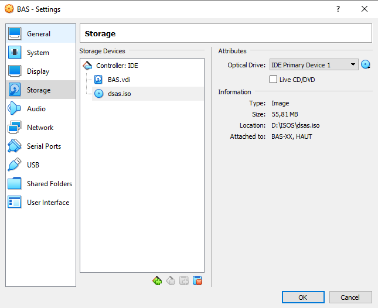
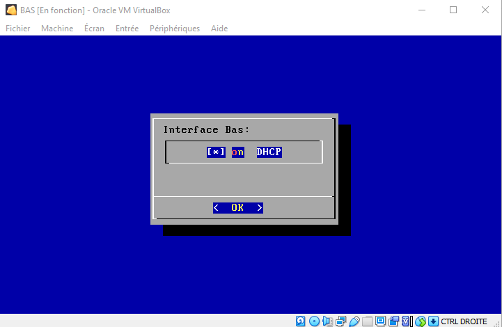
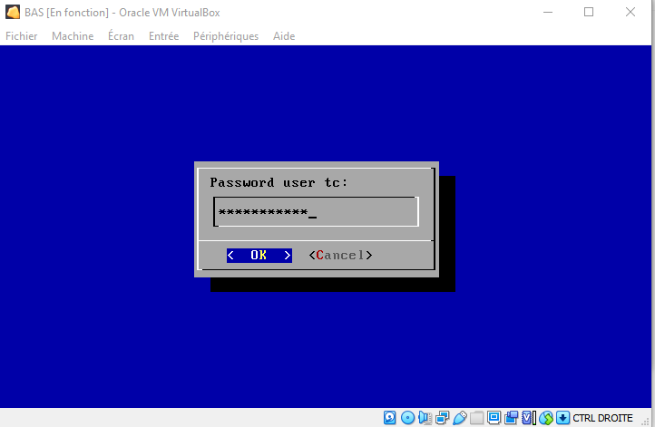
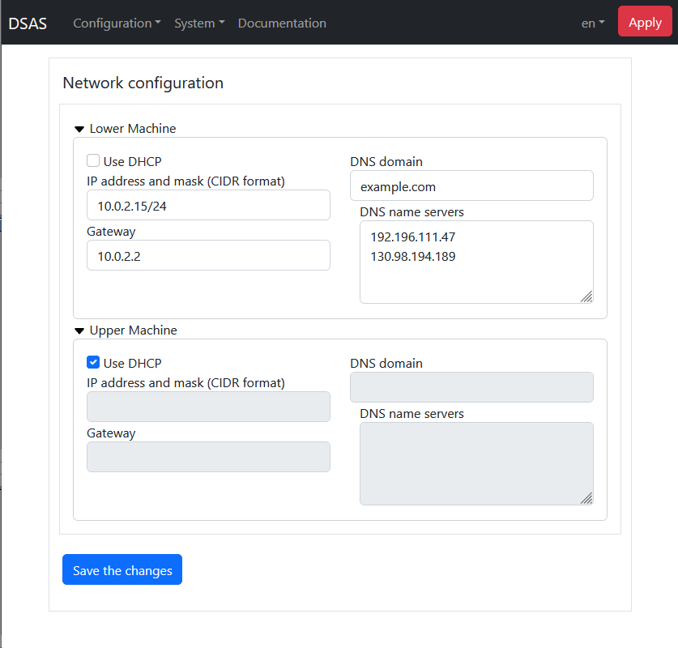
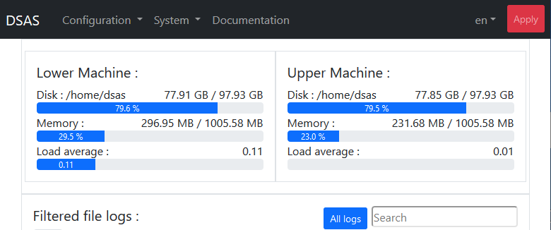
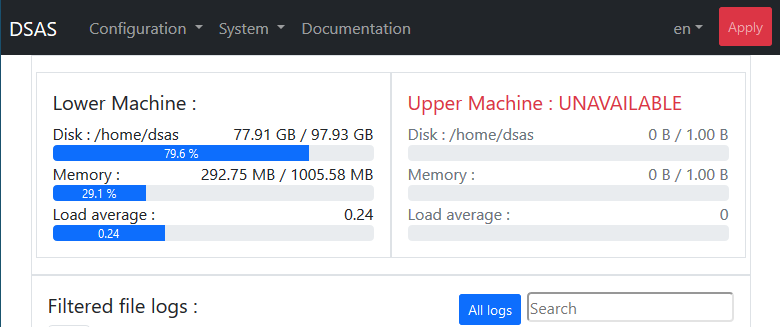
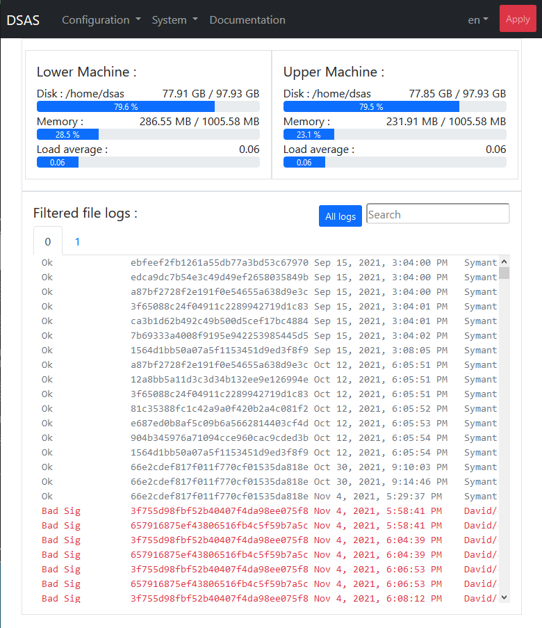

# Introduction

The isolation of industrial infrastructures is essential to limit
the possibility of malicious attack. However, this isolation limits the
ability to automate the downloading of software updates (operating systems,
viral signatures, other updates) that are essentiel to the health of all
sensitive systems. Configuration and other files are also difficult to
send to sensitive systems.

The means to transfer files to sensitive systems is often the use of USB keys.
This mode of transfer requires time consuming human intervention and exposes 
the industrial system to viral contamination at each USB connection. 
Organizational means could be put in place to control USB keys each time they
are used, but the risk of contamination is impossible to exclude.

So, a means of transfering files from a non-sensitive area to our industral
infrastructure is needed, that including the sytematic control of all files
transfered in order to eliminate the risk of malicious files. The "Dynamic 
Security Access Service" (DSAS) aims to be this means of secure transfer.

The objective of the DSAS is to download security updates, to control their 
integrity and to make them available to the sensitive systems. The DSAS will
also allow the use of USB keys to be eliminated on our industrial infrastructures,
and therefore the DSAS includes the ability to transfer files signed by 
authorized people. Finally, the DSAS ensures a protocol break between the various
security zones in a defense in depth strategy.


## The principal of signature verification

The principal means of file verification of the DSAS is the verification of
signatures. Each file allowed to pass the DSAS can be verified by its 
cryptographic signature.

The DSAS is not the first proposal to use cryptographique signatures in a 
file transfer system and for example [a product by SECLAB implements this.](https://www.seclab-security.com/seclab-securing-systems/)
The problem is that these existing systems require human intervention to verifier
and sign every file received and to be transfered by the DSAS. A program like
Symantec End Point Manager produces approximately 4000 files a day to transfer.
It is therefore an illusion to consider that a human control of these files is
possible before their transmission

The DSAS takes another approach, by assigning confidence to the existing signatures
of certain software editors, thus allowing their transfer. However, their exists
a multitude of means used by these editors to sign their softwarre, and the DSAS 
must have the means to verifier each type of signature used by the desired editors.

### The chain of confidence

The problem with a verification by signature is to know to whom we must give confidence.
To this ends it is important to understand the chain of trust of the signature. This
chain can be rooted in a "Certification Authority" (or CA) in this case of X509 certifcates,
or a distributed confid with the certificates themselves signed amongst themselves in
the case of PGP certificates. For PGP certificates, the "web of trust" is implcit and passes
by certificate signing ceremonies in the phase before the inclusion of the certiciate in the
DSAS. For X509 certiciates, the chain of trust is explicitly included in every signed file.
For example, the certificate used to sign a file is itself signed by an intermediate
certificate which is signed by a certification authority. The DSAS allows verification tasks
to be defined limiting the files allowed to pass to have a particular chain of trust and to
not just verify the file is signed by a valid certification authority. Unfortunately, 
[malicious actors can also buy signing certiciates](https://duo.com/decipher/attackers-are-signing-malware-with-valid-certificates)
et a verification solely based on the certification authority is not a strict guarantee 
that a file is not malicious. The DSAS, if correctly configured, allows the transfers to be
strictly limited to a single software editor, or even a particular division of this editor,
so that the risks are minimised.

## Architecture

The principals of the DSAS are the following:

- The DSAS is not part of either of the two domains that are interconnected, but
is isolated between the two. The connections towards the DSAS are strictly controlled
- Unneeded services or network ports are not made available. All unneeded sofware is 
uninstalled
- The DSAS must implement a complete break in the protocol between the two zones
of sensitivity. This is implemented by the DSAS being implemented on two different
machines, each dedicated to the connections towards one of the two differents zones
of sensitivity, so as that compromission of the machine attached to the non sensitive
zone does not put the machine in the sensitive zone at risk.
- Several user accounts are used on the DSAS with different access rights, so that 
the compromission of an account will not expose all of the internal zones of each
of the machines of the DSAS
- No unverified file is visible in the sensitive zone. The file systems of the
two machines of the DSAS are seperate
- The verifications are performed by the DSAS before files are made available in the
sensitive zone. These verifications are for the moment limited to verifications of the
integrity, but in the future could include an anti-virus
- The maintenance of the security of the DSAS must be assured. This means that all
of the software elements exposed to an attack must be known, their vulnerabilities
monitored and the means to protect against these vulnerabilites in place.

These constraints push us towards an architecture with

- seperation of sensitive and non sensitive treatments of the two zones on to two
distinct machines
- To use of a minimaliste linux system with the absolute minimum of software pre-installé.
We have chosen to use the [Tiny Core Linux](http://tinycorelinux.net/) operating system
because it is regularly updated with a minimal installation (12 megabytes) including only
the linux kernel, busybox and a few boot scripts. No service is started by default
- Additional dependances are avoid wherever possible. For example perl, python, ... are not
installed as the scripting language "ash" is already available.
- Each of the machines of the DSAS has two network interfaces, with one serving only for the
interconnexion between the two machines. One of the machines is interconnected via the additional
interface to the sensitive zone, while the other to the non sensitive zone
- The direction of the initiation of the network connexion is always from the more sensitive
zone towards the less sensitive zone. No network port on the more sensitive machine is exposed
to the less sensitive machine. In this manner, while the more senstive machine can download files
from the less sensitive machine, the less senistive machine can not send them directly.
- All of the administration is performed form the sensitive zone. No adminsitration is posisble
from the non sensitive zone.
- Their are several service accounts created on each machine, with the account "haut" being 
the only one with the rights to download from a less sensitive zone, the account "verif" being
the only one with the rights to transfer files between zones on each machine and the account
"bas"  being the only one with exposed towards the more sensitive zone. The account "verif" is
only accessible outside the machine.

A simplified architecture of the DSAS is then


where the arrows represent network or application flows with the direction defining which 
machine or application initiates the flow. 

An administration account is also created. This account is only available from the sensitive
zone and the possibility to add filtring to limit the machine that can connect to this account
is implemented. This is the only account with administration rights and the root account is
only accessible from this account.

# Installation

With the DSAS seperated into two machines, two seperate installations are needed. The two
installation follow the same logic. In the following discussions, the machine connected to
the non sensitive network is called "upper" or "haut" and the machine connected to the 
sensitive network is called "lower" or "bas". An initial configuration of each machine is
needed from their console, but after this initial phase, all configuration is done from the
lower machine.

To facilite the installation it is better to start with the installation of the upper machine,
because in the initial phase the lower machine must be able to contact the upper machine, and
so the upper machine must be configured first to allow the lower machine to send it orders.

In the following sections, if it is not explicitly stated, the configuration step concerns 
both machines.

## Configuration of the virtual machines

### Choice of the disk size

The DSAS needs independant disks for each of the machines used in its implementation.
So the DSAS needs two times more disk space than the maximum used for the transfers.
Inside each machine, the DSAS "mirrors" the files between each zone, and the old files
are removed when they are not longer available on the site they were downloaded from.
So the only the addition of space used by the download sites is needed, with a little
extra margin.

The Windows "Patch Tuesday" updates are often a hundred or so megabytes, so we multiply
that by the number of updates to keep available and we can easily find otherselves with
several gigabytes. The Symantec IntelligentUpdates need roughly 150 megabytes, while 
Symantec LiveUpdate needs 50 gigabytes. 

Each Linux repository could need upto 50 gigabytes, so if we need to transfer linux update
the needed disk space can easily explode. In the following configurations we have used a
disk size of 50 gigabytes, however we recommend at least 500 gigabytes for each machine
of the DSAS.

### Creation of the virtual machines

The DSAS is supplied in the form of an ISO that should be used as a "live CD". This means
that the operating system should always boot from this image ISO. The major advantage of
this is that the updates of the DSAS will be extremely easy and resumes as the shutdown of
the DSAS, the remplacement of the ISO and a restart.

The ISO of the DSAS is a 32 bit Linux, and the virtual machine must be configured accordingly.
For example, under VirtualBox the initial configuration should be 


A minimum of 256 megabytes is needed to be able to start the DSAS. However, while running
the DSAS could use more resources and we recommand 1 gigabyte of memory.

The DSAS has no specific requiement for the format of its disk, and here we have chosen 
VirtualBox's default format 


After the boot disk must be defined with the DSAS ISO image in "IDE primary master" 



If the boot disk is incorrectly configured the DSAS will not start.

### Network interconnexion betwwen the machines of the DSAS

The virtual machines should be configured with two network cards. The first card
will be used for the connection to the outside the DSAS and their configuration 
will be depend upon the environment in which the DSAS is installed.

The second card is always used for the interconnexion between the two machines,
and this network with always be  the static network "192.168.192.0/24". Several
means could be used to configure this interconnection network, particularly if 
a friewall is placed on this link (which doesn't seem to be necessary). We propose
the use of an internal network of the hypervisor configured with VirtualBox like


We are now ready to start the machines for the first time.

This step starts with an initialisation in two phases : the first using the linux 
console, and the second with the administration console of the DSAS using https.

## First initialisation phase

This initial phase is performed from the machine consoles, because before the first
configuration there is no guarantee that the machines will be visible from the outside.
A minimum of configuration from the console for the network configuration is needed
before continuing in a second phase from the DSAS administration interface.

### Formatting the disks

As a first step, the DSAS will request to format its disk. A menu is presented
with all the disks found connected to the DSAS. This menu resembles 


Navigation in this type of menu is done with the following keys

- arrows - cursor movement
- Space - select an option
- Enter - continue

Use "Space" to select the disk, here "/dev/sda", and "Enter" to start formatting 
the disk. After formatting, the machine will restart automatically before continuing

### Selection of the type of machine

The next step is to select whether the DSAS machine will be configured
as the upper or lower machine. The menu


is used to present the selection of the machine type. If the machine
has been configured with only one network card at this point the DSAS will shut down
its configuration with the error


In this case stop the machine and add a network card in the hypervisor.

### Initial network configuration

The network configuration of the upper machine is done via the administration interface
of the lower machine. Consequently, this section only concerns the lower machine. However,
if the network is not at least partially configured on the lower machine, the 
administration interface might not be available. Therefore a initial configuration of the 
network of the lower machine is made from the console.

The first step is to choose if the network is static or if it uses DHCP for its
configuration. The following menu is used to confirm this choice



At this point if DHCP has been chosen no other network configuration is necessary and
you can move on to the next section.

For the static IP configuration you must enter the address and the netmask in the CIDR
format. In CIDR format, the IPv4 netmask is represented by an integer between
0 and 32 representing the number of bits used to encode the NetId part.

For example the netmask "255.255.255.0" is represented in CIDR format by "/24" and
the netmask "255.255.255.128" by "/25". So if our ip is "10.0.2.15" and our
netmask is "255.255.255.0" it is entered as


in the configuration interface at startup. The syntax of the entered IP address is
validated before continuing. If it is not in an acceptable format the same menu will
will be presented in a loop.

If the administration machine is not on the same subnet as the DSAS, you must
configure a default gateway. Otherwise leave blank to prevent any connection
to DSAS from outside the subnet.


Two items are required for DNS configuration. First the search domain, where here
a search domain "edf.fr" is used


with this search domain the hosts "ntp1" and "ntp1.edf.fr" will be equivalent.
Then you have to define name servers, responsible for converting DNS names to 
IP addresses. For example


Several IP addresses separated by spaces could be entered, giving a list of name 
servers in order of their preferred usage. 

### SSH configuration

The upper machine does not need an SSH configuration in the initial phase. SSH 
configuration requires the creation of SSH keys for two DSAS users;

- the priviled user __tc__ allowing shell connexion with both machines, and
- the user __haut__  for the use of sftp between the two machines.

The creation of the keys is automatic, but the authorized keys must be transferred to the
upper machine. If the upper machine is not visible from the lower machine, it will wait
with the message


The main reason for seeing this screen could be that the upper machine has not
been started. However, the network interconnection between the two machines could also be
at fault.

In the initial phase, there is no SSH key for SSH without a password. So the privileged
users __tc__ password must be entered in the window.



By default the DSAS password is __dSa02021DSAS__ but the first time you use
the administration interface you will be forced to change this password.

This is the last step of the initial setup on the console. The second phase
of the initial configuration should be done with the administration interface.

### In the event of a DSAS initialization error

To make mistakes is human, and DSAS offers ways to recover from mistakes made
during initialization. If the initial phase of the installation (using the console)
is not completed, no configuration will be saved. A simple restart of the
machine will allow reconfiguration from scratch.

If unfortunately you have completed the installation but it is not correct,
then the administration interface will no longer be accessible, all is not lost. 
However as the DSAS is configured to start without any human interaction after
its first configuration, you will need to connect from the console interface to
be able to access the configuration menu again.

The user to use on the console is 'tc' and the password to use, if you haven't 
changed it already with the admin interface is as above. A classic linux console
with minimal functionality available will be presented to you.

The command required to reconfigure the DSAS is

``` shell
$ sudo /etc/init.d/services/dsas reconfig
```

You will then be presented with the configuration menu. At the end of the configuration, 
don't forget to log out using the command

``` shell
$ exit
``` 

## First login to the administration interface

The address for the DSAS administration interface will depend on your installation
but without NAT between you and the DSAS, the IP address will be the one entered 
previously. On the other hand the DSAS administration port is always __port 5000__. 
So if your IP is 10.0.15.2 as used in the example above you will need to connect 
to https://10.0.2.15:5000 for the DSAS administration interface.

The administration interface is in HTML5 with recent javascript functions. So
a recent browser (after 2016) will be necessary in order to use the interface. If you can
not connect, there is either a routing problem between you and the DSAS and it is necessary
review the router configurations between you and the DSAS, i.e. the network configuration
of the above DSAS is incorrect. In this case, refer to the section [In the event of an 
initialization error of the DSAS](#in-the-event-of-a-dsas-initialization-error).

The SSL certificate used by the DSAS in the initial phase is self-signed and it will 
be necessary to accept its use in your browser. If you have successfully logged into the
DSAS administration interface you will be presented with the following login screen:


The privileged user on the DSAS is user __tc__, and the default password
is __dSaO2021DSAS__. At this point log on to the administration interface.

### The basics of the administration interface

#### The `Apply` button

At the top of the administration interface pages you will find an `Apply` button
highlighted in red. This button is very important. No modification made via the administration
interface will be permanent and none, except password changes, will be applied until this 
button is used. This button performs a permanent backup of the changes and applies them. In this
manner, major errors can be easily removed with a simple restart unless they are applied.

#### Shutdown and Restart

The DSAS can be shutdown and restarted without fear because all the executable code is
on the DSAS ISO image. The DSAS tasks in progress will be interrupted, but will be resumed at
restart. The shutdown and restart functions are available in the `System` menu of the
DSAS, like


#### Backup and Restore

The currently applied DSAS configuration can be saved by using the button in
the menu above. Selecting to backup, you will be asked to enter a password for the
backup, like


The backups of the two DSAS machines are then encrypted in `bcrypt` with this password and
archived together. If you do not enter a backup password, the files will be archived
without the encryption step.

It is strongly advised to encrypt these archives, because it contains the complete DSAS
configuration, including SSL certificates and SSH secrets. The password does not have to 
be the same password as used for the DSAS. The user passwords will not be backed up.

When restoring the same password will be requested, and so this password should be kept
preciously. In case of a restoration it will be applied immediately. This could result in
the DSAS becoming unavailable, particularly if the network configuration has changed between
the backup and restoration. In this case refer to the section [In the event of an 
initialization error of the DSAS](#in-the-event-of-a-dsas-initialization-error).

#### Automatic logout

The DSAS is configured to check the connection rights for each operation, if more than
10 minutes separate one operation from the next, you will be automatically logged out with
the following message:


By clicking `Ok` on this message you will be redirected to the DSAS login screen.

## Initial password change

If this is your first connection to the DSAS, an error message will be displayed and after
you will be presented with the following screen:


At your first connection, all passwords must be changed. It is impossible to
continue with the administration interface without changing the passwords.

The password change screen has 4 lines. On the first, the existing password of user
__tc__ must be entered. The other three lines concern the following users:

- __tc__ - The administration user of the DSAS. It has all the privileges on the 
DSAS including the ability to become __root__. If `ssh` is active for user __tc__ 
it can used to connect with `ssh` for advanced maintenance on the DSAS.
- __bas__ - This user has only one role. If the DSAS is configured with
`ssh` for the user __bas__ it will have the right to connect via `sftp` and only via 
`sftp` from the sensitive zone. This could be useful for the recovery of transmitted files.
by DSAS in certain scenarios. Only verified files will be shown to this user
by DSAS and a [chroot](https://fr.m.wikipedia.org/wiki/Chroot) is used to prevent
the user from seeing anything else.
- __haut__ - This user, like user __bas__, is used for an `sftp` connection
from the non-sensitive area to allow files to be uploaded directly to the DSAS. It is 
also isolated with chroot and can only see the zone where files should be deposited. The
use of this feature is strongly discouraged as it opens up the possibility of attacks 
against the DSAS

Therefore, in a normal configuration only the user __tc__ is used. But the three
passwords must nevertheless be modified in order to eliminate all default secret elements.
Passwords for users __bas__ and __haut__ can always be changed from this interface later and 
if you don't plan to use the `sftp` functions, it is recommended to choose long and random 
passwords for these __bas__ and __haut__ users.

The limitations on passwords are

- they are at least 8 characters long (12 recommended)
- they do not contain spaces or tabs
- They contain at least 3 types of characters (upper case, lower case, number, special character)

Enter your new passwords and click on `Change passwords`.


At this point it is recommended to press the `Apply` button in order to make these
permanent changes. Otherwise on the next restart the old passwords will be
requested.  


### Network configuration

The network configuration screen is accessed from the DSAS `Configuration` menu, as
follows :


by selecting "Network",  the following screen will be presented


The DSAS network configuration is separated into two parts. The network connected to 
the sensitive network called __lower__ and to the non-sensitive network called __upper__. Each
of these two configurations could be accessed by clicking on the arrow next to the type
network, like



The configuration of the __lower__ network, previously entered is visible in this menu. 
Check the settings, modify if necessary and press `Save changes`.

A summary of the input fields on this page are

- If the DHCP option is selected, the other fields for the network configuration are ignored on this
interface.
- IP addresses, are in IPv4 format like NNN.NNN.NNN.NNN
- If a netmask is necessary it is entered in CIDR format. In CIDR format the netmask is
represented by an integer between 0 and 32, representing the size of the NetId.
For example the netmask "255.255.255.0" is represented in CIDR format by "/24" and the 
netmask "255.255.255.128" by "/25".
- The "DNS Domain" must be a valid domain name.
- Several IP addresses separated by carriage returns can be entered, giving a list of
name servers in order of their preference.

### Renewal of the web certificate

As [discussed above](#first-login-to-the-administration-interface), the SSL certificate
used by the default DSAS is self-signed. This is also a secret item to replace during the 
initial installation. The web server administration interface is in the `Web` submenu
of the `Configuration` tab and appears as


The renewal tab is accessed by clicking on the arrow to the left of `Renew
certificate`, and looks like


The fields to be filled in for the renewal are fields defined by the standard 
[RFC5280](https://datatracker.ietf.org/doc/html/rfc5280.html).

- __C__ - This field is the country of the organization responsible for the server. It 
is must be two letters encoded as defined in RFC5280. The code for France is __FR__.
- __O__ - The organization responsible for the server. In France, the
name of the company registered with INSEE and must be all capital letters.
- __OU__ - An identifier of the sub organization responsible for the server. Certificates
signed in France must include a KBIS, for example here '0002 552081317', is the KBIS of EDF.
- __CN__ - For a server, like the DSAS this must be the DNS name of the server
- __S__ - A free field for the region of the Company's head office. It is optional
- __L__ - A free field for the city of the company's head office. It is optional

You can now click on the button `Renew certificate` and a certificate
will be generated. However, it will not be used by the server until the next time
you click on Apply. The public certificate and Signing Request (CSR) could
be downloaded by clicking on the button . 

## Service Configuration

Other than the administration and repository web services, there are 3 other services
which could be started on the DSAS;

- An OpenSSH server for connections to the DSAS,
- An ntpd client for setting the time of the machines, and
- A syslogd client for local and remote administration logs


### Configuring the OpenSSH service

In addition to the openssh server on the upper machine used for communications
between the two DSAS machines, the DSAS administrator can choose to open
other SSH services from the sensitive and/or non-sensitive zones.

The OpenSSH server is never started with open access to all users on the DSAS. You 
must explicitly give access to each user, and this access is only valid from certain
security zones. For example, above the OpenSSH service is checked and the
user __tc__ can only logged in from IP addresses in the 10.0.2.0/24 subnet.
__haut__ and __bas__ users have no access rights.

Listening addresses for each user can be very complex with multiple addresses
possible separated by commas. A complex example could be

```
10.0.2.1,10.0.2.128/25,!10.0.2.129
```

where the address 10.0.2.1 and the subnet 10.0.2.128/25 could access the DSAS, but the address
10.0.2.129 is prohibited to do so. By default no access is given, and if the listening address
for a user left blank, the OpenSSH server is not even starting on the DSAS network interface
concerned.

Each user can only log in from certain sensitvity zones:

- __tc__ - User __tc__ can only connect from the sensitive area and can
connect with ssh, scp and sftp
- __bas__ - User __bas__ can only connect with sftp from the sensitive zone. This
sftp functionality could be used to replace http server repository (or in addition). It only has 
access to the DSAS area with the verified files and can not access files elsewhere.
- __haut__ - `Use of the __haut__ account in SSH and strongly discouraged`. The reason it is
not recommended is that it does not respect the direction of the initiation of network flows, from
the more sensitive zone to the less ensitive zone. But in the absence of other means of downloading,
this account opens the possibility from the non-sensitive zone to deposit files on the upper
machine of the DSAS. The user __haut__ only has access with sftp and only to the DSAS zones 
with the unverifed files.

If the SSH service is enabled towards a zone, port 22 is open on the DSAS machine
concerned. 

### syslogd client

If the DSAS `syslogd` service is enabled, service logs are made locally. It is also 
possible to define a remote server for the rsyslogd service for logs in UDP on port 514.

Note that the syslogd service is provided by BusyBox, and the implementation of syslogd by 
BusyBox does not include the possibility of TLS encryption on port 6514. So other means of
securing this flow must be put in place.

Using the syslogd service does not open a port on the DSAS, but only connections to a 
remote server.

### ntpd client

The DSAS includes the possibility of synchronizing via the ntp protocol. One or more ntp hosts
could be configured. The addresses of the ntp hosts could be IP addresses or hostnames as provided
by DNS. In the second case the DNS must be configured as discussed in the section 
[Network configuration](network-configuration).

Using ntp does not open a port on the DSAS but only connections to remote servers.

# DSAS Operation

## Status of machines

The status page of tasks and machines is the entry and main page of the DSAS. It is accessed by
clicking on `DSAS` in the menu at the top of the pages and is resembles



The page is divided into two sections; at the top the status of the DSAS machines at the bottom 
the status DSAS tasks. Three statistics are given for the two DSAS machines.

- __Disk usage__ - The total occupancy of DSAS disks are shown. If the disks
are full it will be impossible to properly download and verify files. So the disks
should be periodically monitored. Logically if the tasks have not changed,
the use of the disks should not change either, but if one of the tasks suddenly
increases its disk usage it will be easy to lack disk space. A disk that more than
80 or 90% full could easily be saturated.
- __Memory usage__ - Each task on the DSAS occupies machine memory. If the memory is full, 
the performance of the tasks will be impacted. It is necessary to watch that memory is saturated, 
but as long as it is below 90% it should not be  a problem. With the DSAS architecture, almost 
200MB is used by the operating system.
- __Loadavg__ - The "Load average" is a concept of Unix giving an idea on the occupation of
computational resources of the machine. A "Load Average" of "1" means that the equivalent
of a processor core is completely occupied. So the total occupation of resources
of the machine is at the point where the "Load average" is equal to the number of cores
of the processor. On the DSAS page the "Load average" is presented in a logarithmic scale 
with the number of processor cores at 50% of the length of the status bar. If the status bar 
is longer than half, DSAS might have insufficient computing resources. The first thing
to do again in this case is to restart the DSAS in order to see if the problem disappears.

If the DSAS lower machine is not available you will be unable to connect
at the administration interface. On the other hand, if the upper machine is faulty, the page
status informs you with the following screen

 

## Status of verified files

The status of the verified files is available directly below the status of the machines
of the DSAS, like



The status of file verification might be in multiple tabs. The number
the tab grows with the age of the verification. The first tab is the current week,
the second tab last week, etc.

The status of each verified file is given on a line of the page, and each line is
composed of 4 elements

- __Statut__: In the first position we find the status of the verification
- __Hash__: In second position is the MD5 hash of the file. This could be useful when a threat
has been identified, to see if it has been passed by the DSAS or not.
- __Date__: The date of the verification is given in the third position. Dates are always given
in UTC format.
- __File__: And in the last position the path to the file is given

The status will take one of the following values

- `Ok`: All the requested checks were successful and the file was made available
on the lower machine.
- `$$ Checksum fail`: A checksum test on the file failed
- `** Bad Sig`: One of the requested verifications reported a bad signature
- `** Bad Interm Sig`: The verification of an intermediate certificate failed
- `** Bad RPM Sig`: The signature verification of an RPM file failed
- `** Bad DEB Sig`: The signature verification of an RPM file failed
- `** Not signed`: The file is not signed and could not be verified

the blue button at the top of the verification logs allow to switch between a mode or "all logs"
are visible or a mode or "that errors" are visible. This will allow you to quickly identify
the files that had problems.

### Search in verification logs 

In the case of a problem or a vulnerability being identified it might be necessary to examine
the verification logs, for either the name of a file or its MD5 signature as an indicator of
compromission. The DSAS includes a search dialog allowing matches log lines to be found. type
the string value to be found in the verification logs as shown below and the next matching line
will be highlighted.


Type `Return` allows the next matching line to be found. If there is no matching line between
the actual position in the logs and the end of the logs, the DSAS will recommence the search 
starting at the beginning. If no matching line is found, no line will be highlighted.

## Certificate configuration

The DSAS is preconfigured with the set of root certificates of a classic linux distribution.
All of these certificates and other imported certificates are available from the tab
Configuration/Certificates as seen below


The certificates installed in each category can be viewed by clicking on the
arrow to the left of each category and the details of each certificate are available
like


Each certificate can be downloaded by clicking on the button .

Certificates are highlighted in 4 different ways depending on the characteristics
of the certificate.

- __Certificate CA__ - With black text. The certificate is a root certificate or
a self-signed certificate. The two types of certificate are similar with the difference 
being whether the certificate is trusted or not.
- __Intermediate Certificate__ - With blue text. This certificate is not
a root certificate, but it is signed by another certificate
- __ Less than 6 months at expiration__ - With orange/yellow text. This certificate is at
less than 6 months from expiration
- __Expired__ - With red text. The certificate has already expired. This does not mean
that it is no longer usable, but it is not valid for files signed after the date of
expiration

Preinstalled root certifications could be used for verifications on the DSAS. But using 
these certificates alone is not sufficient, because

- Preinstalled certificates do not include GPG certificates used by linux repositories
- Verification only against a root certificate does not have a completemy guarantee the
absence of malware. [Code signing certificates have been abused]https://duo.com/decipher/attackers-are-signing-malware-with-valid-certificates)
in the past in order to sign malware.

So ideally it is necessary to verify with the intermediate certificates closest to 
the desired software publisher. For example a update of "Symantec Endpoint Protection" 
(SEP) includes the chain of trust

```
VeriSign Class 3 Public Primary Certification Authority - G5
-> Symantec Class 3 SHA256 Code Signing CA
  -> Symantec Corporation
```
So ideally you should check for updates of SEP with the root certificate
`VeriSign Class 3 Public Primary Certification Authority - G5` and with the certificate
Intermediate `Symantec Corporation` or `Symantec Class 3 SHA256 Code Signing CA` in order
to limit as much as possible the files that could be validated as a Symantec update. So 
it is necessary to upload at least one of these Symantec certificates to the DSAS.

## X509 certificate management

#### Identification of X509 certificates

X509 certificates are used in Windows signatures, but also for files signed by `openssl`.

From a Windows computer, with a right click and selecting the option `Properties` we could
see the following menu


By clicking on `Details` and after` Display the certificate` we could see the chain of trust


This allows the root certificate and all the certificates used to sign the file to be seen.

#### Preparation of X509 certificates

The most important point for the preparation of a certificate for importation into the DSAS
is to know the provenance of the certificate. Ideally the certificate directly by the software
editor via a secure method. A usual means of recovering a certificate is directly from the
editors website use https. However, this is not always possible, especially for Symantec as above.

In the absence of distribution via a website, all the certificates used for
Windows signatures are embedded in the signed binaries themselves. So if
you are __ sure__ where a binary comes from you can use the binary itself as a
certificate source.

On the same menu as below on the `Details` tab we can see


with the option of `copy to file`. This option allows all the certificates of the chain of 
trust to be saved. It is necessary to select from `save the certificate in base64 encoded X.509`
format as


A file with the certificate will be saved on your computer.

#### Special case of Symantec LiveUpdate certificates

Symantec LiveUpdate files are not signed directly, they are rather archives in `7z` format 
with all the signed metadata necessary for their verification. In each file of `LiveUpdate`
a file with the extension `.sig` can be found, typically` v.sig`. This file contains the
certificates that must be imported into the DSAS for signing files of LiveUpdate. As long as
you have extracted the `v.sig` file, the two certificates to import can be found with the command

``` shell
$ openssl pkcs7 -inform der -in v.sig -outform pem -print_certs | awk 'split_after == 1 {n ++; split_after = 0} / ----- END CERTIFICATE ----- / {split_after = 1} {if (length ($ 0)> 0) print> "cert" n ". pem "}
```

on a linux machine. From the Windows command line we could do.

``` shell
$ openssl pkcs7 -inform der -in v.sig -outform pem -print_certs -out certs.pem
```

and the `certs.pem` file will contain several certificates in text format that you can
split into multiple files with the help of a text editor.

On the other hand, some files in the archives are relatively old, and their
signatures too. Therefore, several certificates are required. Moreover,
the root certificates used for these signatures are not included in the files
but integrated directly into SEP, as [discussed above](#verification-symantec-liveupdate).

In order to facilitate the use of Symantec LiveUpdate, and other software vendors
typically used with the DSAS, the certificates to be installed on the DSAS are available
in [the attached certificate bundle](Certificates.zip). 

### SSL public key management

Public keys are not really certificates, as they only contain the cryptographic objet
used for signature verification or decryption. No information on the organization responsible 
for the keys or limitations on their use are included in SSL public keys. These keys are used 
in the __openssl__ or __cyberwatch__ tasks

Because there is no chain of trust for public keys, it is essential have a trusted means of
retrieving them.

### Managing GPG certificates

GPG certificates are used in particular for checking linux binaries, but also for other files 
signed by GPG (for example configuration files developed by DSAS users).

GPG certificates do not explicitly integrate the chain of trust into signed binaries. GPG uses 
the concept of a [web of trust](https://en.wikipedia.org/wiki/Web_of_trust) where the certificates
themselves are validated against each other. This is outside the scope of this document and we 
have assumed that you have complete confidence in the certificates that you have chosen to download
to the DSAS.

In order to retrieve a GPG certificate, the only solution is to retrieve them from their publisher.
For example some examples of certificate of software publishers are

- [The RedHat certificates page](https://access.redhat.com/security/team/key)
contains [the certificate used for signing Redhat binaries since
2010](https://www.redhat.com/security/data/fd431d51.txt)
- [The CentOs certificates page](https://www.centos.org/keys/) contains in particular
[the certificate used for CentOS7](https://www.centos.org/keys/RPM-GPG-KEY-CentOS-7)
- [The debian certificates page](https://ftp-master.debian.org/keys.html) contains
in particular the certificate of [Debian Bullseye](https://ftp-master.debian.org/keys/archive-key-11.asc)

### Importing a certificate into the DSAS

Public keys, X509 and GPG certificates can be added to DSAS by clicking on
 next to each category of certificate. A file browser
of the computer is opened in order to select the file to download to the
the DSAS. And a successful importation is signaled by


In order to confirm the correct importation of the certificate into the DSAS, it is
recommend to examine the details of the imported certificate, like for example

 

## Task configuration

A new task can be added by clicking on  to the right of 
the tasks page.


By clicking on it we are presented with an add task form like


- `Task name`: A name given to the task, which is not necessarily unique
- `Sub-folder used by the task` - The files associated with each task
are stored in a separate folder on the DSAS. This folder should be unique
for each task.
- `URI (no loading if empty)` - The address where the DSAS will look for the files
associated with a task. Leaving this empty is permissible and in this case it
is assumed that the files associated with the tasks must be deposited on the DSAS
by the user. the `URI` must be of the form` protocol://site/folder/ `or else
`protocol://site/folder/ file`. Allowed protocols are `sftp:`, `ftp:`, `ftps:` 
`http:` and `https:`. For example `ftp://noeysep3.noe.edf.fr/LiveUpdate/`. The `/` 
at the end of the `URI` with a folder is optional but recommended.
- `URI Certification Authority` - If the `URI` uses `https`, then the DSAS will
refuse to download files from the URI unless a validation certiciate is used 
for the server. Three choices are possible
  * `Base CA` - The integrated cerificate authorities are used the validate the
  server
  * `Self-signed` - The DSAS will not validate the certificated used by the server.
  In this case a "Man in the Middle" attack is possible, and other means of ensuring
  protection ahainst this might be needed. All files recovered are verified by the 
  DSAS so the risk is minimized.
  * Uploaded certificates - The X509 root certificates that have been uploaded can
  also be used as the certification authority for the verification of the server.
- `Task type` - The type of task used. The types of tasks allowed are
  * `rpm` - The task is a file repository in rpm format. All files are
check with `rpm -K`.
  * `repomd` - Like the` rpm` type, but the `repomd.xml` files are signed
allowing to speed up verification.
  * `deb` - Verification of Debian repositories
  * `authenticode` - Files are signed with` Microsoft` type signatures.
  * `liveupdate` - The files corresponding to the update files of
Symantec LiveUpdate.
  * `cyberwatch` - files corresponding to signature files provided by
  [CyberWatch](https://docs.cyberwatch.fr/fr/9_advanced_administration_guides/offline_administration/swarm/import_securitydb.html)
  * `openssl` - Task allowing the transfer of files signed by openssl
  * `gpg` - Task allowing the transfer of files signed by gpg.
- `Periodicity of the task` - How often is the task executed
  * `never` - The task is never executed automatically, but can be executed manually
  * `per hour` - The task is executed once per hour
  * `per day` - The task is executed once per day
  * `per week` - The task is executed once per week
  * `per month` - The task is executed once per month
- `Add certificate` - Default certificates and certificates added
by user are available for addition to verification tasks. The certicate type
must be appropriate for the type of task. Each selected certificate is
added to the list of certificates for the task, and can be removed by
clicking on the  next to the certificate.

An example of an added task is


Next to each task, the icon  allows the task to be modified,
 allows the task to be removed and  allows
the task to be executed immediately. The status of the task is provided via the color of the
task title. In blue, the task was not executed, in green, the execution of the task was successful,
and in red the execution has failed. The last execution of the task is visible by opening
the task as

 

# Security Maintenance

## Analysis of the main risks of the DSAS

This section discusses the main risks of DSAS. Other risks exist, for
example the compromission of the DSAS repository site, but considering the architecture 
of the DSAS other risks are considered as negligible.

The software impacted by these risks are detailed with the version numbers of
each installed software making it easy to see if an upgrade of a software component
is required.

### Risk: Compromise of the link between the two DSAS machines

| Risk        | Compromise of the link between the two DSAS machines |
| ----------- | ---------------------------------------------------------- |
| Criticality | Critical                                                   |
| Comment     | The protocol break in the link between the two DSAS machines <br />is the main protection of the DSAS. In case of compromission <br />The attacker could take control of the lower machine <br />from the upper machine. This could put into question the <br />isolation between the of sensitivity zones. |

Software impacted by this risk

| software      | version    | comment                                                                        | 
| ------------- | ---------- | ------------------------------------------------------------------------------ |
| openssl | [1.1.1l](https://www.openssl.org/source/openssl-1.1.1l.tar.gz) | Only the functionality used by ssh impacted |
| openssh | [8.8p1](https://ftp.openbsd.org/pub/OpenBSD/OpenSSH/portable/openssh-8.8p1.tar.gz) | ssh and sftp used |

### Risk: Attack on signature verification

| Risk | Attack on signature verification |
| ----------- | ---------------------------------------------------------- |
| Criticality | Major |
| Comment | If the software used for signature verification <br />are compromised, malicious files might be passed through the DSAS. <br /> This will undermine the primary purpose of the DSAS, but <br />will be limited to asynchronous attacks. |

Software impacted by this risk

| software | version | comment |
| -------------- | ---------- | ------------------------------------------------------------------------------ |
| openssl | [1.1.1l](https://www.openssl.org/source/openssl-1.1.1l.tar.gz) | Used for authenticode, LiveUpdate and OpenSSL verification |
| gnupg | [2.2.27](https://www.gnupg.org/ftp/gcrypt/gnupg/gnupg-2.2.27.tar.bz2) | Used for RPM, DEB and GPG verification |
| libgcrypt | [1.9.3](https://www.gnupg.org/ftp/gcrypt/libgcrypt/libgcrypt-1.9.3.tar.bz2) | Used for RPM, DEB and GPG verification |
| rpm | [4.16.1.3](https://ftp.osuosl.org/pub/rpm/releases/rpm-4.16.x/rpm-4.16.1.3.tar.bz2) | Used for RPM checking |
| osslsigncode | [2.2.0](https://github.com/mtrojnar/osslsigncode/releases/download/2.2/osslsigncode-2.2.0.tar.gz) | Used for authenicode verification |

### Risk: Attack on the means of downloading files

| Risk | Attack on the means of downloading files |
| ----------- | --------------------------------------------------------- |
| Criticality | Important |
| Comment | All download connections are initiated by the <br />DSAS, so this risk can only be used from specific <br />machines. The risk cannot be <br />used to hijack the main function of the DSAS<br /> |

Software impacted by this risk

| software | version | comment |
| ------------- | ---------- | ------------------------------------------------------------------------------ |
| openssl | [1.1.1l](https://www.openssl.org/source/openssl-1.1.1l.tar.gz) | only the functionality used by ssh impacted |
| lftp    | [4.9.2](https://lftp.yar.ru/ftp/lftp-4.9.2.tar.bz2) | Used for http, https, ftp, ftps, sftp |
 
### Risk: Attack against DSAS administrator authentication

| Risk | Attack against DSAS administrator authentication |
| ----------- | --------------------------------------------------------- |
| Criticality | Important |
| Comment | The DSAS administration site is only available <br />from the sensitive network, and normally by configuring the <br />DMZ where the DSAS is installed accessible only from well-controlled <br />machines. So the risk is limited to an attack from a <br />console allowed to access the DSAS by someone not <br />authorized to do so. The risk of reconfiguring the DSAS to allow <br />unwanted files to enter or to prevent wanted files from <br />doing so. |

Software impacted by this risk

| software | version | comment |
| ------------- | ---------- | ------------------------------------------------------------------------------ |
| php-cgi | [8.0.1](http://tinycorelinux.net/12.x/x86/tcz/php-8.0-cgi.tcz) | Backend of the administration site |
| lighttpd | [1.4.58](http://tinycorelinux.net/12.x/x86/tcz/lighttpd.tcz) | Backend of the administration site |
| cyrus-sasl-lite | [2.1.27](http://tinycorelinux.net/12.x/x86/tcz/cyrus-sasl-lite.tcz) | Authentication on the administration site |
| DSAS website | [-](https://gitlab.devops-unitep.edf.fr/dsao-cyber/dsas---tinycore) | Backend and frontend of the administration site |

The DSAS website is specially developed for this project. A code audit is in progress
and proposed fixes will be applied. 

## DSAS build process

### Preparing a build machine

You will need a build machine. The easiest way is to use the same operating system
to build as is used by the DSAS itself. For example the system
[CorePlus v12.x](http://tinycorelinux.net/12.x/x86/release/CorePlus-current.iso)
is currently used for the build of DSAS. After as you have set up
this machine, you would need a number of tools in order to do the build.

At this point, if you are behind a proxy for internet access, you must configure
access via the environment variables `http_proxy` and` https_proxy` like

```shell
export http_proxy=http://vip-users.proxy.edf.fr:3131
export https_proxy=http://vip-users.proxy.edf.fr:3131
```

It will be useful to add these two lines to the `~/.profile` file so that it is
configured at each login. After the command

```shell
tce-load -wi compiletc rsync coreutils mkisofs-tools squashfs-tools git curl ncursesw-dev
```

will install all the tools necessary for the build

### French keyboard

If you have a French keyboard, the easier is to add

```shell
setxkmap fr
```

to the `~/.xession` file or run this command from an X11 console. 

### Preparing the DSAS source tree

For the next step, we have to temporarily disable the http proxy like 

```shell
unset http_proxy
unset https_proxy
```

EDF's gitlab is used to host the DSAS source code. The certificate SSL used for 
this site is signed by the EDF certification authority, which is not not installed 
by default on the build machine. It can be retrieved and installed for our needs 
with the commands

```shell
mkdir ~/.git-certs
wget -P ~/.git-certs http://crl-edf.edf.fr/ac/autorite_racine_groupe_edf.cer
cat >> ~/.gitconfig << EOF
[http "https://gitlab.devops-unitep.edf.fr"]
  sslCAInfo = ~/.git-certs/autorite_racine_groupe_edf.cer
EOF
```

Now we are ready to download the DSAS source code with the command

```shell
git clone https://gitlab.devops-unitep.edf.fr/dsao-cyber/dsas---tinycore.git
```

Finally, we can configure the next actions on the source tree to ignore the http
proxy with the commands

```shell
cd dsas---tinycore
git config --add remote.origin.proxy ""
```

Can we now restore the values of the proxy environment variables.

### DSAS build commands

Next, the build is performed with the command

```
./make.sh
```

An ISO image is created in the file `work/dsao.iso`. We can keep the temporary files 
with the option "-keep". This is useful to examine why something is badly installed on
the DSAS without needed to start a server with the DSAS installed.

To build a source package (see the files `pkg/*.pkg`) a command like 

```
./make.sh -build gnupg
```

is used. To clean the files used during the build, the command 

```
./make.sh -clean
```

is used. The ISOs of the DSAS sare kept, but all of the other temporary files are
deleted. To completely clean the build tree, use the command

```
./make.sh -realclean
```

## Binary upgrade

For a binary upgrade of the DSAS, the build machine ust first be upgraded and
the DSAS completely rebuilt with the commands

```
sudo tce-update
cd dsas-tinycore
./make.sh -realclean
./make.sh
``` 

In the file `work/dsao.iso` un new ISO image of the DSAS will be available. Next,
the upgrade of the VM is a simple remplacement of te existing ISO with the new image,
like


## Source package upgrades

If a vulnerability is identified with a DSAS package and a binary update
is not available, we have the option to create a package for DSAS from 
the source code. We already have several packages made from source code

- `_pkg` [Required] - The name of the package, it must be identical to a name of the file
minus the `.pkg` extension
- `_version` [Optional] - The software version number
-`_uri` [Required] - The address to look for the source software package
- `_deps` [Optional] - The dependencies necessary for the software as long as it is
is installed
- `_build_dep` [Optional] - The dependencies needed during the software build phase
- `_pkg_path` [Optional] - Source packages fetched from` _uri` should
be in this sub-folder. If empty or absent, we assume that the build is from
from the root of the source package.
- `_conf_cmd` [Optional] - The command needed to configure the software,
typically `./configure`. The order could include options if needed
for the build like `./configure --prefix=/usr/ local`.
- `_make_cmd` [Optional] - The command needed to build the software,
typically `make`
- `_install_cmd` [Optional] - The command needed to install the software.
It will be installed in a temporary folder. It is assumed that the command
`_install_cmd` accepts the name of the temporary folder as the last argument. The example
typical of the `_install_cmd` command is` make install DESTDIR=`
- `_pkgs` [Optional] - The software could be split into several sub-packages.
This variable allows the way the split is made to be defined. An example could
be `main{/usr/local/bin,/usr/local/lib};doc{/usr/local/share/doc}`. The package
main is defined by `main{...}` and a second package with the extension
`-doc` will be created with the files in `/usr/local/doc`
- `_post_install` [Optional] - Allows to define a script which will be executed
for the installation of the package.

A complete example of a `pkg / openssl-1.1.1.pkg` file is 

```
_pkg=openssl-1.1.1
_version=1.1.1l
_uri=https://www.openssl.org/source/openssl-1.1.1l.tar.gz
_dep=""
_build_dep="compiletc perl5"
_pkg_path=openssl-1.1.1l
_conf_cmd="./config --openssldir=/usr/local/etc/ssl"
_make_cmd="make"
_install_cmd="make install DESTDIR="
_pkgs="main{/usr/local/bin,/usr/local/etc,/usr/local/lib/*.so*,/usr/local/lib/engines-1.1};dev{/usr/local/include,/usr/local/lib/*.a,/usr/local/lib/pkgconfig};doc{/usr/local/share}"
_post_install=\
'#! /bin/sh
[  -d /usr/local/etc/ssl/certs ] || mkdir -p /usr/local/etc/ssl/certs
[  -d /usr/local/etc/ssl/private ] || mkdir -p /usr/local/etc/ssl/private
[  -d /usr/local/etc/ssl/crl ] || mkdir -p /usr/local/etc/ssl/crl
[  -d /usr/local/etc/ssl/newcerts ] || mkdir -p /usr/local/etc/ssl/newcerts
[  -f /usr/local/etc/ssl/index.txt ] || touch /usr/local/etc/ssl/index.txt
[  -f /usr/local/etc/ssl/serial ] || echo "01" > /usr/local/etc/ssl/serial
[  -f /usr/local/etc/ssl/crlnumber ] || echo "01" > /usr/local/etc/ssl/crlnumber'
```

With the package defined, it is possible to create a binary package with the command

```shell
./make.sh -build openssl-1.1.1
```

The next build of the DSAS with take into account this package in its build.

# Detailed architecture

This section inclides the details of the security measures in place on the DSAS 
to ensure its security.


## Detailed network flow matrix

| Source            |  Destination      | Port        |  proto  | Service  | optional  | comment                       |
|-------------------|-------------------|-------------|---------|----------|-----------|-------------------------------|
| lower             | upper             | 22          | tcp     | ssh      | required  | interconnection dsas machines |
| sensitive network | lower             | 5000        | tcp/udp | https    | required  | administration console        |
| sensitive network | lower             | 443         | tcp/udp | https    | optional  | file repository               |
| sensitive network | lower             | 22          | tcp     | ssh      | optional  | user 'tc' console access      |
| sensitive network | lower             | 22          | tcp     | sftp     | optional  | user 'bas' file access        |
| open network      | upper             | 22          | tcp     | sftp     | not reco. | user 'haut' file deposit      |
| lower             | sensitive network | 123         | udp     | ntp      | optional  | time synchronisation          |
| lower             | sensitive network | 514         | udp     | syslog   | optional  | log service                   | 
| upper             | open network      | 22          | tcp     | sftp/scp |    -      | task : sftp/scp               |
| upper             | open network      | 20          | tcp     | ftp      |    -      | task : ftp - data fixed       |
| upper             | open network      | 21          | tcp     | ftp      |    -      | task : ftp                    |
| upper             | open network      | 60000-65535 | tcp     | ftp      |    -      | task : ftp - data trigger     |
| upper             | open network      | 80          | tcp/udp | http     |    -      | task : http                   |
| upper             | open network      | 443         | tcp/udp | https    |    -      | task : https                  |

## The user accounts of the DSAS

There are 5 accounts on the DSAS, with only one have to rights to connect 
with a shell.

| account | shell      | comment                                         |
|---------|------------|-------------------------------------------------|
| root    | /bin/false |                                                 |
| tc      | /bin/ash   | Only user with the rights to use sudo do        | 
| haut    | /bin/false | Used for connection to the non sensitive zone   |
| bas     | /bin/false | Used for connection to the sensitive zone       |
| verif   | /bin/false | Used internally to the DSAS                     |

### The zrite permissions of each user

The write permission of each user is as seen in the following table

| account | Folders with write permission                         |
|---------|-------------------------------------------------------|
| tc      | /tmp, /var/*, /home/tc, /home/dsas/log, /dev, /mnt, /opt, /run |
| verif   | /tmp, /home/verif, /home/dsas/haut, /home/dsas/bas, /home/dsas/log, /usr/local/var/lib/rpm  |
| haut    | /tmp, /home/haut, /home/dsas/haut |
| bas     | /tmp, /home/bas, /home/dsas/bas |


User `tc` needs access to certain folders in order to do administration operations.
The `verif` user has access to the files of the `bas` and `haut` users but also for writing
logs and to `/usr/local/var/lib/rpm` so that the `verif` user can install GPG certificates
for `rpm` without having `sudo` rights. Pre-existing rpm certificates are erased at each use,
and so this right for the `verif` user is risk-free. 

## Disk partitionning 

The files downloaded and verified by the DSAS are all stored on a disk.
This disk is mounted with the "noexec" flag and no file downloaded by the
DSAS on this disk can be used to compromise the integrity of the
DSAS. "haut" and "bas" users are restricted to copying files only
on this disc. All the DSAS executable files are on a "ramdisk"
in the machine's memory and copied from the ISO image on each reboot.

A hardlink in linux is exactly the same file duplicated in another location.
The use of hardlinks between the files of the upper and lower disk partitions,
can allow a simplification of the architecture, because no way to trace the
downloaded files will be necessary without increasing the disk space.

On the other hand, the hardlink must comply with the access requirements between 
the two partitions. When a file exists in both zones, it is necessary that

- The haut(upper) user cannot modify the file visible in the lower partition
- The haut (upper) user cannot delete the existence of the file in the
  lower partition 
- That the haut (upper) user can delete a file in the upper partition

With the following permissions


| Perms      |  UID   | GID   |  Chemin
|------------|--------|-------|-------------------
| drwxrwx--- |  haut  | haut  |  dsas/haut
| -rw-r----- |  verif | share |  dsas/haut/fichier
| drwxrwx--- |  bas   | bas   |  dsas/bas
| -rw-r----- |  verif | share |  disas/bas/fichier

and a /etc/group file containing

```
verif:x:2000:
bas:x:2001:verif
haut:x:2002:verif
share:x:2003:verif,bas,haut
repo:x:2004:bas,tc
```

These requirement are respected. The verificaton scripts of the DSAS have been
adapted to respect these conditions

## Means of Verification

There are 3 types of linux repository verificatop,

* rpm - The signature of each RPM file is verified with "rpm -K"
* repomd - The repomd.xml file is verified and only the hashes of each file are checked
* deb - The Release file is verified and only the hashes of each file are checked

There are five other types of verification

* authenticode - Check with Microsoft Authenticode signatures.
* liveupdate - Symantec LiveUpdate signatures
* cyberwatch - CyberWatch signature files
* gpg - Signature of a file with gpg
* openssl - Signature of a file with openssl

### Verification - rpm

In the checks of the RPM repositories the repodata/repomd.xml file is read and the xml files
with the list of packages to check are read. All the files in the repository are listed
with their hash, in the so-called "primary" file of the repository.

A repository could be the repository of an OS such as for example
[http://mirror.centos.org/centos/7/os/x86_64/](http://mirror.centos.org/centos/7/os/x86_64/)
or another repositoty like for example
[http://mirror.centos.org/centos/7/extras/x86_64/](http://mirror.centos.org/centos/7/extras/x86_64/).

In the `rpm` verification mode, each package file listed in the repository xml file
primary is checked with the command `rpm -k` against the GPG certificate provided for the task.

### Verification - repomd

The `repomd` mode is like the` rpm` mode with the exception that the `repodata/repomd.xml` file is
signed directly with GPG. The fact that this metadata file is signed and it contains the
hash of the primary xml file, and the hashes of each package is included in the xml file of
primary repository. In this way, only one signature verification and the 
hash of each package file, allows to cryptographically verify all files
of the repository. This is faster and as secure as the `rpm` type checking.

### Verification - authenticode

For the type of check "authenicode" each file in the folder is checked against
specified certificates. If no certificate authority is specified, the certificate store is
used including all certificates in the store. This could increase the risks and it is
much better to specify a single authority certificate for verification

If the signatures are valid and signed by the specified certificates, the files are rendered
available on the lower DSAS partition. No subfolder is processed

The osslsigncode software [https://github.com/mtrojnar/osslsigncode] is used for verification.
The command

```shell
$ osslsigncode verify -CAfile ca.pem  <file>
```

is used for checking a file `<file>` against a specific root certificate `ca.pem`.
If we want to check against an intermediate certificate, the command is

```shell
$ osslsigncode verify -CAfile ca.pem -require-leaf-hash sha256:$(sha256sum inter.der | cut -d" " -f1) <file>
```

where the `inter.der` file is the intermediate certificate to use for verification.

### Verification - Symantec LiveUpdate

Symantec's IntelligentUpdate files are in authenticode, so they are excluded from this discussion.
Symantec LiveUpdate format is used by `Symantec Endpoint Protection Manager` (SEPM) for updates.
The signature format of LiveUpdate files is very complex with files signed according to
[the method detailed in the next section](#signature-of-liveupdate-files), and files verified
by their hash in another signed file, all the files in LiveUpdate format maybe identified by name
such as

- `* .livetri.zip` - signed files of type LiveUpdate referring to other unsigned files
- `NNNNNNNNNN *. *` - unsigned files with the field `NNNNNNNNNN` representing the date in number of seconds
since the Unix epoch (January 1, 1970, 00:00:00 UTC). These files are not signed, and must be referenced
in a `* livtri.zip` file. It seems that `SEPM` leaves files of this type which are no longer used in
a `* livetri.zip` file and in this case the files can be ignored.
- `minitri.flg` - A single byte file with the character` 0x20` (a space) in it. Presence or not
of the file could modify the behavior of `SEPM`. The file can not be malicious. In the
context of making files from a non-sensitive zone available to a sensitive zone, it can not
be used as a hidden transmisison channel for information leakage. This file is transmitted without testing
- `SymantecProductCatalog.zip` - the dates of the files in this archive are all before 2009. But the
archive date is always updated by `SEPM`, the file is signed with old certificates from
Symantec. This file is verified and sent by the DSAS
- `* .jdb`- [JDB files are for updates from` SEPM` or clients
`SEP`](https://knowledge.broadcom.com/external/article/151309/download-jdb-files-to-update-definitions.html).
They are signed with an expired Symantec certificate.

The DSAS is able to transmit all of these types of files with the exception of files
`NNNNNNNNNN*.*` which are no longer listed in a `*livetri.zip` file.

#### Signing LiveUpdate files

LiveUpdate files, and Symantec JDB files, are not signed directly. On the other hand
all of these files are archives in `7z` or` ZIP` format, and these archives contain two files,
typically named `v.grd` and` v.sig`. These files could have another name, but the extensions
`.grd` and` .sig` are always used

The contents of the `.grd` file are in format like 

```
[GuardHeader]
Legal=Copyright (c) 2021 Broadcom. All Rights Reserved.
LastModifiedUtcSeconds=1631691252
LastModifiedGmtFormated=20210915 07:34:12
[File-catalog.dat]
SHA1=283a3db5efa98bca72c9a637d06ee91e0602bd78
SHA256=aba60a13486e25fe4cb4faf332ff304159d9611433618f1d067e756746432918
[File-cceraser.dll]
SHA1=4454574388758ec3d0cad00b142df6a163a5c001
SHA256=721473abd9d240d5170c9952a8a1d1644f177c1dbbef01b105e1d44705188db4
...
```

With hashes of all the files contained in the archive. In the case of `*livetri.zip` files
the hashes of the files could also correspond to another file not included directly in
the archive but next to it with a name like `NNNNNNNNNN*.*`. The command 

```shell
$ openssl asn1parse -i -inform der -in v.sig
```

makes it easy to see that the `.sig` file contains at least two certificates,
a hash of the `.grd` file and the binary signature itself. The text "pkcs7-signedData"
make it possible to identify the type of signature used. The problem is that the chain of
trust of `.sig` files are typically

```
Symantec Internal RSA IT Root
-> Symantec Code Signing 2017 CA
  -> Product Group - LiveUpdate
```

or

```
Symantec Root 2005 CA
-> Code Signing 2005 CA
  -> Symantec Corporation
```

or even

```
Symantec Root CA
-> Code Signing CA
  -> Symantec Corporation
```

for old files. None of these certificates are publicly available, and they are
embedded directly in the SEPM software when it is installed. The certificate chain
used are included in the `.sig` files and we can recover them in PEM format with a
command

```shell
$ openssl pkcs7 -inform der -in v.sig -outform pem -print_certs | awk 'split_after==1{n++;split_after=0} /-----END CERTIFICATE-----/ {split_after=1}{if(length($0) > 0) print > "cert" n ".pem"}
```

this command will create two files, `cert.pem` and` cert1.pem` with the signing certificate and the
intermediate certificates used. These certificates can be imported into the DSAS. Unfortunately,
this will only output the intermediate certificates and the certificate used for signing.
The root certificate is not included in the signature files. We examine the executable of SEP
in order to find the three root certificates used by SEPM.

All SEP 64bit client workstations include the executable `sepWscSvc64.exe`. Looking with the command 

```shell
$ LANG=C grep -obUaP "\x30\x82..\x30\x82" sepWscSvc64.exe
```

or if your version of grep doesn't include perl regexps 

```shell
$ echo -e "\x30\x82..\x30\x82" | LANG=C xargs -i grep -obUa {} sepWscSvc64.exe
``` 
it is possible to identify the beginning of the certificates. The text "\x30\x82" corresponds to the ASN.1 code
for a `SEQUENCE`. A sequence is always followed by a length encoded on two bytes, and a
certificate always starts with two `SEQUENCE`. So the regexp "\x30\x82..\x30\x82" is suitable for
find the beginnings of certificates, but not only. This command finds the binary offsets of the
corresponding to start of certificates like 

```
$ echo -e "\x30\x82..\x30\x82" | LANG=C xargs -i grep -obUa {} sepWscSvc64.exe
1665104:0▒▒0▒
1666048:0▒▒0▒
1667008:0▒▒0▒
1794627:0▒)▒0▒
1805383:0▒0▒
1806692:0▒▒0▒
1809680:0▒j0▒
1810300:0▒▒0▒
1811326:0▒▒0▒
1811999:0▒▒0▒
1814423:0▒▒0▒
1815659:0▒Y0▒
1817874:0▒j0▒
1818494:0▒▒0▒
1819520:0▒▒0▒
1820193:0▒▒0▒
```

but the text found by the regexp could be a part of the binary and not a certificate.
We must tets all of these valeurs with

```shell
$ dd bs=1666048 skip=1 if=sepWscSVC64.exe | openssl -inform der -in - -noout -text | less
```

and when the certificates `Symantec Internal RSA IT Root`, `Symantec Root 2005 CA` and `Symantec Root CA` are identified, save them with

```shell
$ dd bs=1665104 skip=1 if=sepWscSvc64.exe | openssl x509 -inform der -in - -outform pem -out Symantec_Internal_RSA_IT_ROOT.pem
$ dd bs=1666048 skip=1 if=sepWscSvc64.exe | openssl x509 -inform der -in - -outform pem -out Symantec_Root_2005_CA.pem
$ dd bs=1667008 skip=1 if=sepWscSvc64.exe | openssl x509 -inform der -in - -outform pem -out Symantec_Root_CA.pem
```

The format `PMCS7` is the format used by `SMIME`, and here the signatures are in `DER`format. The
normal  `SMIME` signature verification command is
 
```shell
$ openssl cms -verify -inform der -in v.sig -content v.grd
```

this command will verify the signatures in `v.sig` against the roor certifcates installed
on the machine and compare against the hash of the file `v.grd`. The root certificate 
typically used is `Symantec Root 2005 CA`, and so the real verification to use is  

```shell
$ openssl cms -verify -CAfile SymantecRoot2005CA.pem -inform der -in v.sig -content v.grd
```

but we will find two other problems with the Symantec signature chains. Two of the three root
certificates used by Symantec for signatures have expired, and Symantec have not used
time stamped signatures with an openssl time server. So `openssl` will refuse to validate the files
provided by Symantec. The second problem is in the fields `X509v3 Key Usage` and
`X509v3 Extended Key Usage`. `openssl` requires that all certificates in the chain of trust
supports the same signing options, but the `Code Signing CA` certificate supports the  Code Signing` option,
but the other two certificates in the chain do not support it. Two other options of `openssl` are
necessary in order to bypass such problems,  

```shell
$ openssl cms -verify -purpose any -no_check_time -CAfile SymantecRoot2005CA.pem -inform der -in v.sig -content v.grd
```

This is enough to verify that the Symantec files are signed by a certificate with the
root `Symantec Root 2005 CA`, but nothing prevents Symantec from authorizing another intermediate
certificate on this root. So it will be cleaner to verify the signature against a complete 
chain of trust that we control. For that the DSAS must ignore the certificates in
`v.sig` taking into account only the signature data, and we are obliged to provide the
other certificates used for signing, `cert.pem` and` cert1.pem` created above. The argument
`-certfile` could be used in order to do this, but` openssl` only accepts a single argument of
type `-certfile`, so both certificates should be concatenated in one file and checked like

```shell
$ cat cert.pem cert1.pem > certs.pem
$ openssl cms -verify -CAfile SymantecRoot2005CA.pem -certfile certs.pem -nointern -inform der -in v.sig -content v.grd
```

### Vérification - debian

At the base of the verification of a debian repository is the file file `Release` and its 
signature `Release.gpg`. Recnetly, the file `InRelease`, which is identical to `Release` but
includes an integrated signature.

The debian respositories are sigend with several keys. At each new version of debian , a new master
archive key is created. The file `Release` is signed with the current key and the key anterior. The
repositoreis `stable`, `testing`, `security` are only signed with these two keys. However, the 
repositories of the debian versions themselves, such as `Buster` or `BullsEye`, are also signed
with a third key taht depends on the version.

The verification tasks of debian repositories requires access to all of these keys. For example for
`BullsEye` the needed keys are 

- [Debian 10/buster archive signing key](https://ftp-master.debian.org/keys/archive-key-10.asc)
- [Debian 11/bullseye archive signing key](https://ftp-master.debian.org/keys/archive-key-11.asc)
- [Debian 11/bullseye release key](https://ftp-master.debian.org/keys/release-11.asc)

### Verification - gpg

GPG signatures can be embedded in the signed file or in a separate file. The DSAS
assume that one of the following means is used to sign a file 

```shell
$ gpg --output <file>.gpg --sign <file>
$ gpg --output <file>.sig --detach-sig <file>
$ gpg --output <file>.sig -a --detach-sig <file>
```

So detached signatures are in two files <file> and <file> .sig, and embedded signatures
are in files ending as <file>.gpg. DSAS processes both types of signature. In the
case of detached signature, both files must be provided to the DSAS.

### Verification - openssl

The user must have already generated public and private keys for signing with

```shell
$ openssl genrsa -out key.pem 4096
$ openssl rsa -in key.pem -pubout > key.pub
```

And the public key in the key.pub file must be associated with the task in the DSAS. The files
are signed as

```shell
$ openssl dgst -sign key.pem -keyform PEM -sha256 -out <file>.sig -binary <file>
```

The signatures are always stored in separate files, and the DSAS assumes that the signatures
are in a file with a .sig extension. Both files must be provided to DSAS. 

### Special case - unsigned zip file

In the case of the __liveupdate__ and __cyberwatch__ tasks the signed files are contained in an unsigned 
zip file. The problem with this situation is that even though all of the files in the zip file
are signed, the zip can hide other data that does not belong to the zip file. this is
desired in the design of zip files in order to allow the creation of other zip formats, such as
__JAR__ files, but also to include zip files in executables (self-extracting zips).
There are also ways to abuse the format of zip files to hide data.

A zip file is comprised of __N__ compressed objects followed by an index of the files contained in the
zip with the positions for each compressed object of the zip file relative to the positions of the index.
This opens 4 possible places to hide data in a zip file

- add at the beginning: because the postions of the compressed objects are relative to the index it is
quite possible to have data before these objects
- append at the end: similarly data could be hidden after the index of the zip file
- insert between compressed objects: Objects do not need to occupy all file spaces,
it is just required that the positions of the compressed objects are correct
- In the comment zone of the index: the zip format allows up to 65536 characters in the comment
zone of the index itself.

Verifiying only the contents of the zip file, none of these areas will be controlled. However, if we let 
the zip file pass someone in the sensitive one could abuse this behavior in order to pass unverified files
through DSAS.

This only applies to unsigned zip files, as someone able to sign the zip is also
able to sign content. So the solution is relatively simple, and consists of reconstructing the
unsigned zip files from its contents. DSAS implements this behavior

## OpenSSH Service

L'ensemble des flux ssh possible est

| Source            |  Destination    | User        | Service  | Optional  | 
|-------------------|-----------------|-------------|----------|-----------|
| sensitive network | lower           | tc          | ssh      | optional  |
| sensitive network | lower           | bas         | sftp     | optional  |
| lower             | upper           | tc          | ssh      | required  |
| lower             | upper           | bas         | sftp     | required    |
| open netwoek      | upper           | haut        | sftp     | not reco. |

where the `ssh` service corresponds to the set of ssh services (ssh, scp and sftp). the
first option of hardening the sshd service, except in case of the presence of the stream
not recommended from the open network, the service only listens to the connections from the
more sensitive network with OpenSSH's `Listen` configuration option. By default, all user
access if forbidden, and eac user must be explicitly added. The configuration for `tc` users
are of the form 

```
Match User tc Address $USER_TC
	PasswordAuthentication yes
	PubkeyAuthentication yes
```

where `$ USER_TC` is a list of allowed IP or CIDR addresses to connect to the server. In order to
secure the DSAS this list should be limited. For other users the configuration
of sshd is 

```
Match User $TYP Address $USER
	PasswordAuthentication yes
	PubkeyAuthentication yes
	ChrootDirectory /home/dsas/$TYP
	X11Forwarding no
	AllowTcpForwarding no
	AllowAgentForwarding no
	ForceCommand internal-sftp -u 0007 -d /share
```

`sftp` users are strictly limited to where they can access and  `forwarding`
is forbidden. The default `umask` is forced to be 007 in order to ensure file access
to the user `verif`. 

## Web service

There are two web services; one required for the administration of the DSAS and a second optional
one for a file repository. The two sites share the same TLS certificate, which are
stored in `/var/dsas/`. The permissions of the private certificate are then (0640), with a
group `repo` to which the two users` tc` and `bas` belong.

The administration server is run as the user `tc` and can only access files accessible to the
`tc` user. The site is only available in https on the port `5000`. The site is written in 
`HTML5, JS and bootstrap5` for the frontend and` PHP8` for the backend. The authentication on 
the site is done with the connector "SASL" to the accounts local to the machine `lower`. 
`SASL` is configured to work only with` Unix domain sockets` completely local to the machine, 
therefore accessible only to the process running on the machine. The backend returns a session
identifier for a successful login. This identifier is checked for each operation on the backend, 
and expired after ten minutes without access to the machine.

The backend policy is that no information from the frontend is considered
sure and everything is checked. The `proc_open` function of` PHP8` is used for
system commands required for administration, and

- Called in a way that does not start a shell
- With any argument checked is escaped in order to avoid command injection

The optional repository is run as the `bas` user and cannot
access only files available to the user `bas`. This list of files is
very limited and basically only includes files preinstalled or verified by the DSAS. The site
is only available in https on port `443`. Users of the repository only have the right
download files and under no circumstances would they have the right to add files to the repository 
