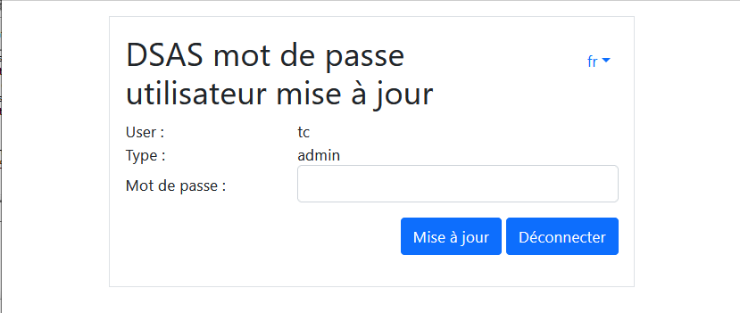
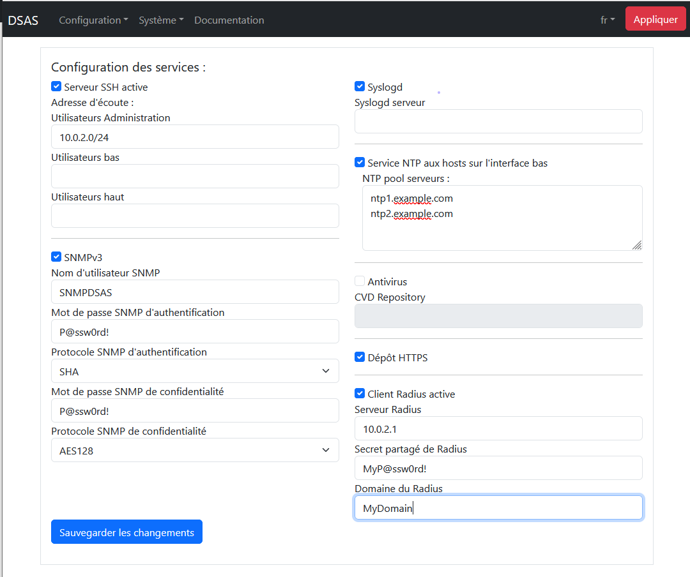
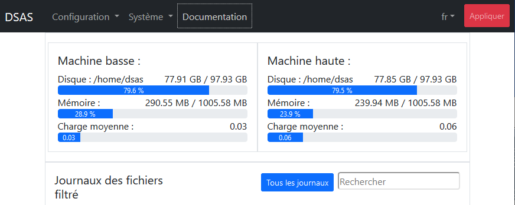
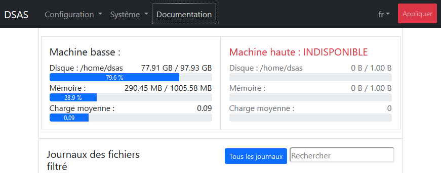
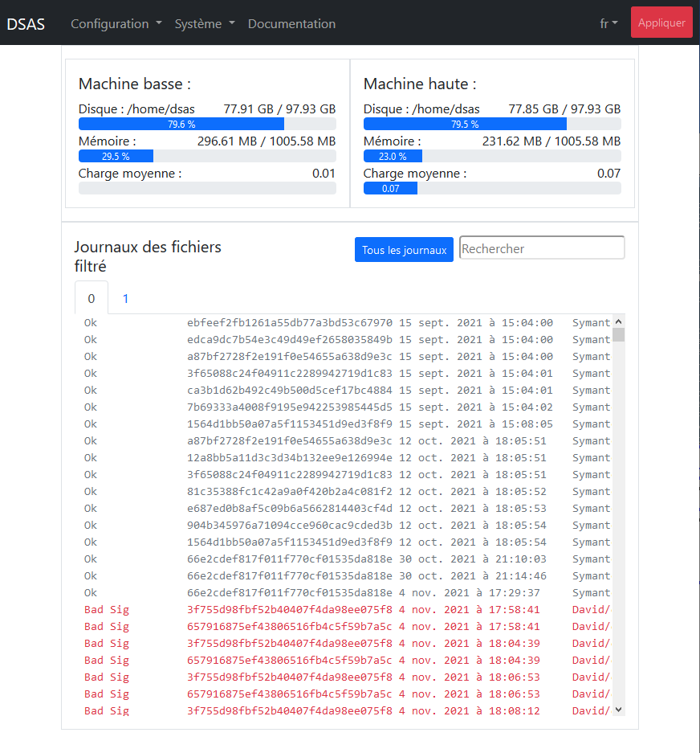
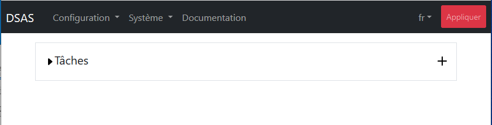
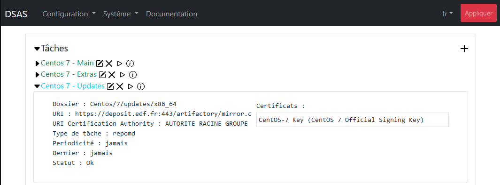

# Introduction

Le cloisonnement des infrastructures industrielles est essentiel pour
limiter les possibilités d’attaques malveillantes. Ce niveau de
cloisonnement limite fortement les capacités à automatiser la
récupération des mises à jour de sécurité (MAJ OS, signatures SEP, MAJ
logicielles) indispensables à tous systèmes sensibles. Les fichiers de
configuration ou tout autre fichier sont également difficiles à
récupérer.

Généralement des clés USB sont utilisées pour injecter des fichiers dans
les systèmes d’information.  Ce mode de transfert nécessite des
interventions humaines (chronophages) et expose le système industriel à
une contamination virale à chaque branchement. Des moyens
organisationnels pourraient être mis en place afin de contrôler les clefs
USB à chaque utilisation, mais le risque de contamination est impossible
à exclure.

Nous avons donc besoin d'un moyen technique de transfert de fichiers
d'une zone non sensible vers nos infrastructures industrielles, et de
contrôler systématiquement tout transfert afin d'exclure les risques de
malveillance. Le "Decontaminating Security Access Service" (DSAS) a pour
but de mettre en place ce moyen de transfert sécurisé.

Le DSAS a pour objectif de télécharger les mises à jour de sécurité,
contrôler leurs intégrités et de les mettre à disposition dans les
systèmes d’information. Il a également pour but la suppression de l'usage
de clefs USB sur des infrastructures industrielles, et donc inclut la
capacite de transfert des fichiers signé par des personnes habilités.
Le DSAS assure également une rupture de session protocolaire entre les différentes zones de sécurité dans un contexte de défense en profondeur.

## La principe de vérification des signatures

Le moyen principal de vérification des fichiers transmis par le DSAS est
la vérification des signatures. Chaque fichier permis de passer par le
DSAS pourrait être vérifier par une signature cryptographique. 

Le DSAS n'est pas le premier à proposer ce moyen de vérification dans un
sas de transfert de fichier et [par exemple le produit de SECLAB permets
de faire](https://www.seclab-security.com/seclab-securing-systems/).
Le problème est que ces moyens requièrent l'intervention de quelqu'un
afin de signer chaque fichier reçu avant leurs transmission. Un produit
comme Symantec End Point Manager produit approximativement 4000 fichiers
par jours à transmettre. Donc c'est illusoire à penser que quelqu'un va
contrôler chacun de ses fichiers avant de signer et les transmettre.

Le DSAS prendre une autre approche, en donnant confiance aux signatures
des fichiers fourraient par certains éditeur de logiciel, et permettant
le transfert de ces fichiers. En revanche il existe plusieurs moyens de
signature utilisé par les éditeurs de logiciels, et le DSAS est requis 
d'avoir une moyen de vérifier chaque type de signature utilisé par les
éditeurs de logiciel

### La chaine de confiance

Le problème avec une vérification de signature est de savoir et limiter à
qui on donne confiance. Pour ça la chaine de confiance de la signature
est importante à connaitre. Cette chaine de confiance pourrait être lié à
des "Autorités de certification" (ou CA) dans la cas des certificats de
type X509, soit à une confiance distribué avec des certificats eux-mêmes
qui sont signé entre eux dans la cas des certificats PGP. Dans le cas des
certificats PGP, la "toile de confiance" est implicite et il se passe
avant l'inclusion des certificats dans la DSAS. Pour les certificats
basés sur la norme X509 la chaine de confiance est inclut dans chaque
fichier signés. Par exemple le certificat utilisé pour la signature d'une
fichier est lui-même signé par un certificat intermédiaire, et ce
certificat intermédiaire est signé par l'autorité de certification. Le
DSAS permet de définir des taches de vérification limitant des fichiers
permis à passer à une chaine de confiance complète et pas seulement
vérifier vis-à-vis des autorités de certification. Malheureusement, [les
malveillantes peut acheter des certificats de signature
aussi](https://duo.com/decipher/attackers-are-signing-malware-with-valid-certificates).
est une vérification seulement avec un autorité de certification n'est
pas un garantis stricte d'absence de malveillance. Le DSAS, si
correctement configuré permets de strictement limiter les transferts à
seulement un seul éditeur de logiciel, ou même un sous-division du
éditeur de logiciel, minimisant les risques.

## Architecture

Les principes du DSAS sont les suivantes :

- Le DSAS n'est intégré dans aucun des deux domaines interconnectés, mais
est cloisonné des deux. Les connexions vers les DSAS doivent être
strictement contrôlées.
- Aucun service ou port réseau non utilisé ne doit être disponible. Les
logiciels non utilisés doivent être désinstallés.
- Le DSAS doit implémenter une rupture complète entre les deux domaines
de sensibilité. Ceci est implémenté par l'utilisation de deux machines
distinctes pour les connexions vers les deux zones de sécurité
différentes, afin que la compromission de la machine interconnectée avec
le zone non sensible ne mettra pas à risque le zone sensible.
- Plusieurs compte utilisateurs sur les machines du DSAS sont utilisés,
avec les droits d'accès distinct, afin que la compromission d'un compte,
n'expose pas entièrement les zones internes de chaque machine.
- Aucun fichier non contrôlé ne doit être visible dans la zone sensible.
Les systèmes fichiers des deux machines du DSAS doivent être distincte.
- Des vérifications doivent être faites par le DSAS avant de rendre
disponible les fichiers dans le zone sensible. Ces vérifications incluent
toujours une contrôle d'intégrité et signature, mais pourraient être
complété par une contrôles des menaces avec un moteur d'AV.
- Le maintien en condition de sécurité doit être assurer. Ceci veut dire
que l'ensemble des logiciels exposés à l'attaque doivent connus, une
veille de sécurité doit être mise en place et des moyens pour pallier les
vulnérabilités maitrisées.

Ces contraintes nous poussent vers un des principes d'architecture avec

- séparation du traitement des zones sensibles et non sensibles sur deux
machines distinctes.
- Utilisation d'une souche linux minimale avec le moins de logiciels
installés possible. Le choix d'utilisation de [Tiny Core Linux](http://tinycorelinux.net/)
a été fait car cette souche est mise à jour régulièrement et
l'installation minimale (de 12 mégaoctets) n'inclut que le noyau de
Linux, busybox et quelques scripts de démarrage. Aucun service n'est
démarré par défaut
- Des dépendances supplémentaires sont à éviter ; par exemple perl,
python, … ne sont pas installés et tout script utilisé par le DSAS est
écrit en shell.
- Chaque machine utilisée dans le DSAS possède deux interfaces réseau
distinctes, l'une d'entre elles sert à l'interconnexion entre les
machines. Une des machines possède une connexion vers les zones sensibles
et l'autre machine est connectée à la zone non sensible.
- La sens d'instanciation des flux réseau va toujours du plus sensible
vers le moins sensible, et aucun port réseau sur l'interface la plus
sensible n'est exposé de la machine la moins sensible. Ainsi seule la
machine de la zone sensible peut télécharger des flux provenant de la
zone sensible, la zone non sensible ne peut envoyer des flux vers la zone
sensible.
- L'ensemble de l'administration doit se faire à partir de la zone
sensible. Aucune administration ne peut se faire à partir de la zone non
sensible. 
- Plusieurs comptes de service sont créés avec le compte "haut" étant le
seul avec les droits de déclencher un téléchargement depuis le zone moins
sensible, le compte "verif" étant le seul avec les droit de transfert
entrée un guichet haut et bas de chaque machine, et le compte "bas" étant
le seul avec les droit d'accès au guichet bas de chaque machine depuis
le zone plus sensibles. Le compte "verif" n'est pas accessible depuis
l'extérieur de la machine.

L'architecture du DSAS simplifiée est alors


où les flèches représentent des flux réseau ou applicatifs et les
directions de ces flèches sont le sens de l'initiation de ces flux

Un utilisateur administrateur est également ajouté. Cet utilisateur ne
peut que connecté depuis le zone sensible et un filtrage forte sur les
machine avec les droits de connecter sur cette compte est implémenté.
Ceci est le seul compte avec les droits d'administration sur les deux
machines, et le compte root n'est accessible que depuis ce compte.

# Installation

Avec le DSAS séparé en deux machines, deux installations séparées sont
nécessaires. Les deux installations suivent la même logique. Dans la
discussion suivante la machine connectée au réseau non sensible est
appelée la machine "haute" et la machine connectée au réseau sensible
est appelée la machine "basse". Une configuration initiale de chaque
machine est nécessaire depuis leur console propre, mais après cette phase
initiale, toute la configuration est faite depuis la machine basse.

Afin que la configuration se passe facilement il faut démarrer avec la
configuration de la machine haute, car même en phase initiale la machine
basse doit prendre la main sur la machine haute, et elle doit être
configurée en premier afin d'être prête à accepter des ordres.

Dans les sections suivantes si ce n'est pas dit explicitement la
configuration concerne les deux machines.

## Espace disques utilisé par le DSAS 

Le DSAS a besoin de disques indépendants, un pour chacun des deux
machines utilisées dans son implémentation. Donc le DSAS a besoin de deux
fois plus de disques que le maximum utilisé pour les transferts. Le DSAS
est configuré afin de faire des "miroirs" des disques à télécharger, et
les anciens fichiers sont supprimés s'ils ne sont plus disponibles sur
leur site de téléchargement. Donc seulement l'addition des espaces
utilisés par les sites externes est nécessaire, plus un peu de marge.

Le formula pour l'espace disque nécessaire pour chaque machine du DSAS
est 

```
Espace = D1 + D2 + ... Dn + max(D1, D2, ..., Dn) + (EstDocker ? 150Moctets : 60Moctets)
```

ou `Di` est l'espace nécessaire pour le dépôt de fichier `Di`. Deux
copies d'un dépôt sont temporairement nécessaire pendant des mise à jour,
ce qui explique la besoin de `max(D1, D2, ... Dn)` de disque en plus. Le
DSAS sous Docker utilise une image non compressée, mais les autres
installations ne requiert que le copie de l'ISO.

Les mises à jour de Windows des "Patch Tuesday" sont souvent une centaine
de mégaoctets en taille, donc multiplier ça par le nombre à garder
représente potentiellement plusieurs giga-octets. Pour les mises à jour
de Symantec le besoin est de l'ordre de 150 mégaoctets pour
IntelligentUpdate mais de l'ordre de 50 giga-octets pour LiveUpdate.

Chaque repositoire de Linux pourrait avoir jusqu'à 50 giga-octets, donc
Si on transfère des mises à jour de linux notre besoin de disque peut
vite exploser. Dans Les configurations suivantes, nous avons utilisé une
taille de 50 giga-octets, mais nous recommandons au moins 500 Go pour
chaque machine du DSAS.

## Mémoire nécessaire pour le DSAS

Le DSAS a besoin un minimum absolu de 500 Mo de démarrage est de
fonctionner correctement. A cet espace minimal, il faut compter des
espaces supplémentaires dépendant sur la configuration du DSAS. Dans
l'installation sur un machine virtuel classique, le dossier `/tmp` est un
partie de la système fichier racine et stocké en mémoire. Par ce que ce
dossier est largement utilisé pour la décompression des archives à
vérifier, la taille maximale de fichier décompressé est nécessaire en
mémoire de plus. En teste, nous avons trouvé qu'un minima de __1Go__ est
nécessaire sur les deux machines du DSAS.

Si le DSAS est configuré afin d'utiliser l'antivirus, le daemon de
l'antivirus va utiliser de la mémoire supplémentaire. L'antivirus n'est
qu'utiliser sur la machine `basse` et nous avons trouvé qu'un minima de
__3Go__ sont nécessaire.

L'utilisation de Docker pourrait légèrement modifier ces calculs, mais
l'image Docker va partager la mémoire de l'hôte à un valeur semblant à
ci-dessus sera nécessaire.

## Configuration des machines virtuelles

Le DSAS est fourni sous forme d'une ISO à utiliser en "live CD". Ceci
veut dire que le système exploitation doit démarrer toujours sur ce
disque ISO. Le grand avantage de cela est que les mises à jour du DSAS
vont être très simples en exploitation et se résument par l'arrêt du
DSAS, le remplacement de l'ISO et le redémarrage.

L'installation de trois types de machine virtuel est discuté ci-dessous,
avec VirtualBox, avec VMWare and avec Docker.

### Installation sous VirtualBox

#### Création des machines virtuelles

L'ISO du DSAS est une souche linux en 32- ou 64-bits, et la machine virtuelle
est à configurer en conséquence. Par exemple, sous VirtualBox la
configuration initiale devrait être


un minimum de 256 mégaoctets est nécessaire afin de démarrer le DSAS.
Mais en fonctionnement le DSAS pourrait utiliser plus de ressources. Sans
l'antivirus, nous recommandons l'utilisation de 1 gigaoctet de mémoire,
mais avec l'antivirus d'au moins 2 giga-octets de mémoire est nécessaire,
mais nous recommandons 3 giga-octets.

Le DSAS n'a pas besoin d'un format spécifique de disque. Nous avons
choisi ici d'utiliser le format par défaut proposé par VirtualBox.


Après il faut configurer le disque de démarrage du DSAS en mettant le
disque ISO du DSAS en maître primaire IDE


Si le disque de démarrage est mal configuré, le DSAS ne pourrait pas
démarrer. 

#### Interconnexion réseau entre les machines du DSAS

Les machines virtuelles sont à configurer avec deux cartes réseaux. La
première carte réseau est toujours utilisée pour les connexions vers les
réseaux externes du DSAS et leur configuration dépendent de
l'environnement où est installé le DSAS. 

La deuxième carte réseau est toujours utilisée pour l'interconnexion
entre les deux machines du DSAS, et ce réseau est un réseau statique par
défaut en "192.168.192.0/24". Plusieurs moyens pourraient être mis en
place pour la configuration du réseau d'interconnexion, notamment si un
pare-feu supplémentaire est à placer sur ce lien (ceci ne semble
néanmoins pas vraiment nécessaire). Nous conseillons l'usage un réseau
interne à l'hyperviseur configuré en VirtualBox comme


### Installation sous VMWare

La configuration sous VMWare est très semblant à la configuration sous
VirtualBox. Comme vue ci-dessous, la machine virtuelle est configuré avec

- Un disque de taille voulu - Ici 150 Go ont été utilisé
- Un lecteur de CD - Comme discuté ci-dessous.
- Deux carte réseaux - La première carte est configuré pour les
connexions vers les réseaux externes du DSAS et leur configuration dépendent de l'environnement où est installé le DSAS. La deuxième carte
est toujours utilisé pour les interconnexion entre les deux machines.


L'image ISO pourrait être modifié en cliquant sur le lecteur,
téléchargeant une nouvelle image, la sélectionnant et sauvegardant les
modifications.


### Installation sous Docker

L'image docker est fourni dans un fichier `docker.tgz`. Ce fichier
devrait être décompressé avec la commande

```
tar xvzf docker.tgz
```

Ceci va créer un dossier `docker` contenant trois fichiers

- rootfs64.tar.gz - Ce fichier contient tous les fichiers nécessaires
pour la création du système racine du DSAS dans Docker
- Dockerfile - Ce fichier contient des instructions pour la conversion du
Ficher `rootfs64.tar.gz` vers un image Docker.
- Makefile - Ce fichier contient nombreuse cible permettant la
simplification de l'installation de l'image Docker du DSAS.

La configuration réseau dans le fichier `Makefile` est à adapter avant
l'usage. Le DSAS doit également configurer le réseau (voir le section
 Docker à la fin du document), et la configuration réseau de Docker
doit-être identique à la configuration dans le DSAS.

#### Configuration réseau principal du Docker

La configuration du réseau principal du DSAS dans le Docker est toujours
configuré comme un `bridge` dans le fichier `Makefile`. Ceci veut dire
que si l'administration du DSAS doit-être visible sur une machine
distante, le hôte doit-être configuré afin de router ces connexions. Si
un type de réseau diffèrent est nécessaire à l'utilisateur de créer un
image Docker approprié sans utilisation du `Makefile`.

Trois variables sont à configurer pour le réseau principal

- NET0 - Le réseau en format CIDR. Par défaut le `Makefile` est configuré
avec la machine basse avec le réseau `192.168.0.0/24` and the machine
haut avec le réseau `192.168.1.0/24`. Ces réseaux sont à adapter comme
besoin.
- GW0 - Ceci est l'adresse de la passerelle du réseau, et il doit-être un
adresse valable dans le réseau
- IP_ETH0 - Ceci est l'adresse des machines basse et haute
respectivement.

#### Configuration du réseau d'interconnexion du Docker

Le réseau d'interconnexion pourrait être virtuel ou physique dépendant
sur la configuration. Il y a 4 variables afin de configurer pour le
réseau d'interconnexion

- ETH1 - Si le réseau est physique ceci doit être un nomme d'interface
valable sur la machine d'hôte. Ce réseau sera configuré comme un
`macvlan` sous Linux sur l'interface physique.
- NET1 - Le réseau en format CIDR. Par défaut les deux machines du DSAS
sont considérés comme sur le même LAN et du coup ce réseau est identique
sur les deux machines. Il est possible de mettre un pare-feu entre les
deux machines du DSAS et dans ce cas les réseau seraient différents. Le
réseau par défaut est `192.168.192.0/24`.
- GW1 - Si les deux machines sont sur le même réseau, la passerelle
pourrait être vide ou pas défini. Sinon il doit être configuré avec
l'adresse permettant la routage de paquets entre les deux machines
- IP_ETH1 - L'adresse IP spécifique des deux machines. Par défaut
l'adresse de la machine haut est `192.168.192.2` et la machine basse est
`192.168.192.1`.

#### Installation sous Docker

L'installation sous Docker doit-être fait individuellement sur les deux
machines du DSAS et elle compris deux étapes. La première étape est sur
la machine haute comme 

```
make install CONTAINER=haut
```

Cette étape démarrera le process d'installation [comme détaillé dans la
section suivante](#premier-phase-dinitialisation). A la fin de cette
étape, le conteneur Docker sera installé et configuré. Avant de continuer
avec l'installation sur la machine basse, la machine haute doit-être
démarré. Ceci est fait via la Makefile avec la commande 

```
make start CONTAINER=haut
```

ou directement via Docker avec la commande

```
docker container start haut
```

A ce point la machine basse pourrait être configuré, démarrant avec la
commande

```
make install CONTAINER=bas
```

Et après, d'avoir [configuré la machine basse avec instructions dans le
chapitre suivante], elle pourrait être démarré avec la commande

```
make start CONTAINER=bas
```

ou directement via Docker avec la commande

```
docker container start bas
```

## Premier phase d'initialisation

Nous sommes maintenant prêts a démarrer la machine pour la première fois.

Cette étape démarre ainsi une initialisation qui se fait en deux phases :
la première à l'aide de la console Linux, et la deuxième à partir de
l'interface d'administration en https.

Cette phase est faite depuis les consoles des machines, car avant la
Première configuration il n'y a aucun garanti que les machines soit
visible depuis l'extérieur. Il faut faire un minimum de geste sur la
console afin de démarrer la configuration réseau avant de continuer dans
une deuxième phase depuis l'interface d'administration du DSAS.

### Formatage des disques

Au premier démarrage le DSAS nous demande de formatter son disque. Un
menu est présenté avec l'ensemble des disques trouvés connectés au DSAS.
Ceci se présente comme


La navigation dans ce type de menu est faite avec les clefs suivantes

- les flèches - déplacement du curseur
- Espace - sélection d'une option
- Entrée - Continuer

Utiliser `Espace` afin de sélectionner le disque, ici `/dev/sda`, et
`Entrée` afin de démarrer le formatage du disque. Après le formatage, la
machine redémarrera automatiquement avant de continuer

### Sélection du type de machine

La prochaine étape consiste à sélectionner si la machine du DSAS va être
configurée en machine haute ou basse. Le menu 


est utilisé afin de présenter la sélection du type de machine. Si la
machine a été configurée avec seulement une carte réseau à ce point le
DSAS va arrêter sa configuration avec l'erreur


Dans ce cas arrêter la machine et ajouter une carte réseau dans
l'hyperviseur.

### Configuration réseau d'interconnexion

La configuration du réseau d'interconnexion ne devrait changer très
rarement, et sa configuration n'est que accessible pendant ce premier
phase de configuration. La configuration du réseau d'interconnexion
dépend sur l'environnement dans lequel le DSAS est installé. Il y a deux
scenarios typiques pour la configuration du réseau d'interconnexion

1. Les deux machines sont sur la même LAN. Dans ce cas, les machines
Haute et basse devraient être configurés avec des adresses IP sur la
même LAN et la passerelle pour les deux machines seraient ignoré
2. Les deux machines sont sur des LAN différentes, afin de permettre la
placement d'un pare-feu entre eux. Dans ce cas, les adresses IP des deux
machines sont indépendant et les passerelle pour les deux machines
devraient un adresse IP valide sur la même LAN.

Les deux machines doivent connaitre le réseau d'interconnexion des deux
machines et alors cette étape est à faire sur les deux machines et doit
être __identique__. Si la configuration est incorrecte, la machine basse
ne pourrait pas communiquer avec la machine haute. Une ou les deux
machines devraient être [reconfigurer comme discuté 
ci-dessous](#en-cas-derreur-dinitialisation-du-dsas).

Il y a 4 étapes dans la configuration du réseau d'interconnexion.
Premièrement il faut configurer l'adresse IP de la machine haute en
format CIDR comme


L'adresse IP est adresse de la machine haute et la masque est en format
CIDR et doit-être entre 24 et 30. Par défaut l'adresse ici est
"192.168.192.2/24".

Après, la passerelle du réseau d'interconnexion haut est a configurer. Si
les deux machines sont sur la même LAN, la passerelle pourrait être
laisser vide. C'est configuré comme


Le réseau bas est configuré de manière identique comme


Ici les deux machines sont sur la même LAN avec la machine basse prenant
l'adresse "192.168.192.1/24". Les adresses utilisées pour les réseaux
d'interconnexion ne devrait pas être utilisé ailleurs.

### Configuration du réseau initial

La configuration réseau de la machine haute est faite via l'interface
d'administration de la machine basse. Par conséquence cette section ne
concerne que la machine basse. En revanche si le réseau n'est pas au
moins partiellement configuré sur la machine basse, l'interface
d'administration pourrait ne pas être disponible. Par conséquent une
configuration initiale du réseau de la machine basse est faite à partir
de la console de la machine.

La première étape consiste à choisir si le réseau est statique ou s'il
utilise DHCP pour sa configuration. Le menu suivant est utilisé afin de
confirmer ce choix


A ce point si le DHCP a été choisi aucune autre configuration réseau
n'est nécessaire et vous pouvez passer au section suivante.

Pour la configuration en IP statique il faut rentrer l'adresse et le
"netmask" en format CIDR. Dans le format CIDR le "netmask" en IPv4 est
représenté par un entier compris entre 0 et 32 représentant le nombre de
bits utilisés pour coder la partie NetId.

Par exemple le "netmask" "255.255.255.0" est représenté en format CIDR
par "/24" et le "netmask" "255.255.255.128" par "/25". Donc si notre IP
est "10.0.2.15" et notre "netmask" est "255.255.255.0" il est rentré
comme


dans l'interface de configuration au démarrage. La syntaxe de l'adresse
IP rentrée est validée avant de continuer. Si elle n'est pas dans un
format acceptable le même menu vous sera représenté en boucle.

Si la machine d'administration n'est pas sur le même sous-réseau que le
DSAS il faut configurer une passerelle par défaut. Sinon laisser vide
afin d'empêcher toute connexion au DSAS depuis l'extérieur du
sous-réseau.


Deux éléments sont nécessaires pour la configuration du DNS. Premièrement
le domaine de recherche. Ici un domaine de recherche "example.com" est
utilisé


avec ce domaine de recherche les hosts "ntp1" et "ntp1.example.com" 
seront équivalents. Après il faut définir des serveurs de noms,
responsables pour la conversion des adresses DNS en IP. Par exemple 


Plusieurs adresses IP séparées par des espaces pourraient être rentrés,
donnant une liste de serveurs de noms en ordre de leur préférence
d'usage.

### Configuration SSH

La machine haute n'a pas besoin de configuration SSH en phase initiale.
La configuration du SSH requiert la création de clefs SSH pour deux
utilisateurs du DSAS;

- l'utilisateur __tc__ en tant que compte à privilèges permettant de
travailler en shell avec les deux machines, et 
- l'utilisateur __haut__ permettant l'interconnexion en sftp avec
l'utilisateur bas de la machine haute.

La création des clefs est automatique, mais il faut transférer les clefs
autorisées sur la machine haute. Si la machine haute n'est pas visible de
la machine basse elle va attendre avec le message


La raison principale afin de voir cet écran pourrait être que la machine
haute n'est pas démarrée. Mais l'interconnexion réseau entre les deux
machines pourrait également être à revoir.

Dans la phase initiale, il n'y a aucune clef SSH pour les SSH sans mot de
passe. Donc il faut entrer le mot de passe utilisateur à privilège __tc__
dans la fenêtre.


Par défaut le mot de passe du DSAS est __dSa02021DSAS__ mais à la
première utilisation de l'interface d'administration vous serez forcé de
changer ce mot de passe.

Ceci est la dernière étape de la configuration initiale sur la console.
La deuxième phase de la configuration initiale devrait être faite avec
l'interface d'administration.

### En cas d'erreur d'initialisation du DSAS

L'erreur est humaine, et le DSAS propose des moyens de récupérer des
erreurs faites lors de l'initialisation. Si la phase initiale de
l'installation (utilisant la console) n'est terminée, aucune
configuration ne sera sauvegardée. Un simple redémarrage de la machine va
permettre de reconfigurer à partir de zéro. 

Si malheureusement vous avez terminé l'installation mais qu'elle n'est
pas correcte et que l'interface d'administration n'est pas accessible,
tout n'est pas perdu. Cependant comme le DSAS est configuré pour démarrer
sans aucune interaction humaine après sa première configuration, il vous
faudra vous connecter à partir l'interface console pour pouvoir accéder
de nouveau au menu de configuration.

L'utilisateur à utiliser sur la console est 'tc' et le mot de passe à
utiliser, si vous ne l'avez pas déjà modifié avec l'interface
d'administration est comme plus haut. Un console linux classique avec un
minimum de fonctionnalités disponibles vous sera présenté. 

La commande nécessaire avec de reconfigurer le DSAS est

```shell
$ sudo /etc/init.d/services/dsas reconfig 
```

Le menu de configuration vous sera alors présenté. A la fin de la
configuration n'oubliez pas de vous déconnecter à l'aide de la commande

```shell
$ exit
```

## Première connexion à l'interface d'administration

L'adresse de connexion à l'interface d'administration du DSAS va dépendre
de votre installation mais sans NAT entre vous et le DSAS, l'adresse IP
sera celle entrée précédemment. En revanche le port d'administration du
DSAS est toujours le __port 5000__. Donc si votre IP est 10.0.15.2 
comme utilisé dans l'exemple ci-dessus vous devrez vous connecter à
https://10.0.2.15:5000 pour l'interface d'administration du DSAS.

L'interface d'administration est en HTML5 avec des fonctions récentes de
javascript. Donc un navigateur récent (après 2016) sera nécessaire afin
d'utiliser l'interface. Si vous n'arrivez pas à vous connecter, c'est
soit qu'il y a un problème de routage entre vous et le DSAS et il faut 
revoir les  configurations des routeurs entre vous et le DSAS, soit que
la configuration du réseau du DSAS précèdent est fausse. Dans ce cas il
faut référer à la section [En cas d'erreur d'initialisation du 
DSAS](#en-cas-derreur-dinitialisation-du-dsas). 

Le certificat SSL utilisé par le DSAS en phase initiale est auto-signé et
il sera nécessaire d'accepter son usage dans votre navigateur. Si vous
avez réussi à vous connecter à l'interface d'administration du DSAS
l'écran de connexion suivant vous sera présenté :


L'utilisateur privilégié sur le DSAS est l'utilisateur __tc__, et le mot
de passe par défaut est le __dSaO2021DSAS__. Il y a un délai de 3
secondes entre chaque tentative de connexion échoué et le compte sera
bloqué pendant 10 minutes en cas de 3 tentatives échoués consécutif.
A ce point connectez-vous sur l'interface d'administration.

### Les basics de l'interface d'administration

#### Le bouton `Appliquer`

En haut des pages de l'interface d'administration vous trouvez un bouton
`Appliquer` souligné en rouge. Ce bouton est très important. Aucune
modification faite via l'interface d'administration ne sera permanente et
aucune, sauf les changements de mot de passe, ne sera appliquée tant que
le bouton n'est pas utilisé. Ce bouton effectue une sauvegarde permanente
des changements effectués et les applique. De cette façon les erreurs
majeures peuvent être facilement supprimées avec un simple redémarrage
tant qu'elles ne sont pas appliqués. 

#### Arrêter et Redémarrer

Le DSAS peut être arrêté et redémarré sans crainte car l'ensemble du code
exécutable est sur l'image ISO du DSAS. Les taches du DSAS en cours
seront interrompues, mais seront reprises au redémarrage. Les fonctions
d'arrêt et redémarrage sont disponibles dans le menu `Système` du
DSAS, comme


Avec Docker ces commandes seraient ignorées

#### Sauvegarde et Restauration

La configuration actuellement appliqué du DSAS peut être sauvegardée en
utilisant le bouton dans la menu ci-dessus. En sélectionnant vous seriez
demandé d'entrée un mot de passe pour la sauvegarde, comme


Les sauvegardes des deux machines du DSAS sont alors chiffré acec
`openssl` utilisant le mode AES256 CBC et ce mot de passe et archivé ensemble.
Si vous ne rentrée pas de mot de passe de sauvegarde, les fichiers sera 
archivés sans l'étape de chiffrement.

Il est fortement conseillé de chiffrer ces archives, parce qu'il contient
la configuration complète du DSAS, les certificats SSL et les éléments
secrets SSH. Le mot de passe n'a pas besoin être le même mot de passe que
le DSAS. Les mots de passes des utilisateurs ne seraient pas restaurés.

En cas de restauration le même mot de passe sera demandé, et donc garder
le précieusement. En cas de restauration la configuration sera appliquée
immédiatement. Ceci pourrait empêcher l'accès au DSAS, particulièrement
si la configuration réseau n'est plus à jour. Dans ce cas référer à la
section [En cas d'erreur d'initialisation du DSAS](#en-cas-derreur-dinitialisation-du-dsas).

#### Déconnexion automatique

Le DSAS est configuré afin de vérifier les droits de connexion à chaque
opération, si plus de 10 minutes séparent une opération de la suivante,
vous serez automatiquement déconnecté avec la message suivant :


En cliquant `Ok` sur ce message vous serez redirigé vers l'écran de
connexion du DSAS.

### Changement initiale des mots de passe

Si ceci est votre première connexion au DSAS, il faut connecter avec
l'utilisateur 'tc', un message d'erreur sera affiché et après, l'écran
suivant vous sera présenté :



A votre première connexion, le mot de passe du compte 'tc' doit-être
changé. Les limitations imposées sur les mots de passe sont 

- ils ont au moins 8 caractères de long (12 recommandés)
- ils ne contiennent pas d'espaces ni de tabulations
- Ils contiennent au moins 3 types de caractères (majuscule, minuscule,
nombre, caractère spécial)

Rentrez vos nouveaux mots de passe et cliquez sur `Mise à jour`. Vous
pouvez maintenant cliquer sur `Déconnecter` et en reconnectant vous
auriez accès à l'interface d'administration.
 
### Configuration des utilisateurs

L'écran de configuration des utilisateurs est accédé depuis l'onglet
`Configuration` et l'option `Utilisateurs`. L'écran de configuration se
présente comme


A la première utilisation, seulement l'utilisateur par défaut `tc` est
configuré. Il est recommandé de créer des comptes nominatifs pour chaque
utilisateur et de désactiver le compte `tc`. L'utilisateur `tc` est le
seul avec le droit de devenir `root` sur la DSAS. Si le compte `tc` est
désactivé les autres utilisateurs pourrait que devenir `root` avec la
connaissance de la mot de passe de l'utilisateur `tc`. Un utilisateur
désactivé ne pourrait que connecté depuis la console du DSAS, et pas à
distance.

Un nouveau compte est créer en cliquant sur la bouton  à
droit de l'écran. Vous seriez demandé de rentrer le nom de l'utilisateur comme


Les noms d'utilisateurs de devraient être des noms valable POSIX.  Ceci
veut dire que

- Ils doivent commencer avec une minuscule or souligne
- Ils doivent inclure que des minuscules, chiffres, soulignes ou moins
- Ils peuvent terminer avec un dollar
- Ne doivent pas être plus longue que 32 caractères

Ici nous avons ajouté l'utilisateur `ua12345`


Pour chaque utilisateur nous pourrions faite plusieurs modifications ou
actions

- __Description__ - De l'information libre pourrait être ajouté sur
l'utilisateur
- __Type__ - Trois type d'utilisateur sont possible
  * __administrateur__ - Un utilisateur administrateur du DSAS. Il a tous
les privilèges sur le DSAS, si `ssh` est actif pour il peut se connecter
avec une interface `ssh` afin de faire de la maintenance avancée sur la
DSAS. 
  * __bas__ - Cet utilisateur n'a qu'un seul rôle. Si le DSAS est
configuré avec `ssh` pour l'utilisateur __bas__ il aura le droit de se
connecter en `sftp` et seulement en `sftp` depuis la zone sensible. Ceci
pourrait être utile pour la récupération des fichiers transmis par le
DSAS dans certains scenarios. Ne seront présentés à cet utilisateur que
des fichiers vérifiés  par le DSAS et un
[chroot](https://fr.m.wikipedia.org/wiki/Chroot) est utilisé afin
d'empêcher l'utilisateur de voir autre chose.
  * __haut__ - Cet utilisateur comme l'utilisateur __bas__ est utilisé
pour une connexion en `sftp` depuis la zone non sensible afin de
permettre la dépôt de fichiers directement sur le DSAS. Il est également
cloisonné et ne peut voir qu'une zone de dépôt de fichiers. L'utilisation
de cette fonctionnalité est fortement déconseillés__ car elle ouvre la
possibilité d'attaques contre le DSAS
- __Active__ - Un compte pourrait existe mais ne pas être fonctionnel.
Ceci permettre de temporairement désactiver un compte sans le supprimer
-  - En cliquant sur cette icone nous pourrions modifier le
mot de passe de l'utilisateur locale. Ce mot de passe n'est que utilisé
si le client radius est désactivé ou le serveur radius ne réponds pas.
-  - En cliquant sur cette icone, l'utilisateur pourrait
être supprimé définitivement.

Les modifications fait ne sera pas prise en compte tant que l'utilisateur
n'a pas appuyé sur la bouton `Sauvegarder les changements`. Un exemple de
configuration des utilisateurs pourraient ressembler à 


L'ordre des utilisateurs pourait facilement être modifié en bouggant
l'utilisateur avec le souris à l'endroit desiré. A ce point il est
recommandé d'appuyer sur le bouton `Appliquer` afin de rendre ces
modifications permanentes. Sinon au prochain redémarrage les anciens mots
de passe seront demandés.

### Configuration des réseaux

L'écran de configuration du réseau est accédé depuis le menu
`Configuration` du DSAS, et l'option `réseau`. En cliquant dessus l'écran
suivant vous sera présenté 


Le configuration réseau du DSAS est séparé en deux parties. Le réseau
connecté vers le réseau sensible dénommé __bas__ et le réseau vers le
réseau non sensible dénommé __haut__.  Chacun de ces deux configurations
pourraient être accédés en cliquant sur la flèche située à côté du type
de réseau, comme


La configuration du réseau __bas__, précédemment entré est visible dans
ce menu. Vérifier les configurations, modifier si nécessaire et appuyer
sur `Sauvegarder des changements`.

Une synthèse des formats des entrées sur cette pages sont

- Si l'option DHCP est sélectionnée les autres champs pour la
configuration réseau sont ignorés sur cette interface.
- Les adresses IP, sont au format IPv4 comme NNN.NNN.NNN.NNN
- Si un "netmask" est nécessaire il est rentré au format CIDR. Dans le
format CIDR le "netmask" est représenté par un entier compris entre 0 et
32, représentant la taille du NetId. Par exemple le "netmask"
"255.255.255.0" est représenté en format CIDR par "/24" et le "netmask"
"255.255.255.128" par "/25".
- Le "DNS Domain" doit être un nom de domaine valable.
- Plusieurs adresses IP séparées par des retours chariot peuvent être
rentrées, donnant une liste de serveurs de noms en ordre de leur
préférence d'usage.

Afin d'éviter que le réseau d'interconnexion entre les machines haute et
basse soit interrompu, sa configuration n'est pas disponible via la page
web d'administration. Si le réseau d'interconnexion doit-être modifier,
il faut suivre la section [En cas d'erreur d'initialisation du 
DSAS](#en-cas-derreur-dinitialisation-du-dsas).

### Renouvellement du certificat web

Comme [discuté ci-dessus](#première-connexion-à-linterface-dadministration),
le certificat SSL utilisé par le DSAS par défaut est auto-signé. Ceci est
également un élément secret à remplacer à la mise en service. L'interface
d'administration du serveur web est dans le sous-menu `Web` de l'onglet
`Configuration` et se présente comme


L'onglet de renouvellement est accédé en cliquant sur la flèche à gauche
de `Renouvellement du certificat, et se présente comme


Les champs à remplir pour le renouvellement sont des champs définis par
la norme [RFC5280](https://datatracker.ietf.org/doc/html/rfc5280.html).

- __C__ - Ce champ est le pays de l'organisation responsable du serveur.
Il est obligatoire codé sur deux lettres comme défini dans le RFC5280. Le
code pour la France est __FR__.
- __O__ - L'organisation responsable pour le serveur. En France, il est
obligatoirement le nom du société enregistré avec INSEE et doit être tout
en majuscule.
- __OU__ - Un identifiant of le sous organisation responsable pour le
serveur. Les certificats signés en France doivent inclure les KBIS, par
exemple ici '0002 552081317' est un KBIS valable.
- __CN__ - Pour un serveur, comme le DSAS ceci est obligatoirement le nom
DNS du serveur
- __S__ - Un champ libre pour la région du siège social de L'entreprise.
Il est optionnel
- __L__ - Un champ libre pour la ville du siège social de L'entreprise.
Il est optionnel

Vous pouvez maintenant cliquer sur le bouton `Renouvellement certificat`
et un certificat sera généré. En revanche il ne sera pas utilisé par le
serveur jusqu'au prochaine fois que vous avez cliqué sur `Appliquer`. Le
certificat publique et Requête de signature (CSR) pourrait être
téléchargé en cliquant sur le bouton .

## Configuration des services

Autre que le service web d'administration et service web de repositoire,
il y a 7 services qui pourrait être démarrer sur les machines du DSAS;

- Un serveur OpenSSH pour les connexions depuis l'extérieur,
- Un dépôt HTTPS pour la distribution des fichiers vérifié par le DSAS,
- Un client ntpd pour la mise à l'heure des machines,
- Un client syslogd pour les logs d'administration locale et distante,
- Un serveur SNMPD pour la remonté du statut du DSAS, et 
- Un serveur de vérification antivirale
- Un client Radius 



### Configuration de la service OpenSSH

En plus que le serveur openssh sur la machine haut utilisé pour les
communications interne entre les deux machine du DSAS, l'administrateur
du DSAS peut choisir d'ouvrir d'autre service de SSH depuis le zone
sensible et/ou non-sensible.

Le serveur OpenSSH n'est jamais démarrer avec des accès ouverts à tous
les utilisateurs sur le DSAS. Il faut explicitement donner l'accès à
chaque utilisateur, et cet accès n'est valable que depuis certain zones
de sécurité. Par exemple, ci-dessus le service OpenSSH est coché et 
les utilisateurs administration  peut connecté que depuis des adresses IP dans le sous-réseau "10.0.2.0/24". Les utilisateurs de type bas et haut
n'ont aucun droit d'accès.

Les adresses d'écoute pour chaque utilisateur peuvent être très complexe
avec plusieurs adresses possible séparées par des virgules. Un exemple
complexe pourrait-être

```
10.0.2.1,10.0.2.128/25,!10.0.2.129
```

ou l'adresse 10.0.2.1 et le sous réseau 10.0.2.128/25 pourraient accéder
au DSAS, mais l'adresse 10.0.2.129 est interdit de faire. Par défaut
aucun accès est donné, et si l’adresse d'écoute pour un utilisateur est
blanc, le serveur OpenSSH n'est même pas démarrer sur l'interface 
réseau du DSAS concerné.

Chaque utilisateur ne peut que connecter depuis certaines zones de
sécurité :

- __Administration__ - Les utilisateurs de type __Administrateur__ ne
peut que connecter depuis la zone sensible et peut connecter en ssh, scp
et sftp
- __bas__ - Les utilisateurs de type bas ne peut que connecter en sftp
depuis la zone sensible. Cette fonctionnalité de sftp pourrait être
utilisé pour remplacer le serveur http de dépôt (ou en complément). Il
n'a que accès à la zone du DSAS avec les fichiers vérifiés et ne peut pas
accéder ailleurs dans le DSAS.
- __haut__ - __Utilisation d'un compte de type haut en SSH en fortement
déconseillé__. La raison qu'il est déconseillé est qu'il ne respecte pas
le sens de l'ouverture des flux de la zone plus sensible vers la zone
moins sensible. Mais en absence d'autre moyen de téléchargement ce compte
ouvre la possibilité depuis la zone non sensible à déposer des fichiers
sur la machine haute du DSAS. Les utilisateurs de type __haut__ n'a
accès que en sftp et que à la zone du DSAS avec les fichiers non
vérifiés.

Si le service SSH est activé vers une zone le port 22 est ouverte sur la
machine du DSAS concernée.

### Dépôt HTTPS

Le DSAS peut publier l'ensemble des fichiers vérifié de manière lecture
seul en sélectionnant l'option `Dépôt HTTPS`. Si l'adresse IP du DSAS sur
le réseau bas est `10.0.2.15` par exemple, le dépôt sera disponible sur
`https://10.0.2.15`.

### Serveur SNMP

Un serveur SNMP pourrait être activé sur le DSAS. Ce service n'est
disponible que en SNMPv3 avec chiffrement et authentification. En
sélectionnant l'option `SNMPv3` le service sera activé. Après il
faut sélectionner des protocoles d'authentification et confidentialité,
avoir un `Nom d'utilisateur SNMP`, des `Mot de passe SNMP` valables.

L'ensemble des données SNMP de la machine bas sera publié SNMP. Les
données spécifique au DSAS sont disponible sur les OID

- 1.3.6.1.4.1.16845.100.100.1.0     - Statut de la machine haute. `0` si la machine est disponible
- 1.3.6.1.4.1.16845.100.100.2.0     - Statut des tâches du DSAS. `0` si l'ensemble des tâches sont ok.
- 1.3.6.1.4.1.16845.100.100.3.1.1.1 - Indice de la tâche 1.
- 1.3.6.1.4.1.16845.100.100.3.1.1.N - Indice de la tâche N.
- 1.3.6.1.4.1.16845.100.100.3.1.2.1 - Nom de la tâche 1.
- 1.3.6.1.4.1.16845.100.100.3.1.2.N - Nom de la tâche N.
- 1.3.6.1.4.1.16845.100.100.3.1.3.1 - ID de la tâche 1.
- 1.3.6.1.4.1.16845.100.100.3.1.4.N - ID de la tâche N.
- 1.3.6.1.4.1.16845.100.100.3.1.4.1 - Statut de la tâche 1.
- 1.3.6.1.4.1.16845.100.100.3.1.4.N - Statut de la tâche N.

Un [fichier MIB avec ces OID est disponible pour téléchargement](DSAS-MIB.txt).

### Client syslogd

Si le service `syslogd` du DSAS est activé, des logs des services sont
fait localement au DSAS.Il est également possible à définir un serveur
distant pour le service rsyslogd pour des logs en UDP sur la port 514. 

A noter que le service syslogd est fourni par BusyBox, et
l'implémentation de syslogd de BusyBox n'inclut pas la possibilité de
chiffrement en TLS sur la port 6514. Donc d'autre moyen de sécurisation
de ces flux sont à mettre en place.

L'utilisation de la service syslogd n'ouvre pas un port sur le DSAS, mais
seulement un flux vers une serveur distante.

### Client ntpd

Le DSAS inclut la possibilité de synchroniser via le protocole ntp. Un ou
plusieurs hôtes ntp pourraient être configuré. Les adresses des hôtes ntp
pourraient être des adresses IP ou des nom de hôte comme fournit par le
DNS. Dans le deuxième cas le DNS doit-être configuré comme discuté dans
la section [Configuration des réseaux](configuration-des-réseaux).

Utilisation de ntp n'ouvre pas un port sur le DSAS mais seulement des
flux vers des serveurs distantes

### Serveur antivirale

Le DSAS inclut un serveur d'antivirus basé sur le produit `ClamAV`. Si
l'option `Antivirus` est active, le serveur `clamd` sera demarré, et les
tests de vérification du DSAS inclura des tests antivirale.

En revanche ces tests dépendent sur des signatures virales qui devrait
être à jour. Des fichiers `main.cvd`, `daily.cvd` et `bytecode.cvd`
doivent être téléchargé sur la DSAS. Ces fichiers sont disponibles sur
les URL

```
https://database.clamav.net/main.cvd
https://database.clamav.net/daily.cvd
https://database.clamav.net/bytecode.cvd
```

et dans ce cas, la configuration du URI du DSAS pourrait être
`https://database.clamav.net/` mais un site de réplication locale est
préférable. Le DSAS mettra à jour ces signatures un fois par jour.

### Client Radius

Le DSAS inclut la possibilité d'utiliser un serveur radius pour 
l'authentication des mots de passe des utilisateurs. Les comptes des
utilisateurs sur le DSAS doit avoir les mêmes nom que le serveur Radius
et seulement le rôle de validation des mots de passe est délugué au
serveur. Les comptes eux-mêmes reste local au DSAS. Si, et seulement si,
le serveur Radius n'est pas disponsible, les mots de passe locaux seraient
utilisés.

Le client Radius du DSAS ne peut que utiliser PAP. Même si PAP est chiffré,
il souffre de deux problemes

- A la base il fonctionne sur la hash MD5, donc le secret partagé doi-être
le plus long possible (32 caracteres recommandé)
- Le "nonce" est selectionné par le client, et donc une cpature de la paquet
RADIUS_REQUEST de la client et sa rejoue pourrait permettre un authetification
sans mot de passe. Ceci veut dire que la connexion réseau entre le client et
serveur doit-être physiquement sécurisé.

# Exploitation du DSAS

## Statut des machines

La page de statut des fichier vérifiés et les machines et la page d'entrée dans
la DSAS et la page principale. Elle est accédée en cliquant sur `DSAS` dans
le menu en tête des pages et se présente comme



La page est divisée en deux sections ; en haut la statut des machines du
DSAS en en bas le statut des taches du DSAS. Trois statistiques sont
donnés pour les deux machines du DSAS.

- __L'usage disque__ - L'occupation total des disques de DSAS sont
montrés. Si les disques sont plein ça sera impossible de correctement
télécharger et vérifier des fichiers. Donc il faut surveiller
périodiquement l'état des disques. Logiquement si les taches n'ont pas
changés, l'usage des disques ne devraient pas changer non plus, mais si
une des taches soudainement augmente son usage des disques ça sera facile
à retrouver en manque. Un disque occupé à plus de 80 ou 90% présente un
risque de débordement.
- __L'usage de la mémoire__ - Chaque tache sur le DSAS occupe de la
mémoire de la machine. Si le mémoire est rempli, la performance des
taches sera impactée. Il faut surveiller que la mémoire n'est jamais trop
utilisé, mais tant qu'il en dessous de 90% il ne faut trop s'en occupé.
Avec l'architecture du DSAS, presque 200Mo est utilisé par le système 
d'exploitation.
- __Loadavg__ - Le "Load average" est un concept d'Unix donnant une idée
sur l'occupation des ressources de calcul de la machine. Un "Load
Average" de "1" veut dire que l'équivalent d'un cœur du processeur est
complètement occupé. Donc l'occupation total des ressources de calcul de
la machine est à la point ou le "Load average" est égale à la nombre de cœur de la processeur. Sur la page de la DSAS le "Load average" est
présenté de manière logarithmique et avec un échelle avec le nombre de cœur de la processeur à 50% de la longueur de la barre de statut. Si le
barre de statut est plus longue que la moitie, il y a peut-être un
problème avec le DSAS ou pas suffisamment de ressources de calcul. Le
premier chose à refaire dans ce cas est de redémarrer le DSAS afin de
voir si le problème disparaitre.

Si la machine basse du DSAS n'est pas disponible vous seriez en
impossibilité de connecter à l'interface d'administration. En revanche si
la machine haute est défaillante, la page de statut vous informe avec
l'écran suivante



## Statut des fichiers vérifiés 

Le statut des fichiers vérifiés est disponible directement en dessous les
statuts des machines du DSAS, comme



Le statut des vérifications des fichiers pourrait être sur plusieurs
onglet. Le numéro de l'onglet est croissant avec l’âge des vérifications.
Le premier onglet est la semaine en cours, le deuxième onglet la semaine dernière, etc.

Le statut de chaque fichier vérifié est donné sur une ligne de la page,
et chaque ligne est composées de 4 éléments

- __Statut__ : En premier position on pourrait trouver le statut de la
vérification
- __Hache__ : En deuxième position est une hache unique en MD5 du
fichier. En cas de recherche de menace ceci pourrait être utile afin de
voir si le DSAS de laisser passer le fichier ou pas.
- __Date__ : La date de la vérification est donner en troisième position.
La date est toujours convertie en heure locale.
- __Fichier__ : Et en dernier position le chemin vers le fichier est
donné

Le statut pourrait prendre les valeurs suivantes

- `   Ok` : Tous les vérifications demandé ont réussi et le fichier a été
mise à disposition depuis le machine bas.
- `$$ Checksum fail` : Un test de checksum sur le fichier a échoué 
- `** Bad Sig` : Un des vérifications demandées a signalé une mauvaise
signature
- `** Bad Interm Sig` : La vérification d'un certificat intermédiaire a
échoué
- `** Bad RPM Sig` : La vérification de signature d'un fichier RPM a
échoué
- `** Bad DEB Sig` : La vérification de signature d'un fichier DEB a
échoué
- `** Not signed` : Le fichier n'est pas signé et ne pourrait pas être
vérifié

le bouton bleu en haut des logs de vérification permettre de basculer
entre un mode ou `tous le logs` sont visible ou un mode ou `que des
erreurs` sont visible. Ceci permettre de rapidement identifiés les
fichiers ayant eu des problèmes.

### Recherche dans les logs de vérification

En cas d'identification d'un problème ou vulnérabilité ça pourrait être
nécessaire à chercher dans les logs de vérification, soit pour le nom
d'un logiciel, soit pour sa signature MD5en En tant d'indicateur de
compromission. Le DSAS fournit un dialogue de recherche afin de trouver
des entrées correspondant dans les logs de vérification. Taper la valeur
à trouver dans la dialogue de recherche comme ci-dessous et la prochaine
log correspondant sera sous-ligné 


Tapant sur `Entrée` permit d'avancer entre les lignes de log
correspondant à la valeur rechercher. Si à partir de la position actuelle
il n'y a plus de ligne correspondant, Le DSAS recommence la recherche
depuis la début des logs. En cas d'aucun correspondance, aucune ligne est
sous-ligné 

## Configuration des certificats

Le DSAS est préconfiguré avec l'ensemble de certificats racines d'un
souche Linux classique. L'ensemble de ces certificats et d'autres
certificats importés sont disponible depuis onglet
`Configuration/Certificats` comme vue ci-dessous


Les certificats installés dans chaque catégorie pourraient être vue en
cliquant sur la flèche à gauche de chaque catégorie et les détails de
chaque certificat sont disponible comme


Chaque certificat pourrait être téléchargé sur la poste d'administration
en cliquant sur le bouton . 

Les certificats sont soulignés de 4 façon différentes dépendant sur les
caractéristiques du certificat. 

- __Certificat CA__ - Avec un texte en noir. Le certificat est un
certificat racine ou un certificat auto-signé. Les deux types de
certificat se ressemble avec la différence étant la confiance ou pas donné au certificat.
- __Certificat Intermédiat__ - Avec un texte en bleue. Ce certificat
n'est pas un certificat racine, mais elle est signé par un autre
certificat
- __Moins de 6mois à l'expiration__ - Avec un texte en orange/jaune. Ce
certificat est à moins de 6 mois de l'expiration
- __Expiré__ - Avec un texte en rouge. Le certificat a déjà expiré. Ceci
ne veut pas dire qu'il n'est plus utilisable, mais il n'est pas valable
pour des fichiers signés après la date de expiration

Les certificatifs racines préinstallées pourraient être utiliser pour les
vérifications du DSAS. Mais l'utilisation de ces certificats seule n'est
pas suffisante, parce que

- Les certificats préinstallé n'incluent pas des certificats GPG utilisé 
par les dépôts Linux
- La vérification seulement contre un certificat racine n'ai pas un 
garanti forte d'absence de malveillance. [Les certificats de type "code signing" ont été abusés par les 
malveillantes](https://duo.com/decipher/attackers-are-signing-malware-with-valid-certificates) 
afin de signer des malware.

Donc idéalement il faut restreindre les vérifications par des
vérifications des certificats de type intermédiaires la plus proche de
l'éditeur de logiciel voulu. Par exemple un mise à jour de "Symantec
Endpoint Protection" (SEP) comporte la chaine de confiance suivante

```
VeriSign Class 3 Public Primary Certification Authority - G5
-> Symantec Class 3 SHA256 Code Signing CA
  -> Symantec Corporation
```
Donc idéalement il faut vérifier les mises à jour de SEP avec le
certificat racine `VeriSign Class 3 Public Primary Certification
Authority - G5` et avec le certificat intermédiate `Symantec Corporation`
afin de limiter au maximum les fichiers qui pourrait être validé en tant
que mise à jour de Symantec. Donc pour ces mises à jour il faut charger
le certificat `Symantec Corporation` dans le DSAS.

### Gestion des certificats X509

#### Identification des certificats X509

Les certificats X509 sont utilisés dans la vérification des binaires
Windows, mais également pour des fichiers signés par `openssl`. 

Depuis un poste de travail en Windows, avec un clic droit et en
sélectionnant l'option `Propriétés` nous pourrions voir le menu suivant


En cliquant sur `Détails` et après `Afficher le certificat` nous
pourrions voir la chaine de confiance suivante


Ceci permet de valider le certificat racine et l'ensemble des certificats
Utilisés pendant la signature des binaires.

#### Préparation des certificats X509

La plus importante pour la préparation d'un certificat pour l'importation
dans le DSAS est de savoir la provenance de la certificat. Idéalement le
certificat est donné de manière sûr par l'éditeur de logiciel. Ce moyen
de diffusion est souvent réalisé par un moyen de télécharger le(s)
certificat(s) depuis une site web de l'éditeur. Mais ceci n'est pas
toujours le cas, notamment pour Symantec comme ci-dessus.

A défaut de la distribution par site web, l'ensemble des certificats
utilisés pour des signatures de binaires Windows sont embarquées dans les
binaires signés eux-mêmes. Donc si vous êtes __sûr__ de la provenance
d'un binaire vous pouvez utiliser le binaire lui-même comme source de
certificat.

Sur le même menu que ci-dessous sur l'onglet `Détails` nous pourrions
voir


avec l'option de `copier dans un fichier`. Cette option permettre de
sauvegarder l'ensemble des certificats de la chaine de confiance. Il faut
sélectionner de sauvegarder le certificat en format X.509 encodé en base
64 comme 


Un fichier avec le certificat sera sauvegardé sur votre poste de travail.

#### Cas spécial des certificats Symantec LiveUpdate

Les fichiers LiveUpdate de Symantec ne sont pas signées directement, ils
sont plutôt des archives en format `7z` avec tous les métadonnées signés
nécessaire à leur vérification. Dans chaque fichier de `LiveUpdate` un
fichier avec l'extension `.sig` pourrait être trouver, typiquement
`v.sig`. Ce fichier contient les certificats qui doit être importés dans
le DSAS pour la signature des fichiers de LiveUpdate. Tant que vous avez
extrait le fichier `v.sig`, les deux Certificats à importer peux être
retrouver avec la commande

```shell
$ openssl pkcs7 -inform der -in v.sig -outform pem -print_certs | awk 'split_after==1{n++;split_after=0} /-----END CERTIFICATE-----/ {split_after=1}{if(length($0) > 0) print > "cert" n ".pem"}
```
sur une machine linux. A partir de la ligne de command Windows nous
pourrions faire.

```shell
$ openssl pkcs7 -inform der -in v.sig -outform pem -print_certs -out certs.pem
```

et la fichiers `certs.pem` va contenir plusieurs certificats en format
texte que vous pouvez splitté en plusieurs fichiers avec l'aide d'un
éditeur de texte.

En revanche, certains fichiers dans les archives sont relativement vieux,
et leurs signatures aussi. Par conséquence, plusieurs certificats sont
nécessaires. En plus les certificats racines utilisés pour ces signatures
ne sont pas incluent dans les fichiers mais intégrés directement dans
SEP, voir [discuté ci-dessus](#vérification-symantec-liveupdate).

Afin de faciliter l'utilisation de Symantec LiveUpdate, et les autres
éditeurs de logiciel typiquement utilisé avec le DSAS, les certificats à
installer sur le DSAS sont disponible dans [le bundle de certificats ci-jointe](Certificates.zip).

#### Cas spécial des certificats Trend Micro

Les fichiers de Trend Micro sont de deux types; des fichier JAR ou des
fichiers signés en SMIME. Les certificats utilisés pour les signatures en
SMIME pourrait être récupéré de même manière que pour Symantec
LiveUpdate. Pour les fichiers JAR, il faut premièrement désarchiver le
JAR afin de trouver les certificats comme

```shell
$ unzip file.zip
$ openssl pkcs7 -inform der -in JAVA.RSA -outform pem -print_certs | awk 'split_after==1{n++;split_after=0} /-----END CERTIFICATE-----/ {split_after=1}{if(length($0) > 0) print > "cert" n ".pem"}
```

### Gestion des clefs publiques SSL

Des clefs publiques ne sont pas vraiment des certificats, cas ils ne
contient que l'objet cryptographique permettant vérification de signature
ou déchiffrement. Aucune information sur les organisations responsables
pour les clefs, les limitation sur leurs utilisations est inclut dans les
clefs publiques SSL. Ces clefs sont utilisées dans les tâches __openssl__
ou __cyberwatch__

Parce qu’il existe aucune chaine de confiance pour des clefs publique, il
est essentiel de maitriser la manière que les clefs utilisé avec le DSAS
sont récupérés.

### Gestion des certificats GPG

Les certificats GPG sont utilisé notamment pour la vérification des
Binaires de Linux, mais également pour d'autres fichiers signés par GPG
(par exemple des fichiers de configuration développé par les utilisateurs
du DSAS). 

Les certificats GPG n'intègrent pas explicitement la chaine de confiance
dans les binaires signées. GPG utilise la concept de [toile de
confiance](https://fr.wikipedia.org/wiki/Toile_de_confiance)
ou les certificats eux-mêmes sont validés entre eux. Ceci est en dehors
du scope du document et nous avons assumé que vous avez un confiance
complet dans les certificats que vous avez choisi à télécharger sur le
DSAS.

Afin de récupérer un certificat GPG, la seule solution est de retourner
vers l’éditeur de logiciel concerné. Par exemple quelques exemples de
certificat des éditeurs de logiciels sont

<!-- Keep these bullet points on a single line as it causes problems with forigate VPN SSL -->
- [La page des certificats de RedHat](https://access.redhat.com/security/team/key) contient [le certificat utilisé pour la signatures des binaires de Redhat depuis 2010](https://www.redhat.com/security/data/fd431d51.txt)
- [La page des certificats de CentOs](https://www.centos.org/keys/) contient notamment [le certificat utilisé pour CentOS7](https://www.centos.org/keys/RPM-GPG-KEY-CentOS-7)
- [La page des certificats debian](https://ftp-master.debian.org/keys.html) contient notamment le certicat de [Debian Bullseye](https://ftp-master.debian.org/keys/archive-key-11.asc)

### Importation d'un certificat dans le DSAS

Des certificats X509 et GPG pourraient être ajoutés au DSAS en cliquant 
sur le  a droit de chaque catégorie de certificat. Un
navigateur du poste de travail est ouvert afin de sélectionner le fichier
à télécharger sur le DSAS. Et une importation réussie est signalé par


Afin de confirmer la bonne importation du certificat dans le DSAS, il est
recommandé de regarder les détails du certificat importé, comme


La positionne d'un certificat dans la liste des certificats pourrait être 
modifié simplement en selectionnant le certificat avec le souris et placant 
le certificat sur un autre certificat. La nouvelle positione du certificat 
sera immediatement après ce certificat.

## Configuration des taches

Une nouvelle tâche pourrait être ajouter en cliquant sur le 
 a droit de la page des taches. 



En cliquant dessus nous sommes présentés avec un formulaire d'ajout de
tâche comme


- `Nom de la tâche` : Un nom donné à la tâche, qui n'est pas forcément 
unique
- `Sous-dossier utilisé par la tâche` - Les fichiers associé avec chaque 
tâche sont stocké dans un dossier à part sur le DSAS. Ce dossier devrait
être unique pour chaque tache.
- `URI (pas de chargement si vide)` - L'adresse ou le DSAS va chercher 
les fichiers associés avec une tâche. De laisser vide est permissible et 
dans ce cas il est assumé que les fichiers associés avec le taches
doit-être déposé sur la DSAS par l'utilisateur. le `URI` doit-être de la
forme `protocole://site/dossier/` ou bien
`protocole://site/dossier/fichier`. Les protocoles permis sont `sftp:`,
`ftp:`, `ftps:`, `http:` et `https:`. Par exemple
`ftp://example.com/LiveUpdate/`. Le `/` à la fin des `URI` avec un
dossier est optionnelle mais recommandé.
- `Autorité de certification d'URI` - Si `https` est utilisé pour le
`URI`, le DSAS va refuser de télécharger des fichiers depuis l'URI si le
certificat utilisé par le serveur n'est pas valable. Trois choix sont
possible
  * `CA Intégré` - Les autorités de certification intégrée sont utilisés
pour la validation du serveur
  * `Auto signée` - Le DSAS ne validera pas le certificat utilisé par le
serveur.   Ceci ouvre la possibilité d'attaque de `l'homme de milieu`, et
d'autres moyens de protection pourrait être nécessaire. En revanche tous
les fichiers transitant le DSAS sont vérifié, donc malgré tout la risque
est minimale
  * Certificats téléchargé - Les certificats X509 racine chargés sur la
DSAS pourrait être utilisé pour la vérification du serveur.
- `Type de tache` - Le type de tache a utilisé. Les types de tache permis
sont
  * `rpm` - La tâche est un dépôt de fichier en format rpm. L’ensemble
des fichiers sont  vérifier avec `rpm -K`. 
  * `repomd` - Comme le type `rpm`, mais le les fichiers `repomd.xml` est
Signé permettant d'accélérer les vérifications. 
  * `deb` - Vérification des dépôts de type Debian.
  * `authenticode` - Les fichiers sont signés avec des signature de type
`Microsoft`.
  * `liveupdate` - Les fichiers correspondant aux fichiers de mise à jour
de Symantec LiveUpdate.
  * `cyberwatch` - les fichiers correspondant aux fichiers de signature
fournit par
[CyberWatch](https://docs.cyberwatch.fr/fr/9_advanced_administration_guides/offline_administration/swarm/import_securitydb.html)
  * `openssl` - Tache permettant le transfert des fichiers signé par
openssl
  * `gpg` - Tache permettant le transfert des fichiers signé par gpg.
  * `jar` _ Tâche permettant le transfert de fichier JAR signés
  * `trend` - Tâche permettant le transfert de fichier DSP and Package de
Trend Micro
- `Périodicité de la tâche` - A quel rythme est-ce que la tâche est
exécuté
  * `jamais` - La tâche n'est jamais exécuté automatique, mais peut-être 
exécuté manuellement
  * `tous les quarts d'heure` - La tâche est exécuté 4 fois par heure
  * `par heure` - La tâche est exécuté un fois par heure
  * `par jour` - La tâche est exécuté un fois par jour
  * `par semaine` - La tâche est exécuté un fois par semaine
  * `par mois` - La tâche est exécuté un fois par mois
- `Ajouter un certificat` - Les certificats par défaut et les certificats
Ajouté par l'utilisateur sont disponible pour l'ajout à la vérification
par le tache. Le type de certificat doit être adapté au type de tache.
Chaque certificat sélectionné est ajouté à la liste des certificats pour
la tache, et pourrait être supprimé en cliquant sur le [](x-lg.svg) à
côté le certificat.

Un exemple de tache après ajout est 



A côté de chaque tache, l'icône  permets de
modifier le tache,  permet de supprimer le tache,
 permets à l'exécuter immédiatement et  permets
les logs du tâche à être examiner. Si la tâche est en cours d'exécution,
un icône  va apparaitre à côté la tâche, permets l'arrêt de
la tâche. Le statut de la tâche et fournit via la couleur du titre de la
tâche. En bleu, la tâche n'a pas été exécuté, en vert l'exécution de la
tâche a réussi, et en rouge l'exécution a échoué. La dernière exécution
de la tâche est visible en ouvrant la tâche comme


La positionne d'un tache dans la liste des taches pourrait être modifié
simplement en selectionnant le tache avec le souris et placant le tache 
sur un autre tache. La nouvelle positione du tache sera immediatement 
après ce tache.

### Sélection d'architecture pour Debian et Redhat

Les dépôts de style Debian et Redhat pourraient être très large. Un moyen
de réduire leurs taille est de seulement télécharger les fichiers pour
les architectures que vous utilisez vraiment. Par exemple, si vous n'avez
aucun machine Debian avec un architecture `arm64` dans votre
installation, il n'y a aucun raison de télécharger des fichiers pour cet
architecture.

Debian et Redhat permet des fichiers à télécharger à être restrient, mais
la manière d'y arriver avec le DSAS est différente, parce que Debian
utilisé un seul dépôt monolithique et Redhat utilisé des dépôt différents
pour chaque architecture et même peut-être par fonctions (main, extras et
updates pour Centos par exemple). 

Afin de limiter les fichiers à télécharger pour Debian, le tâche DSAS est
directement créé ou modifié avec les architecture voulu comme ci-dessous 


Ou les architectures spéciaux 

- source : Les packages de code source permettant de reconstruire des
binaires
- all : Les packages indépendant d'une architecture nécessaire pour tout
architecture

sont également fournit.

Parce que Redhat fournit des dépôts par architecture et/ou fonction, le
DSAS doit-être configuré avec plusieurs tâches pour chaque architecture
et/ou fonction voulu. Par exemple, afin de télécharger des miroirs de
RHEL v8 pour 64bit pour Intel/Amd et Arm, deux tâches DSAS sont à
configurer avec des URI comme ci-dessous

```
https://mirror.example.com/rhel/8Server/x86_64
https://mirror.example.com/rhel/8Server/arm64
```

# Maintien en condition de sécurité

## Analyse des risques principales du DSAS

Cette section discute des risques principaux sur le DSAS. D'autres
risques existent, par exemple la compromission de la site dépôt du DSAS,
mais par l'architecture du DSAS sont considéré comme nageable.

Les logiciels impactés par ces risques sont détaillés avec les numéros de
version de  chaque logiciel installé permettant facilement à voir si une
mise à niveau d'un logiciel est nécessaire.

### Risque : Compromission du lien entre les deux machines du DSAS

| Risque      | Compromission du lien entre les deux machines du DSAS   |
| ----------- | ---------------------------------------------------------- |
| Criticité  | Critique                                                   |
| Commentaire | La rupture sur le lien entre les deux machines du DSAS est <br />la protection principale du DSAS. En cas de compromission <br />L'attaquant pourrait prendre la main sur la machine bas <br />depuis la machine haut. Ceci pourrait mettre en cause la <br />cloisonnement entre les zones de sensibilité. |

Logiciels impactés par ce risque

| logiciel    | version  |  commentaire                                                                      | 
|-------------|----------|------------------------------------------------------------------------------|
| openssl     | [1.1.1u](https://www.openssl.org/source/openssl-1.1.1u.tar.gz) | Que la fonctionnalité utilisé par ssh impacté |
| openssh     | [9.3p1](https://ftp.openbsd.org/pub/OpenBSD/OpenSSH/portable/openssh-9.3p1.tar.gz) | ssh et sftp utilisé |

### Risque : Attaque sur la vérification des signatures 

| Risque      | Attaque sur la vérification des signatures                 |
| ----------- | ---------------------------------------------------------- |
| Criticité  | Majeur                                                     |
| Commentaire | Si les logiciels utilisé pour les vérifications de signature <br />sont compris la passage d'un fichier malveillant par le DSAS.<br />Ceci mettra en cause l'objectif principale du DSAS, mais<br />sera limité aux attaques asynchrone.  |

Logiciels impactés par ce risque

| logiciel      | version  |  commentaire                                                                      | 
|--------------|----------|------------------------------------------------------------------------------|
| openssl      | [1.1.1u](https://www.openssl.org/source/openssl-1.1.1u.tar.gz) | Utilisé pour la vérification authenticode, LiveUpdate et OpenSSL |
| gnupg        | [2.2.41](https://www.gnupg.org/ftp/gcrypt/gnupg/gnupg-2.2.41.tar.bz2) | Utilisé pour la vérification RPM, DEB et GPG |
| libgcrypt    | [1.10.1](https://www.gnupg.org/ftp/gcrypt/libgcrypt/libgcrypt-1.10.1.tar.bz2) | Utilisé pour la vérification RPM, DEB et GPG |
| rpm          | [4.18.1](https://ftp.osuosl.org/pub/rpm/releases/rpm-4.18.x/rpm-4.18.1.tar.bz2) | Utilisé pour la vérification RPM |
| osslsigncode | [2.5.0](https://github.com/mtrojnar/osslsigncode/releases/download/2.5/osslsigncode-2.5.tar.gz) | Utilisé pour la vérification authenticode |
| clamav | [1.1.1](https://www.clamav.net/downloads/production/clamav-1.1.1.tar.gz) | Utilisé pour des tests antivirale |

### Risque : Elevation des privilèges

| Risque      | Attaque par élévation des privilèges de l'utilisateurs sur le DSAS       |
| ----------- | ------------------------------------------------------------------------ |
| Criticité | Important                                                                  |
| Commentaire | Une étape nécessaire sur plusieurs vecteurs d'attaques est<br />une attaque par élévation de privilège. Ces attaques<br />doit passer par application de type SUID ou le noyau<br /> de linux. | 

Logiciels impactés par ce risque

| logiciel    | version  |  commentaire                                                                      | 
|-------------|----------|------------------------------------------------------------------------------|
| noyau linux | [5.15.10](https://tinycorelinux.net/13.x/x86/release/src/kernel/linux-5.15.10-patched.txz) | Des CVE d'élévation de privilège sont les seuls à traiter |


### Risque : Attaque sur le moyen de téléchargement des fichiers 

| Risque      | Attaque sur le moyen de téléchargement des fichiers       |
| ----------- | --------------------------------------------------------- |
| Criticité | Important                                                 |
| Commentaire | Tout interconnexion de téléchargement sont initié par le<br />DSAS, donc ce risque ne peut qu’être utilisé depuis<br />des machines bien spécifiques. Le risque ne peut pas être<br />utilisé afin de détourner la fonctionne principale du DSAS<br /> |

Logiciels impactés par ce risque

| logiciel     | version  |  commentaire                                                                      | 
|-------------|----------|------------------------------------------------------------------------------|
| openssl     | [1.1.1u](https://www.openssl.org/source/openssl-1.1.1u.tar.gz) | Que la fonctionnalité utilisé par ssh impacté |
| lftp    | [4.9.2](https://lftp.yar.ru/ftp/lftp-4.9.2.tar.bz2) | Utilsé pour http, https, ftp, ftps, sftp |
 
### Risque : Attaque contre l'authentification administrateur du DSAS

| Risque      | Attaque contre l'authentification administrateur du DSAS  |
| ----------- | --------------------------------------------------------- |
| Criticité | Important                                                 |
| Commentaire | La site d'administration du DSAS n'est disponible que depuis<br />le réseau sensible, et normalement par configuration du<br />DMZ ou le DSAS est installé accessible que depuis des machines<br />bien maitrisés. Donc le risque se limite à une attaque depuis<br />une console permis d'accéder au DSAS par quelqu'un non-habilité<br />de faire. Le risque la reconfiguration du DSAS permettant<br />d'entre des fichiers non voulus ou d'empêcher d'entre des<br />fichiers voulu. |

Logiciels impactés par ce risque

| logiciel     | version  |  commentaire                                                                      | 
|-------------|----------|------------------------------------------------------------------------------|
| php-cgi     | [8.0.1](http://tinycorelinux.net/12.x/x86/tcz/php-8.0-cgi.tcz) | Backend de la site d'administration |
| lighttpd    | [1.4.58](http://tinycorelinux.net/12.x/x86/tcz/lighttpd.tcz) | Backend de la site d'administration |
| Linux PAM | [1.5.2](https://github.com/linux-pam/linux-pam/releases/download/v1.5.2/Linux-PAM-1.5.2.tar.xz) | Authentification sur la site d'administration |
| site web DSAS | [1.2.21](https://gitlab.com/groupe-edf/dsas-tinycore) | Backend et frontend de la site d'administration |

La site web du DSAS est développé spécialement pour ce projet. Une
analyse statique et suite de test de la code est utilisé à chaque version
de la code afin de limiter les risques.

## Processus de build du DSAS

### Préparation d'une souche de build sous TinyCore

Vous auriez besoin une machine de build. Le plus simple est d'utiliser la
même souche que utilisé par le DSAS lui-même. Par exemple la souche 
[CorePlus v13.x](http://tinycorelinux.net/13.x/x86/release/CorePlus-current.iso)
est utilisé actuellement pour la build du DSAS. Le DSAS a besoin au moins
4 Go de mémoire (notamment pour le build de clamav). Tant que vous avez
mise en place cette machine, vous auriez besoin un certain nombre
d'outils afin de faire le build.

A ce point si vous êtes derrière un proxy pour l'accès à l'internet, il
faut configurer l'accès les variable d'environnement `http_proxy` et
`https_proxy` comme 

```shell
export http_proxy=http://<hostname>:<port>
export https_proxy=http://<hostname>:<port>
```

Ça sera utile à ajouter ces deux lignes au fichier `~/.profile` afin
qu'il soit configuré à chaque fois. Après, la commande

```shell
tce-load -wi Xorg-7.7 compiletc rsync coreutils mkisofs-tools squashfs-tools git curl ncursesw-dev tar
```

va installer l'ensemble des outils nécessaire pour le build.

#### Clavier français

Si vous avez un clavier français, le plus simple est d'ajouter 

```
/usr/local/bin/setxkmap fr
```

au fichier `~/.xession` ou d'exécuter cette commande depuis un console en
X11.

#### Préparation d'un arbre de source DSAS

```shell
git clone https://gitlab.com/groupe-edf/dsas-tinycore.git
```

#### Préparation d'un arbre de source DSAS avec un git privée

Lea compilation du DSAS a besoin que des packages seraient télécharger
depuis l'internet. Dans le cas où le dépôt de git principal utilisé par
le DSAS est sur le réseau privée, il va falloir utiliser un peu de magie
de git afin d'assurer un accès à la fois à l'internet et le dêpôt de git.
Cette étape n'est utile que dans ce cas spécifique.

Pour cette étape il faut temporairement désactiver le proxy http en
faisant

```shell
unset http_proxy
unset https_proxy
```

Prenant l'exemple du gitlab de mon propre entreprise, le certificat TLS
utilisé par le dêpôt est signé par un autorité de certification privée,
ce qui n'est pas installé par défaut sur la machine de compilation. Un
exemple de la manière de télécharger et de rendre disponible à git
pourrait être 

```shell
mkdir ~/.git-certs
wget -P ~/.git-certs http://crl-edf.edf.fr/ac/autorite_racine_groupe_edf.cer
cat >> ~/.gitconfig << EOF
[http "https://gitlab.devops-unitep.edf.fr"]
  sslCAInfo = ~/.git-certs/autorite_racine_groupe_edf.cer
EOF
```

Ou le site utilisé pour le téléchargement du CA et la location du git est
à adapter à vos besoin.

Maintenant, nous sommes prêts à récupérer l'arbre de code source du DSAS
avec la commande

```shell
git clone https://gitlab.devops-unitep.edf.fr/dsao-cyber/dsas-tinycore.git
```

Nous pourrions configurer les prochaines actions sur cet arbre à ignorer
le proxy http avec les commandes

```shell
cd dsas-tinycore
git config --add remote.origin.proxy ""
```

Nous pourrions maintenant rétablir les valeurs des variables
d'environnement du proxy.

### Utilisation de couleur avec `git diff`

Finalement, la version de `less` installé par défaut n'accepte pas
l'option `-R` nécessaire pour la colorisation des avec la commande `git
diff`. Afin d'avoir les changements proprement montrés, il faut faire les
commandes

```
tce-load -wi less
git config core.pager /usr/local/bin/less
``` 

### Souche de build autre que TinyCore

Il est possible de faire un build du DSAS sur une souche d'autre que
TinyCore, en revanche les noms de packages à installer va dépendre sur la
souche. Le minimum d'outil nécessaire est

- Les outils de build essentiel, y compris make, gcc, etc
- rsync
- genisoimage ou mkisofs
- squashfs-tolls
- curl
- git

sont nécessaire. Après il faut inspirer des instructions ci-dessus afin
de configurer le build. L'équivalente commande sur Debian est

```shell
apt-get install build-essential rsync genisoimage squashfs-tools git curl
``` 

Il devrait être noter que la compilation du DSAS utilise largement la
commande chroot afin de créer des environnement de build cloisonné pour
chaque package. Le code de TinyCore est utilisé dans ces `chroot`. Ceci veut dire que

- Le distribution utilisé doit avoir une architecture compatible avec ce
utilisé par le DSAS. Seulement x86 et AMD64 sont actuellement supporté
- Le noyau et bibliothèque glibc doit-être compatible avec la
distribution de TinyCore, et particulièrement le shell. Si vous recevez
la message "Kernel too old" pendant la compilation, la distribution est
trop vielle afin de supporté la compilation du DSAS. Par exemple, au moins Debian Bullseye est nécessaire pour un build du DSAS.

### Commande de build du DSAS

Tout le processus de compilation du DSAS est fait depuis la ligne de
commande avec le script `make.sh`. L'usage du script pourrait être obtenu
avec la commande `./make.sh -h` 

```shell
% ./make.sh -h
Usage: make.sh  [Options] [Command]
Build DSAS packages and distributions. Valid commands are
     build pkg       Build the package 'pkg' from source code
     source          Package DSAS source code
     docker          Build a docker distribution package
     clean           Remove the distribution files
     realclean       Remove all files, leaving a clean build tree
     check           Run test code to test correct function of checkfiles
     iso             Build the DSAS ISO file. This the default command
     static          Run static analysis on the DSAS source code
     upgrade         Upgrade the TCZ packages to their latest version
     work            Set the work directory
Valid options are
     -r|--rebuild    Force the rebuild of source packages
     -f|--download   Force the source packages to be re-downloaded
     -t|--test       Include test code in DSAS build
     -k|--keep       Keep intermediate build files for debugging
     -32             Force the build for 32 bit architectures
     -64             Force the build for 64 bit architectures
     -h|--help       Print this help
```

Le build de l'image ISO est fait avec la commande

```
./make.sh
```

Une image ISO est créée dans le fichier `work/dsas.iso`. Nous pourrions
garder les fichiers temporaires du build avec option "-keep". Ceci est
utile afin de voir pourquoi quelque chose a été mal installé sur le DSAS, sans être obliger à démarrer un serveur avec le DSAS.

Afin de faire le build d'un package à partir du code source (voir les
fichiers `pkg/*.pkg`) une commande comme

```
./make.sh -build gnupg
```

est utilisé. Afin de nettoyer les fichiers utilisés pendant le build vous pouvez faire

```
./make.sh -clean
```

Les ISOs du DSAS sont gardés, mais l'ensemble des fichiers intermédiaire
sont détruit. Afin de complétement nettoyer le build utiliser la commande

```
./make.sh -realclean
```

est utilisé. La compilation d'un image `Docker` est fait avec la commande

```
./make.sh docker
```

Une package d'installation docker est créé dans work/docker.tgz avec un
fichier `Makefile` à modifier avec les paramètres d'installation voulu.

## Processus de préparation d'une release

L'objective du processus de release est d'assurer la qualité de la
release et que les modifications depuis le dernier release n'apporte pas
des régressions dans la fonctionnalité et sécurité du DSAS. Le
processus est séparé en deux phase; une phase de test et un phase de build de la release.

### Processus de de test pour une release

Préalablement aux tests, il faut assurer que les derniers versions des
packages de TinyCore sont utilisés avec les commandes

```
./make.sh clean
./make.sh upgrade
sudo rm work/tcz*/dsas_js.tcz*
```

Avant de continuer, une analyse statique du code source (javascript,
shell et php) du DSAS est fait avec la commande

```
./make.sh static
```

Les erreurs identifier par cette analyse sont à corriger ou accepter
avant de continuer. C'est possible de faire des trois stages de l'analyse
statique individuellement comme

```
./make.sh static phpstan
./make.sh static eslint
./make.sh static shellcheck
```

Après la compilation d'une version du DSAS pour les tests est fait avec la 
commande

```
./make.sh -t
```

Une ISO avec la version du DSAS de test est après disponible dans le
fichier `work/dsas-test.iso`. Cet ISO inclut du code et service
supplémentaire nécessaire aux tests de tous les fonctions du DSAS. Afin
d'utilisé, il faut avoir deux machines virtuel configuré comme guichets
haut et bas du DSAS et depuis le guichet bas et en tant que utilisateur
`tc` la commande 

```
dsastests
```

est utilisé. Ceci est un script PHP utilisant un webdriver basé sur gecko
afin de tester l'ensemble des fonctions du DSAS et d'assuré que les rôles
de filtrage du DSAS ne sont pas compris. Un exemple Des retours du script
est


En cas d'erreurs retourné par cette script, il faut le résoudre avant de
continuer. Une erreur pourrait indiquer un changement dans la manière de
fonctionner du script de test, ayant besoin un mise à jour du script de
test, ou bien en erreur dans le code de DSAS ayant besoin d'être corrigé.

Assurer que l'ensemble des tests du script `dsastests` sont corrects
avant de continuer 

### Processus de compilation une release

Maintenant que vous êtes prêt à faire le release, il faut assurer que

- Le fichier CHANGELOG est à jour, y compris le numéro de version et date
de la release
- Le numéro de la release est correct dans les fichiers
  * DsasHelp.js: Le variable `dsasVersion`
  * Documentation_en.md: Dans la section `Maintien en condition de
sécurité` de la documentation 
  * Documentation_fr.md: Dans la section `Maintien en condition de sécurité`  de la documentation
- Le git est taggué avec la version comme `git tag -a v1.0.0`

Vous pouvez après procéder à la compilation de l'ISO avec les commandes

```
./make.sh clean
sudo rm work/tcz*/dsas_js.tcz*
./make.sh
```

et l'ISO est disponible dans le fichier `work/dsas.iso`. A ce point vous
pouvez créer la release sur la gitlab.

### Mise à jour binaire des machines virtuels

La mise à jour d'un VM est le simple remplacement du ISO existant avec le
nouveau ISO comme


ou avec Docker en utilisant les commandes

```
docker container stop haut
make install CONTAINER=haut
docker container start haut
```

et 

```
docker container stop bas
make install CONTAINER=bas
docker container start bas
```

les deux images Docker sera réinstallé sans perte de la configuration
existante

### Mise à jour d'un package en source

Si une vulnérabilité est identifiée sur une package du DSAS est une mise
à jour binaire n'est pas disponible, nous avons la possibilité de créer
une package pour le DSAS à partir du code source. Nous avons déjà
plusieurs packages fait à partir du code source 

- `_pkg` [Requis] - Le nom du package, ça doit être identique un nom du
fichier moins l'extension `.pkg`
- `_disk_needed` [Optionnel] - Le espace de disk libre nécessaire pour la 
compilation en gigaoctets
- `_version` [Optionnel] - Le numéro de version du logiciel
- `_uri` [Requis] - L'adresse auquel de chercher la source package du
logiciel
- `_src` [Optionnel] - Le nom à utiliser pour le fichier téléchargé. Si
omis utilise `basename $_uri`
- `_dep` [Optionnel] - Les dépendances nécessaire pour le logiciel tant
qu'il est installé
- `_build_dep` [Optionnel] - Les dépendances nécessaire pendant la phase
de build du logiciel
- `_pkg_path` [Optionnel] - Les packages source récupérée depuis `_uri`
devrait être dans cette sous dossier. Si vide ou absent on assume que le
build est à partir du racine du package source. 
- `_pre_config` [Optionnel] - Permets de définir une script a exécuté
avant la configuration
- `_conf_cmd` [Optionnel] - La commande nécessaire pour la configure du
logiciel, typiquement `./configure`. La commande pourrait inclure des
options si nécessaire pour la build comme `./configure --prefix=/usr/local`.
- `_make_cmd` [Optionnel] - La commande nécessaire afin de faire le build
du logiciel, typiquement `make`
- `_install_cmd` [Optionnel] - La commande nécessaire pour l'installation
du logiciel. Il sera installé dans un dossier temporaire. Il est assumé
que la commande  `_install_cmd` accepte le nom du dossier temporaire en
dernier argument. L'exemple typique de la commande `_install_cmd` est
`make install DESTDIR=`
- `_post_build` [Optionnel] - Permets de définir une script qui sera
éxécuté entre la compilation and packaging
- `_pkgs` [Optionnel] - Le logiciel pourrait être splitté en plusieurs 
sous packages. Cette variable permettre à définir la manière quel soit 
découpé. Un exemple pourrait être
`main{/usr/local/bin,/usr/local/lib};doc{/usr/local/share/doc}`. Le
package principal est définit par `main{...}` et une deuxième package
avec l'extension `-doc` sera créé avec les fichiers dans `/usr/local/doc`
- `_post_install` [Optionnel] - Permets de définir une script qui sera 
éxécuté pour l'installation du package.

Un exemple complet d'un fichier `pkg/openssl-1.1.1.pkg` est

```
_pkg=openssl-1.1.1
_version=1.1.1s
_uri=https://www.openssl.org/source/openssl-1.1.1s.tar.gz
_dep=""
_build_dep="compiletc perl5"
_pkg_path=openssl-1.1.1s
_conf_cmd="./config --openssldir=/usr/local/etc/ssl"
_make_cmd="make"
_install_cmd="make install DESTDIR="
_pkgs="main{/usr/local/bin,/usr/local/etc,/usr/local/lib/*.so*,/usr/local/lib/engines-1.1};dev{/usr/local/include,/usr/local/lib/*.a,/usr/local/lib/pkgconfig};doc{/usr/local/share}"
_post_install=\
'#! /bin/sh
[  -d /usr/local/etc/ssl/certs ] || mkdir -p /usr/local/etc/ssl/certs
[  -d /usr/local/etc/ssl/private ] || mkdir -p /usr/local/etc/ssl/private
[  -d /usr/local/etc/ssl/crl ] || mkdir -p /usr/local/etc/ssl/crl
[  -d /usr/local/etc/ssl/newcerts ] || mkdir -p /usr/local/etc/ssl/newcerts
[  -f /usr/local/etc/ssl/index.txt ] || touch /usr/local/etc/ssl/index.txt
[  -f /usr/local/etc/ssl/serial ] || echo "01" > /usr/local/etc/ssl/serial
[  -f /usr/local/etc/ssl/crlnumber ] || echo "01" > /usr/local/etc/ssl/crlnumber'
```

Avec cette package définit, il pourrait être créer avec la commande

```shell
./make.sh build openssl-1.1.1
```

Un build du DSAS prendra en compte ce nouveau package pendant son build.

# Architecture détaillé

Cette section inclut des détails des mesures de sécurité mise en place
Afin de garantir le niveau de sécurité du DSAS.

## Matrice de flux réseau détaillé

| Source          |  Destination    | Port        |  proto  | Service  | optionnel | commentaire                  |
|-----------------|-----------------|-------------|---------|----------|-----------|------------------------------|
| bas             | haut            | 22          | tcp     | ssh      | requis    | interconnexion machines dsas |
| réseau sensible | bas             | 5000        | tcp/udp | https    | requis    | console d'administration     |
| réseau sensible | bas             | 443         | tcp/udp | https    | optionnel | repositoire de fichier       |
| réseau sensible | bas             | 22          | tcp     | ssh      | optionnel | accès console user 'tc'      |
| réseau sensible | bas             | 22          | tcp     | sftp     | optionnel | accès fichiers user 'bas'    |
| réseau sensible | bas             | 161         | udp     | snmp     | optional  | surveillance du DSAS         |
| réseau ouverte  | haut            | 22          | tcp     | sftp     | non reco. | dépôt fichier user 'haut'    |
| bas             | réseau sensible | 123         | udp     | ntp      | optionnel | synchronisation temps        |
| bas             | réseau sensible | 514         | udp     | syslog   | optionnel | service de log               | 
| bas             | réseau sensible | 1812        | udp     | radius   | optionnel | radius authentication        |
| bas             | réseau sensible | 1813        | udp     | radius   | optionnel | radius accounting            |
| haut            | réseau ouverte  | 22          | tcp     | sftp/scp |    -      | tâche en sftp/scp            |
| haut            | réseau ouverte  | 20          | tcp     | ftp      |    -      | tâche en ftp - data fixed    |
| haut            | réseau ouverte  | 21          | tcp     | ftp      |    -      | tâche en ftp                 |
| haut            | réseau ouverte  | 60000-65535 | tcp     | ftp      |    -      | tâche en ftp - data trigger  |
| haut            | réseau ouverte  | 80          | tcp/udp | http     |    -      | tâche en http                |
| haut            | réseau ouverte  | 443         | tcp/udp | https    |    -      | tâche en https               |

## Les comptes utilisateurs sur la DSAS

Il existe cinq comptes de base sur la DSAS, avec seulement un avec les
droits de connexion avec un shell.

| compte | shell      | commentaire                                     |
|--------|------------|-------------------------------------------------|
| root   | /bin/false |                                                 |
| tc     | /bin/ash   | Seul utilisateur avec les droits de sudo        | 
| haut   | /bin/false | Utilisé pour connexion vers zone moins sensible |
| bas    | /bin/false | Utilisé pour connexion vers zone plus sensible  |
| verif  | /bin/false | Utilisé que à l'intérieur du DSAS               |

Chaque utilisateur ajouté via l'interface d'adminsitration du DSAS aurait
le shell /bin/ash.

### Les droits d'écriture de chaque utilisateur

Les droits d'écriture de chacun des utilisateurs sont comme selon le
tableau ci-dessous

| compte | Dossier avec des droits d’écriture                    |
|--------|-------------------------------------------------------|
| tc     | /tmp, /var/*, /home/tc, /home/dsas/log, /dev, /mnt, /opt, /run |
| verif | /tmp, /home/verif, /home/dsas/haut, /home/dsas/bas, /home/dsas/log, /usr/local/var/lib/rpm  |
| haut  | /tmp, /home/haut, /home/dsas/haut |
| bas   | /tmp, /home/bas, /home/dsas/bas |

L'utilisateur `tc` a besoin d'accès a certains dossiers afin de faire des 
opérations d'administration. L'utilisateur `verif` a accès aux fichiers
des utilisateurs `bas` et `haut` mais également pour l'écriture des logs
et à `/usr/local/var/lib/rpm` afin que l'utilisateur `verif` pourrait 
installer des certificats GPG  pour `rpm` sans avoir les droits de
`sudo`. Les certificats préexistant de rpm sont effacés à chaque usage,
et ce droit pour l'utilisateur `verif` est sans risque.

## Cloisonnement disque 

Les fichiers téléchargés et vérifiés par le DSAS sont tous stockés sur un
disque. Ce disque est monté avec le flag "noexec" et aucun fichier 
téléchargé par le DSAS sur ce disque pourrait être utilisé afin de 
compromettre l'intégrité du DSAS.  Les utilisateurs "haut" et "bas" sont 
restrient à copier les fichiers seulement sur cette disque. L'ensemble 
des fichiers exécutable du DSAS sont sur un "ramdisk" en mémoire de la 
machine et copié depuis l'image ISO à chaque redémarrage.

Un hardlink sous linux est exactement le même fichier dupliqué à un autre 
endroit. L'usage des hardlinks entre les fichiers du guichet haut du sas 
et le guichet bas pourrait permettre un simplification de l'architecture, 
car aucun moyen de tracer les fichiers téléchargés sera nécessaire et ça sans augmentation de l'espace disque.

En revanche les hardlinks doivent respecter les exigences d'accès entre 
les guichets haut et bas. Quand un fichier existe dans les deux zones, il 
faut que

- L'utilisateur haut ne peut pas modifier le fichier visible dans le 
guichet bas
- L'utilisateur haut ne peut pas supprimer l'existence du fichier dans le 
guichet bas
- Que l'utilisateur haut pourrait supprimer l'existence du fichier dans le guichet haut
- L'accès par les utilisateurs bas et haut devrait être cloisonné par un
 `chroot jail` et par conséquence le dossier principal de chaque
utilisateur doit avoir un UID de `root`

Avec les permissions suivantes

| Perms      |  UID   | GID   |  Chemin
|------------|--------|-------|-------------------
| drwxrwx--- |  root  | haut  |  dsas/haut
| drwxrws--- |  haut  | haut  |  dsas/haut/share 
| -rw-r----- |  verif | share |  dsas/haut/share/../fichier
| drwxrwx--- |  root  | bas   |  dsas/bas
| drwxrws--- |  bas   | share |  dsas/bas/share 
| -rw-r----- |  verif | share |  disas/bas/share/../fichier

et un fichier /etc/group contenant 

```
verif:x:2000:
bas:x:2001:verif
haut:x:2002:verif
share:x:2003:verif,bas,haut
repo:x:2004:bas,tc
```

les exigences voulu sont respectés. Les scripts de vérification du DSAS 
ont été adapté afin d'assurer ces conditions. Ces permissions sont 
auditées à chaque redémarrage

## Moyens de Vérification 

Il y a 3 types de vérification des dépôts linux

* rpm - La signature de chaque fichier RPM est vérifié avec "rpm -K"
* repomd - Le fichier repomd.xml est vérifié et seulement les haches de 
chaque fichier est vérifié
* deb - Le fichier Release est vérifié et seulement les haches de chaque 
fichier est vérifié

Il y a sept autres types de vérification 

* authenticode - Vérifier avec Microsoft Authenticode signatures. 
* liveupdate - Symantec LiveUpdate signatures
* cyberwatch - CyberWatch fichiers de signature
* gpg - Signature d'un fichier avec gpg
* openssl - Signature d'un fichier avec openssl
* jar - Signature d'un ficher JAR
* trend - Trend Micro DSP et fichier Packages 

### Vérification - rpm

Dans les vérifications des dépôts RPM le fichier repodata/repomd.xml est 
lu et les fichiers xml avec la liste des packages à vérifier sont lu. 
Tous les fichiers du dépôt sont listés avec leur hache, dans le fichier 
dit "primaire" du dépôt. 

Un dépôt pourrait être le dépôt d'un OS comme par exemple 
[http://mirror.centos.org/centos/7/os/x86_64/](http://mirror.centos.org/centos/7/os/x86_64/)
ou d'autre dépôt comme par exemple
[http://mirror.centos.org/centos/7/extras/x86_64/](http://mirror.centos.org/centos/7/extras/x86_64/).

Dans la mode de vérification `rpm`, chaque fichier de package listé dans 
le fichier xml de dépôt primaire est vérifié avec la commande `rpm -k` 
contre le certificat GPG fournit pour la tâche.

### Vérification - repomd

La mode `repomd` est comme la mode `rpm` avec l'exception que le fichier 
`repodata/repomd.xml` est signé directement avec GPG. Le fait que ce 
fichier de métadonnées est signé et il contient la hache du fichier xml 
primaire, et les haches de chaque package est inclut dans le fichier xml 
de dépôt primaire. De cette façon, une seule vérification de signature et 
des vérifications de hash de chaque fichier de package, permets de 
cryptographiquement vérifier l'ensemble des fichiers du dépôt. Ceci est 
plus rapide est aussi sûr que la vérification de type `rpm`.

### Vérification - authenticode

Pour le type de vérification "authenticode" chaque fichier dans le 
dossier est vérifiés contre les certificats spécifiés. Si aucune autorité 
de certification est spécifiée, le store de certificat est utilisé 
incluant tous les certificats dans le store. Ceci pourrait augmenter les 
risques et il est beaucoup mieux de spécifier un seul certificat autorité 
pour la vérification

Si les signatures sont valables et signées par les certificats spécifiés, 
les fichiers sont rendus disponible sur le sas du bas de DSAS. Aucun
sous-dossier est traité

Le logiciel osslsigncode [https://github.com/mtrojnar/osslsigncode] est 
utilisé pour la vérification. La commande

```shell
$ osslsigncode verify -CAfile ca.pem  <file>
```

est utilisé pour la vérification d'un fichier `<file>` contre un 
spécifique certificat racine `ca.pem`. Si nous voulons vérifier contre un 
certificat intermédiaire, la commande est

```shell
$ osslsigncode verify -CAfile ca.pem -require-leaf-hash sha256:$(sha256sum inter.der | cut -d" " -f1) <file>
```

ou le fichier `inter.der` est la certificat intermédiaire à utiliser pour 
la vérification.

### Vérification - Symantec LiveUpdate

Les fichiers IntelligentUpdate de Symantec sont en authenticode, donc ils 
sont exclus de cette discussion. Le format Symantec LiveUpdate est 
utilisé par `Symantec Endpoint Protection Manager` (SEPM) pour les mises
à jour. Le format de signature des fichiers de LiveUpdate sont très 
complexe avec des fichiers signés selon [la méthode détaillée dans la
section suivante](#signature-des-fichiers-liveupdate), et des fichiers
vérifiés que par leurs hash dans un autre fichier signé, l'ensemble des 
fichiers en format LiveUpdate peut-être identifiés selon leurs nom comme

- `*.livetri.zip` - des fichiers signés de type LiveUpdate faisant 
références à d'autre fichiers non-signés
- `NNNNNNNNNN*.*` - des fichiers non-signés avec le champ `NNNNNNNNNN` 
représentant la date en nombre de secondes depuis l'époche Unix (1 
janvier 1970, 00:00:00 UTC). Ces fichiers ne sont pas signés, et doit 
être référencés dans un fichier `*livtri.zip`. Ça semble que `SEPM` 
laisse des fichiers de ce type qui ne sont plus utilisé dans un fichier 
`*livetri.zip` et dans ce cas les fichiers pourraient être ignorés.
- `minitri.flg` - Un fichier d’un seul octet avec le caractère `0x20` (un 
espace) dedans. La présence ou pas du fichier pourrait modifier le 
comportement de `SEPM`. Le fichier ne pourrait pas être malveillante. 
Dans le contexte de faire rentre des fichiers depuis un zone non sensible 
vers un zone sensible il ne pourrait pas être utilisé pour un canal cache 
pour la fuite d'information non plus. Ce fichier est transmis sans test
- `SymantecProductCatalog.zip` - les dates des fichiers dans cette 
archive sont tous avant 2009.  Mais la date de l'archive est toujours 
mise à jour par `SEPM`, le fichier est signé est des vieux certificats de
Symantec. Ce fichier est vérifié est transmis par le DSAS
- `*.jdb`- [Les fichiers JDB sont pour des mise à jour de `SEPM` ou des 
Clients
`SEP`](https://knowledge.broadcom.com/external/article/151309/download-jdb-files-to-update-definitions.html). 
A ce jour ils sont signés avec un certificat Symantec périmé. 

Le DSAS est capable de transmettre l'ensemble de ce type de fichiers avec 
l'exception des fichiers `NNNNNNNNNN*.*` qui ne sont plus listé dans un 
fichier `*livetri.zip`.

#### Signature des fichiers LiveUpdate

Les fichiers de LiveUpdate, et les fichier JDB, de Symantec ne sont pas 
signés directement. En revanche l'ensemble de ces fichiers sont des 
archives en format `7z` ou `ZIP`, et ces archives contient deux fichiers,
typiquement nommés `v.grd` et `v.sig`. Ces fichiers pourraient avoir 
d'autre nom, mais les extensions `.grd` et `.sig` sont toujours utilisés

Le contenu de la fichier `.grd` est en format comme

```
[GuardHeader]
Legal=Copyright (c) 2021 Broadcom. All Rights Reserved.
LastModifiedUtcSeconds=1631691252
LastModifiedGmtFormated=20210915 07:34:12
[File-catalog.dat]
SHA1=283a3db5efa98bca72c9a637d06ee91e0602bd78
SHA256=aba60a13486e25fe4cb4faf332ff304159d9611433618f1d067e756746432918
[File-cceraser.dll]
SHA1=4454574388758ec3d0cad00b142df6a163a5c001
SHA256=721473abd9d240d5170c9952a8a1d1644f177c1dbbef01b105e1d44705188db4
...
```

Avec des haches de l'ensemble des fichiers contenu dans l'archive. Dans le cas des fichiers `*livetri.zip`
les haches des fichiers pourraient correspondre également à un autre
fichiers pas inclut directement dans l'archive mais à côté avec un nom 
comme `NNNNNNNNNN*.*`. La commande

```shell
$ openssl asn1parse -i -inform der -in v.sig
```

permettre de voir facilement que la fichier `.sig` contient, au moins
deux certificats, une hache de la fichier `.grd` et la signature en 
binaire lui-même. La texte "pkcs7-signedData" permettre d'identifier le 
type de signature utilisé. Le problème est que la chaine de confiance des
fichiers `.sig` sont typiquement

```
Symantec Internal RSA IT Root
-> Symantec Code Signing 2017 CA
  -> Product Group - LiveUpdate
```

ou

```
Symantec Root 2005 CA
-> Code Signing 2005 CA
  -> Symantec Corporation
```

ou bien

```
Symantec Root CA
-> Code Signing CA
  -> Symantec Corporation
```

pour des vielles fichiers. Aucun de ces certificats est publiquement 
disponible, est ils sont embarquées directement dans le logiciel SEPM à son installation. La chaine des certificats utilisés sont inclut dans les 
fichiers `.sig` et nous pourrions les sortir en format PEM avec une 
commande

```shell
$ openssl pkcs7 -inform der -in v.sig -outform pem -print_certs | awk 'split_after==1{n++;split_after=0} /-----END CERTIFICATE-----/ {split_after=1}{if(length($0) > 0) print > "cert" n ".pem"}
```

cette commande va créer deux fichier, `cert.pem` et `cert1.pem` avec la 
certificat signataire et les certificats intermédiaires utilisés. Ces 
certificats peuvent être importé dans le DSAS. Malheureusement, 
ceci va permettre de sortir que les certificats intermédiaires et la 
certificat utilisé pour la signature. La certificat racine n'est pas 
inclut dans les fichiers de signature. Il faut retourner vers 
l'exécutable de SEP afin de retrouver les trois certificats racines 
utilisées par SEPM. 

Tous les postes clients 64bit de SEP inclut l'exécutable 
`sepWscSvc64.exe`. En regardant avec la commande

```shell
$ LANG=C grep -obUaP "\x30\x82..\x30\x82" sepWscSvc64.exe
```

ou si ta version de grep inclut pas de regexp de type perl 

```shell
$ echo -e "\x30\x82..\x30\x82" | LANG=C xargs -i grep -obUa {} sepWscSvc64.exe
``` 

c'est possible d'identifier la début des certificats. Le texte "\x30\x82"
correspond à la code ASN.1 pour une `SEQUENCE`. Une séquence est toujours
suivie par une longueur codé sur deux octets, et un certificat démarre
toujours avec deux `SEQUENCE`. Donc le regexp "\x30\x82..\x30\x82" est
adapté à trouver les débuts des certificats, mais pas que.  Cette 
commande trouver les offsets binaires des endroit correspondant à des 
certificats comme

```
$ echo -e "\x30\x82..\x30\x82" | LANG=C xargs -i grep -obUa {} sepWscSvc64.exe
1665104:0▒▒0▒
1666048:0▒▒0▒
1667008:0▒▒0▒
1794627:0▒)▒0▒
1805383:0▒0▒
1806692:0▒▒0▒
1809680:0▒j0▒
1810300:0▒▒0▒
1811326:0▒▒0▒
1811999:0▒▒0▒
1814423:0▒▒0▒
1815659:0▒Y0▒
1817874:0▒j0▒
1818494:0▒▒0▒
1819520:0▒▒0▒
1820193:0▒▒0▒
```

mais le texte du regexp pourrait également être une partie du binaire et 
pas un certificat de tout. Il faut les tester tous ces valeurs avec

```shell
$ dd bs=1666048 skip=1 if=sepWscSVC64.exe | openssl -inform der -in - -noout -text | less
```

et quand les certificats `Symantec Internal RSA IT Root`, `Symantec Root 
2005 CA` et `Symantec Root CA` sont identifiés, les sauver avec

```shell
$ dd bs=1665104 skip=1 if=sepWscSvc64.exe | openssl x509 -inform der -in - -outform pem -out Symantec_Internal_RSA_IT_ROOT.pem
$ dd bs=1666048 skip=1 if=sepWscSvc64.exe | openssl x509 -inform der -in - -outform pem -out Symantec_Root_2005_CA.pem
$ dd bs=1667008 skip=1 if=sepWscSvc64.exe | openssl x509 -inform der -in - -outform pem -out Symantec_Root_CA.pem
```

Maintenant le format `PKCS7` est le format utilisé par `SMIME`, et ici la 
signature est en format `DER`. La commande normale de vérification de 
signature `SMIME` est

```shell
$ openssl cms -verify -inform der -in v.sig -content v.grd
```

cette commande va vérifier les signatures contenu dans `v.sig` contre les 
certificats racines installé sur la machine et comparer contre le hache 
du fichier `v.grd`. Le certificat racine typiquement utilisé est 
`Symantec Root 2005 CA`, et donc la vraie vérification à mettre en place 
est 

```shell
$ openssl cms -verify -CAfile SymantecRoot2005CA.pem -inform der -in v.sig -content v.grd
```

qu'on va trouver deux autres problème avec les chaines de signature de 
Symantec. Deux des trois certificats racines utilisés par Symantec pour
les signatures ont expiré, et Symantec n'ont pas utilisé des signatures 
horodaté avec un server de temps openssl. Donc, `openssl` va refuser de 
valider les fichiers fournis par Symantec. Le deuxième problème est dans
les champs `X509v3 Key Usage` et `X509v3 Extended Key Usage`. `openssl`
demande que l'ensemble des certificats de la chaine de confiance support
les mêmes options de signature, mais le certificat `Code Signing CA`
support l'option `Code Signing`, mais les deux autres certificats dans la
chaine ne le supportent pas. Deux autres options de `openssl` sont
nécessaire afin de détourner ces problèmes, comme

```shell
$ openssl cms -verify -purpose any -no_check_time -CAfile SymantecRoot2005CA.pem -inform der -in v.sig -content v.grd
```

Ceci suffit afin de vérifier que les fichiers de Symantec sont bien 
signés par un certificat avec la racine `Symantec Root 2005 CA`, mais
rien veut dire Symantec n'as pas autorisé un autre certificat 
intermédiate sur cette racine. Donc ça sera plus propre de vérifier la 
signature contre une chaine de confiance complète que nous contrôle. Pour
ça le DSAS nous doit ignorer les certificats dans `v.sig` en prenant en
compte que les données de signature, et nous sommes obligé à fournir les
deux autres certificats utilisés pour les signatures, `cert.pem` et
`cert1.pem` créé ci-dessus. L'argument `-certfile` pourrait être utilisé
afin de faire, mais `openssl` n'accepte qu’un seul argument de 
type `-certfile`, donc les deux certificats doit être remise dans un seul 
fichier et vérifier comme

```shell
$ cat cert.pem cert1.pem > certs.pem
$ openssl cms -verify -CAfile SymantecRoot2005CA.pem -certfile certs.pem -nointern -inform der -in v.sig -content v.grd
```

### Vérification - trend et jar

Il y a deux types de vérification fait pour des fichiers de Trend Micro

- Des vérifications des fichiers JAR signés
- Des vérifications des fichiers `*.7z` signés en SMIME.

Les chaines de certification utilisées pour ces deux moyens de 
vérifications sont indépendant, mais afin de simplifier des choses, ils
sont traité par le DSAS comme un seul tache. Il est alors possible 
d'inclure l'ensemble des certificats pour les deux types de vérification
dans une tâche de type `trend` et les deux type de vérification serait
testés.

Le choix de type de vérification est fait comme suivant

- Seulement les fichiers `*.jar`, `*.zip` et `*.7z` sont directement
testé, d'autre fichier pourrait afin traité par le DSAS seulement si
leurs hash est dans un fichier manifest d'un jar
- Si un fichier `*.sig` existe correspondant au fichier `*.zip` ou
`*.7z`, le fichier est considéré d'être signé en SMIME
- Sinon le fichier est considéré d'être en format JAR.

#### Signature des fichier SMIME

Comme pour des fichiers de LiveUpdate, plusieurs des certificats à 
utiliser pourrait être récupéré des signature des fichiers. Par exemple
pour le fichier `file.sig`, nous pourrions récupérer les certificats
utilisé pour la signature avec la commande

```shell
$ openssl pkcs7 -inform der -in file.sig -outform pem -print_certs | awk 'split_after==1{n++;split_after=0} /-----END CERTIFICATE-----/ {split_after=1}{if(length($0) > 0) print > "cert" n ".pem"}
```

Malheureusement, les certificats récupérés ne sont que des certificats
intermédiat ou feuille. Aucun certificat racine semble être contenu dans
les signatures SMIME de Trend Micro, et le certificat racine est auto généré par Trend Micro est n'est pas publiquement disponible

FIXME: Comment récupérer le certificat racine ????

Après que nous avons récupéré le certificat racine, un fichier comme
`file.7z` pourrait être vérifier comme

```
openssl cms -verify -inform DER -in file.sig -content file.7Z -purpose any -CAfile cert.0 -nointern -certfile cert.1
```

Le certificat racine est dans le fichier `cert.0` et l'ensemble des
certificats intermédiat ou feuille désiré sont dans le fichier `cert.1`

#### Signature des fichiers JAR

[Le format des fichiers JAR](https://docs.oracle.com/javase/7/docs/technotes/guides/jar/jar.html#Manifest-Overview) 
est publiquement disponible, et les JAR pourrait être vérifier avec
openssl sans besoin d'installer java sur le DSAS. Notamment les JAR
fourneient par Trend Micro contient 3 fichiers important pour les 
signatures

MANIFEST.MF - Un fichier contenant les noms et haches de l'ensemble des 
fichiers dans (ou à côté) le JAR
JAVA.SF - Un fichier avec le hash des fichiers et manifest
JAVA.RSA - Un fichier de signature SMIME du fichier JAVA.SF

L'ensemble des certificats utilisé pour la signature des JAR pourrait 
être trouvés comme 

```shell
$ openssl pkcs7 -inform der -in file.sig -outform pem -print_certs | awk 'split_after==1{n++;split_after=0} /-----END CERTIFICATE-----/ {split_after=1}{if(length($0) > 0) print > "cert" n ".pem"}
$ cat cert.pem >> cert.0
$ cat cert[1-9].pem >> cert.1
```

A noté que le certificate raçine des signature JAR de Trend Micro est 
"Digicert Trusted Root G4", un publique CA disponible dans la plupart de
store de certificat. 

La vérification de signature est après fait comme

```
openssl cms -verify -inform DER -in JAVA.RSA -content JAVA.SF -purpose any -CAfile cert.0 -nointern -certfile cert.1
```

Et les autres fichiers sont vérifiés via leur hash.

### Vérification - Debian

La base de la vérification des dépôt Debian est le fichier `Release` et
sa signature `Release.gpg`. Depuis peu, il y a également un fichier
`InRelease` qui est identique au fichier `Release` mais avec la signature
 `gpg` intégrée.

Les dépôt Debian sont signés avec plusieurs clefs. Actuellement, à chaque
nouvelle version de Debian un clef d'archive maitre est renouvelé. Le
fichier `Release` est signé avec la clef maitre courant et la clef
antécédente. Les dépôts `stable`, `testing`, `security` ne sont signés
que avec ces deux clefs. En revanche les dépôts des versions eux-mêmes
tel-que `Buster`ou `BullsEye` sont également signés avec une troisième
clef lié à ce version.

La vérification des dépôt Debian requiert que l'ensemble de ces clefs que 
disponible pour les taches. Par exemple pour `BullsEye` les clefs nécessaire sont

- [Debian 10/buster archive signing key](https://ftp-master.debian.org/keys/archive-key-10.asc)
- [Debian 11/bullseye archive signing key](https://ftp-master.debian.org/keys/archive-key-11.asc)
- [Debian 11/bullseye release key](https://ftp-master.debian.org/keys/release-11.asc)

### Vérification - gpg

Les signatures GPG pourrait être intégré dans le fichier signé ou dans un 
fichier à part. Le DSAS assume qu'un des moyens suivants est utilisé afin
de signé un fichier

```shell
$ gpg --sign <file>
$ gpg --clearsign <file>
$ gpg --detach-sig <file>
$ gpg -a --detach-sig <file>
```

Avec la premiere deux formes seulement ls fichier <file>.gpg ou 
<file>.asc doivent être transmis au DSAS parce que ce fichier contient la
signature et le fichier d'origine. Pour les deux formes avec les 
signatures detachées le fichier d'origine et un fichier <file>.sig ou 
<file>.asc doit être fournis au DSAS.

### Vérification - openssl

L'utilisateur doit avoir déjà généré des clefs publiques et privés pour 
la signature avec 

```shell
$ openssl genrsa -out key.pem 4096
$ openssl rsa -in key.pem -pubout > key.pub
```

Et la clef publique dans le fichier key.pub doit être associé avec la 
tâche dans le DSAS. Les fichiers sont signés comme

```shell
$ openssl dgst -sign key.pem -keyform PEM -sha256 -out <file>.sig -binary <file>
```

Les signatures sont toujours stockées dans des fichiers séparés, et le 
DSAS assume que les signatures sont dans un fichier avec un extension 
.sig. Les deux fichiers doivent être fournis au DSAS.

### Cas spécial - fichier zip non signé

Dans la cas des tâches __liveupdate__ et __cyberwatch__ les fichiers 
signé sont contenu dans un fichier zip non signé. Le problème avec cette 
situation est que même si l'ensemble des fichiers dans le fichier zip
sont signé, le zip peuvent caché d'autre données n'appartenaient pas au 
fichier zip. Ceci est voulu dans le design des fichiers zip afin de
permettre la création d'autre format de zip, comme les fichiers __JAR__, 
mais également afin d'inclure des zip dans des exécutable (des zips
auto-éxtractant).Il y a également des façons d'abuser le format des 
fichiers zip afin de cacher des données.

Un fichier zip est compris de __N__ objets compressé suivi par une index 
des fichiers contenu dans le zip avec les positionnes pour chaque objet 
compressé du fichier zip relatives aux positionne de l'index.
Ceci ouvre 4 endroit possible à cacher des données dans une fichier zip

- ajouter au début : parce que les positionnes des objets compressés sont 
relative à l'index il est tout à fait possible d'avoir des données avant
ces objets
- ajouter à la fin : de même façon des données pourrait être caché après
l'index du fichier zip
- intercaler entre les objets compressés : Les objets non pas besoin
d'occupé tout espaces du fichiers, il suffit simplement que les 
positionnes dans l'index soit correcte
- Dans la zone de commentaire de l'index : le format zip permets jusqu'au
65536 caractères dans la zone de commentaire de l'index lui-même.

En utilisant le fichier zip aucun de ces zones sera regarder. Mais si on 
laisse passer le fichier zip quelqu'un dans le zone sensible pourrait
abuser de cette comportement afin de faire passer des fichiers non
vérifier à traverse du DSAS.

Ceci ne concerne que des fichiers zip non signé, car quelqu'un capable de 
signer le zip est également capable de signer le contenu. Donc la parade
est relativement simple, et consiste à reconstruire les fichiers zip non
signé à partir de son contenu. Le DSAS implémente cette parade

## Vérification - Antivirus

ClamAV est utilisé pour des tests antivirale. C'est important de 
connaitre les limitations des tests antivirale and la raison d'être de
ces tests dans le DSAS.

1. Un antivirus ne peut que fonctionner correctement si les signatures 
utilisées sont à jour. Le DSAS doit alors être configuré afin de chercher 
régulièrement des mises à jour des signatures
2. Avec le chiffrement et l'obfuscation c'est possible de cacher la
présence de code dans les fichiers. La limitation de ces techniques est
que l'attaquant doit avoir la contrôle que la format du fichier.

La risque que le DSAS tente à traiter avec l'antivirus est le cas de
dépôt de fichier compromis, avec au moins un fichier malveillant mise à
disposition. Par exemple un [compromission récent de
php.net](https://arstechnica.com/gadgets/2021/03/hackers-backdoor-php-source-code-after-breaching-internal-git-server)
a permis des attaquants d'installer des portes dérobés dans des packages
compromis. Dans cette scenario, l'attaquant n'a aucun control sur le
format des fichiers de package. ClamAV est capable de décompresser la
plupart des packages et à examiner des fichiers contenu dedans, donc des
signatures de l'attaque vont être visible à ClamAV.

Cependant, ClamAV ne peut pas aider quand l'attaquant aurait le contrôle
sur le format des fichiers. Dans ce cas, l'attaquant peur choisir le type
de fichier afin d'offusquer son contenu and cacher la code malveillante.
Ceci pourrait être le cas si attaquant aurait accès à un clef openssl ou 
gpg. Il est alors critique d'assurer qui aurait accès aux clefs installé
dans le DSAS.

## Service OpenSSH

L'ensemble des flux ssh possible est

| Source          |  Destination    | Utilisateur | Service  | Optionnel | 
|-----------------|-----------------|-------------|----------|-----------|
| réseau sensible | bas             | tc          | ssh      | optionnel |
| réseau sensible | bas             | bas         | sftp     | optionnel |
| bas             | haut            | tc, haut    | ssh      | requis    |
| bas             | haut            | bas         | sftp     | requis    |
| réseau ouverte  | haut            | haut        | sftp     | non reco. |

ou les service `ssh` correspond à l'ensemble des services de ssh (ssh, 
scp et sftp). La première option de durcissement des service sshd, sauf 
en cas de la présence de la flux non recommandé depuis le réseau ouverte, 
les service n'écoute que les flux d’origine d'un réseau plus sensible 
avec l'option de configuration `Listen` d'OpenSSH. Après par défaut 
l'accès est interdit à l'ensemble dès l'utilisateur et les permissions de
chaque utilisateur permis est explicitement ajouté. La configuration pour 
les utilisateurs `tc` sont de la forme

```

Match User tc Address $USER_TC
	PasswordAuthentication yes
	PubkeyAuthentication yes
```

ou `$USER_TC` est une liste d'adresse IP ou CIDR permis à connecter au 
serveur. Afin de bien sécurisé cette liste devrait être limité. Pour les 
autres utilisateurs, la configuration de sshd est

```
Match User $TYP Address $USER
	PasswordAuthentication yes
	PubkeyAuthentication yes
	ChrootDirectory /home/dsas/$TYP
	X11Forwarding no
	AllowTcpForwarding no
	AllowAgentForwarding no
	ForceCommand internal-sftp -u 0007 -d /share
```

les utilisateurs en `sftp` sont limité strictement a ou ils sont accès 
est le `forwarding` est interdit. Le `umask` par défaut est forcé d'être
007 afin d'assure un accès aux fichiers à l'utilisateur `verif`.

## Service web

Il y a deux service web; un requis pour l'administration du DSAS et un 
deuxième optionnel pour un dépôt des fichiers. Les deux sites partagent
le certificat TLS, qui sont stocké dans `/var/dsas/`. Les permissions du 
certificat privé sont alors (0640), avec une groupe `repo` auquel 
appartiennent les deux utilisateurs `tc` et `bas`.

Le serveur d'administration est exécuté en tant qu'utilisateur `tc` est 
ne peux accéder que des fichiers accessible à l'utilisateur `tc`. Le site 
est disponible seulement en https sur la port `5000`. Le site est écrit 
en `HTML5, JS et bootstrap5` pour le frontend et `PHP8` pour le backend.  
L'authentification sur le site est faite avec un connecteur à `Linux PAM` 
aux comptes local à la machine `bas`. `PAM` est configuré de fonctionner 
qu'avec des `Unix domain socket` complétement local à la machine, donc 
accessible que au processus tournant sur la machine. Le backend retourne 
une session identifiant pour un login réussite. Cet identifiant est
vérifié a chaque opération sur le backend, et périmé après dix minutes 
sans accès à la machine.

Le politique du backend est qu’aucune information venant du frontend est 
considéré comme sûr est tout est vérifié. La fonctionne `proc_open` de 
`PHP8` est utilisé pour des commande système nécessaire à
l'administration, et

- Appelé d'une façon à ne pas démarrer un shell
- Avec tout argument vérifié est échappé afin d'éviter l'injection de 
commande

Le site de dépôt optionnel est exécuté en tant que l'utilisateur `bas` et 
ne peut accéder que des fichiers disponible pour l'utilisateur `bas`. 
Cette liste de fichiers est très limitée est inclut en gros que des 
fichiers préinstallé ou vérifié par le DSAS. Le site est disponible 
seulement en https sur la port `443`. Les utilisateurs du dépôt n'ont que 
le droit de télécharger des fichiers et en aucun cas, ils auraient le 
droit d'ajouter des fichiers au dépôt.

## Des problèmes associés avec Docker

Un installation Docker va significativement réduire la cloisonnement 
entre des conteneurs eux-mêmes et la machine hôte. De coup, il n'est
recommandé que d'utiliser Docker avec les deux machines du DSAS sur deux
machines physique distincts.

### ulimit sur Docker

Les conteneurs Docker utilisent un système de fichier en couche, avec
plusieurs système, les uns sur les autres en utilisant [le systme de
fichier FuseFS](https://en.wikipedia.org/wiki/Filesystem_in_Userspace). 
Ceci aurait un impact sur la vitesse de certain `ioctl` utilisé dans les
conteneurs. Un cas spécifique est le ioctl de système de fichier,
`fclose`. Plusieurs logiciels bien connus, y compris `OpenSSH`, inclut du 
code comme

```
do (int i=0; i < FD_MAX; i++)
  fclose(i);
```

afin d'assurer que tous les fichiers sont correctement fermés. Dans une 
installation de Docker par défaut la valeur de `FD_MAX` est `1024*1024`.
Dans une installation standard, un appel d'ioctl sur un fichier non
ouvert est tellement vite que cette code se termine en quelques 
millisecondes, En revanche, avec Docker et plus d'un million de 
descripteur de fichier, il va prendre plus que 2 seconds pour le code ci-
dessus sur une installation de Docker par défaut.

Parce que le DSAS utilise SSH pour plusieurs opérations, ce délai
pourrait sérieusement dégrader la performance, et l'image Docker
doit-être configuré avec un nombre réduit de descripteurs de fichier. Nous avons trouvé avec la limite réduite à `65535` une bonne performance 
est retrouvé, mais nous suggérons une valeur de `4096`. Ceci pourrait
être configuré avec l'option `--ulimit nofile=4096` pendant la phase
de création d'image Docker.

### Docker mode privilégié

Actuellement le seul privilège nécessaire pour le DSAS sur Docker est 
CAP_NET_ADMIN. Ceci est nécessaire parce que le DSAS a besoin de 
configurer ses réseaux, plutôt que le model de Docker ou le conteneur est
déjà préconfiguré avec ses réseaux. En revanche, des implications de 
sécurité sont associé avec l'usage de CAP_NET_ADMIN qui doit-être 
adressé.

Comme discuté dans l'article [Docker running an app with NET_ADMIN 
capability: involved
risks](https://unix.stackexchange.com/questions/508809/docker-running-an-app-with-net-admin-capability-involved-risks), 
l'utilisation de CAP_NET_ADMIN va ouvrir la possibilité d'usage de ioctl 
permettant la reprogrammation de la carte réseau (NIC). Ceci pourrait permettant un attaquant à rendre la carte réseau instable (même après un
redémarrage), ou même dans des situation extrême, va permettre 
l'installation de code dans l'EEPRIM du NIC permettant un attaque contre 
le noyau de la hôte et va permettant un accès root à la hôte.

Il y a deux stratégies afin de traiter cette risque 

1. Garder CAP_NET_ADMIN : Afin d'utiliser cet défaillance, l'attaquant a
déjà besoin un accès root au DSAS. Si ceci est le cas, l'attaquant peut 
déjà utilisé cet accès afin de faire une rupture de la cloisonnement
fournit par le DSAS. Donc dans une installation réelle, le DSAS est au
même niveau de sensibilité que la hôte utilisé par le DSAS. Cet
attaque semble alors de ne pas être un problème. Même si nous décidons à 
garder l'option CAP_NET_ADMIN, l'impact sur la hôte pourrait être réduite
par des parades :
  - Utiliser seulement le type de réseau `bridge`. Avec un type de réseau 
purement virtuel, un attaque n'ouvrira pas un accès à la système d'hôte.
Ceci aurait certaines implications pour la configuration réseau qui pourrait être non souhaitable.
  - Dédier une carte réseau physique pour l'interconnexion entre les 
machines du DSAS. Même si un attaque DOS contre un carte physique reste 
réel, une attaque de reprogrammation de l'EEPROM semble relativement
théorique. Donc de dédier une carte physique à interconnexion du DSAS 
semble être un bon compromis. Une attaque réussie n'impactera que le DSAS lui-même.
2. Ne pas garder CAP_NET_ADMIN : Dans ce cas le DSAS ne peut plus
modifier les paramètres réseau. Dans un VM ou en version autonome, le
DSAS a absolument besoin la capacité de modifier ses réseaux. Donc 
l'implication est qu'il va falloir avoir une logique complexe
afin de désactivé la configuration des réseaux dans `dsas.js` et le
script de démarrage `dsas`. Aucun de ces deux options est désirable.

Pour le moment l'option CAP_NET_ADMIN a été gardé.

### Noms d'interface de réseau de Docker

Avec Docker il n'y a aucune garantie sur l'ordre d'initialisation des 
interfaces réseaux ou même l'ordre retourné par `cat /proc/net/dev`. 
Parce que le DSAS, comme tout équipement utilisé pour le routage des 
paquets, dépends sur l'ordre des interfaces physique pour sa
configuration, ceci est un contraint problématique.

Nous pourrions adresser ceci en laissant la configuration réseau purement 
à Docker comme discuté ci-dessus, mais les contraints ne sont pas
acceptable. La solution actuellement implémenté par le DSAS est de
changer le préfixe utilisé pour le nom d'interface réseau sur l'interface
principale avec l'option 
`--opt com.docker.network.container_iface_prefix=doc`. Avec le nom
d'interface par défaut étant `eth`, ceci veut dire que le nom d'interface
principale sera toujours alphabétiquement premier. Cette option n'est que
disponible sur le type de réseau `bridge`, et actuellement l'interface
principal doit toujours être configuré en `bridge`.

## Protection DDOS par des CDN

Beaucoup de site web utilisent des services comme 
[Cloudflare](www.cloudflare.com) pour des protections contre des 
attaques. Ces services de CDN utilisent (ou pas) nombreux outils comme

- L'identification de `User-Agent`
- Empreinte numérique des certificats TLS
- Des cookies avec des jetons d'accès
- Exécution d'outil en javascript dans le navigateur
- Capatcha
- ...

Ces protections sont très efficaces en éliminant l'utilisation des `bots`
afin d'accéder au site web et force les attaquants à utiliser autant de
ressources qu'un navigateur modern afin de simuler ce navigateur et 
accéder au site web. Ceci pourrait réduire significativement la charge
d'attaque. Malheureusement, les technologies légères utilisé par le DSAS
veut dire que ces CDN vont considérer le DSAS comme un attaquant et ne
vont pas permettre le DSAS a accéder les sites protégés

An exemple est les bases de données de ` ClamAV` trouvé sur le site 
`https://database.clamav.net` protégé par CloudFlare. Le DSAS ne peut pas
accéder à ce site. Donc les bases de données ClamAV ne peut pas être 
téléchargé directement depuis ce site par le DSAS. Heureusement, ClamAV
a fourni un moyen d'accéder de manière automatique via un `User-Agent` avec un UUID. Le DSAS a implémenté cette manière de changer spécifique à ClamAV et `https://database.clamav.net` ne peut qu’être utilisé via cet
interface spécifique dans l'onglet `Service` du DSAS.
